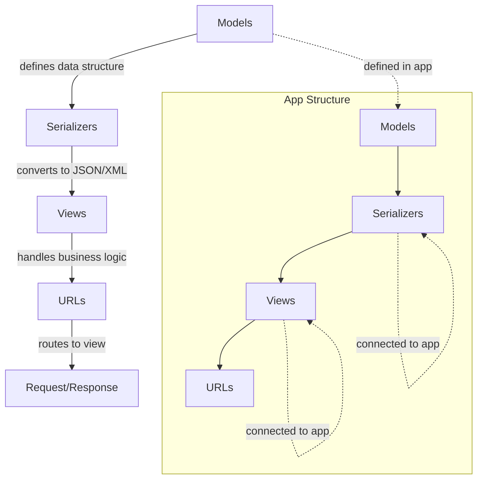

# Project Structure

In Django Rest Framework (DRF) projects, the project is typically structured to organize code logically and maintain scalability. The general structure follows Django's modular design, with the addition of DRF components for building RESTful APIs. Here's a breakdown of the main components:

## Basic Structure of a DRF Project

A typical DRF project structure looks like this:

```
project_name/
│
├── manage.py
├── project_name/
│   ├── __init__.py
│   ├── settings.py
│   ├── urls.py
│   ├── wsgi.py
│   └── asgi.py
└── apps/
    └── app_name/
        ├── __init__.py
        ├── admin.py
        ├── apps.py
        ├── models.py
        ├── serializers.py
        ├── views.py
        ├── urls.py
        ├── tests.py
        └── migrations/
```

## Key Components

### Models (models.py)

- **Purpose**: Models represent the data structure of your application, i.e., the database tables.
- **Role**: They define fields, relationships between data, and methods that operate on the data.
- **Example**: If you're building a blog, a model for `Post` might look like this:

  ```python
  from django.db import models

  class Post(models.Model):
      title = models.CharField(max_length=200)
      content = models.TextField()
      created_at = models.DateTimeField(auto_now_add=True)

      def __str__(self):
          return self.title
  ```

### Serializers (serializers.py)

- **Purpose**: Serializers convert complex data types (like models) into native Python data types (e.g., dictionaries) that can then be rendered into JSON or XML, and vice versa.
- **Role**: They define how model instances should be serialized and validated for input/output. They also handle data transformation when sending or receiving it from the API.
- **Example**:

  ```python
  from rest_framework import serializers
  from .models import Post

  class PostSerializer(serializers.ModelSerializer):
      class Meta:
          model = Post
          fields = ['id', 'title', 'content', 'created_at']
  ```

### Views (views.py)

- **Purpose**: Views handle the business logic for your API and determine what data to show, how to show it, and how to handle incoming requests.
- **Role**: Views can either be class-based views (CBVs) or function-based views (FBVs). They use serializers to process data and send appropriate responses.
- **Example** (Using DRF's `APIView`):

  ```python
  from rest_framework import generics
  from .models import Post
  from .serializers import PostSerializer

  class PostListView(generics.ListCreateAPIView):
      queryset = Post.objects.all()
      serializer_class = PostSerializer
  ```

### URLs (urls.py)

- **Purpose**: URLs define the routing of incoming HTTP requests to the appropriate view.
- **Role**: URLs map the requested endpoint (e.g., `/posts/`) to a specific view in `views.py`. DRF provides easy integration with Django’s URL routing system.
- **Example**:

  ```python
  from django.urls import path
  from .views import PostListView

  urlpatterns = [
      path('posts/', PostListView.as_view(), name='post-list')
  ]
  ```

### Apps (App Structure)

- **Purpose**: In Django, an "app" is a modular unit that encapsulates a specific part of the project, such as a blog, user authentication, or payment processing.
- **Role**: Each app can have its own models, views, serializers, and URLs, and they can be reused across different projects. Apps are like self-contained modules.
- **Example**: You might have an app called `blog`, another for `users`, etc.

## Connection between Models, Serializers, Views, URLs

Here is how the components interact:

1. **Models** define the data structure.
2. **Serializers** transform the models into data formats suitable for the API (e.g., JSON) and validate incoming data.
3. **Views** handle the logic for processing requests and interacting with the models through serializers.
4. **URLs** route requests to the appropriate views.



## Example Flow:

1. A client sends a GET request to `/posts/`.
2. The `urls.py` file maps this URL to the `PostListView` in `views.py`.
3. The view uses the `PostSerializer` to convert data from the database into a JSON response.
4. The serialized data is returned to the client as a response.
