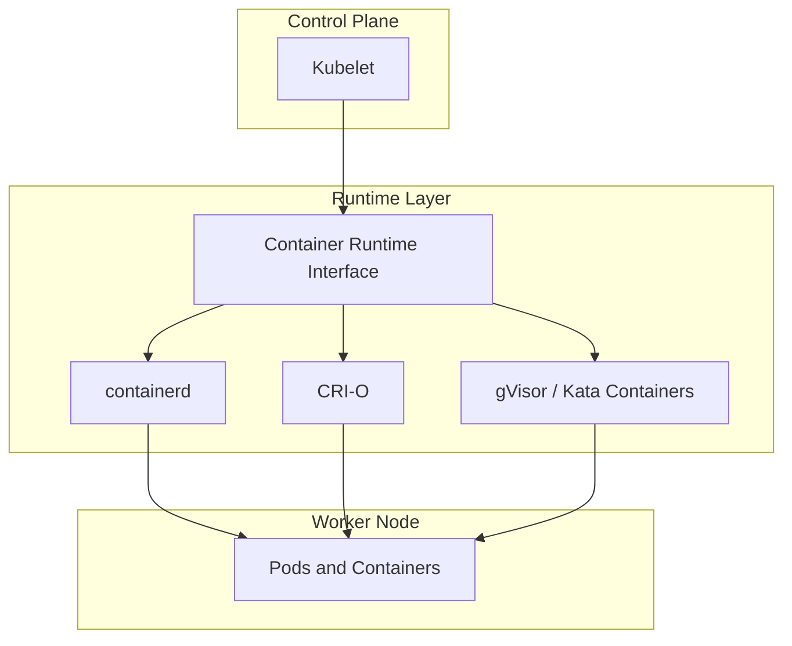
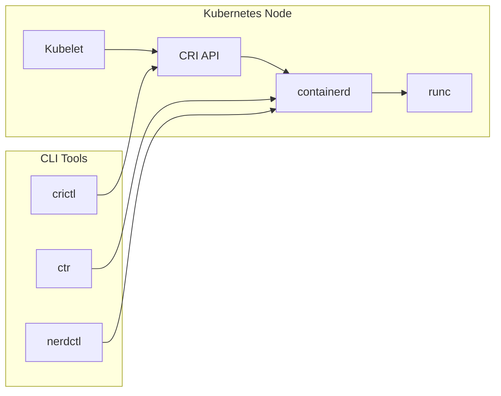

# Container Runtime Interface

The Container Runtime Interface (CRI) is a standard API that defines how Kubernetes interacts with container runtimes. Instead of Kubernetes being bound to a single runtime, CRI makes it possible to plug in different runtimes as long as they implement the CRI specification. This allows Kubernetes to be modular, flexible, and adaptable to new runtimes as they emerge.

## Motivation behind CRI

In its early days, Kubernetes was tightly coupled with Docker as the container runtime. While Docker was the most popular runtime at the time, it was not designed specifically for Kubernetes, and the tight coupling created challenges. To solve this, Kubernetes introduced the CRI as an abstraction layer between the kubelet and the runtime.

With CRI, Kubernetes only communicates through a defined gRPC API. Any runtime that implements CRI can run containers inside Kubernetes, which is why Kubernetes eventually deprecated Docker as a runtime and now relies on CRI-compliant runtimes like containerd and CRI-O.

## How CRI fits in Kubernetes architecture

The kubelet interacts with the CRI through two services:

- RuntimeService → manages pod and container lifecycle (start, stop, delete, status)
- ImageService → manages images (pull, list, remove)

The CRI ensures kubelet’s requests are consistently handled regardless of the underlying runtime.

## Containerd in the context of CRI

Containerd is a lightweight, industry-standard container runtime originally part of Docker but now a standalone project maintained by the CNCF. Kubernetes uses containerd directly as a CRI-compliant runtime.

Containerd is focused on simplicity, robustness, and performance. It provides core container lifecycle management, including image transfer, container execution, storage, and networking. containerd itself uses `runc` (the reference OCI runtime) for creating containers.

When Kubernetes deprecated Docker as a runtime, it still continued using containerd under the hood. This is because Docker itself uses containerd to run containers, so Kubernetes simply bypassed Docker’s higher-level layers and integrated directly with containerd via CRI.

## Docker in the context of CRI

Docker was not originally built with CRI in mind. To make Docker work with Kubernetes, a component called dockershim was introduced. Dockershim translated CRI calls into Docker Engine API calls.

However, maintaining dockershim created unnecessary complexity, and since Docker already relied on containerd internally, Kubernetes officially removed dockershim support. This means Kubernetes no longer talks to Docker directly but instead communicates with containerd (or another CRI runtime).

Docker is still useful for building and distributing images but no longer plays a direct role as a runtime in Kubernetes clusters.

## CLI tools for CRI runtimes

ctr
A low-level CLI tool shipped with containerd. It interacts directly with containerd APIs and is mainly for debugging or administrative tasks. It is not user-friendly and is not intended for day-to-day use.

nerdctl
A higher-level CLI for containerd that mimics the Docker CLI. With nerdctl, we can run commands like `nerdctl run` or `nerdctl ps` in the same way we use Docker. It provides a developer-friendly interface while directly working with containerd.

crictl
A CLI specifically designed for CRI. It is primarily used to debug Kubernetes nodes by interacting with the CRI directly. crictl can list pods, containers, and images, as well as fetch logs. It is often used by Kubernetes administrators to troubleshoot container runtime issues.

### Example: how these tools fit together

- ctr and nerdctl talk directly to containerd
- crictl talks to the CRI API, the same way kubelet does

## Benefits of CRI

- Decouples Kubernetes from any single runtime
- Provides a standard that runtimes can implement to integrate with Kubernetes
- Simplifies Kubernetes architecture by removing special-case handling for runtimes like Docker
- Allows developers and operators to use specialized runtimes such as gVisor (security-focused) or Kata Containers (lightweight VMs) without changes to Kubernetes itself
