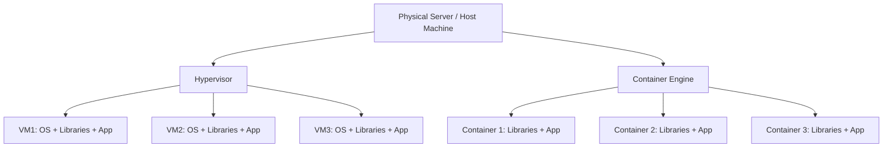

# Introduction

A container is a lightweight, portable, and isolated execution environment that allows applications to run reliably across different computing environments.
It packages together:

- Application code
- Runtime
- Libraries and dependencies
- Configuration files

Unlike virtual machines, containers share the host operating system’s kernel, making them faster and more efficient.

## Why do we need Containers?

Traditional application deployment faced issues such as:

- “Works on my machine” problem → Applications behaved differently in dev, test, and prod
- Dependency conflicts → Multiple apps required conflicting library versions
- Resource overhead → Virtual machines consumed significant CPU/RAM for running separate OS instances

Containers solve these problems by providing:

- Portability → Same container runs anywhere (developer laptop, test server, cloud)
- Consistency → Dependencies and configuration bundled within the container
- Efficiency → Faster startup and lower overhead compared to VMs
- Scalability → Easy replication and scaling in distributed environments
- Isolation → Each container runs in its own environment without interfering with others

## Containers vs Virtual Machines

Virtual machines virtualize hardware. Each VM includes its own OS, libraries, and apps, making them heavy and slower to boot.
Containers virtualize the OS, share the host kernel, and are lightweight with much faster startup times.

### Comparison Table

| Feature         | Virtual Machines                  | Containers                       |
| --------------- | --------------------------------- | -------------------------------- |
| Virtualization  | Hardware-level (via hypervisor)   | OS-level (via container engine)  |
| OS per Instance | Yes (each VM has its own OS)      | No (all share host OS kernel)    |
| Startup Time    | Minutes                           | Seconds                          |
| Resource Usage  | High (each OS consumes resources) | Low (lightweight and efficient)  |
| Portability     | Limited (depends on hypervisor)   | High (works across environments) |
| Isolation       | Strong (separate OS per VM)       | Strong but shares kernel         |

## Container Platforms

### Docker

The most popular container platform. It provides Docker Engine (container runtime), Docker CLI, and Docker Hub (registry).
Uses container images built from Dockerfiles.
Features include portability, developer-friendly tooling, and a large community.

### rkt (Rocket)

Developed by CoreOS (now Red Hat). Designed as an alternative to Docker with more focus on security and composability.
Uses the App Container (appc) specification.
Now mostly replaced by Podman and CRI-O in Kubernetes ecosystems.

### LXC (Linux Containers)

One of the earliest container technologies. Provides a lightweight VM-like environment.
Uses Linux kernel features like cgroups and namespaces.
Lower-level compared to Docker, with less developer tooling.

### Podman

A daemonless container engine. Compatible with Docker CLI commands (`docker run` → `podman run`).
Better integration with Kubernetes (can generate Kubernetes YAML directly).
Runs containers without requiring a root daemon, improving security.

### CRI-O

A lightweight container runtime specifically for Kubernetes.
Implements the Container Runtime Interface (CRI).
Focused on running containers efficiently in Kubernetes clusters.
