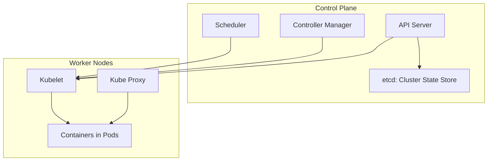

# Kubernetes

Kubernetes, often abbreviated as K8s, is an open-source container orchestration platform designed to automate the deployment, scaling, and management of containerized applications. It was originally developed by Google and is now maintained by the Cloud Native Computing Foundation (CNCF). Kubernetes has become the standard for managing large-scale containerized environments because it abstracts away infrastructure complexities and provides a consistent way to operate applications across different environments.

Kubernetes enables us to describe the desired state of applications using declarative configurations, and it continuously works to ensure that the actual state matches the desired state. This model makes applications resilient, portable, and highly scalable.

## Why Kubernetes

Kubernetes addresses the limitations of running containers manually or using simpler orchestrators. It provides:

- Automated scheduling and placement of containers on nodes
- Service discovery and networking across multiple containers
- Self-healing by restarting or rescheduling failed containers
- Horizontal scaling based on demand
- Rolling updates and rollbacks for application upgrades
- Persistent storage integration for stateful applications
- Multi-cloud and hybrid-cloud deployment capabilities

## Kubernetes Architecture Overview

Kubernetes follows a master-worker architecture. The master components form the control plane, which manages the cluster and makes decisions about scheduling, scaling, and maintaining the desired state. The worker nodes run the actual containerized applications.

## Control Plane Components

### API Server

The entry point for all cluster operations. It exposes the Kubernetes API, validates requests, and processes commands from users or other components.

### etcd

A distributed key-value store that stores the entire cluster state. It ensures strong consistency and serves as the source of truth for Kubernetes.

### Scheduler

Assigns newly created pods to suitable nodes based on resource requirements, policies, and constraints. It ensures optimal distribution of workloads.

### Controller Manager

Runs various controllers that monitor the state of the cluster and take corrective action when the actual state diverges from the desired state. Examples include the replication controller and node controller.

## Worker Node Components

### Kubelet

An agent running on each worker node. It ensures that containers are running as expected in pods. It communicates with the API server to receive instructions and reports back status.

### Kube Proxy

Handles networking on worker nodes. It ensures that containers can communicate with each other and with services, implementing load balancing and network rules.

### Pods

The smallest deployable unit in Kubernetes. A pod can contain one or more tightly coupled containers that share networking and storage.

## kubectl

`kubectl` is the primary command-line tool for interacting with Kubernetes clusters. It allows users to deploy applications, inspect resources, manage cluster components, and troubleshoot issues.

Common `kubectl` commands:

- `kubectl get pods` — List all pods in the cluster
- `kubectl describe pod <pod-name>` — Show detailed information about a pod
- `kubectl apply -f <file.yaml>` — Apply configuration from a YAML file
- `kubectl logs <pod-name>` — View logs from a pod
- `kubectl exec -it <pod-name> -- /bin/sh` — Execute a shell inside a running pod

`kubectl` communicates with the API server and is essential for cluster administration and day-to-day operations.
