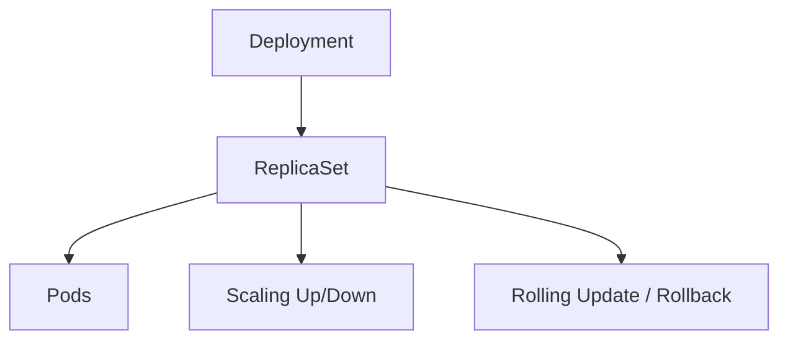
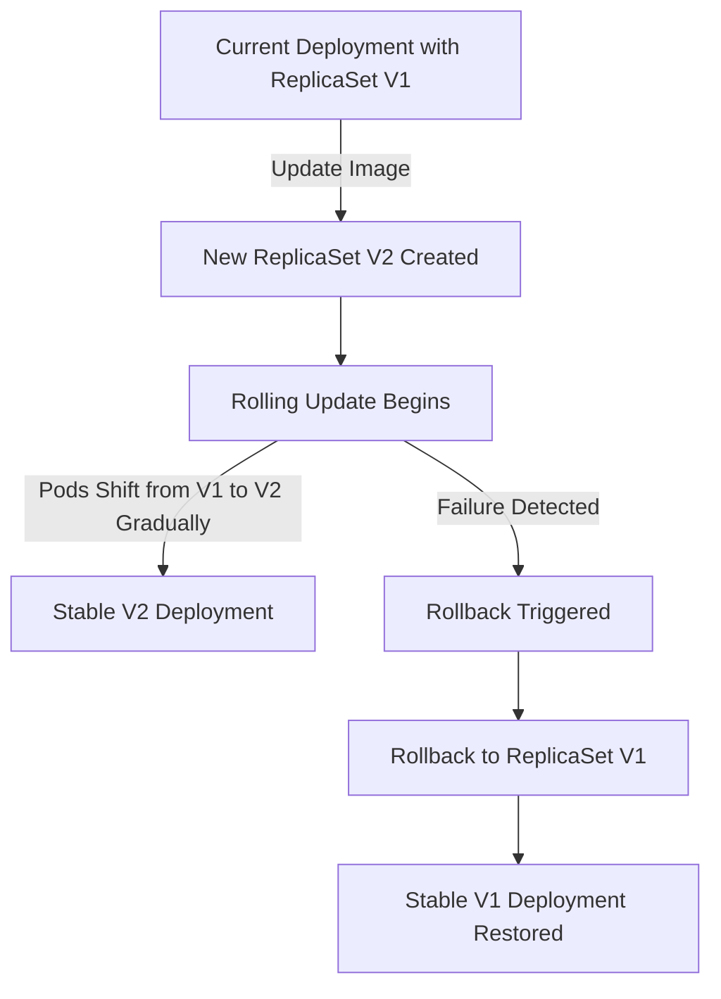

# Deployments

A Deployment is a higher-level Kubernetes resource that provides declarative updates for Pods and ReplicaSets. It allows us to describe the desired state for our application and lets Kubernetes handle creating and managing Pods, scaling them, and rolling out or rolling back updates automatically.

Deployments abstract away the direct management of ReplicaSets, making it easier to perform tasks like rolling updates, scaling, and self-healing.

## Features of Deployments

- Ensures a specified number of replicas are running.
- Performs **rolling updates** to update Pods to a new version without downtime.
- Provides easy **rollbacks** if something goes wrong during deployment.
- Abstracts **ReplicaSets**, automatically creating and managing them.
- Enables scaling up or down easily.

## Deployment YAML Example

```yaml
apiVersion: apps/v1
kind: Deployment
metadata:
  name: nginx-deployment
  labels:
    app: nginx
spec:
  replicas: 3
  selector:
    matchLabels:
      app: nginx
  template:
    metadata:
      labels:
        app: nginx
    spec:
      containers:
        - name: nginx
          image: nginx:1.21
          ports:
            - containerPort: 80
```

Explanation:

- **replicas**: Specifies how many Pods should run.
- **selector**: Ensures the Deployment manages Pods with `app: nginx`.
- **template**: Defines the Pod spec (metadata and containers).
- **image**: Versioned (`nginx:1.21`) so updates can be managed via rolling updates.

## Deployment Lifecycle

<div style={{textAlign: 'center'}}>



</div>

## Updates in Deployments

Updates allow us to change aspects of the Deployment specification, most commonly the container image version. Kubernetes uses **rolling updates** by default to ensure there is no downtime.

During a rolling update:

- A new ReplicaSet is created with the updated specification.
- Pods from the new ReplicaSet are gradually started.
- Pods from the old ReplicaSet are terminated one by one.
- The Deployment ensures that the number of available Pods never goes below a certain threshold.

The rolling update strategy can be tuned using two parameters:

- **maxUnavailable**: Maximum number of Pods that can be unavailable during the update.
- **maxSurge**: Maximum number of extra Pods that can be created above the desired count during the update.

Example of an update using `kubectl`:

```bash
kubectl set image deployment/nginx-deployment nginx=nginx:1.22
```

This changes the image from `nginx:1.21` to `nginx:1.22`. Kubernetes then performs a rolling update.

## Rollouts

Kubernetes maintains a history of revisions for each Deployment. Each time a Deployment is updated, a new revision is created. The rollout process ensures these changes are applied gradually and safely.

Commands for managing rollouts:

```bash
kubectl rollout status deployment/nginx-deployment    # Check rollout status
kubectl rollout history deployment/nginx-deployment   # View revision history
```

## Rollbacks

If an update fails (for example, the new Pods crash or fail readiness probes), we can rollback to a previous revision. Kubernetes makes this process easy by maintaining the ReplicaSets created during earlier rollouts.

Rollback commands:

```bash
kubectl rollout undo deployment/nginx-deployment              # Rollback to previous revision
kubectl rollout undo deployment/nginx-deployment --to-revision=2   # Rollback to specific revision
```

During rollback:

- The Deployment scales down the ReplicaSet of the failed update.
- The ReplicaSet of the previous stable version is scaled back up.
- The application returns to a stable version with minimal downtime.

## Example Deployment with Update Strategy

```yaml
apiVersion: apps/v1
kind: Deployment
metadata:
  name: nginx-deployment
spec:
  replicas: 3
  strategy:
    type: RollingUpdate
    rollingUpdate:
      maxUnavailable: 1
      maxSurge: 1
  selector:
    matchLabels:
      app: nginx
  template:
    metadata:
      labels:
        app: nginx
    spec:
      containers:
        - name: nginx
          image: nginx:1.21
```

In this example:

- **maxUnavailable: 1** → At most one Pod can be unavailable at any time.
- **maxSurge: 1** → At most one additional Pod can be created temporarily.

This ensures smooth updates with minimal disruption.

## Update and Rollback Flow

<div style={{textAlign: 'center'}}>



</div>

## Common kubectl Commands for Deployments

### Create and Manage

```bash
kubectl apply -f deployment.yaml          # Create or update a Deployment
kubectl create deployment nginx --image=nginx  # Quick one-liner Deployment
```

### View

```bash
kubectl get deployments                   # List all Deployments
kubectl describe deployment nginx-deployment   # Get detailed info
kubectl get pods -l app=nginx             # See Pods managed by Deployment
```

### Scaling

```bash
kubectl scale deployment nginx-deployment --replicas=5   # Scale replicas
```

### Update

```bash
kubectl set image deployment/nginx-deployment nginx=nginx:1.22   # Update image
```

### Rollout and Rollback

```bash
kubectl rollout status deployment/nginx-deployment   # Check rollout status
kubectl rollout history deployment/nginx-deployment  # View rollout history
kubectl rollout undo deployment/nginx-deployment     # Rollback to previous version
kubectl rollout undo deployment/nginx-deployment --to-revision=2  # Rollback to specific revision
```

### Delete

```bash
kubectl delete deployment nginx-deployment
```

## Use Cases of Deployments

- Running stateless applications (e.g., web servers, APIs).
- Handling continuous application updates in CI/CD pipelines.
- Ensuring zero-downtime upgrades through rolling updates.
- Managing scaling automatically based on workload.
