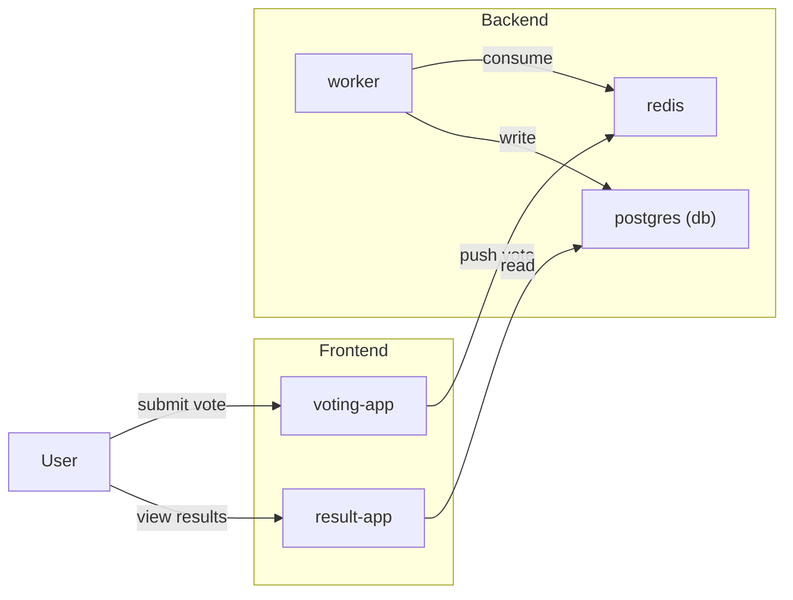

# VotingApp Deployment

This note shows how to deploy a small microservice system to Kubernetes using Deployments and Services. The application components are:

- voting-app: Python Flask web app where users submit votes
- redis: in-memory store used as a queue for votes
- worker: background consumer that reads votes from Redis and writes to PostgreSQL
- db: PostgreSQL database (stateful)
- result-app: Python Flask web app that reads aggregated results from PostgreSQL

The manifests below assume you already have container images for each component (for example `your-registry/voting-app:latest`, `your-registry/result-app:latest`, etc.). Replace image names with your actual images before applying.

This demo creates a namespace, a Secret for DB credentials, a PVC for Postgres, Deployments for stateless services, a Deployment + PVC for the database, and Services to expose the components internally. For external access we expose `result-app` via a NodePort example and recommend adding an Ingress in production.

<div style={{textAlign: 'center'}}>



</div>

## Namespace

```yaml
apiVersion: v1
kind: Namespace
metadata:
  name: voting-demo
```

## Secrets and Config

Create a secret for Postgres credentials (base64-encoded values or use `kubectl create secret`):

```yaml
apiVersion: v1
kind: Secret
metadata:
  name: pg-credentials
  namespace: voting-demo
type: Opaque
data:
  POSTGRES_USER: cG9zdGdyZXM= # base64 for 'postgres'
  POSTGRES_PASSWORD: c2VjcmV0 # base64 for 'secret'
  POSTGRES_DB: dm90aW5n # base64 for 'voting'
```

Alternatively create secret from literals:

```sh
kubectl -n voting-demo create secret generic pg-credentials \
  --from-literal=POSTGRES_USER=postgres \
  --from-literal=POSTGRES_PASSWORD=secret \
  --from-literal=POSTGRES_DB=voting
```

## PersistentVolumeClaim for Postgres

```yaml
apiVersion: v1
kind: PersistentVolumeClaim
metadata:
  name: pg-data
  namespace: voting-demo
spec:
  accessModes:
    - ReadWriteOnce
  resources:
    requests:
      storage: 5Gi
```

Note: On cloud providers this will dynamically provision a PV. For local clusters (kind/minikube), ensure a storage class is available or use hostPath for demos.

## PostgreSQL Deployment

```yaml
apiVersion: apps/v1
kind: Deployment
metadata:
  name: postgres
  namespace: voting-demo
spec:
  replicas: 1
  selector:
    matchLabels:
      app: postgres
  template:
    metadata:
      labels:
        app: postgres
    spec:
      containers:
        - name: postgres
          image: postgres:15
          env:
            - name: POSTGRES_USER
              valueFrom:
                secretKeyRef:
                  name: pg-credentials
                  key: POSTGRES_USER
            - name: POSTGRES_PASSWORD
              valueFrom:
                secretKeyRef:
                  name: pg-credentials
                  key: POSTGRES_PASSWORD
            - name: POSTGRES_DB
              valueFrom:
                secretKeyRef:
                  name: pg-credentials
                  key: POSTGRES_DB
          ports:
            - containerPort: 5432
          volumeMounts:
            - name: pg-data
              mountPath: /var/lib/postgresql/data
      volumes:
        - name: pg-data
          persistentVolumeClaim:
            claimName: pg-data
```

Create a Service for Postgres (ClusterIP):

```yaml
apiVersion: v1
kind: Service
metadata:
  name: postgres
  namespace: voting-demo
spec:
  ports:
    - port: 5432
      targetPort: 5432
  selector:
    app: postgres
  type: ClusterIP
```

## Redis Deployment + Service

Redis will be used as a simple queue for votes.

```yaml
apiVersion: apps/v1
kind: Deployment
metadata:
  name: redis
  namespace: voting-demo
spec:
  replicas: 1
  selector:
    matchLabels:
      app: redis
  template:
    metadata:
      labels:
        app: redis
    spec:
      containers:
        - name: redis
          image: redis:7
          ports:
            - containerPort: 6379

---
apiVersion: v1
kind: Service
metadata:
  name: redis
  namespace: voting-demo
spec:
  selector:
    app: redis
  ports:
    - port: 6379
      targetPort: 6379
  type: ClusterIP
```

## Voting app Deployment + Service

The `voting-app` receives user votes and pushes them to Redis. Replace the image with your built image.

```yaml
apiVersion: apps/v1
kind: Deployment
metadata:
  name: voting-app
  namespace: voting-demo
spec:
  replicas: 2
  selector:
    matchLabels:
      app: voting-app
  template:
    metadata:
      labels:
        app: voting-app
    spec:
      containers:
        - name: voting-app
          image: your-registry/voting-app:latest
          env:
            - name: REDIS_HOST
              value: redis
            - name: REDIS_PORT
              value: "6379"
          ports:
            - containerPort: 80

---
apiVersion: v1
kind: Service
metadata:
  name: voting-app
  namespace: voting-demo
spec:
  selector:
    app: voting-app
  ports:
    - port: 80
      targetPort: 80
  type: ClusterIP
```

## Worker Deployment

The worker reads votes from Redis and writes into Postgres. Configure DB connection via env and Secrets.

```yaml
apiVersion: apps/v1
kind: Deployment
metadata:
  name: worker
  namespace: voting-demo
spec:
  replicas: 1
  selector:
    matchLabels:
      app: worker
  template:
    metadata:
      labels:
        app: worker
    spec:
      containers:
        - name: worker
          image: your-registry/worker:latest
          env:
            - name: REDIS_HOST
              value: redis
            - name: REDIS_PORT
              value: "6379"
            - name: PGHOST
              value: postgres
            - name: PGUSER
              valueFrom:
                secretKeyRef:
                  name: pg-credentials
                  key: POSTGRES_USER
            - name: PGPASSWORD
              valueFrom:
                secretKeyRef:
                  name: pg-credentials
                  key: POSTGRES_PASSWORD
            - name: PGDATABASE
              valueFrom:
                secretKeyRef:
                  name: pg-credentials
                  key: POSTGRES_DB
```

## Result app Deployment + Service

The `result-app` reads aggregated results from PostgreSQL and serves a web UI.

```yaml
apiVersion: apps/v1
kind: Deployment
metadata:
  name: result-app
  namespace: voting-demo
spec:
  replicas: 2
  selector:
    matchLabels:
      app: result-app
  template:
    metadata:
      labels:
        app: result-app
    spec:
      containers:
        - name: result-app
          image: your-registry/result-app:latest
          env:
            - name: PGHOST
              value: postgres
            - name: PGUSER
              valueFrom:
                secretKeyRef:
                  name: pg-credentials
                  key: POSTGRES_USER
            - name: PGPASSWORD
              valueFrom:
                secretKeyRef:
                  name: pg-credentials
                  key: POSTGRES_PASSWORD
            - name: PGDATABASE
              valueFrom:
                secretKeyRef:
                  name: pg-credentials
                  key: POSTGRES_DB
          ports:
            - containerPort: 80

---
apiVersion: v1
kind: Service
metadata:
  name: result-app
  namespace: voting-demo
spec:
  selector:
    app: result-app
  ports:
    - port: 80
      targetPort: 80
  type: NodePort
  # nodePort: 30080 # optionally pin a nodePort
```

For external access (example): find the NodePort and access `http://<node-ip>:<nodePort>`.

## Database initialization

If your worker or apps assume DB tables exist, initialize the schema by running a job or connect and run migrations. Example local one-off job:

```yaml
apiVersion: batch/v1
kind: Job
metadata:
  name: db-init
  namespace: voting-demo
spec:
  template:
    spec:
      containers:
        - name: migrate
          image: your-registry/db-migrate:latest
          env:
            - name: PGHOST
              value: postgres
            - name: PGUSER
              valueFrom:
                secretKeyRef:
                  name: pg-credentials
                  key: POSTGRES_USER
            - name: PGPASSWORD
              valueFrom:
                secretKeyRef:
                  name: pg-credentials
                  key: POSTGRES_PASSWORD
            - name: PGDATABASE
              valueFrom:
                secretKeyRef:
                  name: pg-credentials
                  key: POSTGRES_DB
      restartPolicy: OnFailure
```

## Apply order and commands

Recommended apply order:

1. Namespace
2. Secrets
3. PVC
4. Postgres Deployment + Service
5. Redis Deployment + Service
6. Voting app Deployment + Service
7. Worker Deployment
8. Result app Deployment + Service
9. DB init Job (if needed)

Commands:

```sh
kubectl apply -f namespace.yaml
kubectl apply -f secret.yaml
kubectl apply -f pg-pvc.yaml
kubectl apply -f postgres-deployment.yaml
kubectl apply -f redis.yaml
kubectl apply -f voting-app.yaml
kubectl apply -f worker.yaml
kubectl apply -f result-app.yaml
kubectl apply -f db-init-job.yaml
```

## Health checks and readiness

- Add readiness probes to `voting-app`, `result-app`, and `worker` so unhealthy Pods are removed from Service endpoints.
- Example readiness probe snippet (HTTP):

```yaml
readinessProbe:
  httpGet:
    path: /health
    port: 80
  initialDelaySeconds: 5
  periodSeconds: 10
```

## Monitoring and logs

- Use `kubectl logs` and `kubectl describe` to inspect Pods and Services for issues.
- Monitor resource usage with `kubectl top` (requires metrics-server) or add Prometheus for production-grade monitoring.

## Security notes

- Do not store credentials in image or plain YAML; use `Secrets` and RBAC.
- Use network policies to restrict access between namespaces and services if needed.

## Cleanup

```sh
kubectl delete namespace voting-demo
```
