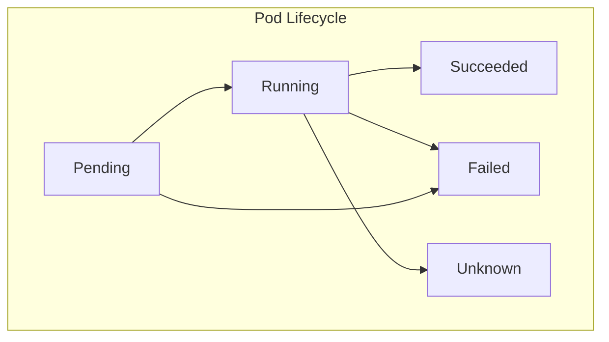

# Pods

A Pod is the smallest deployable unit in Kubernetes. It represents a single instance of a running process in a cluster. Unlike containers, which are isolated units of software packaging, a Pod abstracts one or more tightly coupled containers as a single execution environment. Containers within a Pod share resources like network and storage, making them suitable for running workloads that need to communicate closely.

A Pod always runs on a Node, and Kubernetes schedules Pods to Nodes based on resource requirements and policies. Pods are ephemeral in nature, meaning they can be created, destroyed, or rescheduled by Kubernetes at any time. This makes them flexible but also highlights that Pods are not meant to be directly managed at scale without higher-level controllers.

## Characteristics of Pods

- A Pod can contain a single container or multiple containers.
- Containers inside a Pod share the same network namespace, including IP address and ports. This means they can communicate with each other using `localhost`.
- Pods can share storage volumes, allowing containers inside the Pod to read and write data collaboratively.
- Pods are ephemeral; once terminated, they are not restarted unless managed by higher-level abstractions.
- Each Pod gets a unique IP address within the cluster.

## Single-container Pod

This is the most common form of a Pod, where one container represents one Pod.

```yaml
apiVersion: v1
kind: Pod
metadata:
  name: single-container-pod
  labels:
    app: web
spec:
  containers:
    - name: nginx-container
      image: nginx:1.25
      ports:
        - containerPort: 80
```

Explanation:
This YAML defines a Pod named `single-container-pod` running a single Nginx container on port 80.

## Multi-container Pod

Sometimes, multiple containers are grouped into the same Pod when they need to work closely together, such as a sidecar pattern.

```yaml
apiVersion: v1
kind: Pod
metadata:
  name: multi-container-pod
  labels:
    app: logging
spec:
  containers:
    - name: app-container
      image: nginx:1.25
      ports:
        - containerPort: 80
    - name: sidecar-container
      image: busybox
      command: ["sh", "-c", "while true; do echo logging...; sleep 5; done"]
```

Explanation:
This Pod has two containers: one running Nginx and another sidecar container running BusyBox to simulate logging. Both containers share the Pod’s IP and can communicate using `localhost`.

## Pod with Volume

Pods can use persistent or ephemeral storage volumes that are shared between containers.

```yaml
apiVersion: v1
kind: Pod
metadata:
  name: pod-with-volume
spec:
  containers:
    - name: app-container
      image: busybox
      command: ["sh", "-c", "echo Hello > /data/message.txt && sleep 3600"]
      volumeMounts:
        - mountPath: /data
          name: shared-volume
    - name: sidecar-container
      image: busybox
      command: ["sh", "-c", "cat /data/message.txt && sleep 3600"]
      volumeMounts:
        - mountPath: /data
          name: shared-volume
  volumes:
    - name: shared-volume
      emptyDir: {}
```

Explanation:
Here, both containers share the same `emptyDir` volume. The first container writes to a file, and the second container reads it. This demonstrates how Pods enable storage sharing.

## Pod Lifecycle

Pods go through various phases in their lifecycle:

<div style={{textAlign: 'center'}}>



</div>

- **Pending**: Pod is accepted but waiting for scheduling or resource availability
- **Running**: At least one container is running
- **Succeeded**: All containers have completed successfully
- **Failed**: One or more containers terminated unsuccessfully
- **Unknown**: Status cannot be determined

Containers inside Pods have their own restart policies (`Always`, `OnFailure`, `Never`).

## Key Takeaways

- A Pod is the fundamental unit of execution in Kubernetes.
- Containers inside a Pod share network and storage, enabling close communication.
- Pods are ephemeral, often short-lived, and typically managed by higher-level controllers for scalability.
- YAML manifests define Pods declaratively, allowing fine-grained configuration of containers, volumes, and networking.

## Useful kubectl commands for Pods

Creating a Pod from a YAML file:

```sh
kubectl apply -f pod.yaml
```

Listing all Pods in the current namespace:

```sh
kubectl get pods
```

Getting detailed information about a specific Pod:

```sh
kubectl describe pod <pod-name>
```

Viewing logs of a container inside a Pod:

```sh
kubectl logs <pod-name>
```

If there are multiple containers inside the Pod, specify the container:

```sh
kubectl logs <pod-name> -c <container-name>
```

Executing a command inside a container of a Pod:

```sh
kubectl exec -it <pod-name> -- sh
```

Deleting a Pod:

```sh
kubectl delete pod <pod-name>
```
