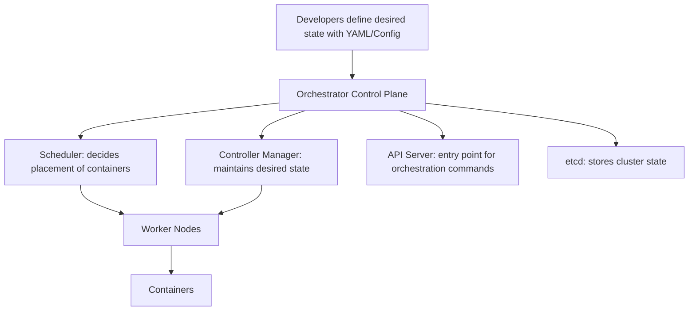
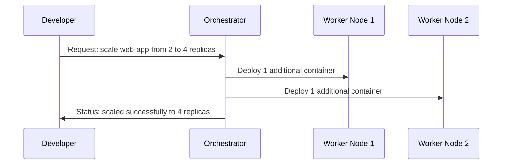

# Container Orchestration

Container orchestration is the automated management of the lifecycle of containers in large, distributed environments. It ensures that containers are deployed, scaled, networked, and maintained without manual intervention. As applications grow in complexity, orchestration becomes essential to handle the dynamic and elastic nature of modern workloads.

## Why container orchestration is needed

When working with just a few containers, manual management is feasible. However, in real-world systems, we often deal with hundreds or thousands of containers. Without orchestration, we would face challenges such as:

- Ensuring high availability when nodes fail
- Distributing workloads evenly across infrastructure
- Scaling containers up or down based on demand
- Managing communication between containers across multiple hosts
- Handling storage and data persistence across container restarts
- Automating rolling updates and rollbacks

Container orchestration provides automation for all these requirements, making it the backbone of cloud-native systems.

## Key responsibilities of orchestration

- Scheduling containers onto available hosts
- Ensuring the desired state of applications is maintained
- Scaling applications up and down automatically
- Managing service discovery and container networking
- Automating health checks and restarting failed containers
- Rolling out updates with minimal downtime and supporting rollbacks
- Managing secrets, configs, and persistent storage

## High-level architecture of orchestration

In this model, the control plane ensures the system matches the desired state defined by developers. Worker nodes run the actual containers, and the orchestrator ensures consistency between desired and actual states.

## Popular container orchestration tools

Kubernetes
Currently the most widely used orchestration system. Originally developed by Google and now maintained by the Cloud Native Computing Foundation (CNCF). Kubernetes manages clusters of nodes, schedules containers into pods, handles service discovery, provides auto-scaling, and enables rolling updates.

Docker Swarm
Docker’s native orchestration solution. Easier to set up than Kubernetes, but less feature-rich. It integrates tightly with Docker tools, making it developer-friendly for small to medium workloads.

Apache Mesos with Marathon
A more general-purpose cluster manager that can run not only containers but also other types of distributed workloads. Marathon is used as a container orchestrator on top of Mesos.

Nomad
Developed by HashiCorp. A simple and flexible orchestrator that supports containers as well as non-containerized workloads. It is often chosen for environments that do not need the full complexity of Kubernetes.

## Example of scaling with orchestration

This shows how orchestration automatically manages scaling across multiple nodes.

## Container orchestration in cloud-native systems

In modern microservices architectures, each service runs as multiple container replicas across clusters. Orchestration ensures these services remain highly available, discoverable, and responsive under varying loads. It abstracts the complexity of distributed systems, allowing us to focus on building applications instead of managing infrastructure.
