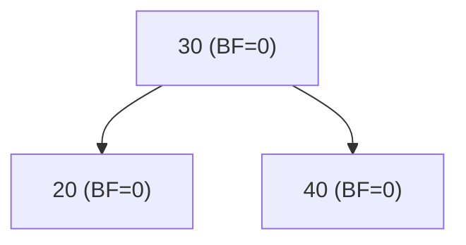
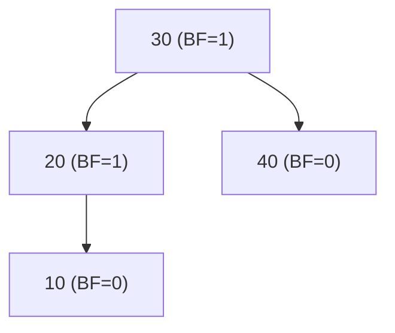
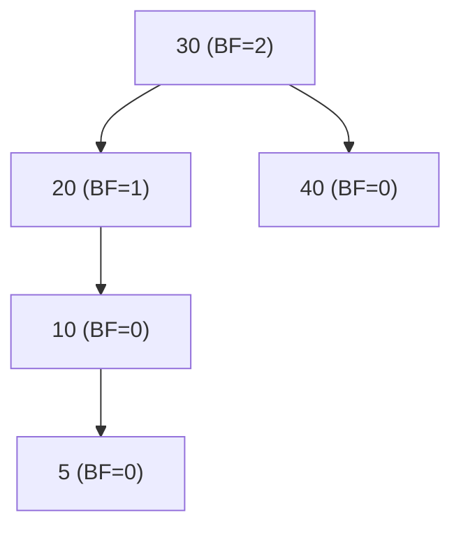

# Introduction

An **AVL Tree** is a **self-balancing Binary Search Tree** where the height difference (balance factor) between the left and right subtrees of any node is at most **1**.

- Named after **Adelson-Velsky and Landis**, who introduced it in 1962.
- Ensures that search, insertion, and deletion operations remain **O(log n)** by maintaining balance automatically after every operation.
- After insertion or deletion, the tree may become unbalanced, and rotations are performed to restore balance.

## Balance Factor

The **Balance Factor (BF)** of a node is defined as:

$$
BF = \text{height(left subtree)} - \text{height(right subtree)}
$$

- **Allowed range:** $-1, 0, +1$
- If $BF > 1$ or $BF < -1$, the tree is **unbalanced**.

### Example: Calculating Balance Factor

#### Balanced Example

- Height(left subtree of 30) = 1
- Height(right subtree of 30) = 1
- **BF(30) = 1 - 1 = 0** → Balanced

#### Slightly Unbalanced Example

- Height(left subtree of 30) = 2
- Height(right subtree of 30) = 1
- **BF(30) = 2 - 1 = 1** → Balanced (still allowed)

#### Unbalanced Example

- Height(left subtree of 30) = 3
- Height(right subtree of 30) = 1
- **BF(30) = 3 - 1 = 2** → Unbalanced → Requires rotation

### Balance Factor Ranges and Rotations

When BF is outside the allowed range, four cases arise:

1. **Left Left (LL) Case** → Single Right Rotation
2. **Right Right (RR) Case** → Single Left Rotation
3. **Left Right (LR) Case** → Left Rotation on Left Child + Right Rotation
4. **Right Left (RL) Case** → Right Rotation on Right Child + Left Rotation

## Advantage over Normal BST

A **normal BST** can degrade to a **linked list** if data is inserted in sorted order, making operations **O(n)** in the worst case.
In contrast:

| Operation | Normal BST (Worst) | AVL Tree (Worst) |
| --------- | ------------------ | ---------------- |
| Search    | O(n)               | O(log n)         |
| Insert    | O(n)               | O(log n)         |
| Delete    | O(n)               | O(log n)         |

- **AVL maintains height ≈ log₂(n)**, preventing skewed trees.
- Guarantees better **worst-case performance** for frequently accessed dynamic datasets.
