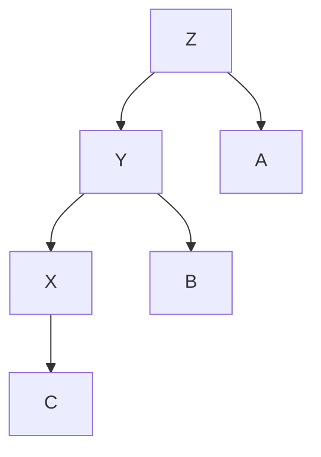
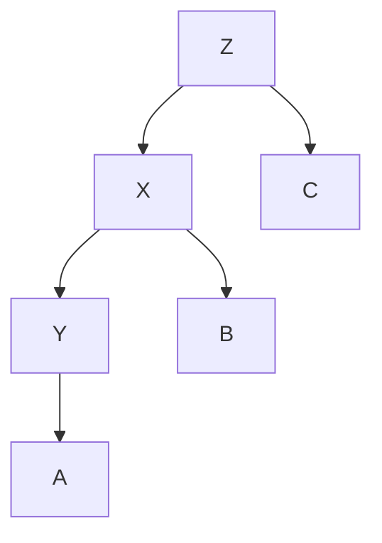
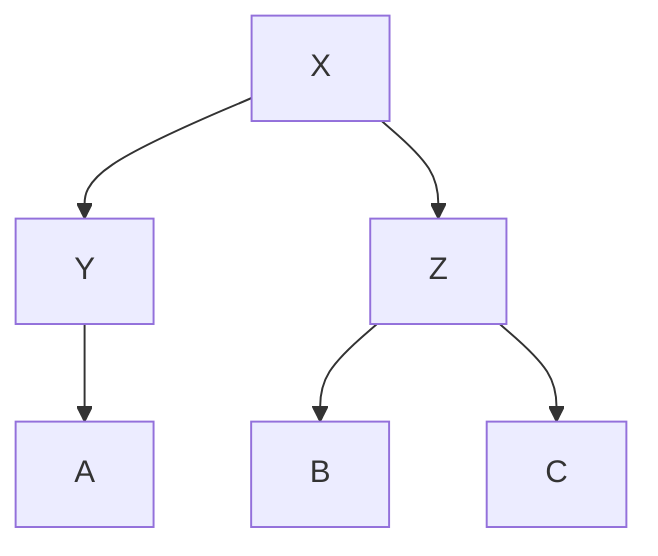
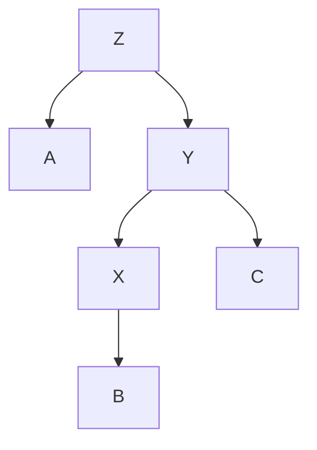
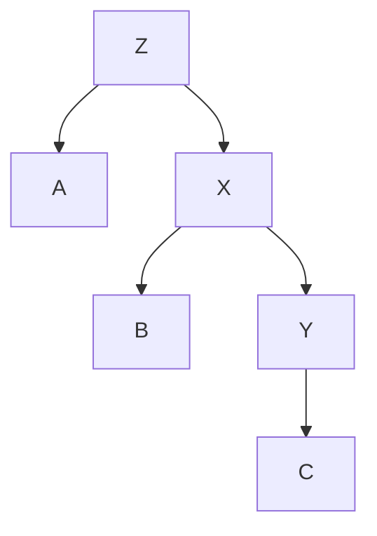
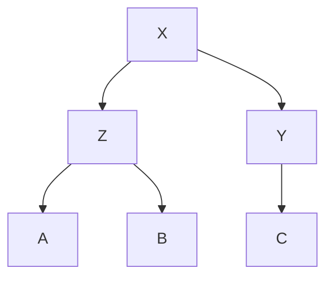

# AVL Tree Rotations

Rotations in an AVL Tree are **tree restructuring operations** that restore balance when the **Balance Factor (BF)** of a node goes outside the range $[-1, 0, +1]$.
After insertion or deletion, if any node’s **BF** becomes:

- $> 1$ → left-heavy
- $< -1$ → right-heavy

a **rotation** is applied.

## Types of Rotations

There are **four** possible imbalance cases:

1. **Left Left (LL)** → Single Right Rotation
2. **Right Right (RR)** → Single Left Rotation
3. **Left Right (LR)** → Left Rotation on Left Child, then Right Rotation
4. **Right Left (RL)** → Right Rotation on Right Child, then Left Rotation

## Left Left (LL) Rotation

**Condition:**

- BF(node) > 1 (left-heavy)
- BF(node.left) ≥ 0 (left child is left-heavy or balanced)

**Fix:** Perform a **Right Rotation**.

### Example Before Rotation

<div style={{textAlign: 'center'}}>

</div>

**After Right Rotation (around Z):**

<div style={{textAlign: 'center'}}>

</div>

**Key Idea:**

- Y becomes the new root of the subtree.
- Z moves down to the right of Y.
- The subtree that was between X and Z (B) becomes the left child of Z.

## Right Right (RR) Rotation

**Condition:**

- BF(node) < -1 (right-heavy)
- BF(node.right) ≤ 0 (right child is right-heavy or balanced)

**Fix:** Perform a **Left Rotation**.

### Example Before Rotation

<div style={{textAlign: 'center'}}>

</div>

**After Left Rotation (around Z):**

<div style={{textAlign: 'center'}}>

</div>

**Key Idea:**

- Y becomes the new root of the subtree.
- Z moves down to the left of Y.
- The subtree between Z and X (B) becomes the right child of Z.

## Left Right (LR) Rotation

**Condition:**

- BF(node) > 1 (left-heavy)
- BF(node.left) < 0 (left child is right-heavy)

**Fix:**

1. Left Rotation on the left child.
2. Right Rotation on the node.

### Before Rotation

<div style={{textAlign: 'center'}}>

</div>

### Step 1: Left Rotation on Y

<div style={{textAlign: 'center'}}>

</div>

### Step 2: Right Rotation on Z

<div style={{textAlign: 'center'}}>

</div>

## Right Left (RL) Rotation

**Condition:**

- BF(node) < -1 (right-heavy)
- BF(node.right) > 0 (right child is left-heavy)

**Fix:**

1. Right Rotation on the right child.
2. Left Rotation on the node.

### Before Rotation

<div style={{textAlign: 'center'}}>

</div>

### Step 1: Right Rotation on Y

<div style={{textAlign: 'center'}}>

</div>

### Step 2: Left Rotation on Z

<div style={{textAlign: 'center'}}>

</div>

## Rotation Summary Table

| Case | Condition                 | Steps                                         |
| ---- | ------------------------- | --------------------------------------------- |
| LL   | BF > 1 and BF(left) ≥ 0   | Right Rotation                                |
| RR   | BF < -1 and BF(right) ≤ 0 | Left Rotation                                 |
| LR   | BF > 1 and BF(left) < 0   | Left Rotation on left child → Right Rotation  |
| RL   | BF < -1 and BF(right) > 0 | Right Rotation on right child → Left Rotation |

## Python Example for Rotations

```python
def right_rotate(y):
    x = y.left
    T2 = x.right

    x.right = y
    y.left = T2

    y.height = 1 + max(get_height(y.left), get_height(y.right))
    x.height = 1 + max(get_height(x.left), get_height(x.right))

    return x

def left_rotate(x):
    y = x.right
    T2 = y.left

    y.left = x
    x.right = T2

    x.height = 1 + max(get_height(x.left), get_height(x.right))
    y.height = 1 + max(get_height(y.left), get_height(y.right))

    return y
```
