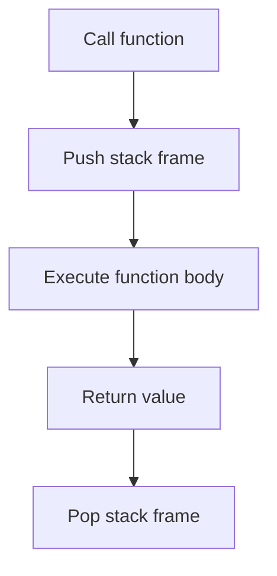
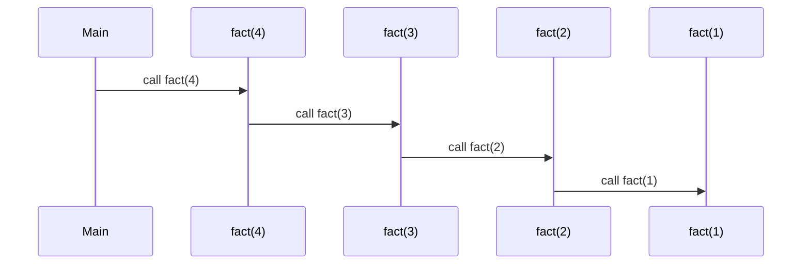
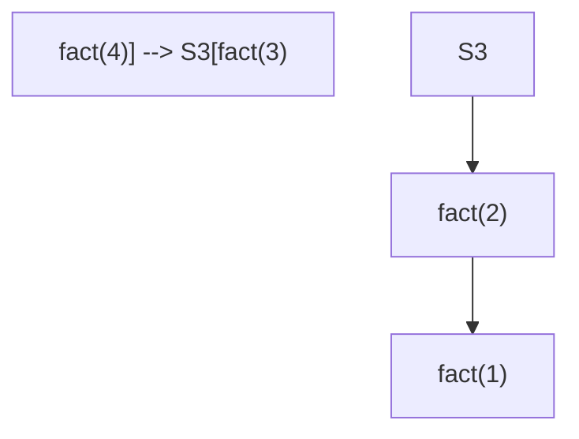
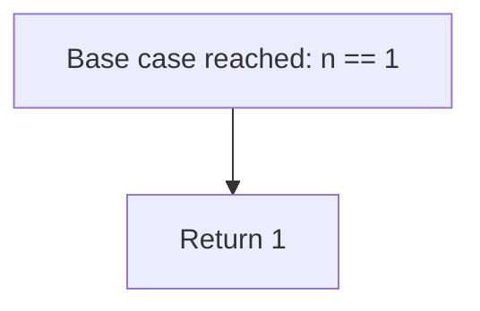
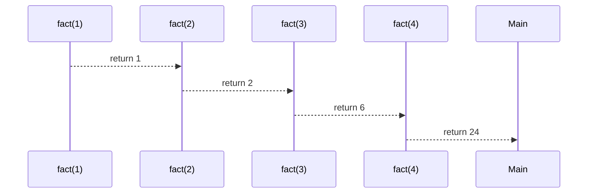
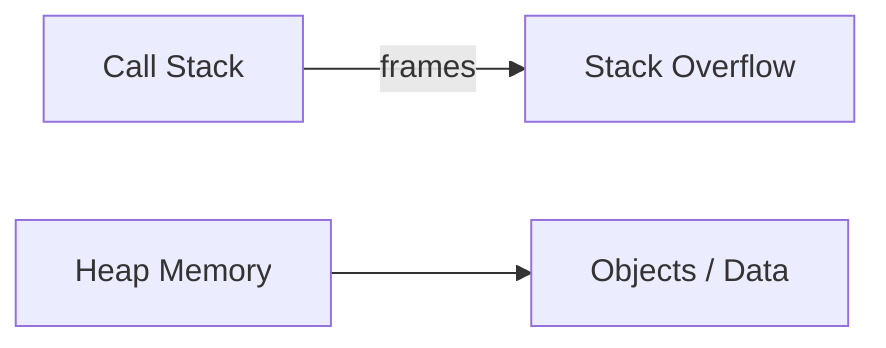

# Recursion

Recursion is a programming technique where a function calls itself to solve a problem by reducing it to **smaller instances of the same problem**.

A recursive solution is valid only if:

* There exists a **base case** that stops recursion
* Every recursive call moves strictly toward that base case

Without these, recursion results in infinite calls and stack overflow.

## Why recursion exists

Recursion is used when a problem has a **recursive structure**, meaning:

* The problem can be expressed in terms of itself
* The depth of the problem is unknown at compile time
* The data structure is hierarchical or branching

Typical examples:

* Trees
* Graph traversal (DFS)
* Divide-and-conquer algorithms
* Backtracking problems

## Basic structure of a recursive function

```python
def f(x):
    if base_condition:
        return base_value
    return f(smaller_x)
```

Logical interpretation:

* Solve the smallest possible version directly
* Delegate the rest to the same function

### Base case

The base case defines:

* The smallest valid input
* A result that does not require further recursion

Examples:

* Factorial → `n == 0`
* Tree traversal → `node is None`
* Binary search → `low > high`

If the base case is unreachable, recursion is incorrect. Base case is used to end the recursion.

## How recursion works internally

Recursion is nothing magical at the machine level. Internally, it is just **function calls using the call stack**.

### The call stack: what actually happens

Every time a function is called, the runtime pushes a **stack frame** onto the call stack.

A stack frame contains:

* Function arguments
* Local variables
* Return address (where execution resumes after the function returns)
* Bookkeeping data (saved registers, etc.)

The stack follows **LIFO** semantics.

<div style={{textAlign: 'center'}}>

</div>

Recursion works because a function can push **another instance of itself** onto the stack.

### Example: factorial

```python
def fact(n):
    if n == 1:
        return 1
    return n * fact(n - 1)
```

Call:

```python
fact(4)
```

### Phase 1: call expansion (going down)

Each recursive call creates a new stack frame. Execution pauses at the recursive call line.

<div style={{textAlign: 'center'}}>



</div>

Stack state after reaching the base case:

<div style={{textAlign: 'center'}}>

</div>

Key point:

* No multiplication has happened yet.
* Every frame is waiting for the result of the next call.

### Base case: stopping stack growth

```python
if n == 1:
    return 1
```

Internally:

* No new stack frame is created
* A concrete value is returned immediately

<div style={{textAlign: 'center'}}>

</div>

This is what prevents infinite stack growth.

### Phase 2: stack unwinding (coming back up)

Returned values flow upward as stack frames are popped.

<div style={{textAlign: 'center'}}>



</div>

Unwinding intuition:

* Work is done **after** recursive calls return
* Each frame completes its pending operation

### Why variables don’t clash

Each recursive call has its own stack frame.

Example:

```python
def f(n):
    x = n + 1
    return f(n - 1)
```

Even though x has the same name:

* x in f(4) is different from x in f(3)
* They live in different stack frames

Memory-wise:

```text
frame f(4): x = 5
frame f(3): x = 4
frame f(2): x = 3
```

### Stack vs heap (important distinction)

* **Stack**: function calls, parameters, local variables
* **Heap**: dynamically allocated objects

Recursion mainly consumes **stack memory**.

<div style={{textAlign: 'center'}}>

</div>

Too deep recursion → stack overflow.

### Tail recursion (internal optimization idea)

A function is tail-recursive if the recursive call is the **last operation**.

```python
def fact(n, acc=1):
    if n == 0:
        return acc
    return fact(n - 1, acc * n)
```

Internally:

* No work is pending after the recursive call
* In theory, the compiler/runtime can reuse the same stack frame

This is called **Tail Call Optimization (TCO)**.

Reality:

* C, Scheme: often optimized
* Python, Java, JavaScript: **no TCO**
* Go: **no TCO**

So even tail recursion still consumes stack in most mainstream languages.

## Recursion vs iteration

Recursion:

* Uses call stack
* Cleaner for hierarchical problems
* Risk of stack overflow
* Often slower due to function call overhead

Iteration:

* Constant stack usage
* Better for linear problems
* Usually faster

Python does **not** optimize tail recursion.
