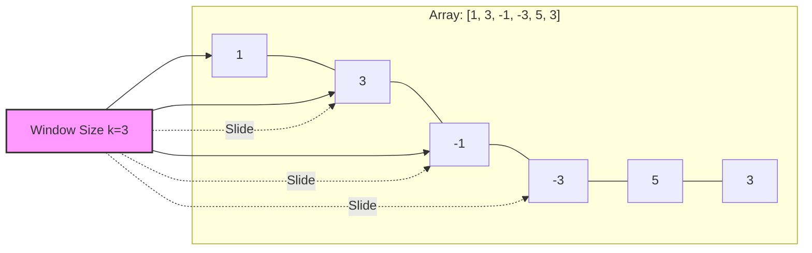
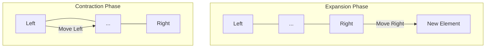

# Sliding Window

:::tip[Status]

This note is complete, reviewed, and considered stable.

:::

The **Sliding Window** technique is a powerful algorithmic pattern where we use a "window" (a subset of consecutive elements) that slides over a collection, such as an array or string. By maintaining this window and updating it as we move, we can solve complex range-based problems with optimal efficiency.

This approach allows us to reduce time complexity from nested loops (O(n²)) to linear time (O(n)) by avoiding redundant calculations.

## How It Works

We maintain two pointers that define the boundaries of our window. As we slide the window across the data:

1. **Expand**: We move the right pointer to include new elements in our window.
2. **Process**: We update our current state (e.g., sum, count, or frequency map) with the new element.
3. **Contract**: If our window violates a specific constraint, we move the left pointer to shrink the window until the constraint is met again.

## Types of Sliding Windows

### Fixed-Size Window

In this scenario, our window maintains a constant length `k` as it moves from start to end.

<div style={{textAlign: 'center'}}>



</div>

- **Example**: Finding the maximum sum of any subarray of size `k`.

### Dynamic-Sized Window

The size of our window grows or shrinks dynamically based on the problem's constraints.

<div style={{textAlign: 'center'}}>



</div>

- **Example**: Finding the smallest subarray whose sum is greater than or equal to a target value `x`.

## Time and Space Complexity

- **Time Complexity**: We typically achieve **O(n)** because each element is added to and removed from the window at most once.
- **Space Complexity**: This varies. If we only track a sum or count, it's **O(1)**. If we use a hash map or set to track frequencies or unique elements, it can be **O(k)** or **O(n)**.

## Common Problems and Examples

| Problem Type | Description | Example |
| :--- | :--- | :--- |
| **Fixed Subarray Sum** | Find the maximum or minimum sum in any window of size `k`. | Max Sum Subarray |
| **Shortest/Longest Range** | Find a subarray meeting constraints with minimal or maximal length. | Smallest Subarray Sum |
| **Unique Elements** | Find windows containing only distinct characters or elements. | Longest Unique Substring |
| **Frequency Tracking** | Count or analyze occurrences within a moving window. | Distinct Element Counts |

### Example 1: Maximum Sum of Subarray of Size `k` (Fixed-Size)

We calculate the initial window sum and then "slide" it by adding the next element and subtracting the one that fell out of the window.

```python
def max_sum_subarray(arr, k):
    n = len(arr)
    if n < k:
        return -1

    # Initial window sum
    window_sum = sum(arr[:k])
    max_sum = window_sum

    # Slide the window across the rest of the array
    for i in range(k, n):
        # Add the new element, remove the oldest one
        window_sum += arr[i] - arr[i - k]
        max_sum = max(max_sum, window_sum)

    return max_sum
```

### Example 2: Smallest Subarray with Sum ≥ `x` (Dynamic-Sized)

We expand the window until the sum meets our requirement, then shrink it from the left to find the smallest possible valid window.

```python
def min_subarray_len(arr, x):
    n = len(arr)
    min_len = float('inf')
    current_sum = 0
    left = 0

    for right in range(n):
        current_sum += arr[right]

        # Shrink the window as long as it remains valid
        while current_sum >= x:
            min_len = min(min_len, right - left + 1)
            current_sum -= arr[left]
            left += 1

    return min_len if min_len != float('inf') else 0
```

### Example 3: Longest Substring Without Repeating Characters

We use a set to track elements in our current window and shrink the window whenever we encounter a duplicate.

```python
def longest_unique_substring(s):
    char_set = set()
    left = 0
    max_length = 0

    for right in range(len(s)):
        # If we find a duplicate, shrink from the left
        while s[right] in char_set:
            char_set.remove(s[left])
            left += 1
        
        char_set.add(s[right])
        max_length = max(max_length, right - left + 1)

    return max_length
```

## Advantages of the Technique

1. **Performance**: We eliminate the need for O(n²) nested loops in most range-based problems.
2. **Scalability**: Our solutions handle large datasets efficiently due to the linear time complexity.
3. **Simplicity**: Once we understand the expand/contract logic, it becomes a very intuitive way to process sequential data.

## When to Use It

- When we need to find a **subarray** or **substring** that satisfies a specific condition.
- When we are tasked with finding the **maximum**, **minimum**, or **optimal** range of elements.
- When we need to perform **running calculations** (sums, averages, frequencies) over a moving range.
