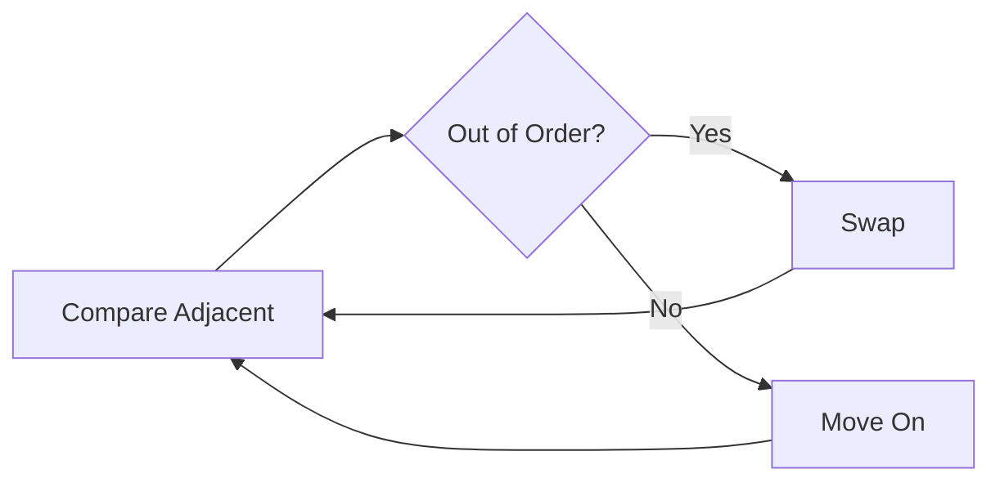
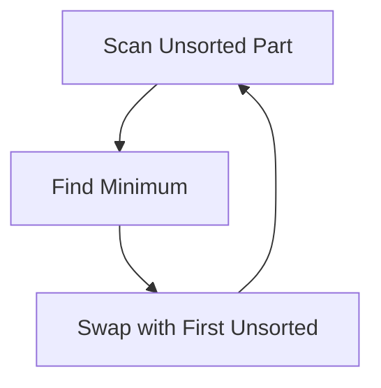
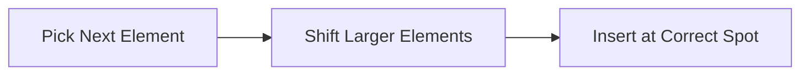
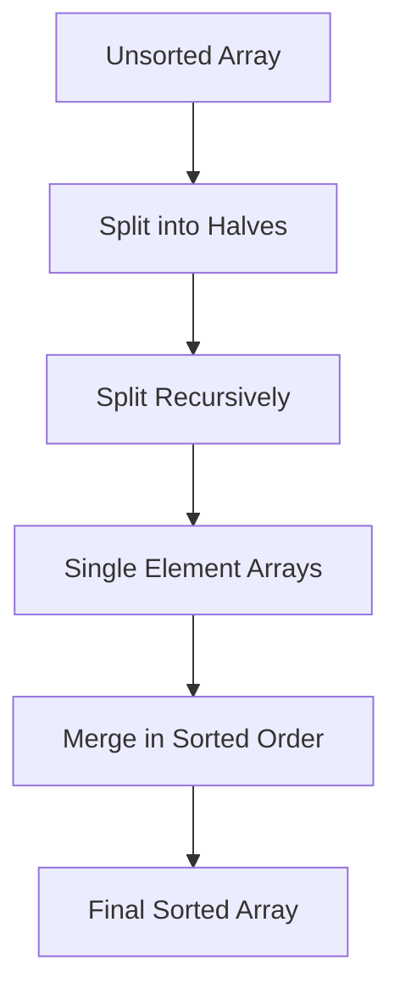
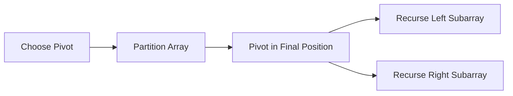
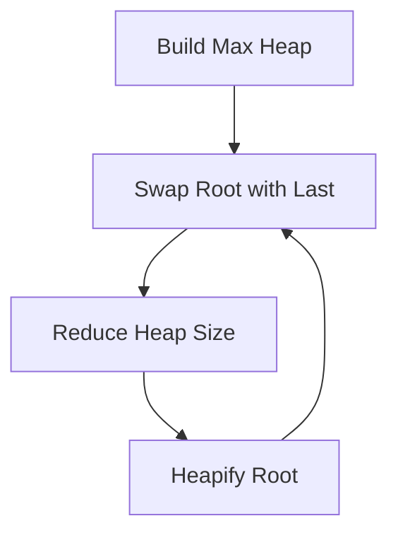
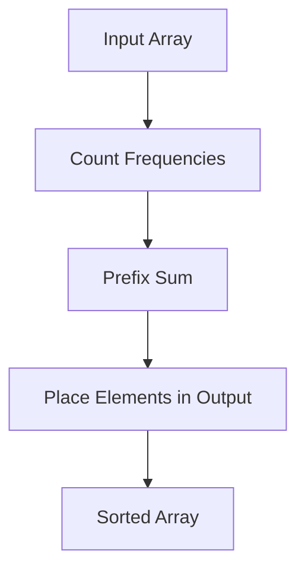
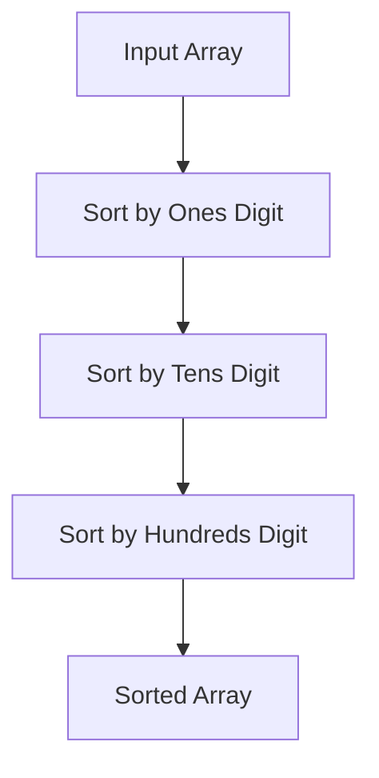

# Sorting

:::tip[Status]

This note is complete, reviewed, and considered stable.

:::

At its core, **sorting is about order**.

Given a collection of elements:

```text
[7, 3, 5, 2]
```

We want to rearrange them so that:

```text
[2, 3, 5, 7]
```

## Why Do We Need Sorting?

- Searching becomes fast (binary search is impossible without sorting)
- Databases rely heavily on sorted data (indexes, range queries)
- Operating systems schedule tasks using sorted queues
- Analytics (median, percentile, ranking) _require_ sorted data

If we understand sorting well, we automatically understand:

- Why databases choose certain indexes
- Why Python’s `sort()` behaves the way it does
- Why some algorithms are fast on “almost sorted” data

## What Does “Sorting” Mean to a Machine?

A computer **does not see numbers** like humans do. It sees:

- Memory locations
- Comparisons
- Swaps or moves

So every sorting algorithm answers two questions:

1. **How do I decide order?**
   (comparison, digits, buckets, counts)
2. **How do I rearrange data?**
   (swap, shift, copy, merge)

Different algorithms make _different trade-offs_ between:

- Speed
- Memory
- Simplicity
- Stability

## Key Properties

### In-place vs Out-of-place

- **In-place**: rearranges elements inside the same array
- **Out-of-place**: needs extra memory

Why it matters:

- In-place → memory efficient
- Out-of-place → often simpler and safer

### Stability

A sorting algorithm is **stable** if it preserves the relative order of equal elements.

Example:

```text
[(A, 5), (B, 5), (C, 3)]
```

After stable sort by number:

```text
[(C, 3), (A, 5), (B, 5)]
```

Why stability matters:

- Multi-key sorting (sort by salary, then by name)
- Database operations

## Comparison vs Non-Comparison Sorting

### Comparison Sorting

Algorithms that only ask:

> “Is A smaller than B?”

Key fact:

- **No comparison-based sort can beat O(n log n)** in the worst case

Examples:

- Bubble, Insertion, Merge, Quick, Heap

### Non-Comparison Sorting

Algorithms that **do not compare elements directly**.

Instead they exploit:

- Value ranges
- Digits
- Distribution

Examples:

- Counting Sort
- Radix Sort

These can beat `n log n`, sometimes reaching **O(n)**.

## Bubble Sort

### Core Idea

Imagine numbers as bubbles in water.

- Bigger bubbles float upward
- Smaller bubbles sink downward

Bubble Sort repeatedly:

1. Looks at **adjacent elements**
2. Swaps them if they are in the wrong order

Over time, the largest element “floats” to the end.

### Step-by-Step Example

Array:

```text
[5, 3, 4, 1]
```

First pass:

- Compare 5 & 3 → swap → [3, 5, 4, 1]
- Compare 5 & 4 → swap → [3, 4, 5, 1]
- Compare 5 & 1 → swap → [3, 4, 1, 5]

Notice:

- **5 is now in its final position**

Each pass fixes **one element** at the end.

### Visual Flow

<div style={{textAlign: 'center'}}>



</div>

### Python Implementation

```python
def bubble_sort(arr):
    n = len(arr)
    for i in range(n):
        swapped = False
        for j in range(0, n - i - 1):
            if arr[j] > arr[j + 1]:
                arr[j], arr[j + 1] = arr[j + 1], arr[j]
                swapped = True
        if not swapped:
            break
```

### Complexity & Properties

- Best: O(n)
- Average: O(n²)
- Worst: O(n²)
- Space: O(1)
- Stable: Yes

Bubble Sort teaches **how swapping gradually creates order**.

## Selection Sort

### Core Idea

Instead of swapping many times:

> “Find the smallest element first, then place it correctly.”

Think of arranging cards:

- Scan all cards
- Pick the smallest
- Place it at position 0

Repeat for position 1, 2, ...

### Step-by-Step Example

Array:

```text
[5, 3, 4, 1]
```

Pass 1:

- Smallest = 1
- Swap with index 0 → [1, 3, 4, 5]

Pass 2:

- Remaining = [3, 4, 5]
- Smallest already at correct place

### Visual Flow

<div style={{textAlign: 'center'}}>



</div>

### Python Implementation

```python
def selection_sort(arr):
    n = len(arr)
    for i in range(n):
        min_idx = i
        for j in range(i + 1, n):
            if arr[j] < arr[min_idx]:
                min_idx = j
        arr[i], arr[min_idx] = arr[min_idx], arr[i]
```

### Complexity & Properties

- Best: O(n²)
- Average: O(n²)
- Worst: O(n²)
- Space: O(1)
- Stable: No

## Insertion Sort

### Core Idea

Insertion Sort assumes:

> “The left part is already sorted.”

Then it:

- Takes the next element
- Inserts it into the correct position in the sorted part

Exactly how we sort playing cards in our hands.

### Step-by-Step Example

Array:

```text
[5, 3, 4, 1]
```

- Start with [5]
- Insert 3 → [3, 5]
- Insert 4 → [3, 4, 5]
- Insert 1 → [1, 3, 4, 5]

No swapping chaos — just **shifting and inserting**.

### Visual Flow

<div style={{textAlign: 'center'}}>



</div>

### Python Implementation

```python
def insertion_sort(arr):
    for i in range(1, len(arr)):
        key = arr[i]
        j = i - 1
        while j >= 0 and arr[j] > key:
            arr[j + 1] = arr[j]
            j -= 1
        arr[j + 1] = key
```

### Complexity & Properties

- Best: O(n)
- Average: O(n²)
- Worst: O(n²)
- Space: O(1)
- Stable: Yes

## Merge Sort

### Core Idea

Merge Sort is based on a simple principle:

> **It is easy to merge two sorted arrays, but hard to sort a big unsorted one.**

So Merge Sort:

1. **Divides** the array into smaller parts until each part has only one element
2. **Merges** those parts back together in sorted order

The key point:

- Splitting is trivial
- **Merging is where the actual sorting happens**

### Step-by-Step Example

Array:

```text
[8, 3, 1, 7, 0, 10, 2]
```

#### Step 1: Divide

```text
[8, 3, 1, 7] | [0, 10, 2]
```

Divide again:

```text
[8, 3] | [1, 7] | [0, 10] | [2]
```

Divide until size = 1:

```text
[8] [3] [1] [7] [0] [10] [2]
```

#### Step 2: Merge (sorted merge)

Merge pairs:

```text
[8] + [3]   → [3, 8]
[1] + [7]   → [1, 7]
[0] + [10]  → [0, 10]
```

Merge again:

```text
[3, 8] + [1, 7]   → [1, 3, 7, 8]
[0, 10] + [2]     → [0, 2, 10]
```

Final merge:

```text
[1, 3, 7, 8] + [0, 2, 10]
→ [0, 1, 2, 3, 7, 8, 10]
```

### Visual Flow

<div style={{textAlign: 'center'}}>



</div>

### Python Implementation

```python
def merge_sort(arr):
    if len(arr) <= 1:
        return arr

    mid = len(arr) // 2
    left = merge_sort(arr[:mid])
    right = merge_sort(arr[mid:])

    return merge(left, right)


def merge(left, right):
    result = []
    i = j = 0

    while i < len(left) and j < len(right):
        if left[i] <= right[j]:
            result.append(left[i])
            i += 1
        else:
            result.append(right[j])
            j += 1

    result.extend(left[i:])
    result.extend(right[j:])
    return result
```

### Complexity & Properties

#### Time Complexity

- Best Case: **O(n log n)**
- Average Case: **O(n log n)**
- Worst Case: **O(n log n)**

#### Space Complexity

- **O(n)** (temporary arrays during merging)

#### Stability

- **Stable** (equal elements preserve order)

#### In-place

- **No**

## Quick Sort

### Core Idea

Quick Sort works by **placing one element (called the pivot) into its final correct position** in the array.

Once the pivot is in the correct place:

- All elements **smaller than the pivot** are on the left
- All elements **greater than the pivot** are on the right

After this:

- The pivot is **done forever**
- The same process is applied recursively to the left and right parts

Quick Sort does **not** sort the entire array at once.
It repeatedly fixes **one element at a time** in its final position.

### Step-by-Step Example

Array:

```text
[8, 3, 1, 7, 0, 10, 2]
```

Choose pivot (last element):

```text
pivot = 2
```

**Partition step**:

- Elements < 2 → `[1, 0]`
- Pivot → `[2]`
- Elements > 2 → `[8, 3, 7, 10]`

Array now conceptually becomes:

```text
[1, 0] | 2 | [8, 3, 7, 10]
```

Pivot `2` is now in its **final sorted position**.

Repeat the same steps recursively on:

- Left part: `[1, 0]`
- Right part: `[8, 3, 7, 10]`

This continues until all subarrays have size 0 or 1.

### Visual Flow

<div style={{textAlign: 'center'}}>



</div>

### Python Implementation

(In-place Quick Sort using Lomuto partition)

```python
def quick_sort(arr, low, high):
    if low < high:
        p = partition(arr, low, high)
        quick_sort(arr, low, p - 1)
        quick_sort(arr, p + 1, high)


def partition(arr, low, high):
    pivot = arr[high]
    i = low - 1

    for j in range(low, high):
        if arr[j] <= pivot:
            i += 1
            arr[i], arr[j] = arr[j], arr[i]

    arr[i + 1], arr[high] = arr[high], arr[i + 1]
    return i + 1
```

Usage:

```python
arr = [8, 3, 1, 7, 0, 10, 2]
quick_sort(arr, 0, len(arr) - 1)
```

### Complexity & Properties

#### Time Complexity

- Best Case: **O(n log n)** (balanced partitions)
- Average Case: **O(n log n)**
- Worst Case: **O(n²)** (already sorted with bad pivot choice)

#### Space Complexity

- Average: **O(log n)** (recursion stack)
- Worst: **O(n)**

#### Stability

- **Not stable**

#### In-place

- Yes (excluding recursion stack)

## Heap Sort

### Core Idea

Heap Sort uses a **heap data structure** to sort elements.

A **max heap** has this property:

- The **largest element is always at the root**

Heap Sort works by:

1. Turning the array into a max heap
2. Repeatedly removing the maximum element and placing it at the end
3. Restoring the heap property after each removal

Each removal puts **one element into its final sorted position**.

### Step-by-Step Example

Array:

```text
[4, 10, 3, 5, 1]
```

#### Step 1: Build Max Heap

After heapify:

```text
        10
       /  \
      5    3
     / \
    4   1
```

Array representation:

```text
[10, 5, 3, 4, 1]
```

#### Step 2: Extract Maximum (Repeatedly)

1. Swap root with last element:

```text
[1, 5, 3, 4, 10]
```

Heapify remaining heap:

```text
        5
       / \
      4   3
     /
    1
```

Array:

```text
[5, 4, 3, 1, 10]
```

2. Repeat:

```text
[1, 4, 3, 5, 10] → heapify → [4, 1, 3, 5, 10]
```

Continue until heap size is 1.

Final sorted array:

```text
[1, 3, 4, 5, 10]
```

### Visual Flow

<div style={{textAlign: 'center'}}>



</div>

### Python Implementation

(In-place Heap Sort)

```python
def heap_sort(arr):
    n = len(arr)

    # Build max heap
    for i in range(n // 2 - 1, -1, -1):
        heapify(arr, n, i)

    # Extract elements one by one
    for i in range(n - 1, 0, -1):
        arr[0], arr[i] = arr[i], arr[0]
        heapify(arr, i, 0)


def heapify(arr, n, i):
    largest = i
    left = 2 * i + 1
    right = 2 * i + 2

    if left < n and arr[left] > arr[largest]:
        largest = left

    if right < n and arr[right] > arr[largest]:
        largest = right

    if largest != i:
        arr[i], arr[largest] = arr[largest], arr[i]
        heapify(arr, n, largest)
```

### Complexity & Properties

#### Time Complexity

- Best Case: **O(n log n)**
- Average Case: **O(n log n)**
- Worst Case: **O(n log n)**

#### Space Complexity

- **O(1)** (in-place, excluding recursion stack)

#### Stability

- **Not stable**

#### In-place

- **Yes**

## Counting Sort

### Core Idea

Counting Sort is a **non-comparison-based sorting algorithm**.

It works by:

- Counting how many times each **value appears**
- Computing positions using **prefix sums**
- Placing elements directly into their **final sorted position**

It only works when:

- The input values are **integers**
- The value range **(max − min)** is reasonably small

### Step-by-Step Example

Array:

```text
[4, 2, 2, 8, 3, 3, 1]
```

#### Step 1: Find Range

Minimum = `1`
Maximum = `8`

Range = `1 → 8`

#### Step 2: Count Frequencies

Create count array (index = value):

```text
Index:  1 2 3 4 5 6 7 8
Count:  1 2 2 1 0 0 0 1
```

#### Step 3: Prefix Sum (Cumulative Count)

This tells **final positions**.

```text
Index:  1 2 3 4 5 6 7 8
Prefix: 1 3 5 6 6 6 6 7
```

#### Step 4: Build Output (Right to Left for Stability)

Process original array backwards:

```text
8 → position 7
3 → position 5
3 → position 4
2 → position 3
2 → position 2
1 → position 1
```

Final sorted array:

```text
[1, 2, 2, 3, 3, 4, 8]
```

### Visual Flow

<div style={{textAlign: 'center'}}>



</div>

### Python Implementation

(Stable Counting Sort)

```python
def counting_sort(arr):
    if not arr:
        return arr

    min_val = min(arr)
    max_val = max(arr)

    range_size = max_val - min_val + 1
    count = [0] * range_size

    # Count frequencies
    for num in arr:
        count[num - min_val] += 1

    # Prefix sum
    for i in range(1, range_size):
        count[i] += count[i - 1]

    # Build output array (stable)
    output = [0] * len(arr)
    for num in reversed(arr):
        index = num - min_val
        count[index] -= 1
        output[count[index]] = num

    return output
```

### Complexity & Properties

#### Time Complexity

- Best Case: **O(n + k)**
- Average Case: **O(n + k)**
- Worst Case: **O(n + k)**
  (`k = range of values`)

#### Space Complexity

- **O(n + k)**

#### Stability

- **Stable**

#### In-place

- **No**

#### Key Limitations

- Not suitable for **large value ranges**
- Only works with **discrete integer keys**

## Radix Sort

### Core Idea

Radix Sort sorts numbers **digit by digit**, instead of comparing entire values.

It works by:

- Sorting elements based on **one digit at a time**
- Starting from the **least significant digit (LSD)** to the **most significant digit (MSD)**
- Using a **stable sub-sorting algorithm** (usually **Counting Sort**) at each digit

Because digits are processed independently, **no direct comparisons between numbers are needed**.

### Step-by-Step Example

Array:

```text
[170, 45, 75, 90, 802, 24, 2, 66]
```

Assume base = 10 (decimal numbers).

#### Step 1: Sort by Ones Place

Digits:

```text
170 → 0
45  → 5
75  → 5
90  → 0
802 → 2
24  → 4
2   → 2
66  → 6
```

After stable sort:

```text
[170, 90, 802, 2, 24, 45, 75, 66]
```

#### Step 2: Sort by Tens Place

Digits:

```text
170 → 7
90  → 9
802 → 0
2   → 0
24  → 2
45  → 4
75  → 7
66  → 6
```

After stable sort:

```text
[802, 2, 24, 45, 66, 170, 75, 90]
```

#### Step 3: Sort by Hundreds Place

Digits:

```text
802 → 8
2   → 0
24  → 0
45  → 0
66  → 0
170 → 1
75  → 0
90  → 0
```

After stable sort:

```text
[2, 24, 45, 66, 75, 90, 170, 802]
```

Final sorted array:

```text
[2, 24, 45, 66, 75, 90, 170, 802]
```

### Visual Flow

<div style={{textAlign: 'center'}}>



</div>

### Python Implementation

(LSD Radix Sort using Counting Sort)

```python
def counting_sort_by_digit(arr, exp):
    n = len(arr)
    output = [0] * n
    count = [0] * 10  # digits 0-9

    # Count digit frequencies
    for num in arr:
        digit = (num // exp) % 10
        count[digit] += 1

    # Prefix sum
    for i in range(1, 10):
        count[i] += count[i - 1]

    # Build output (stable)
    for num in reversed(arr):
        digit = (num // exp) % 10
        count[digit] -= 1
        output[count[digit]] = num

    return output


def radix_sort(arr):
    if not arr:
        return arr

    max_val = max(arr)
    exp = 1

    while max_val // exp > 0:
        arr = counting_sort_by_digit(arr, exp)
        exp *= 10

    return arr
```

### Complexity & Properties

#### Time Complexity

- Best Case: **O(d × (n + b))**
- Average Case: **O(d × (n + b))**
- Worst Case: **O(d × (n + b))**

Where:

- `d` = number of digits
- `b` = base (10 for decimal)

#### Space Complexity

- **O(n + b)**

#### Stability

- **Stable** (depends on stable digit sort)

#### In-place

- **No**

#### Key Characteristics

- No comparisons between full numbers
- Extremely fast for fixed-length integers
- Performance depends on **number of digits**, not value magnitude

#### When Radix Sort is Better Than Comparison Sorts

- Large datasets of integers
- Fixed-width keys (IDs, timestamps)
- Known numeric base

## What Sorting Algorithm Does Python Use?

### Python Uses **Timsort**

Timsort is a hybrid of:

- Merge Sort
- Insertion Sort

### Why Timsort Exists

Real-world data is:

- Partially sorted
- Repetitive
- Structured

Timsort:

- Detects existing runs
- Extends them using insertion sort
- Merges efficiently

### Guarantees

- Best case: O(n)
- Worst case: O(n log n)
- Stable

```python
arr.sort()
sorted(arr)
```

Both use Timsort.

## Summary

| Algorithm          | Type                    | Best Time    | Average Time | Worst Time   | Space    | Stable | In-place | Comparison-Based |
| ------------------ | ----------------------- | ------------ | ------------ | ------------ | -------- | ------ | -------- | ---------------- |
| **Bubble Sort**    | Comparison              | O(n)         | O(n²)        | O(n²)        | O(1)     | Yes    | Yes      | Yes              |
| **Selection Sort** | Comparison              | O(n²)        | O(n²)        | O(n²)        | O(1)     | No     | Yes      | Yes              |
| **Insertion Sort** | Comparison              | O(n)         | O(n²)        | O(n²)        | O(1)     | Yes    | Yes      | Yes              |
| **Merge Sort**     | Divide & Conquer        | O(n log n)   | O(n log n)   | O(n log n)   | O(n)     | Yes    | No       | Yes              |
| **Quick Sort**     | Divide & Conquer        | O(n log n)   | O(n log n)   | O(n²)        | O(log n) | No     | Yes      | Yes              |
| **Heap Sort**      | Selection / Heap-Based  | O(n log n)   | O(n log n)   | O(n log n)   | O(1)     | No     | Yes      | Yes              |
| **Counting Sort**  | Non-comparison          | O(n + k)     | O(n + k)     | O(n + k)     | O(n + k) | Yes    | No       | No               |
| **Radix Sort**     | Non-comparison          | O(d·(n + b)) | O(d·(n + b)) | O(d·(n + b)) | O(n + b) | Yes    | No       | No               |
| **TimSort**        | Hybrid (Merge + Insert) | O(n)         | O(n log n)   | O(n log n)   | O(n)     | Yes    | No       | Yes              |

### Key Notes

- **Stable** means equal elements preserve original order
- **In-place** means O(1) extra space (ignoring recursion stack)
- **k** = range of values
- **d** = number of digits
- **b** = base (e.g., 10)
- **TimSort** is used by **Python’s `sorted()` and `.sort()`**
