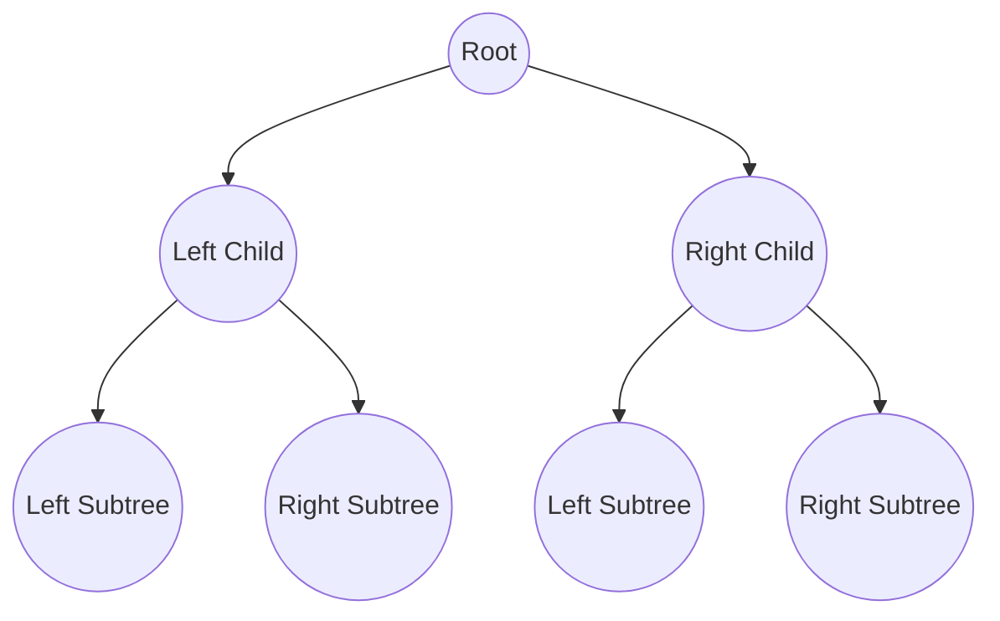
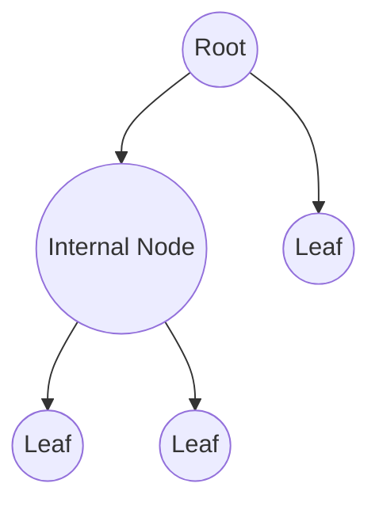

# Binary Tree

A **Binary Tree** is a hierarchical data structure where each node has at most **two children**, referred to as the **left child** and **right child**.

## Key Properties

- The **topmost node** is called the **root**.
- Nodes with no children are called **leaf nodes**.
- The **depth** of a node is the number of edges from the root to that node.
- The **height** of a tree is the number of edges in the longest path from root to a leaf.

## Structure of a Binary Tree

## Types of Binary Trees

1. **Full Binary Tree** – Every node has either 0 or 2 children.
2. **Complete Binary Tree** – All levels are completely filled except possibly the last, which is filled from left to right.
3. **Perfect Binary Tree** – All internal nodes have two children, and all leaves are at the same level.
4. **Degenerate (Skewed) Binary Tree** – Each parent has only one child (like a linked list).

## Catalan Number and Binary Trees

The **Catalan number** counts the number of possible **distinct Binary Search Trees (BSTs)** that can be formed with `n` distinct keys.

Formula:

$$
C_n = \frac{(2n)!}{(n+1)! \cdot n!}
$$

Or recursively:

$$
C_n = \sum_{i=0}^{n-1} C_i \cdot C_{n-1-i}
$$

where $C_0 = 1$.

Example: For $n = 3$ keys,

$$
C_3 = \frac{6!}{4! \cdot 3!} = \frac{720}{24 \cdot 6} = 5
$$

So, **5 distinct BSTs** can be formed.

## Number of Labelled Binary Trees

If you have `n` **labelled** nodes (distinct labels), the number of **labelled binary trees** is:

$$
\text{Count} = C_n \cdot n!
$$

Where:

- $C_n$ = Catalan number (structure count)
- $n!$ = permutations of labels

Example: For $n = 3$,

$$
C_3 = 5, \quad n! = 6
$$

Total labelled binary trees:

$$
5 \cdot 6 = 30
$$

## Max and Min Number of Nodes Given Height

Let height $h$ be **number of edges** in longest path from root to leaf.

- **Max Nodes** in height $h$ (Perfect Binary Tree):

$$
N_{\text{max}} = 2^{h+1} - 1
$$

- **Min Nodes** in height $h$ (Skewed Tree):

$$
h + 1
$$

Example: For $h = 3$,
Max nodes:

$$
2^{3+1} - 1 = 15
$$

Min nodes:

$$
3 + 1 = 4
$$

## Max and Min Height Given Number of Nodes

Let $n$ = total nodes.

- **Min Height** (Perfect Binary Tree):

$$
h_{\text{min}} = \lfloor \log_2(n) \rfloor
$$

- **Max Height** (Skewed Tree):

$$
h_{\text{max}} = n - 1
$$

Example: For $n = 10$,
Min height:

$$
\lfloor \log_2(10) \rfloor = 3
$$

Max height:

$$
10 - 1 = 9
$$

## Internal and External Nodes

### Definitions

- **Internal Node**: A node with at least one child (non-leaf).
- **External Node**: A node with no children (leaf).

**Properties** in a full binary tree:

$$
E = I + 1
$$

where:

- $E$ = number of external nodes
- $I$ = number of internal nodes

## Summary Table

| Concept                         | Formula                     |
| ------------------------------- | --------------------------- |
| Catalan Number $C_n$            | $\frac{(2n)!}{(n+1)!n!}$    |
| Number of labelled binary trees | $C_n \cdot n!$              |
| Max nodes for height $h$        | $2^{h+1} - 1$               |
| Min nodes for height $h$        | $h + 1$                     |
| Min height for $n$ nodes        | $\lfloor \log_2(n) \rfloor$ |
| Max height for $n$ nodes        | $n - 1$                     |
| Full Binary Tree relation       | $E = I + 1$                 |
