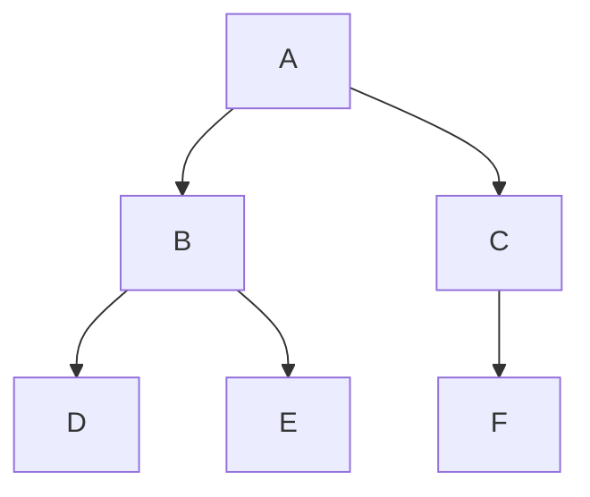

# Common Tree Algorithms

## Generating Binary Tree from In-order and Post-order Traversals

### Algorithm

- **Idea**:

  - In **post-order**, the **last element** is always the root of the current subtree.
  - In **in-order**, elements to the **left** of root are in the left subtree, and elements to the **right** are in the right subtree.

- **Steps**:

  1. Pick the last element from post-order as the root.
  2. Find this root in in-order traversal — split into left and right subtrees.
  3. Recursively build **right subtree first** (because in post-order, right subtree comes before the root when reading from the end).
  4. Recursively build left subtree.

**Visual Representation:**
Example:
In-order: `[D, B, E, A, F, C]`
Post-order: `[D, E, B, F, C, A]`

<div style={{textAlign: 'center'}}>



</div>

### Python Code

```python
class Node:
    def __init__(self, value):
        self.value = value
        self.left = None
        self.right = None

def build_tree_in_post(inorder, postorder):
    inorder_index_map = {val: idx for idx, val in enumerate(inorder)}
    post_idx = [len(postorder) - 1]

    def helper(in_left, in_right):
        if in_left > in_right:
            return None
        root_val = postorder[post_idx[0]]
        root = Node(root_val)
        post_idx[0] -= 1
        index = inorder_index_map[root_val]
        root.right = helper(index + 1, in_right)
        root.left = helper(in_left, index - 1)
        return root

    return helper(0, len(inorder) - 1)

# Example usage:
inorder = ['D', 'B', 'E', 'A', 'F', 'C']
postorder = ['D', 'E', 'B', 'F', 'C', 'A']
root = build_tree_in_post(inorder, postorder)
```

### Complexity

- **Time**: `O(n)` — each node processed once, hashmap lookup is O(1).
- **Space**: `O(n)` — recursion stack + hashmap.

## Generating Binary Tree from In-order and Pre-order Traversals

### Algorithm

- **Idea**:

  - In **pre-order**, the **first element** is always the root of the current subtree.
  - In **in-order**, elements to the left of root are in the left subtree, and to the right are in the right subtree.

- **Steps**:

  1. Pick the first element from pre-order as the root.
  2. Find this root in in-order traversal — split into left and right subtrees.
  3. Recursively build **left subtree first** (because in pre-order, left subtree comes before the right).

**Visual Representation:**
Example:
In-order: `[D, B, E, A, F, C]`
Pre-order: `[A, B, D, E, C, F]`

<div style={{textAlign: 'center'}}>


</div>

### Python Code

```python
def build_tree_in_pre(inorder, preorder):
    inorder_index_map = {val: idx for idx, val in enumerate(inorder)}
    pre_idx = [0]

    def helper(in_left, in_right):
        if in_left > in_right:
            return None
        root_val = preorder[pre_idx[0]]
        root = Node(root_val)
        pre_idx[0] += 1
        index = inorder_index_map[root_val]
        root.left = helper(in_left, index - 1)
        root.right = helper(index + 1, in_right)
        return root

    return helper(0, len(inorder) - 1)

# Example usage:
inorder = ['D', 'B', 'E', 'A', 'F', 'C']
preorder = ['A', 'B', 'D', 'E', 'C', 'F']
root = build_tree_in_pre(inorder, preorder)
```

### Complexity

- **Time**: `O(n)`
- **Space**: `O(n)`

## Counting Nodes, Leaf Nodes, Height, and Levels in a Binary Tree

### Algorithm

1. **Count total nodes**: Recursively count left + right + 1.
2. **Count leaf nodes**: Recursively check if both left & right are None → leaf.
3. **Height**: `1 + max(height(left), height(right))`, height of empty tree is 0.
4. **Levels**: Height and levels are same numerically, but “levels” are counted starting at 1.

### Python Code

```python
def count_nodes(root):
    if root is None:
        return 0
    return 1 + count_nodes(root.left) + count_nodes(root.right)

def count_leaf_nodes(root):
    if root is None:
        return 0
    if not root.left and not root.right:
        return 1
    return count_leaf_nodes(root.left) + count_leaf_nodes(root.right)

def tree_height(root):
    if root is None:
        return 0
    return 1 + max(tree_height(root.left), tree_height(root.right))

def tree_levels(root):
    return tree_height(root)  # same numeric value
```

### Complexity

- **Time**: `O(n)` for all counting and height functions.
- **Space**: `O(h)` where `h` is tree height (recursion stack).
