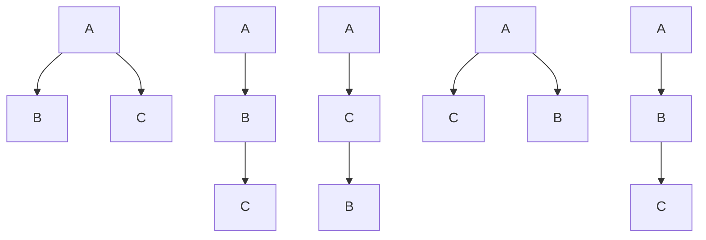
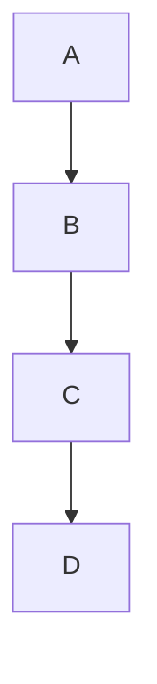
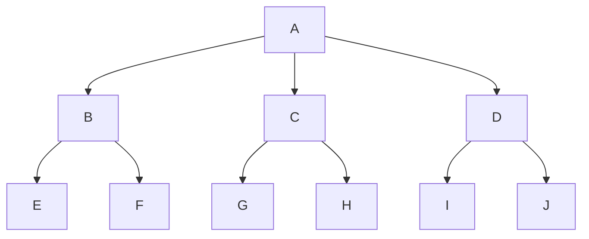

# Height and Nodes

Understanding the relationships between the number of nodes, height, and possible tree structures is fundamental in tree-based algorithms and data structures. Here are the key concepts, formulas, and visual examples for general trees:

## Number of Trees (Catalan Formula)

The number of distinct rooted ordered trees (general trees) that can be formed with `n` nodes is given by the **Catalan number**:

$$
C_n = \frac{1}{n+1} \binom{2n}{n}
$$

For example:

- For n = 3: $C_3 = 5$
- For n = 4: $C_4 = 14$

All possible rooted ordered trees with 3 nodes (A, B, C)

## Number of Trees with Labelled Nodes

If all nodes are labelled (distinct), the number of possible trees is:

$$
\text{Labelled Trees} = C_n \times n!
$$

## Maximum and Minimum Height of a Tree

- **Maximum height** of a tree with `n` nodes is `n-1` (a path/tree where each node has only one child).
- **Minimum height** (for a perfectly balanced tree) is $\lceil \log_k n \rceil$ where $k` is the maximum degree (children per node).

Perfectly balanced k-ary tree (height = ⌈log_k n⌉)

## Relationship Between Height and Nodes

### If Height is Given

- **Minimum nodes** for height `h`: $h+1$ (path/tree)
- **Maximum nodes** for height `h` in a k-ary tree: $\frac{k^{h+1}-1}{k-1}$

### If Number of Nodes is Given

- **Minimum height** for `n` nodes in a k-ary tree: $\lceil \log_k(n(k-1)+1) - 1 \rceil$
- **Maximum height** for `n` nodes: $n-1$

## Summary Table

| Property                     | Formula                              |
| ---------------------------- | ------------------------------------ |
| Number of trees (unlabelled) | $C_n = \frac{1}{n+1} \binom{2n}{n}$  |
| Number of trees (labelled)   | $C_n \times n!$                      |
| Max height (n nodes)         | $n-1$                                |
| Min height (n nodes, k-ary)  | $\lceil \log_k n \rceil$             |
| Min nodes (height h)         | $h+1$                                |
| Max nodes (height h, k-ary)  | $\frac{k^{h+1}-1}{k-1}$              |
| Min height (n nodes, k-ary)  | $\lceil \log_k(n(k-1)+1) - 1 \rceil$ |
| Max height (n nodes)         | $n-1$                                |

## Key Points

- The Catalan number counts the number of possible rooted ordered tree structures (unlabelled).
- For labelled nodes, multiply by $n!$ for all possible arrangements.
- Height and node relationships are useful for analyzing tree balance and efficiency.
- For k-ary trees, adjust formulas using $k$ (max children per node).
