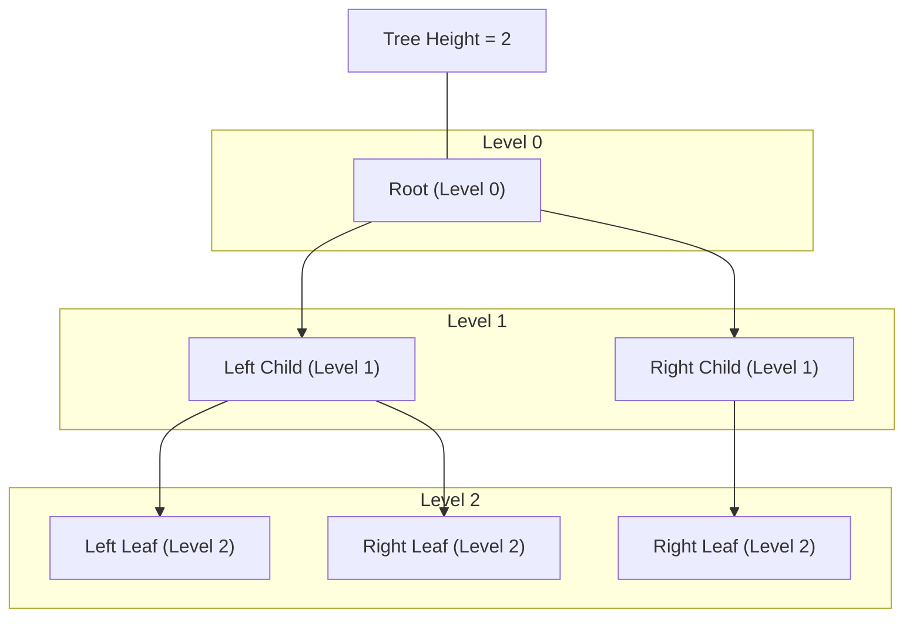

# Introduction

A **tree** is a widely used abstract data structure that simulates a hierarchical tree structure, with a root value and subtrees of children, represented as a set of linked nodes. Trees are fundamental in computer science and are used in various applications such as databases, file systems, compilers, and more.

## Tree Terminology

- **Node**: The basic unit of a tree, containing data and links to child nodes.
- **Root**: The topmost node in a tree, with no parent.
- **Parent**: A node that has one or more child nodes.
- **Child**: A node that descends from another node (its parent).
- **Leaf**: A node with no children.
- **Sibling**: Nodes that share the same parent.
- **Edge**: The connection between two nodes (parent to child).
- **Subtree**: A tree formed by a node and its descendants.
- **Level**: The distance from the root node (root is level 0).
- **Height**: The length of the longest path from the root to a leaf.
- **Depth**: The length of the path from the root to a given node.
- **Degree**: The number of children a node has.
- **Ancestor**: Any node on the path from a node to the root.
- **Descendant**: Any node on the path from a node to a leaf.
- **Path**: A sequence of nodes and edges connecting a node with a descendant.

Below is a binary tree diagram with levels and height highlighted using Mermaid:

In this diagram:

- **A** is the root node at Level 0.
- **B** and **C** are at Level 1.
- **D**, **E**, and **F** are leaf nodes at Level 2.
- The tree height is 2 (longest path from root to leaf).
- Subgraphs visually group nodes by their level.
