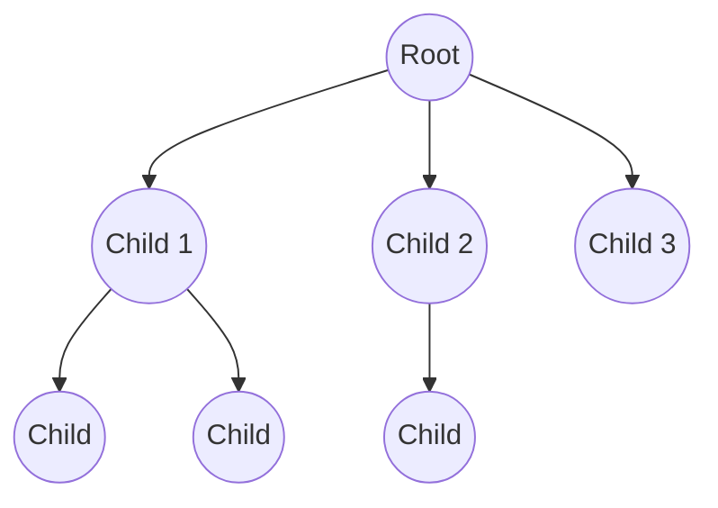

# N-ary Tree

An **n-ary tree** is a rooted tree in which each node can have at most `n` children. This generalizes the binary tree concept to any number of children.

- If `n = 2`, it’s a binary tree.
- If `n = 3`, each node can have 0, 1, 2, or 3 children.

## Structure of an N-ary Tree (n = 3 Example)

## Types of N-ary Trees

- **Full N-ary Tree** – Every internal node has exactly `n` children.
- **Complete N-ary Tree** – All levels except possibly the last are full; last level filled left to right.
- **Perfect N-ary Tree** – All internal nodes have exactly `n` children, and all leaves are at the same depth.

## Number of Possible N-ary Trees – Catalan Generalization

For full n-ary trees (every internal node has exactly n children), the generalized Catalan number gives the number of structurally distinct trees with `m` internal nodes:

$$
C^{(n)}_m = \frac{1}{(n-1)m + 1} \binom{nm}{m}
$$

Where:

- $m$ = number of internal nodes
- Total nodes = $nm + 1$

Example: For a full ternary tree ($n = 3$) with $m = 2$ internal nodes:

$$
C^{(3)}_2 = \frac{1}{5} \cdot \binom{6}{2} = \frac{1}{5} \cdot 15 = 3
$$

## Number of Labelled Full N-ary Trees

If nodes are labelled (distinct), the number is:

$$
\text{Count} = C^{(n)}_m \cdot (nm + 1)!
$$

Where:

- $C^{(n)}_m$ = generalized Catalan number
- $nm + 1$ = total nodes

## Max and Min Number of Nodes Given Height

Let $h$ = height (number of edges from root to deepest leaf).

- **Max Nodes** (Perfect N-ary Tree):

$$
N_{\text{max}} = \frac{n^{h+1} - 1}{n - 1}
$$

- **Min Nodes** (Full N-ary Tree):

$$
N_{\text{min}} = nh + 1
$$

If not strict:

$$
N_{\text{min}} = h + 1
$$

Example: For $n = 3$ and $h = 2$:
Max:

$$
\frac{3^{3} - 1}{3 - 1} = 13
$$

Min (full):

$$
3 \cdot 2 + 1 = 7
$$

Min (non-full):

$$
2 + 1 = 3
$$

## Max and Min Height Given Number of Nodes

Let $N$ = total nodes.

- **Min Height** (Perfect N-ary Tree):

$$
h_{\text{min}} = \lfloor \log_n((N(n-1))+1) \rfloor - 1
$$

- **Max Height**:
  If full:
  $$
  h_{\text{max}} = \frac{N - 1}{n}
  $$
  If not full:
  $$
  h_{\text{max}} = N - 1
  $$

## Internal and External Nodes (Full N-ary Tree)

For a full n-ary tree:

$$
E = (n-1)I + 1
$$

Where:

- $E$ = external nodes (leaves)
- $I$ = internal nodes

Also:

$$
\text{Total Nodes} = E + I
$$

Example: For $n = 3$, $I = 4$ internal nodes:

$$
E = (3-1) \cdot 4 + 1 = 9
$$

Total nodes:

$$
4 + 9 = 13
$$

## Summary Table for N-ary Tree

| Concept                             | Formula                                          |
| ----------------------------------- | ------------------------------------------------ |
| Generalized Catalan Number (full)   | $C^{(n)}_m = \frac{1}{(n-1)m + 1} \binom{nm}{m}$ |
| Labelled full n-ary trees           | $C^{(n)}_m \cdot (nm+1)!$                        |
| Max nodes for height $h$            | $\frac{n^{h+1} - 1}{n - 1}$                      |
| Min nodes for height $h$ (full)     | $nh + 1$                                         |
| Min nodes for height $h$ (non-full) | $h + 1$                                          |
| Min height for $N$ nodes            | $\lfloor \log_n((N(n-1))+1) \rfloor - 1$         |
| Max height for $N$ nodes (full)     | $\frac{N - 1}{n}$                                |
| Max height for $N$ nodes (non-full) | $N - 1$                                          |
| Full n-ary tree relation            | $E = (n-1)I + 1$                                 |

---

If you want, I can now **draw a mermaid diagram showing a perfect vs minimal full n-ary tree for a given height**, so the min/max formula is visually easy to remember.

Do you want me to add that visual?
