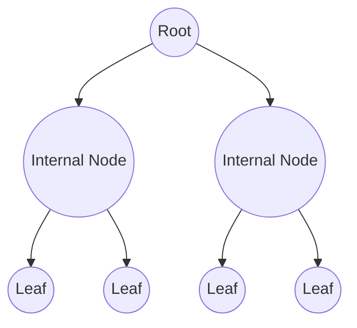
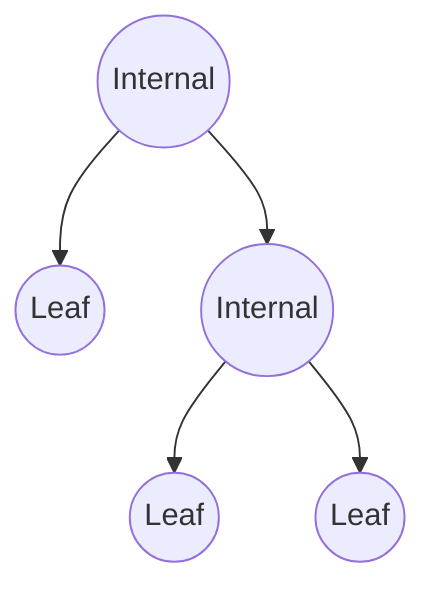

# Strict Binary Tree

A **Strict Binary Tree** (also called a full binary tree) is a binary tree in which every internal node has exactly two children. This means:

- No node has only one child.
- Every node is either a **leaf node** or has **two children**.

## Structure of a Strict Binary Tree

## Types of Strict Binary Tree

- **Perfect Strict Binary Tree** – All internal nodes have two children and all leaves are at the same depth.
- **Complete Strict Binary Tree** – All levels are full except possibly the last, which is filled left-to-right, but still must follow the strict property at every internal node.
- **Strict but Skewed Tree** – Not possible, since strictness requires every internal node to have two children.

## Catalan Number and Strict Binary Trees

The **Catalan number** formula applies for counting the number of possible structures of strict binary trees with `n` internal nodes:

$$
C_n = \frac{(2n)!}{(n+1)! \cdot n!}
$$

where $n$ is the number of internal nodes, and total nodes = $2n + 1$.

Example: $n = 3$ internal nodes → Total nodes = $2 \cdot 3 + 1 = 7$

$$
C_3 = \frac{6!}{4! \cdot 3!} = 5
$$

## Number of Labelled Strict Binary Trees

If you have $n$ internal nodes (thus $2n+1$ total labelled nodes), the number of labelled strict binary trees is:

$$
\text{Count} = C_n \cdot (2n+1)!
$$

Example: For $n = 3$ internal nodes → Total nodes = 7

$$
C_3 = 5, \quad (2n+1)! = 7! = 5040
$$

Total labelled strict binary trees:

$$
5 \cdot 5040 = 25200
$$

## Max and Min Number of Nodes Given Height

For a strict binary tree of height $h$ (number of edges from root to leaf):

- **Max Nodes** (Perfect Strict Binary Tree):

$$
N_{\text{max}} = 2^{h+1} - 1
$$

- **Min Nodes**: A strict binary tree must have at least $2h + 1$ nodes.

$$
N_{\text{min}} = 2h + 1
$$

Example: $h = 3$

Max nodes:

$$
2^{3+1} - 1 = 15
$$

Min nodes:

$$
2 \cdot 3 + 1 = 7
$$

## Max and Min Height Given Number of Nodes

Let $n$ = total nodes in a strict binary tree.

- **Min Height** (Perfect Strict Binary Tree):

$$
h_{\text{min}} = \lfloor \log_2(n) \rfloor
$$

- **Max Height**: In a strict binary tree, the longest possible height occurs when the tree is minimally filled but still strict:

$$
h_{\text{max}} = \frac{n - 1}{2}
$$

Example: For $n = 9$

Min height:

$$
\lfloor \log_2(9) \rfloor = 3
$$

Max height:

$$
\frac{9 - 1}{2} = 4
$$

## Internal and External Nodes

In a strict binary tree:

$$
E = I + 1
$$

where:

- $E$ = number of external (leaf) nodes
- $I$ = number of internal nodes

Also:

$$
\text{Total Nodes} = 2I + 1
$$

Example: $I = 4$ → $E = 5$, total nodes = $2 \cdot 4 + 1 = 9$.

## Summary Table for Strict Binary Tree

| Concept                           | Formula                     | Notes                            |
| --------------------------------- | --------------------------- | -------------------------------- |
| Catalan Number (n internal nodes) | $\frac{(2n)!}{(n+1)!n!}$    | Counts structures only           |
| Labelled strict binary trees      | $C_n \cdot (2n+1)!$         | Labels permuted across all nodes |
| Max nodes for height $h$          | $2^{h+1} - 1$               | Perfect case                     |
| Min nodes for height $h$          | $2h + 1$                    | Minimal strict shape             |
| Min height for $n$ nodes          | $\lfloor \log_2(n) \rfloor$ | Perfect case                     |
| Max height for $n$ nodes          | $\frac{n - 1}{2}$           | Minimal strict shape             |
| Full Binary Tree relation         | $E = I + 1$                 | Applies to all strict trees      |
