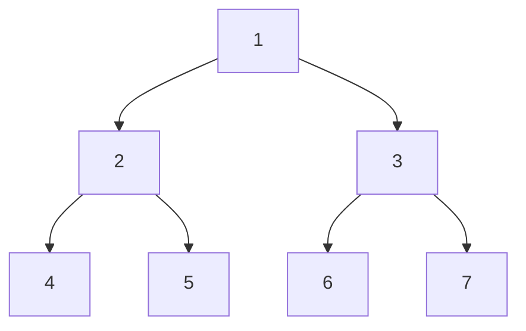

# Binary Tree Traversals

Traversal refers to visiting each node of a binary tree exactly once in a systematic way.

There are two main categories:

1. Depth-First Traversal (DFS): In-order, Pre-order, Post-order
2. Breadth-First Traversal (BFS): Level-order

## Depth-First Traversals (DFS)

DFS visits nodes as far as possible along each branch before backtracking.

### In-order Traversal (LNR)

Order:

1. Visit Left subtree
2. Visit Node
3. Visit Right subtree

<div style={{textAlign: 'center'}}>



</div>

Example for In-order: 4, 2, 5, 1, 6, 3, 7

Python Code

```python
class Node:
    def __init__(self, key):
        self.key = key
        self.left = None
        self.right = None

def inorder(root):
    if root:
        inorder(root.left)   # Step 1: Left
        print(root.key, end=" ")  # Step 2: Node
        inorder(root.right)  # Step 3: Right

# Example usage
root = Node(1)
root.left = Node(2)
root.right = Node(3)
root.left.left = Node(4)
root.left.right = Node(5)
root.right.left = Node(6)
root.right.right = Node(7)

inorder(root)
```

### Pre-order Traversal (NLR)

Order:

1. Visit Node
2. Visit Left subtree
3. Visit Right subtree

Example: 1, 2, 4, 5, 3, 6, 7

Python Code

```python
def preorder(root):
    if root:
        print(root.key, end=" ")  # Step 1: Node
        preorder(root.left)       # Step 2: Left
        preorder(root.right)      # Step 3: Right

preorder(root)
```

### Post-order Traversal (LRN)

Order:

1. Visit Left subtree
2. Visit Right subtree
3. Visit Node

Example: 4, 5, 2, 6, 7, 3, 1

Python Code

```python
def postorder(root):
    if root:
        postorder(root.left)   # Step 1: Left
        postorder(root.right)  # Step 2: Right
        print(root.key, end=" ")  # Step 3: Node

postorder(root)
```

## Breadth-First Traversal (BFS)

### Level-order Traversal

Order: Visit nodes level by level from left to right.

<div style={{textAlign: 'center'}}>


</div>

Level-order result: 1, 2, 3, 4, 5, 6, 7

Python Code

```python
from collections import deque

def level_order(root):
    if not root:
        return
    queue = deque([root])
    while queue:
        node = queue.popleft()
        print(node.key, end=" ")
        if node.left:
            queue.append(node.left)
        if node.right:
            queue.append(node.right)

level_order(root)
```

## Complexity Analysis

| Traversal Type | Time Complexity | Space Complexity (worst case) | Space Complexity (best case) |
| -------------- | --------------- | ----------------------------- | ---------------------------- |
| In-order       | O(n)            | O(h) recursion stack          | O(1) for skewed tree         |
| Pre-order      | O(n)            | O(h) recursion stack          | O(1) for skewed tree         |
| Post-order     | O(n)            | O(h) recursion stack          | O(1) for skewed tree         |
| Level-order    | O(n)            | O(n) queue                    | O(1) if tree has only root   |

- n = number of nodes
- h = height of the tree
- Recursion space complexity applies only to DFS traversals. BFS uses a queue.

## Key Points to Remember

- In-order is mainly used for Binary Search Trees to get sorted order.
- Pre-order is used for tree cloning or serialization.
- Post-order is used for deleting/freeing nodes.
- Level-order is used for shortest path in unweighted trees and printing level-wise data.
