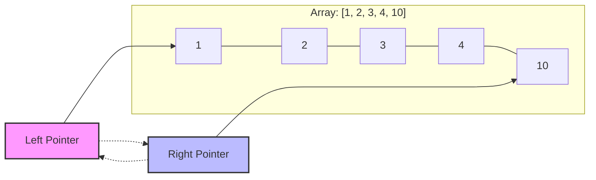
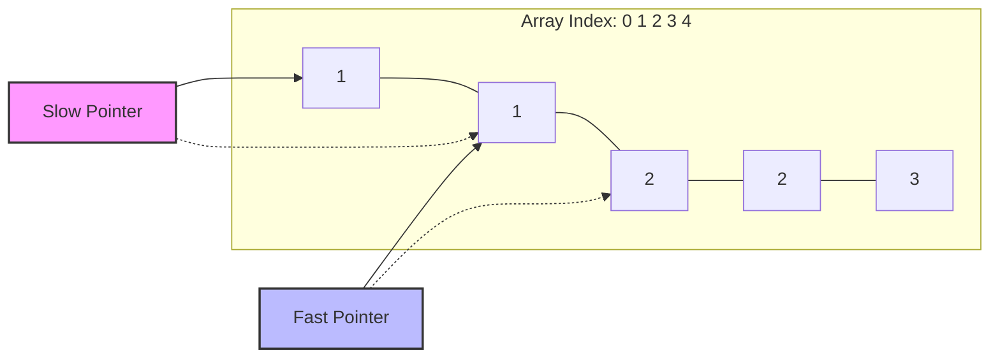

# Two Pointers Technique

:::tip[Status]

This note is complete, reviewed, and considered stable.

:::

The **Two Pointers** technique is a powerful algorithmic pattern where we use two indices (pointers) to traverse or manipulate a data structure, typically an array or string. By coordinating the movement of these pointers, we can often solve complex problems with optimal time and space complexity.

We typically move these pointers in the same direction, opposite directions, or at different speeds (slow and fast pointers).

## How It Works

We use two pointers to keep track of indices as we iterate through a collection. The logic depends on the specific strategy:

- **Opposite Direction**: We start one pointer at the beginning and the other at the end, moving them toward each other.
- **Fast and Slow**: Both pointers start at the same point, but one moves faster or under different conditions than the other.
- **Sliding Window**: We maintain a range (a "window") between the two pointers that expands or contracts based on the problem's constraints.

## Key Scenarios

### Opposite Direction (Start and End)

We use this when we need to compare or process elements from both ends of a sorted array or a string.

<div style={{textAlign: 'center'}}>



</div>

- **Example**: Checking if an array is a palindrome or finding pairs with a specific sum in a sorted array.

### Same Direction (Fast and Slow)

We move both pointers from the start, but at different speeds. This is often used to detect cycles or find midpoints.

<div style={{textAlign: 'center'}}>



</div>

- **Example**: Moving duplicates to the end of an array or detecting a cycle in a linked list.

## Time and Space Complexity

- **Time Complexity**: Most Two Pointers solutions run in **O(n)** because each pointer usually traverses the collection only once.
- **Space Complexity**: These algorithms are highly space-efficient, typically requiring only **O(1)** additional space.
- **Preprocessing**: If the data isn't sorted and the strategy requires it, we might need an initial sort step, adding **O(n log n)** to the total time.

## Common Problems and Examples

| Problem Type | Description | Example |
| :--- | :--- | :--- |
| **Target Sum** | Find if two elements add up to a target value in a sorted array. | Two Sum (Sorted) |
| **Palindrome** | Check if a string reads the same forward and backward. | Palindrome Check |
| **In-place Modification** | Filter or remove elements without using extra space. | Remove Duplicates |
| **Sliding Window** | Find a subarray or substring meeting specific criteria. | Longest Substring |

### Example 1: Finding Pairs with a Target Sum

This approach is ideal for sorted arrays. We adjust our pointers based on whether the current sum is too high or too low.

```python
def two_sum_sorted(arr, target):
    left, right = 0, len(arr) - 1

    while left < right:
        current_sum = arr[left] + arr[right]
        if current_sum == target:
            return (arr[left], arr[right])
        elif current_sum < target:
            left += 1  # Need a larger sum
        else:
            right -= 1 # Need a smaller sum

    return None
```

### Example 2: Check if a String is a Palindrome

We use two pointers to compare characters from both ends moving inward.

```python
def is_palindrome(s):
    left, right = 0, len(s) - 1

    while left < right:
        if s[left] != s[right]:
            return False
        left += 1
        right -= 1

    return True
```

### Example 3: Remove Duplicates from Sorted Array

We use a "write" pointer and a "read" pointer to modify the array in-place.

```python
def remove_duplicates(nums):
    if not nums:
        return 0

    write_pointer = 1
    for read_pointer in range(1, len(nums)):
        # If we find a new unique element
        if nums[read_pointer] != nums[read_pointer - 1]:
            nums[write_pointer] = nums[read_pointer]
            write_pointer += 1

    return write_pointer
```

## Advantages of the Technique

1. **Efficiency**: We often reduce complexity from O(n²) to O(n).
2. **Memory**: We avoid creating extra copies of the data structure (O(1) space).
3. **Clarity**: The logic is typically cleaner and easier to reason about than nested loops.

## When to Use It

- When we are dealing with **sorted** arrays or strings.
- When we need to find pairs, triplets, or subarrays that satisfy a condition.
- When we need to modify an array **in-place** to save memory.
- When we are looking for a **window** of data within a larger set.
