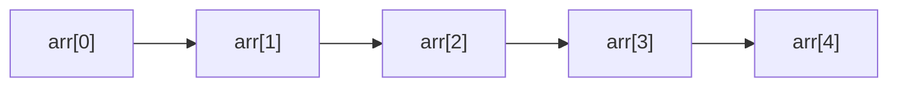
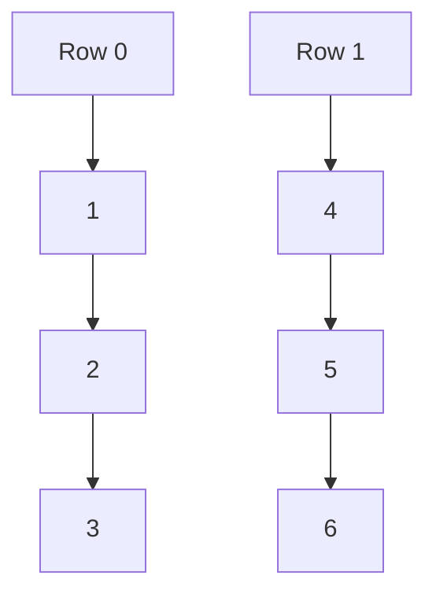
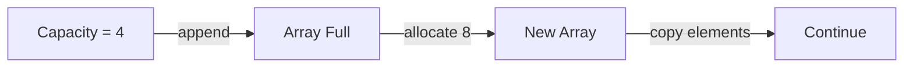
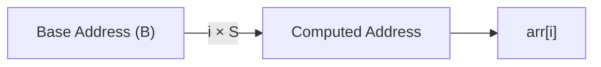

# Arrays

:::tip[Status]

This note is complete, reviewed, and considered stable.

:::

An **array** is a **linear data structure** used to store multiple values of the **same data type** in a **contiguous block of memory**.

The defining idea of an array is **predictable memory layout**.

Key properties (unchanged, now explained):

* **Linear structure:** Elements are arranged one after another conceptually.
* **Homogeneous data type:** All elements have the same size, which is critical for address calculation.
* **Contiguous memory allocation:** Every element is placed next to the previous one in memory.
* **Index-based access:** Each element is accessed using an integer index.
* **Zero-based indexing (mostly):** The first element is usually at index `0`.

**Example:**

```text
arr = [10, 20, 30, 40]
index:  0   1   2   3
```

**Why this matters:** Because all elements are the same size and contiguous, the computer can **directly compute where any element lives in memory**, without scanning.

## Why Arrays Exist

Arrays solve two core problems:

* **Group related data** under one variable
* **Fast random access** using index-based addressing

Without arrays, we would need separate variables:

```text
a, b, c, d
```

**Arrays allow:**

```text
arr[0], arr[1], arr[2], arr[3]
```

## Array Dimensions

### One-Dimensional Array (1D)

A **1D array** is the simplest form: a linear list of elements.

**Example:**

```text
int arr[5] = {1, 2, 3, 4, 5}
```

<div style={{textAlign: 'center'}}>

</div>

**Each element:**

* Has the same size
* Is stored next to the previous one

**Important mental model:**
A 1D array is just a **pointer to the first element**, plus **index arithmetic**.

### Two-Dimensional Array (2D)

A **2D array** represents data in rows and columns.

Example:

```text
int matrix[2][3] = {
  {1, 2, 3},
  {4, 5, 6}
}
```

<div style={{textAlign: 'center'}}>

</div>

#### Memory Reality (Critical)

Despite looking like a grid, **2D arrays are stored linearly**.

Row-major order:

```text
1 | 2 | 3 | 4 | 5 | 6
```

Address calculation:

```text
address = base + ((row * total_columns) + col) * element_size
```

This formula is **non-negotiable knowledge** for understanding performance and cache behavior.

### Three-Dimensional Array (3D)

A **3D array** is an extension of the same idea.

Example:

```text
int arr[2][3][4]
```

Interpretation:

* 2 blocks
* Each block has 3 rows
* Each row has 4 columns

Conceptually:

* Array of matrices
* Matrix of rows
* Row of elements

Memory reality:

* Still **one long contiguous block**
* Indexed using multi-level arithmetic

## Static vs Dynamic Arrays

### Static Arrays

A **static array** has a size fixed at compile time.

Example:

```text
int arr[10];
```

Characteristics:

* Memory allocated on the **stack**
* Size known at compile time
* Extremely fast access
* No resizing overhead

Advantages:

* Predictable memory usage
* Very low overhead
* Cache-friendly

Limitations:

* Cannot grow or shrink
* Risk of stack overflow for large sizes
* Wasted memory if over-allocated

Static arrays are common in:

* Embedded systems
* Performance-critical code
* Low-level programming

### Dynamic Arrays

A **dynamic array** can grow or shrink at runtime.

Examples:

* Python `list`
* Java `ArrayList`
* C++ `vector`

Key idea:

> A dynamic array is still backed by a **static array internally**.

When capacity is reached:

1. Allocate a **larger array**
2. Copy existing elements
3. Free old memory
4. Update reference

<div style={{textAlign: 'center'}}>

</div>

### Amortized Analysis

Occasionally, appending to a dynamic array triggers a resize, which costs **O(n)** because all existing elements must be copied to a new memory block.

However, this cost does **not** happen on every append.

What actually happens is:

* The array grows by allocating extra unused capacity
* Most append operations simply place the element into already-allocated space
* Resizing happens infrequently (typically when capacity is exhausted)

When the total cost of many appends is averaged over all operations, the expensive resize cost gets spread out.

```text
Average cost per append = O(1) amortized
```

This is why dynamic arrays scale efficiently and are widely used in real-world systems despite occasional expensive operations.

## How Arrays Work Internally

### Memory Addressing

The defining strength of arrays comes from **direct address computation**, not from any form of searching.

**Given:**

* Base address of the array = `B`
* Index being accessed = `i`
* Size of each element = `S`

**Address calculation:**

```text
address(arr[i]) = B + (i × S)
```

What this implies internally:

* No iteration over elements
* No branching or decision-making
* Only a fixed amount of arithmetic

The CPU computes the target address and reads it directly.

<div style={{textAlign: 'center'}}>

</div>

Because this computation always takes the same amount of time, array access has **constant time complexity: O(1)**.

### Contiguous Memory Requirement

Arrays **must occupy a continuous memory region**.

Consequences:

* Insertion at beginning → shift all elements
* Insertion in the middle → shift half the array
* Deletion → shifting required
* Resizing → full copy

This is the **fundamental tradeoff** of arrays.

Fast reads, expensive structural changes.

## Common Array Operations & Complexity

| Operation           | Time Complexity | Space Complexity |
| ------------------- | --------------- | ---------------- |
| Access by index     | O(1)            | O(1)             |
| Update              | O(1)            | O(1)             |
| Traversal           | O(n)            | O(1)             |
| Insert at end       | O(1)*           | O(1)*            |
| Insert at beginning | O(n)            | O(1)             |
| Insert at middle    | O(n)            | O(1)             |
| Delete at end       | O(1)            | O(1)             |
| Delete at beginning | O(n)            | O(1)             |
| Delete at middle    | O(n)            | O(1)             |
| Search (unsorted)   | O(n)            | O(1)             |
| Search (sorted)     | O(log n)        | O(1)             |

**Note:** For dynamic arrays, "Insert at end" is amortized O(1). The actual complexity is O(n) when resizing occurs, but averaged over many operations, it behaves as O(1). Static arrays always have O(1) insertion at the end (if capacity allows).

## Common Array Algorithms & Patterns

These patterns show up repeatedly across DSA problems. Once internalized, most array questions reduce to recognizing which pattern applies.

### Traversal

Process each element **exactly once**, in order.

Typical use cases:

* Computing sum, max, min
* Frequency counting
* Validations and checks

General pattern:

```text
for i in range(n):
    process(arr[i])
```

Python example (sum of array):

```python
arr = [3, 1, 4, 1, 5]

total = 0
for x in arr:
    total += x

print(total)
```

Time: **O(n)**
Space: **O(1)**

### Searching

#### Linear Search

* Works on any array
* Checks elements one by one until found

Python example:

```python
def linear_search(arr, target):
    for i in range(len(arr)):
        if arr[i] == target:
            return i
    return -1
```

Time: **O(n)**
Space: **O(1)**

#### Binary Search

* Requires the array to be **sorted**
* Repeatedly halves the search space

Python example:

```python
def binary_search(arr, target):
    left, right = 0, len(arr) - 1

    while left <= right:
        mid = (left + right) // 2

        if arr[mid] == target:
            return mid
        elif arr[mid] < target:
            left = mid + 1
        else:
            right = mid - 1

    return -1
```

Time: **O(log n)**
Space: **O(1)** (iterative)

### Prefix Sum

Precompute cumulative sums so that range queries become fast.

Definition:

```text
prefix[i] = arr[0] + arr[1] + ... + arr[i]
```

Python example:

```python
arr = [2, 4, 6, 8]
prefix = [0] * len(arr)

prefix[0] = arr[0]
for i in range(1, len(arr)):
    prefix[i] = prefix[i - 1] + arr[i]
```

Range sum query `[l, r]`:

```python
def range_sum(prefix, l, r):
    if l == 0:
        return prefix[r]
    return prefix[r] - prefix[l - 1]
```

Why this matters:

* Converts repeated **O(n)** range queries into **O(1)**

Used in:

* Range sum problems
* Subarray sum questions
* Difference array techniques

### Sliding Window

Used when working with **contiguous subarrays**.

Instead of recomputing sums from scratch:

* Add the incoming element
* Remove the outgoing element

Python example (max sum of subarray of size `k`):

```python
def max_subarray_sum(arr, k):
    window_sum = sum(arr[:k])
    max_sum = window_sum

    for i in range(k, len(arr)):
        window_sum += arr[i]
        window_sum -= arr[i - k]
        max_sum = max(max_sum, window_sum)

    return max_sum
```

Time: **O(n)**
Space: **O(1)**

### Two Pointer Technique

Uses two indices moving through the array in a controlled way.

Common forms:

* Left / Right pointers
* Slow / Fast pointers

Python example (check if pair with given sum exists in sorted array):

```python
def has_pair_with_sum(arr, target):
    left, right = 0, len(arr) - 1

    while left < right:
        s = arr[left] + arr[right]

        if s == target:
            return True
        elif s < target:
            left += 1
        else:
            right -= 1

    return False
```

Used for:

* Pair sum problems
* Removing duplicates
* Reversing arrays
* Partitioning

Time: **O(n)**
Space: **O(1)**

### Sorting Arrays

Sorting is often used as a **preprocessing step** to unlock faster algorithms (binary search, two pointers, greedy logic).

| Algorithm      | Time Complexity | Extra Space |
| -------------- | --------------- | ----------- |
| Bubble Sort    | O(n²)           | O(1)        |
| Selection Sort | O(n²)           | O(1)        |
| Insertion Sort | O(n²)           | O(1)        |
| Merge Sort     | O(n log n)      | O(n)        |
| Quick Sort     | O(n log n) avg  | O(log n)    |

Python built-in sort (Timsort):

```python
arr = [5, 2, 9, 1, 3]
arr.sort()          # In-place
# or
sorted_arr = sorted(arr)
```

Built-in sorting is **stable**, highly optimized, and usually the best practical choice.

### Final Mental Model

Most array problems reduce to one of these:

* Single pass → **Traversal**
* Lookup → **Search**
* Range queries → **Prefix sum**
* Fixed-size subarrays → **Sliding window**
* Ordered data → **Two pointers / Binary search**
* Optimization → **Sorting**

Recognizing the pattern is usually harder than writing the code.

## When to Use Arrays

Use arrays when:

* Fast random access is critical
* Data is dense
* Memory locality matters
* Iteration performance is important

Avoid arrays when:

* Frequent middle insertions/deletions
* Highly dynamic size changes
* Sparse data representation is needed

## Key Takeaways

* Arrays are **memory + math**
* O(1) access comes from address calculation
* Contiguous memory is both strength and weakness
* Dynamic arrays hide resizing but cannot avoid copying
* Most data structures are built *on top of arrays*
