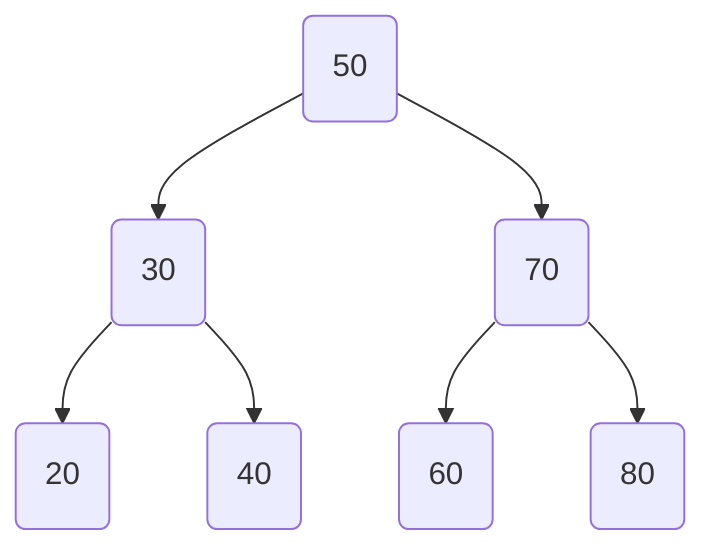

# Introduction

A **Binary Search Tree (BST)** is a type of binary tree where each node satisfies the **BST property**:

- **Left Subtree**: All values in the left subtree are **less than** the node’s value.
- **Right Subtree**: All values in the right subtree are **greater than** the node’s value.
- This rule applies recursively to every node in the tree.

BSTs are particularly useful when we need to store data in a way that supports efficient ordering and retrieval.

## Structure

Example BST:

Here:

- Root: `50`
- Left subtree: `30 → {20, 40}`
- Right subtree: `70 → {60, 80}`

## Number of Nodes

If a BST has **h** height (root at height 0):

- **Minimum number of nodes**: $h + 1$ (completely skewed)
- **Maximum number of nodes**: $2^{h+1} - 1$ (perfectly balanced)

For a BST that is **full and balanced** (every level completely filled):

$$
\text{Max Nodes} = 2^{h+1} - 1
$$

For the **number of structurally unique BSTs** that can be formed with `n` distinct keys:

$$
\text{Unique BSTs} = \frac{(2n)!}{(n+1)! \cdot n!}
$$

(This is the **Catalan number** $C_n$.)

## In-order Traversal

In a BST, **in-order traversal** (Left → Node → Right) always produces data in **sorted order**. This property is one of the main reasons BSTs are used for ordered data storage.

## Pros and Cons

**Pros**:

- Maintains **sorted order**
- Efficient for **ordered data retrieval**
- Can handle dynamic datasets (insertion and deletion without complete reordering)

**Cons**:

- Can become **unbalanced**, leading to degraded performance
- Requires balancing mechanisms (e.g., AVL, Red-Black Trees) for optimal efficiency
- Overhead of pointer storage compared to arrays

## Use Cases

- **Database indexing** (basis for B-Trees)
- **Symbol tables** in compilers
- **Autocomplete systems** (finding ordered matches)
- **Range queries** (finding values within a range quickly)
