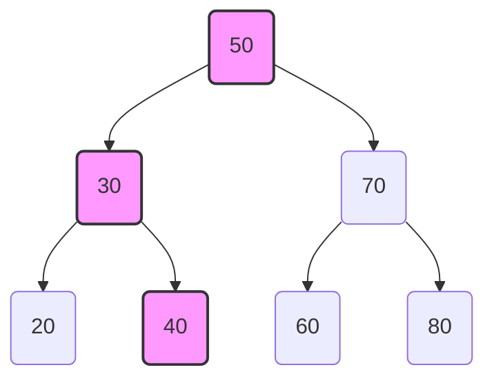
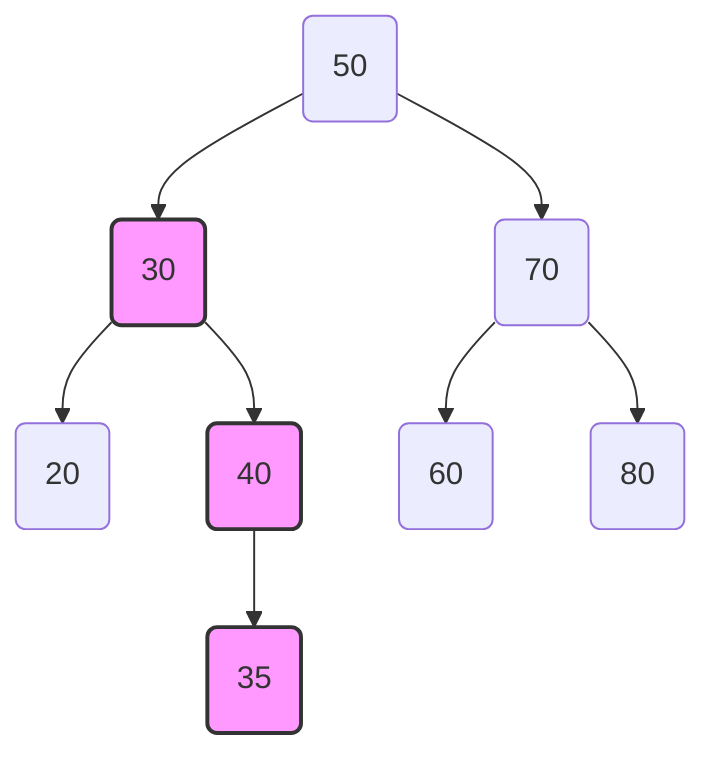
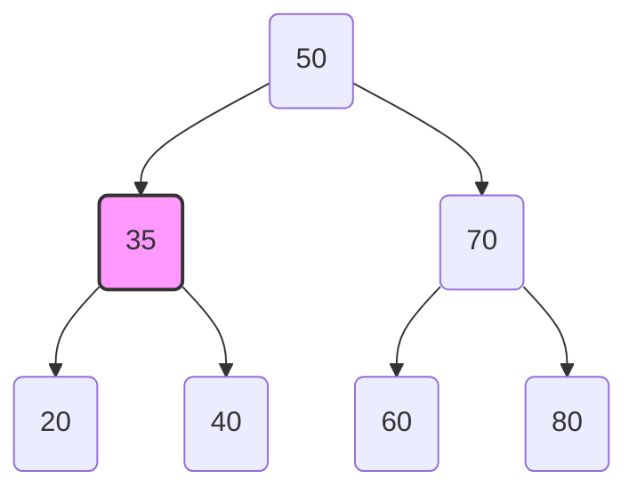
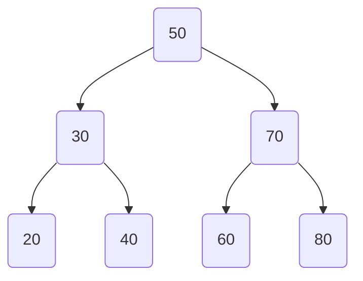
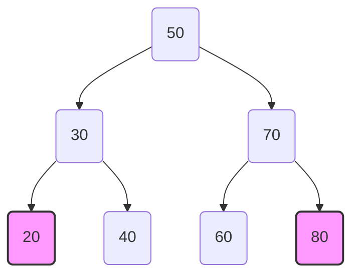
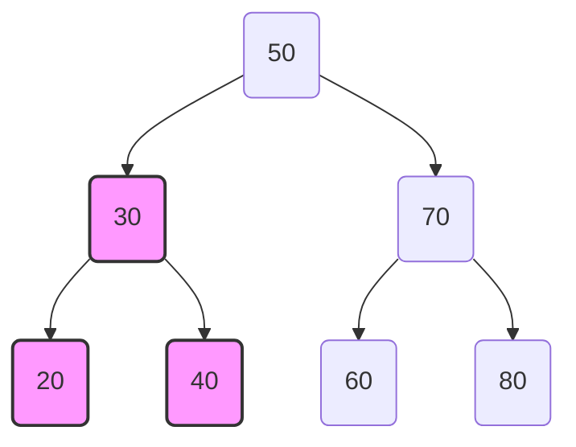

# Common BST Algorithms

A **Binary Search Tree** supports a variety of operations to insert, find, delete, construct the tree from traversal data, validate properties, and perform traversals while maintaining the BST property.

## Search in BST

**Concept**:

- Start from the root.
- If the target value is **equal** to the root, return the node.
- If the target value is **less**, search in the left subtree.
- If the target value is **greater**, search in the right subtree.

**Diagram example** (searching for 40 in the given tree):

<div style={{textAlign: 'center'}}>

</div>

**Python code**:

```python
class Node:
    def __init__(self, key):
        self.key = key
        self.left = None
        self.right = None

def search(root, key):
    if root is None or root.key == key:
        return root
    if key < root.key:
        return search(root.left, key)
    return search(root.right, key)

# Example usage
root = Node(50)
root.left = Node(30)
root.right = Node(70)
root.left.left = Node(20)
root.left.right = Node(40)
root.right.left = Node(60)
root.right.right = Node(80)

result = search(root, 40)
print("Found" if result else "Not found")
```

## Insert in BST

**Concept**:

- Start from the root and compare the new value.
- If smaller → go left.
- If larger → go right.
- Insert when a `None` spot is found.

**Diagram example** (inserting 35):

<div style={{textAlign: 'center'}}>

</div>

**Python code**:

```python
def insert(root, key):
    if root is None:
        return Node(key)
    if key < root.key:
        root.left = insert(root.left, key)
    elif key > root.key:
        root.right = insert(root.right, key)
    return root

root = insert(root, 35)
```

## Delete in BST

**Concept**:

- **Case 1**: Node has no children → delete it.
- **Case 2**: Node has one child → replace with the child.
- **Case 3**: Node has two children → replace with **inorder successor** (minimum in right subtree) and delete the successor.

**Diagram example** (deleting 30):

<div style={{textAlign: 'center'}}>

</div>

(Here 30 is replaced by its inorder successor 35.)

**Python code**:

```python
def min_value_node(node):
    current = node
    while current.left:
        current = current.left
    return current

def delete_node(root, key):
    if root is None:
        return root
    if key < root.key:
        root.left = delete_node(root.left, key)
    elif key > root.key:
        root.right = delete_node(root.right, key)
    else:
        # Node with only one child or no child
        if root.left is None:
            return root.right
        elif root.right is None:
            return root.left
        # Node with two children
        temp = min_value_node(root.right)
        root.key = temp.key
        root.right = delete_node(root.right, temp.key)
    return root

root = delete_node(root, 30)
```

## Validate BST

**Concept**:

- A tree is a valid BST if for every node, all nodes in its left subtree are less than the node, and all nodes in its right subtree are greater than the node.
- Use inorder traversal to check if the sequence is sorted.

**Diagram example** (valid BST):

<div style={{textAlign: 'center'}}>

</div>

**Python code**:

```python
def is_valid_bst(root):
    def inorder(node, prev):
        if not node:
            return True
        if not inorder(node.left, prev):
            return False
        if prev[0] is not None and node.key <= prev[0]:
            return False
        prev[0] = node.key
        return inorder(node.right, prev)

    return inorder(root, [None])

print(is_valid_bst(root))  # True
```

## Find Minimum and Maximum

**Concept**:

- **Minimum**: Leftmost node in the tree.
- **Maximum**: Rightmost node in the tree.

**Diagram example** (minimum is 20, maximum is 80):

<div style={{textAlign: 'center'}}>

</div>

**Python code**:

```python
def find_min(root):
    if root is None:
        return None
    while root.left:
        root = root.left
    return root.key

def find_max(root):
    if root is None:
        return None
    while root.right:
        root = root.right
    return root.key

print("Min:", find_min(root))  # 20
print("Max:", find_max(root))  # 80
```

## Inorder Traversal

**Concept**:

- Visit left subtree, root, right subtree.
- Produces sorted order in BST.

**Diagram example** (inorder: 20, 30, 40, 50, 60, 70, 80):

<div style={{textAlign: 'center'}}>

</div>

**Python code**:

```python
def inorder_traversal(root):
    result = []
    def inorder(node):
        if node:
            inorder(node.left)
            result.append(node.key)
            inorder(node.right)
    inorder(root)
    return result

print(inorder_traversal(root))  # [20, 30, 40, 50, 60, 70, 80]
```

## Height of BST

**Concept**:

- Height is the number of edges on the longest path from root to leaf.
- Recursive: 1 + max(height of left, height of right).

**Diagram example** (height = 3):

<div style={{textAlign: 'center'}}>

</div>

**Python code**:

```python
def height(root):
    if root is None:
        return -1  # or 0 depending on convention
    return 1 + max(height(root.left), height(root.right))

print("Height:", height(root))  # 2 (if root height 0)
```

## Check if Balanced BST

**Concept**:

- A BST is balanced if the height difference between left and right subtrees is at most 1 for every node.

**Python code**:

```python
def is_balanced(root):
    def check(node):
        if not node:
            return 0, True
        left_h, left_b = check(node.left)
        right_h, right_b = check(node.right)
        balanced = left_b and right_b and abs(left_h - right_h) <= 1
        return 1 + max(left_h, right_h), balanced
    _, balanced = check(root)
    return balanced

print(is_balanced(root))  # True
```

## Lowest Common Ancestor (LCA)

**Concept**:

- LCA of two nodes is the deepest node that is ancestor of both.
- In BST, find split point where one key < node < other key.

**Diagram example** (LCA of 20 and 40 is 30):

<div style={{textAlign: 'center'}}>

</div>

**Python code**:

```python
def lca(root, n1, n2):
    if root is None:
        return None
    if root.key > n1 and root.key > n2:
        return lca(root.left, n1, n2)
    if root.key < n1 and root.key < n2:
        return lca(root.right, n1, n2)
    return root

lca_node = lca(root, 20, 40)
print("LCA:", lca_node.key if lca_node else None)  # 30
```

## BST Construction from Preorder Traversal

**Concept**:

- First element in preorder is root.
- All values smaller than root form the left subtree, rest form the right subtree.
- Recursively build left and right subtrees.

**Diagram example** (Preorder: \[50, 30, 20, 40, 70, 60, 80]):

<div style={{textAlign: 'center'}}>

</div>

**Python code**:

```python
import sys
sys.setrecursionlimit(10**6)

def construct_bst_preorder(preorder):
    index = [0]
    def build(bound):
        if index[0] == len(preorder) or preorder[index[0]] > bound:
            return None
        root_val = preorder[index[0]]
        index[0] += 1
        root = Node(root_val)
        root.left = build(root_val)
        root.right = build(bound)
        return root
    return build(float('inf'))

preorder = [50, 30, 20, 40, 70, 60, 80]
root = construct_bst_preorder(preorder)
```

## BST Construction from Inorder Traversal

**Important Note**:

- **A BST cannot be uniquely constructed from inorder traversal alone** because many BSTs can have the same inorder sequence.
- If the inorder is **sorted array**, and we want a **balanced BST**, we pick the middle element as root, recursively build left and right.

**Diagram example** (Inorder: \[20, 30, 40, 50, 60, 70, 80]):

<div style={{textAlign: 'center'}}>

</div>

**Python code** (balanced BST from sorted inorder list):

```python
def sorted_array_to_bst(arr):
    if not arr:
        return None
    mid = len(arr) // 2
    root = Node(arr[mid])
    root.left = sorted_array_to_bst(arr[:mid])
    root.right = sorted_array_to_bst(arr[mid+1:])
    return root

inorder = [20, 30, 40, 50, 60, 70, 80]
root = sorted_array_to_bst(inorder)
```

## Summary

Here’s the **time and space complexity table** for the BST operations we discussed.
Assuming **n** nodes in the BST:

| Operation                      | Average Time Complexity | Worst-Case Time Complexity | Space Complexity                |
| ------------------------------ | ----------------------- | -------------------------- | ------------------------------- |
| Search                         | O(log n)                | O(n)                       | O(1) iterative / O(h) recursive |
| Insert                         | O(log n)                | O(n)                       | O(1) iterative / O(h) recursive |
| Delete                         | O(log n)                | O(n)                       | O(1) iterative / O(h) recursive |
| Validate BST                   | O(n)                    | O(n)                       | O(h)                            |
| Find Min/Max                   | O(log n)                | O(n)                       | O(1)                            |
| Inorder Traversal              | O(n)                    | O(n)                       | O(n)                            |
| Height                         | O(n)                    | O(n)                       | O(h)                            |
| Check Balanced                 | O(n)                    | O(n)                       | O(h)                            |
| Lowest Common Ancestor         | O(log n)                | O(n)                       | O(h)                            |
| BST Construction from Preorder | O(n)                    | O(n)                       | O(n)                            |
| BST Construction from Inorder  | O(n)                    | O(n)                       | O(log n) recursive              |
