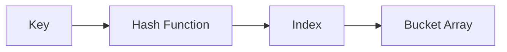
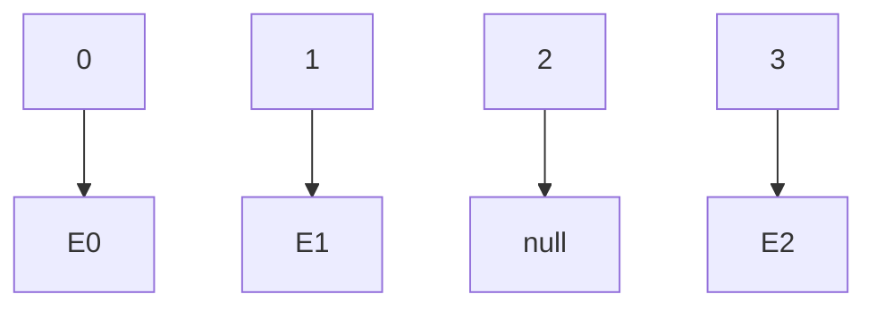
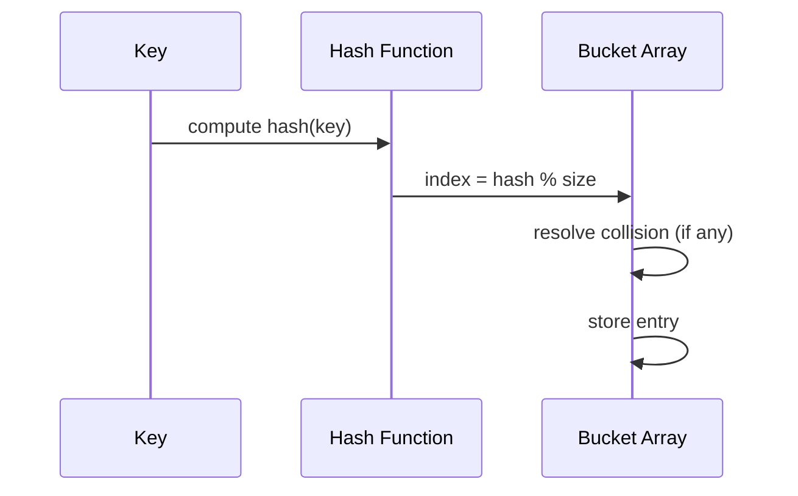
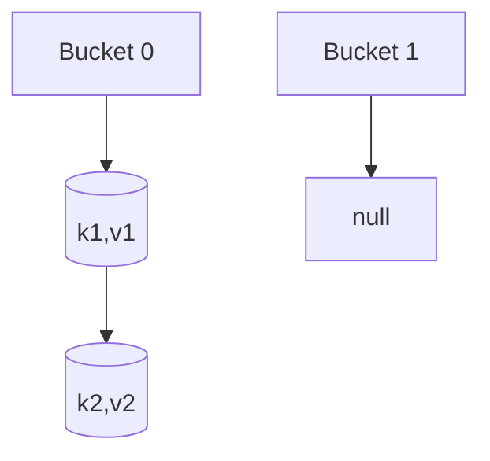
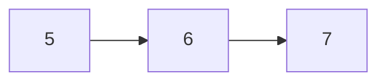
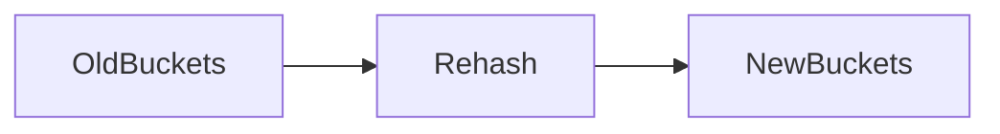

# Hash Tables

:::tip[Status]

This note is complete, reviewed, and considered stable.

:::

A **hash table** is a data structure that implements an **associative array** abstraction:

> Given a key, efficiently store and retrieve a corresponding value.

Formally, it supports:

* `put(key, value)`
* `get(key)`
* `delete(key)`

The defining promise of a hash table is:

> **Constant-time performance on average**, independent of the number of stored elements.

This is achieved by **directly computing where a key should live**, instead of searching for it.

## Why Hash Tables Are Fundamentally Different

Most data structures answer this question:

> “Where should I search for this value?”

Hash tables answer a different question:

> “Where *must* this value be stored?”

That shift is what enables O(1) access.

### Comparison

| Structure   | How lookup works   |
| ----------- | ------------------ |
| Array       | Index-based        |
| Linked List | Sequential scan    |
| Tree        | Guided traversal   |
| Hash Table  | Direct computation |

Hash tables **eliminate traversal**.

## Core Components of a Hash Table

A hash table is composed of four essential parts:

1. **Key**
2. **Hash Function**
3. **Bucket Array**
4. **Collision Resolution Mechanism**

<div style={{textAlign: 'center'}}>



</div>

Without any one of these, the data structure breaks down.

## Hash Function

A hash function maps a key to an integer:

```text
hash(key) → integer
```

That integer is then mapped to a bucket:

```text
index = hash(key) % capacity
```

### What the Hash Function Actually Controls

The hash function determines:

* Distribution of keys
* Collision frequency
* Performance stability
* Resistance to adversarial input

A poor hash function turns a hash table into a linked list.

### Required Properties

A valid hash function **must**:

1. Be deterministic
   Same key → same hash
2. Be consistent across the lifetime of the key
   Hashing must not depend on mutable data
3. Be fast
   Hashing must be cheaper than searching

### Desired Properties (Performance-Critical)

A good hash function should:

* Spread keys uniformly
* Minimize clustering
* Avoid predictable patterns

Uniform distribution is the **entire reason hash tables work**.

## Bucket Array

At its core, a hash table uses a **contiguous array**.

Each index is called a **bucket**.

<div style={{textAlign: 'center'}}>



</div>

What a bucket stores depends on the collision strategy:

* Linked list
* Dynamic array
* Single entry with probing

## Insertion

Let’s insert `(key, value)`.

<div style={{textAlign: 'center'}}>



</div>

Key observation:

> **Insertion never scans unrelated elements.**

## Lookup

Lookup is insertion without mutation.

1. Hash the key
2. Compute index
3. Search only inside that bucket

This is why lookup is fast.

## Collisions

A **collision** occurs when:

```text
hash(k1) % size == hash(k2) % size
```

Collisions are mathematically unavoidable:

* Infinite key space
* Finite bucket space

The goal is not to eliminate collisions, but to **handle them efficiently**.

## Collision Resolution Strategies

### Separate Chaining

Each bucket stores a collection of entries.

<div style={{textAlign: 'center'}}>



</div>

#### Characteristics

* Simple to implement
* Performance degrades linearly with bucket size
* Memory overhead from pointers

#### Time Complexity

| Case    | Time |
| ------- | ---- |
| Average | O(1) |
| Worst   | O(n) |

Worst case happens when all keys hash to one bucket.

### Open Addressing

All entries live directly inside the array.

If a collision occurs, search for another slot.

#### Linear Probing

```text
index, index+1, index+2, ...
```

<div style={{textAlign: 'center'}}>



</div>

#### Problems

* Primary clustering
* Cache-friendly but fragile
* Deletions are complex

### Quadratic Probing

```text
index + 1², index + 2², index + 3²
```

Reduces clustering, but still sensitive to load factor.

## Load Factor

```text
load_factor = entries / buckets
```

As load factor increases:

* Collision probability increases
* Performance degrades

Typical thresholds:

* 0.7
* 0.75

## Resizing and Rehashing

### Why Resizing Is Mandatory

Without resizing:

* Buckets grow unbounded
* Hash table degenerates

### What Rehashing Actually Means

Rehashing is **not copying memory**.

Steps:

1. Allocate new bucket array
2. Recompute index for every key
3. Insert again

<div style={{textAlign: 'center'}}>



</div>

### Complexity

* Single resize: O(n)
* Amortized per operation: O(1)

This is identical to dynamic array growth behavior.

## Python `dict`

Python dictionaries are **highly optimized hash tables**.

### Properties

* Open addressing
* Perturbation-based probing
* Insertion-ordered (since 3.7)
* Randomized hash seed

### Example

```python
d = {}
d["x"] = 10
d["y"] = 20

print(d["x"])
```

Internally, Python stores:

* Hash
* Key
* Value

This avoids recomputing hashes during probing.

## Time & Space Complexity

| Operation | Average | Worst |
| --------- | ------- | ----- |
| Insert    | O(1)    | O(n)  |
| Lookup    | O(1)    | O(n)  |
| Delete    | O(1)    | O(n)  |

Worst case is rare but theoretically possible.

## Algorithms Using Hash Tables

### Frequency Counting

```python
freq = {}
for x in nums:
    freq[x] = freq.get(x, 0) + 1
```

Used in:

* Histograms
* Voting algorithms
* Anagrams

### Two Sum

```python
seen = {}

for i, num in enumerate(nums):
    need = target - num
    if need in seen:
        return [seen[need], i]
    seen[num] = i
```

Transforms O(n²) → O(n).

### Deduplication

```python
unique = set(nums)
```

### Grouping by Key

```python
groups = {}

for item in items:
    key = compute_key(item)
    groups.setdefault(key, []).append(item)
```

## Hash Set vs Hash Map

| Hash Set        | Hash Map         |
| --------------- | ---------------- |
| Stores keys     | Stores key-value |
| Membership test | Value retrieval  |
| No duplicates   | Unique keys      |

Both are hash tables.

## Hash Tables vs Balanced Trees

| Hash Table | Tree        |
| ---------- | ----------- |
| O(1) avg   | O(log n)    |
| Unordered  | Ordered     |
| Faster     | Predictable |

Trees are chosen when **order or range queries matter**.

## Security: Hash Flooding Attacks

Attackers can exploit predictable hashes.

Defenses:

* Randomized hashing
* Dynamic resizing
* Strong hash functions

Python includes built-in protections.

## When Hash Tables Are a Bad Choice

* When ordering matters
* When memory is constrained
* When worst-case guarantees are required
* When keys are mutable
