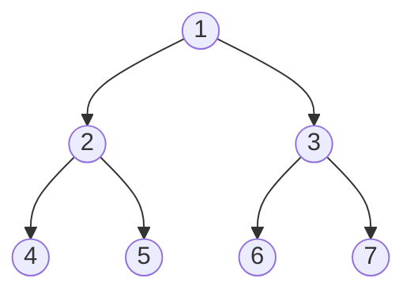
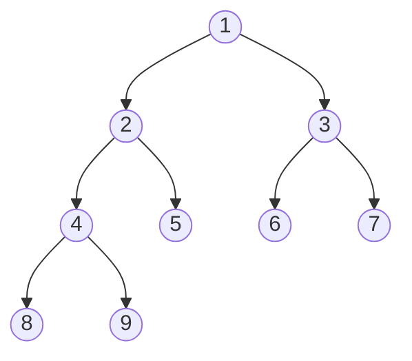

# Full vs Complete Binary Tree

<!-- markdownlint-disable MD024 -->

## Full Binary Tree

A **Full Binary Tree** is a binary tree in which every node has either 0 or 2 children. No node can have only one child.

### Properties

1. If a full binary tree has $i$ internal nodes:
   $$
   \text{Leaves} = i + 1
   $$
   $$
   \text{Total Nodes} = 2i + 1
   $$
2. Minimum height for $n$ nodes:
   $$
   h_{\text{min}} = \lfloor \log_2(n) \rfloor
   $$
3. Maximum height for $n$ nodes:
   $$
   h_{\text{max}} = \frac{n - 1}{2}
   $$

### Diagram

<div style={{textAlign: 'center'}}>



</div>

- Full because every node has 0 or 2 children.

### Python Example

```python
class Node:
    def __init__(self, data):
        self.data = data
        self.left = None
        self.right = None

def is_full_binary_tree(node):
    if node is None:
        return True
    if (node.left is None) and (node.right is None):
        return True
    if (node.left is not None) and (node.right is not None):
        return is_full_binary_tree(node.left) and is_full_binary_tree(node.right)
    return False

# Example full binary tree
root = Node(1)
root.left = Node(2)
root.right = Node(3)
root.left.left = Node(4)
root.left.right = Node(5)

print(is_full_binary_tree(root))  # True
```

## Complete Binary Tree

A **Complete Binary Tree** is a binary tree in which:

- All levels are completely filled except possibly the last.
- In the last level, all nodes are as far left as possible.

### Properties

1. Max nodes in height $h$:
   $$
   N_{\text{max}} = 2^{h+1} - 1
   $$
2. Min nodes in height $h$:
   $$
   N_{\text{min}} = 2^h
   $$
3. Height for $n$ nodes:
   $$
   h = \lfloor \log_2(n) \rfloor
   $$
4. Ideal for array representation (used in Heaps).

### Diagram

<div style={{textAlign: 'center'}}>



</div>

- Complete because all levels except the last are full, and last level nodes are left-aligned.

### Python Example

```python
from collections import deque

def is_complete_binary_tree(root):
    if not root:
        return True
    queue = deque([root])
    end = False
    while queue:
        node = queue.popleft()
        if node:
            if end:
                return False
            queue.append(node.left)
            queue.append(node.right)
        else:
            end = True
    return True

# Example complete binary tree
root = Node(1)
root.left = Node(2)
root.right = Node(3)
root.left.left = Node(4)
root.left.right = Node(5)
root.right.left = Node(6)

print(is_complete_binary_tree(root))  # True
```

## Key Differences Between Full and Complete Binary Tree

| Feature              | Full Binary Tree                          | Complete Binary Tree                                        |
| -------------------- | ----------------------------------------- | ----------------------------------------------------------- |
| Children Rule        | Each node has 0 or 2 children             | All levels are full except last, nodes filled left to right |
| Shape                | No restriction on shape beyond child rule | Shape is left-packed                                        |
| Last Level           | Can have gaps if child rule followed      | No gaps allowed before last node                            |
| Usage                | Expression trees, decision trees          | Heaps, priority queues                                      |
| Array Representation | Inefficient for sparse full trees         | Efficient (ideal for heaps)                                 |

## Relation Between Them

- A **Perfect Binary Tree** is both full and complete.
- A **Full Binary Tree** is not always complete (can be unevenly shaped).
- A **Complete Binary Tree** is not always full (some nodes may have only one child in the last level).
