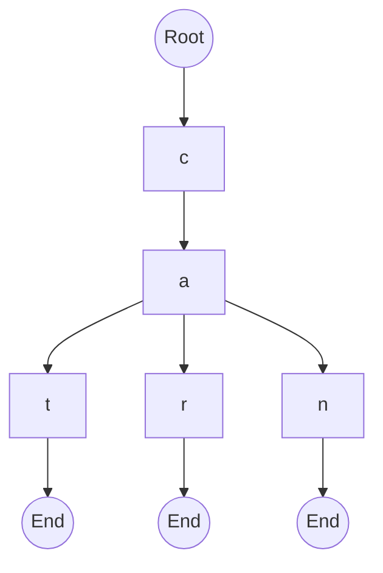
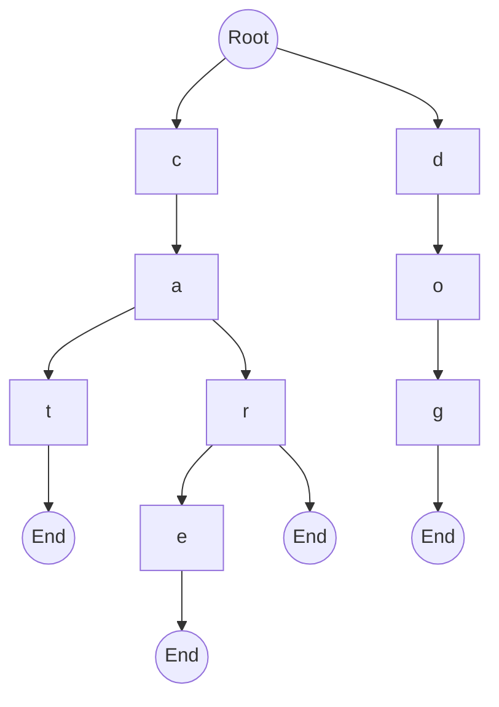
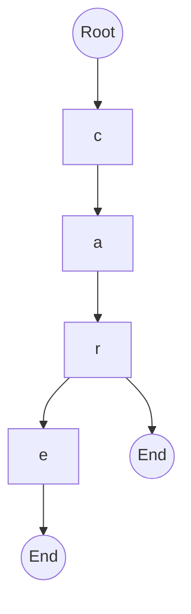
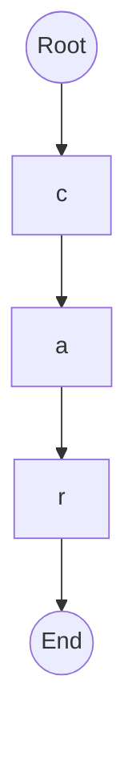
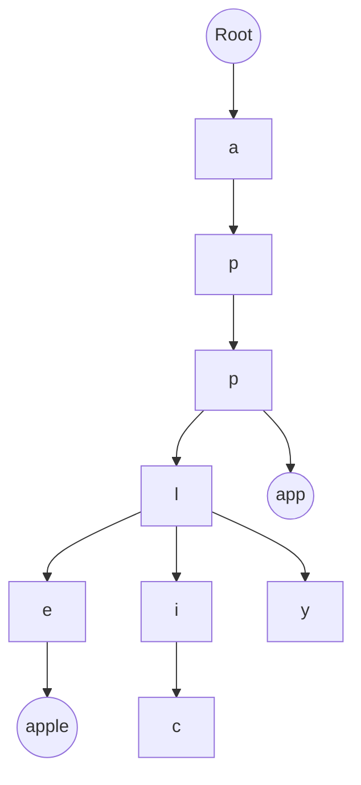

# Trie

:::tip[Status]

This note is complete, reviewed, and considered stable.

:::

A Trie (pronounced "try"), also known as a **Prefix Tree**, is a tree-based data structure used to efficiently store and search strings.

Unlike Binary Search Trees, which organize data using value comparisons, a Trie organizes data character by character. Strings that share a common prefix share the same path in the tree.

Tries are commonly used for:

* Autocomplete systems
* Spell checkers
* Dictionaries
* Search suggestions
* IP routing
* Word games

## Why Do We Need a Trie?

Consider storing the following words:

```text
cat
car
can
```

A hash table can tell us whether a word exists, but it cannot efficiently answer questions like:

```text
Words starting with "ca" ?
```

A Trie is specifically designed for prefix-based operations.

## Trie Structure

Each node represents a character.

The path from the root to a node forms a prefix.

A special marker is used to indicate the end of a complete word.

### Example

Words:

```text
cat
car
can
```

<div style={{textAlign: 'center'}}>



</div>

Notice how all three words share the prefix:

```text
ca
```

## Trie Node Structure

A typical Trie node contains:

```text
children
isEndOfWord
```

### Conceptual Representation

```text
TrieNode
├── children
└── isEndOfWord
```

## Example Trie

Words:

```text
cat
car
care
dog
```

<div style={{textAlign: 'center'}}>



</div>

## Common Trie Operations

### Insert

To insert a word:

1. Start at the root.
2. Process each character.
3. Create nodes if they do not exist.
4. Mark the last character as a complete word.

#### Insert "cat"

<div style={{textAlign: 'center'}}>


</div>

#### Time Complexity

```text
O(m)
```

where:

```text
m = length of word
```

### Search

To search for a word:

1. Start from the root.
2. Follow the path for each character.
3. If any character is missing, the word does not exist.
4. Verify that the final node is marked as a complete word.

#### Example

Searching:

```text
cat
```

Path:

```text
Root → c → a → t
```

Result:

```text
Found
```

#### Time Complexity

```text
O(m)
```

### Prefix Search

One of the biggest advantages of a Trie.

Question:

```text
Does any word start with "ca"?
```

Traversal:

```text
Root → c → a
```

If the path exists:

```text
Prefix Exists
```

No need to traverse the entire tree.

#### Time Complexity

```text
O(m)
```

### Deletion

Deletion is more complicated than insertion and search.

Consider:

```text
car
care
```

Deleting:

```text
care
```

should not remove:

```text
car
```

#### Before Deletion

<div style={{textAlign: 'center'}}>



</div>

#### After Deletion

<div style={{textAlign: 'center'}}>



</div>

The node `e` can be removed because no other word uses it.

#### Time Complexity

```text
O(m)
```

## Prefix Sharing

The major strength of a Trie is prefix sharing.

Words:

```text
apple
app
application
apply
```

<div style={{textAlign: 'center'}}>



</div>

All words reuse the same prefix:

```text
app
```

## Complexity Analysis

Let:

```text
m = length of key
```

| Operation     | Complexity |
| ------------- | ---------- |
| Insert        | O(m)       |
| Search        | O(m)       |
| Prefix Search | O(m)       |
| Delete        | O(m)       |

## Trie vs Hash Table

| Feature           | Trie      | Hash Table  |
| ----------------- | --------- | ----------- |
| Search Word       | O(m)      | O(m)        |
| Prefix Search     | Efficient | Inefficient |
| Autocomplete      | Excellent | Poor        |
| Ordered Traversal | Yes       | No          |
| Memory Usage      | Higher    | Lower       |

## Advantages

* Fast prefix search
* Efficient autocomplete
* Shared prefixes reduce duplication
* Predictable performance
* Naturally supports lexicographical traversal

## Disadvantages

* High memory usage
* Large alphabet increases storage requirements
* More complex than hash tables

## Variants of Trie

### Compressed Trie (Radix Tree)

Chains of single-child nodes are compressed.

```text
c → a → t
```

becomes:

```text
cat
```

Reducing memory usage.

### Ternary Search Trie

Combines ideas from:

* Trie
* Binary Search Tree

### Suffix Trie

Stores all suffixes of a string.

Used in advanced string matching algorithms.
