# AVL Tree

:::tip[Status]

This note is complete, reviewed, and considered stable.

:::

An **AVL Tree** (Adelson-Velsky and Landis Tree) is a **self-balancing Binary Search Tree (BST)** in which the height difference between the left and right subtrees of every node is at most **1**.

AVL Trees automatically perform **rotations** after insertions and deletions to maintain balance, ensuring that search, insertion, and deletion operations remain efficient.

## Why Do We Need AVL Trees?

A regular BST can become skewed depending on the insertion order.

### Example

Insert:

```text
10, 20, 30, 40, 50
```

Resulting BST:

<div style={{textAlign: 'center'}}>

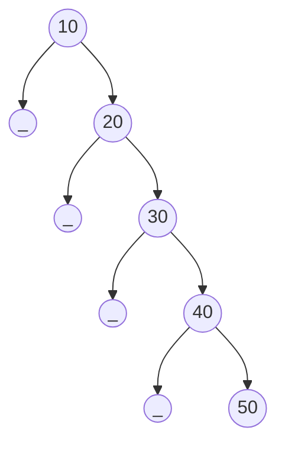

</div>

The tree behaves like a linked list.

```text
Height = O(n)
Search = O(n)
Insert = O(n)
Delete = O(n)
```

AVL Trees prevent this degeneration by maintaining balance.

Balanced AVL Tree:

<div style={{textAlign: 'center'}}>

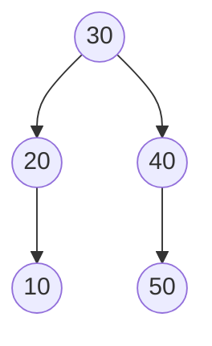

</div>

```text
Height ≈ O(log n)
```

## AVL Tree Properties

Every AVL Tree must satisfy:

### Binary Search Tree Property

For every node:

```text
Left Subtree < Node < Right Subtree
```

Example:

<div style={{textAlign: 'center'}}>

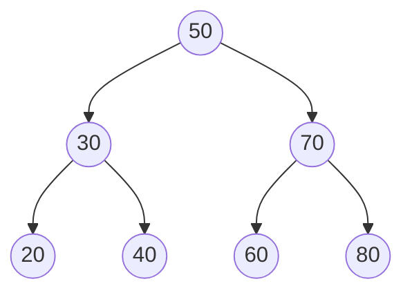

</div>

### Balance Property

For every node:

```text
|Height(Left Subtree) - Height(Right Subtree)| ≤ 1
```

## Height of a Node

The height of a node is the number of edges in the longest path from that node to a leaf.

Example:

<div style={{textAlign: 'center'}}>

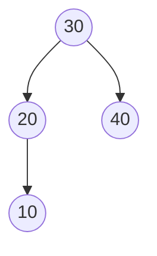

</div>

Heights:

```text
10 → 0
20 → 1
40 → 0
30 → 2
```

## Balance Factor

The balance factor determines whether a node is balanced.

### Formula

```text
Balance Factor = Height(Left Subtree) - Height(Right Subtree)
```

Possible balanced values:

```text
-1, 0, +1
```

Unbalanced:

```text
<-1 or >+1
```

### Example

<div style={{textAlign: 'center'}}>

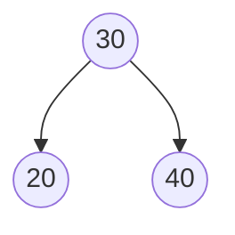

</div>

```text
BF(30) = 0
```

<div style={{textAlign: 'center'}}>

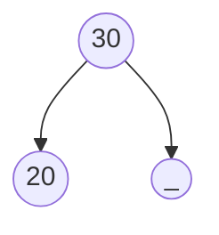

</div>

```text
BF(30) = +1
```

<div style={{textAlign: 'center'}}>

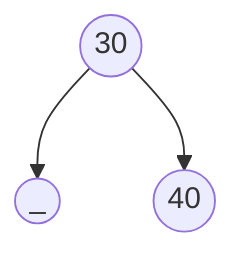

</div>

```text
BF(30) = -1
```

<div style={{textAlign: 'center'}}>

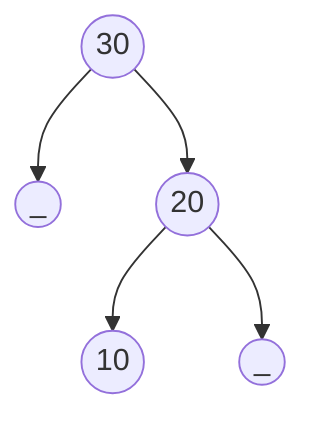

</div>

```text
BF(30) = +2
```

Node 30 is unbalanced.

## Rotations

AVL Trees use rotations to restore balance.

There are four possible imbalance cases:

1. Left-Left (LL)
2. Right-Right (RR)
3. Left-Right (LR)
4. Right-Left (RL)

### Left-Left (LL) Case

Occurs when:

```text
Node becomes left-heavy
Insertion occurs in left subtree of left child
```

Example:

Insert:

```text
30, 20, 10
```

Before balancing:

<div style={{textAlign: 'center'}}>

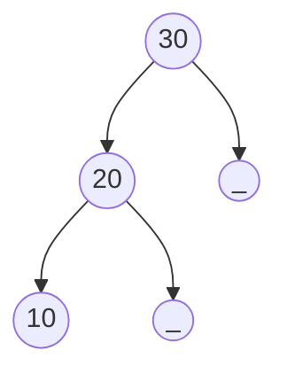

</div>

Balance Factor:

```text
BF(30) = +2
```

Perform a **Right Rotation**.

After balancing:

<div style={{textAlign: 'center'}}>

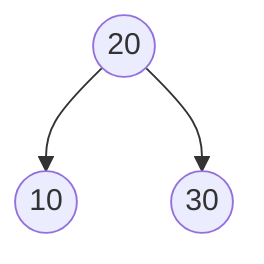

</div>

#### Right Rotation

Before:

<div style={{textAlign: 'center'}}>

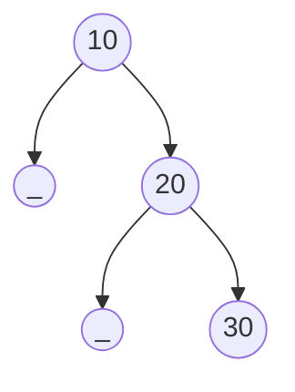

</div>

After:

<div style={{textAlign: 'center'}}>


</div>

### Right-Right (RR) Case

Occurs when:

```text
Node becomes right-heavy
Insertion occurs in right subtree of right child
```

Example:

Insert:

```text
10, 20, 30
```

Before balancing:

<div style={{textAlign: 'center'}}>


</div>

Balance Factor:

```text
BF(10) = -2
```

Perform a **Left Rotation**.

After balancing:

<div style={{textAlign: 'center'}}>


</div>

#### Left Rotation

Before:

<div style={{textAlign: 'center'}}>

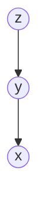

</div>

After:

<div style={{textAlign: 'center'}}>

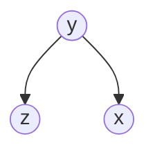

</div>

### Left-Right (LR) Case

Occurs when:

```text
Node becomes left-heavy
Insertion occurs in right subtree of left child
```

Insert:

```text
30, 10, 20
```

Before balancing:

<div style={{textAlign: 'center'}}>

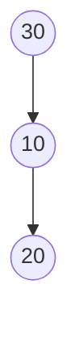

</div>

#### Step 1: Left Rotation on 10

<div style={{textAlign: 'center'}}>


</div>

#### Step 2: Right Rotation on 30

<div style={{textAlign: 'center'}}>


</div>

### Right-Left (RL) Case

Occurs when:

```text
Node becomes right-heavy
Insertion occurs in left subtree of right child
```

Insert:

```text
10, 30, 20
```

Before balancing:

<div style={{textAlign: 'center'}}>

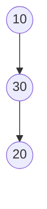

</div>

#### Step 1: Right Rotation on 30

<div style={{textAlign: 'center'}}>

```mermaid
graph TD
    A((10)) --> B((20))
    B --> C((30))
```

</div>

#### Step 2: Left Rotation on 10

<div style={{textAlign: 'center'}}>

```mermaid
graph TD
    A((20)) --> B((10))
    A --> C((30))
```

</div>

### Summary of Rotations

| Case | Condition      | Fix                            |
| ---- | -------------- | ------------------------------ |
| LL   | Left of Left   | Right Rotation                 |
| RR   | Right of Right | Left Rotation                  |
| LR   | Right of Left  | Left Rotation + Right Rotation |
| RL   | Left of Right  | Right Rotation + Left Rotation |

## AVL Tree Insertion

### Step 1

Insert the node exactly as in a BST.

Example:

<div style={{textAlign: 'center'}}>

```mermaid
graph TD
    A((50)) --> B((30))
    A --> C((70))
    B --> D((20))
```

</div>

### Step 2

Move upward from the inserted node toward the root.

Update:

```text
Height
Balance Factor
```

### Step 3

Check for imbalance.

```text
Balance Factor > 1
Balance Factor < -1
```

### Step 4

Apply the appropriate rotation.

```text
LL → Right Rotation
RR → Left Rotation
LR → Left Rotation + Right Rotation
RL → Right Rotation + Left Rotation
```

## AVL Tree Deletion

Deletion follows normal BST deletion first.

### BST Deletion Cases

#### Leaf Node

<div style={{textAlign: 'center'}}>

```mermaid
graph TD
    A((30)) --> B((20))
    A --> C((40))
```

</div>

Delete:

```text
20
```

#### One Child

<div style={{textAlign: 'center'}}>

```mermaid
graph TD
    A((30)) --> B((20))
    B --> C((10))
```

</div>

Delete:

```text
20
```

Promote 10.

#### Two Children

Replace the node with:

```text
Inorder Successor
or
Inorder Predecessor
```

Then delete the replacement node.

### Rebalancing After Deletion

Unlike insertion, deletion may cause multiple ancestors to become unbalanced.

Therefore:

```text
Delete Node
Update Heights
Update Balance Factors
Rotate If Needed
Continue Toward Root
```

## AVL Height Analysis

AVL Trees guarantee logarithmic height.

Minimum number of nodes required for a given height follows:

```text
N(h) = 1 + N(h-1) + N(h-2)
```

This recurrence is similar to Fibonacci numbers.

Therefore:

```text
Height = O(log n)
```

More precisely:

```text
Height ≤ 1.44 log₂(n + 2)
```

## Time Complexity

| Operation    | Complexity |
| ------------ | ---------- |
| Search       | O(log n)   |
| Insert       | O(log n)   |
| Delete       | O(log n)   |
| Find Minimum | O(log n)   |
| Find Maximum | O(log n)   |

## Space Complexity

Tree Storage:

```text
O(n)
```

Extra per node:

```text
Value
Left Pointer
Right Pointer
Height
```

## AVL Node Structure

```text
Node
├── value
├── left
├── right
└── height
```

Example:

<div style={{textAlign: 'center'}}>

```mermaid
graph TD
    A(("30 (h=2)")) --> B(("20 (h=1)"))
    A --> C(("40 (h=0)"))
    B --> D(("10 (h=0)"))
```

</div>

## AVL Tree vs BST

| Feature        | BST  | AVL          |
| -------------- | ---- | ------------ |
| Self Balancing | No   | Yes          |
| Worst Height   | O(n) | O(log n)     |
| Search         | O(n) | O(log n)     |
| Insert         | O(n) | O(log n)     |
| Delete         | O(n) | O(log n)     |
| Extra Memory   | No   | Height Field |

## AVL Tree vs Red-Black Tree

| Feature       | AVL                | Red-Black               |
| ------------- | ------------------ | ----------------------- |
| Balancing     | Strict             | Relaxed                 |
| Search Speed  | Faster             | Slightly Slower         |
| Rotations     | More               | Fewer                   |
| Insert/Delete | Slower             | Faster                  |
| Use Case      | Read-Heavy Systems | General-Purpose Systems |

## Advantages

- Guaranteed O(log n) search.
- Prevents skewed trees.
- Faster lookups than Red-Black Trees.
- Strict balancing.
- Predictable performance.

## Disadvantages

- More complex implementation.
- Additional memory for height.
- More rotations during updates.
- Insertions and deletions can be slower than Red-Black Trees.

## Key Takeaways

- AVL Tree is a self-balancing Binary Search Tree.
- Every node maintains a balance factor.
- Balance Factor = Height(Left) − Height(Right).
- Allowed balance factors are -1, 0, and +1.
- Rotations restore balance after insertions and deletions.
- Four rotation cases exist: LL, RR, LR, and RL.
- AVL Trees guarantee O(log n) height.
- Search, insertion, and deletion all run in O(log n) time.
