# Red-Black Tree

:::tip[Status]

This note is complete, reviewed, and considered stable.

:::

A Red-Black Tree is a self-balancing Binary Search Tree where every node contains an additional piece of information called a **color**.

Each node is either:

* Red
* Black

The coloring rules ensure that the tree remains approximately balanced.


## Why Do We Need Red-Black Trees?

A normal BST can become skewed.

### Balanced BST

<div style={{textAlign: 'center'}}>

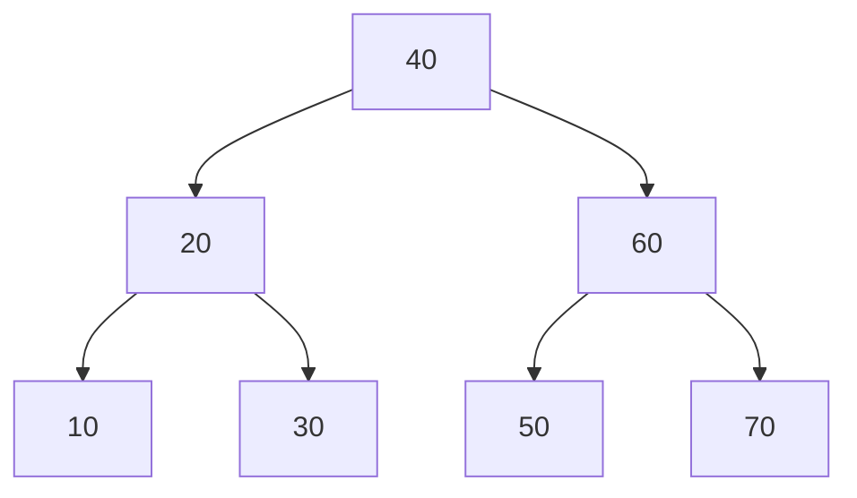

</div>

Height = O(log n)


### Skewed BST

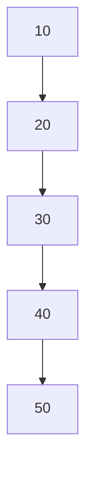

Height = O(n)


Red-Black Trees prevent such degeneration and keep the height bounded.


# Properties of a Red-Black Tree

Every valid Red-Black Tree must satisfy the following five properties.


## Property 1: Every Node is Either Red or Black

Example:

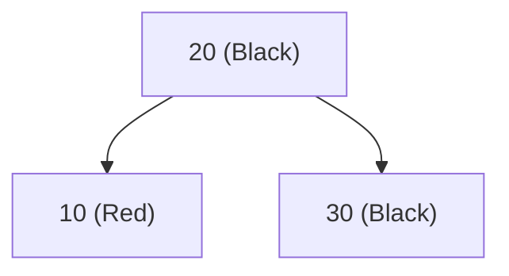


## Property 2: Root Must Be Black

Valid:

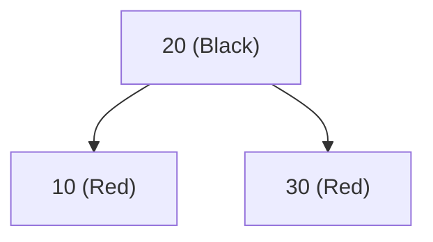

Invalid:

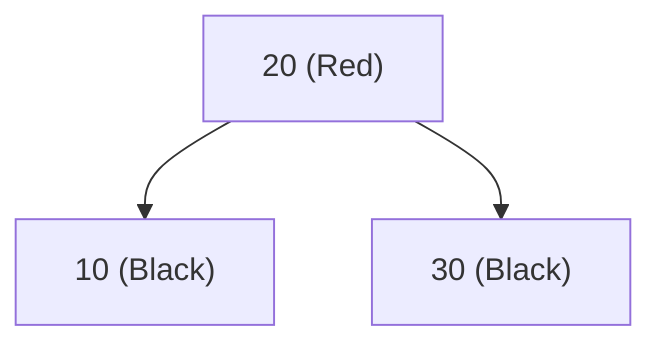

Root cannot be red.


## Property 3: All NIL Leaves Are Black

Instead of using actual null pointers conceptually, Red-Black Trees treat every missing child as a special NIL node.

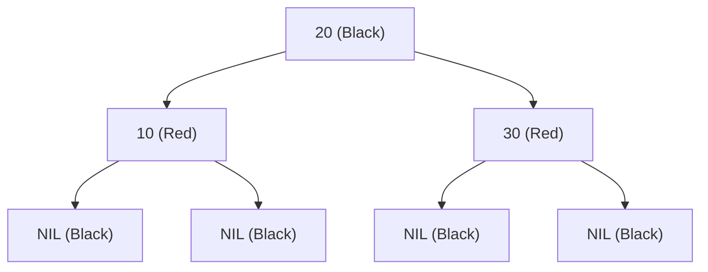


## Property 4: Red Node Cannot Have Red Children

No two consecutive red nodes can appear on a path.

Valid:


Invalid:

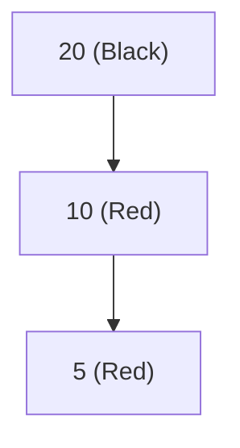

This is called a **Red-Red Violation**.


## Property 5: Every Path Must Have Same Number of Black Nodes

The number of black nodes from any node to its descendant NIL leaves must be identical.

This count is called the **Black Height**.

Valid:

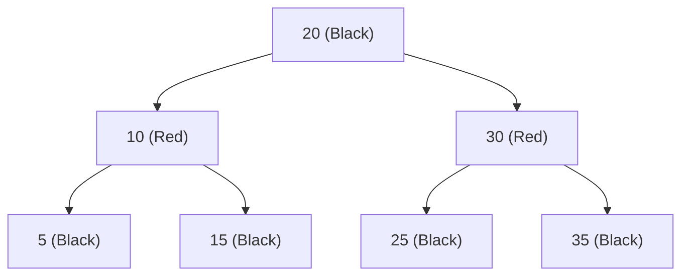

All root-to-NIL paths contain the same number of black nodes.


# Black Height

Black Height (BH) is:

> Number of black nodes from a node to any NIL leaf, excluding the starting node itself.

Example:

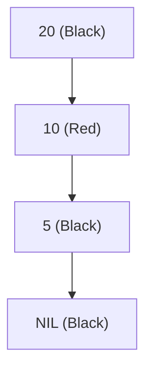

For node 20:

Path:

```
20 → 10 → 5 → NIL
```

Black nodes below 20:

```
5, NIL
```

BH(20) = 2


# Height of Red-Black Tree

A Red-Black Tree is not perfectly balanced.

AVL Trees are stricter.

Red-Black Trees allow some imbalance while guaranteeing:

[
Height \le 2 \log_2(n+1)
]

Therefore:

| Operation | Complexity |
| --------- | ---------- |
| Search    | O(log n)   |
| Insert    | O(log n)   |
| Delete    | O(log n)   |
| Min       | O(log n)   |
| Max       | O(log n)   |


# Insertion in Red-Black Tree

Insertion occurs in two phases.

### Phase 1

Insert the node exactly like a BST.

### Phase 2

Fix Red-Black property violations.


# New Nodes Are Always Inserted Red

Suppose we insert 15.

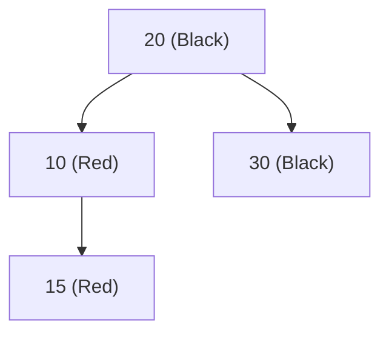

Immediately we have:

```
10 (Red)
|
15 (Red)
```

Red-Red violation.


# Fixing Violations

There are two major tools:

1. Recoloring
2. Rotations


# Case 1: Uncle is Red

Initial tree:

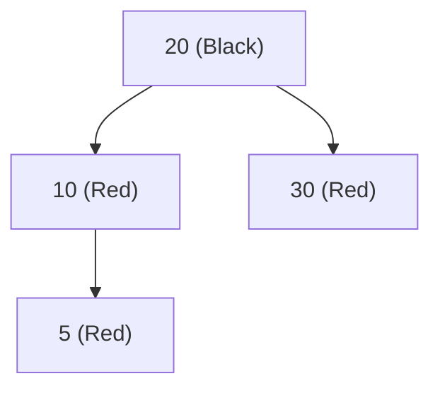

Node = 5

Parent = 10

Uncle = 30

Both Parent and Uncle are Red.

### Solution

Recolor:

```text
Parent  -> Black
Uncle   -> Black
Grandparent -> Red
```

Result:

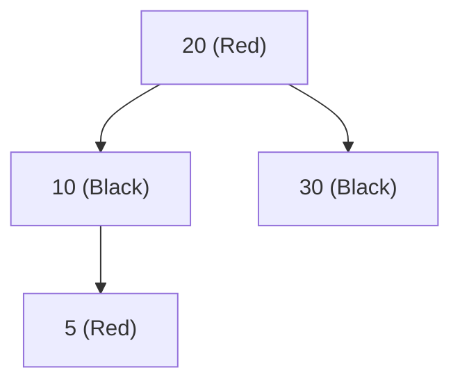

If grandparent becomes root, recolor it back to black.


# Case 2: Uncle is Black

Rotations are required.


## Left-Left (LL) Case

Before insertion:

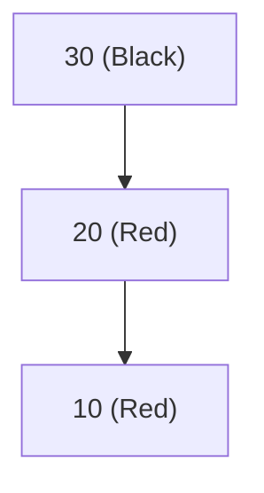

Violation:

```
30
/
20
/
10
```

### Right Rotation

After rotation:


## Right-Right (RR) Case

Before:

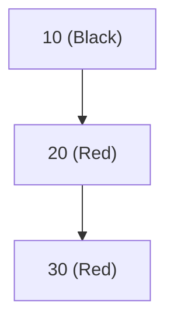

### Left Rotation

After:


## Left-Right (LR) Case

Before:

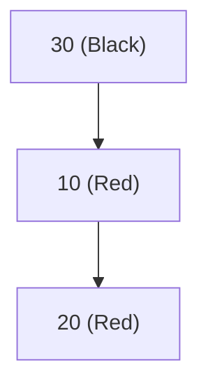

Structure:

```
    30
   /
  10
    \
     20
```

### Step 1: Left Rotation


### Step 2: Right Rotation


## Right-Left (RL) Case

Before:

```mermaid
graph TD
    G["10 (Black)"]

    G --> P["30 (Red)"]

    P --> N["20 (Red)"]
```

Structure:

```
10
  \
   30
   /
  20
```

### Step 1: Right Rotation

```mermaid
graph TD
    G["10 (Black)"]

    G --> N["20 (Red)"]

    N --> P["30 (Red)"]
```

### Step 2: Left Rotation

```mermaid
graph TD
    N["20 (Black)"]

    N --> G["10 (Red)"]
    N --> P["30 (Red)"]
```


# Tree Rotations

Rotations are local restructuring operations that preserve BST ordering.


## Right Rotation

Before:

```mermaid
graph TD
    Y[30]
    Y --> X[20]
    X --> A[10]
```

After:

```mermaid
graph TD
    X[20]
    X --> A[10]
    X --> Y[30]
```


## Left Rotation

Before:

```mermaid
graph TD
    X[20]
    X --> Y[30]
    Y --> B[40]
```

After:

```mermaid
graph TD
    Y[30]
    Y --> X[20]
    Y --> B[40]
```


# Example Insertion Sequence

Insert:

```
10, 20, 30
```


### Insert 10

```mermaid
graph TD
    A["10 (Black)"]
```


### Insert 20

```mermaid
graph TD
    A["10 (Black)"]
    A --> B["20 (Red)"]
```

Valid.


### Insert 30

```mermaid
graph TD
    A["10 (Black)"]
    A --> B["20 (Red)"]
    B --> C["30 (Red)"]
```

RR violation.

Apply left rotation:

```mermaid
graph TD
    B["20 (Black)"]
    B --> A["10 (Red)"]
    B --> C["30 (Red)"]
```

Balanced again.


# Deletion in Red-Black Tree

Deletion is significantly more complicated than insertion.

Process:

1. Delete node as BST.
2. If a red node is removed → usually no problem.
3. If a black node is removed → black-height may decrease.
4. Fix violations using:

   * Recoloring
   * Rotations
   * Double Black resolution

Because deletion involves many cases, most implementations follow the CLRS algorithm or library implementations directly.


# Red-Black Tree vs AVL Tree

| Feature    | Red-Black Tree  | AVL Tree    |
| ---------- | --------------- | ----------- |
| Balance    | Looser          | Stricter    |
| Height     | Slightly Taller | Shorter     |
| Search     | Slightly Slower | Faster      |
| Insertion  | Faster          | Slower      |
| Deletion   | Faster          | Slower      |
| Rotations  | Fewer           | More        |
| Complexity | Easier          | More Strict |


# Real-World Usage

Red-Black Trees are widely used because they provide excellent overall performance.

Examples:

* C++ `std::map`
* C++ `std::set`
* Linux Kernel scheduler structures
* Java `TreeMap`
* Java `TreeSet`
* Database indexing structures (in some systems)
* Memory management systems


# Key Takeaways

1. Red-Black Tree is a self-balancing BST.
2. Every node is either red or black.
3. Root is always black.
4. Red nodes cannot have red children.
5. Every path must have the same black height.
6. Balancing is achieved through:

   * Recoloring
   * Left Rotation
   * Right Rotation
7. Height is always O(log n).
8. Search, Insert, and Delete are O(log n).
9. Red-Black Trees trade perfect balance for fewer rotations, making them popular in production systems.
