# Red-Black Tree

:::tip[Status]

This note is complete, reviewed, and considered stable.

:::

A Red-Black Tree is a self-balancing Binary Search Tree where every node contains an additional piece of information called a **color**.

Each node is either:

- Red
- Black

The coloring rules ensure that the tree remains approximately balanced.

## Why Do We Need Red-Black Trees?

A normal BST can become skewed.

### Balanced BST

<div style={{textAlign: 'center'}}>

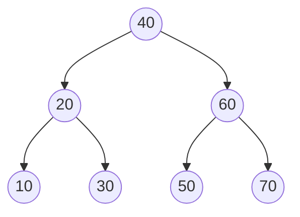

</div>

Height = O(log n)

### Skewed BST

<div style={{textAlign: 'center'}}>

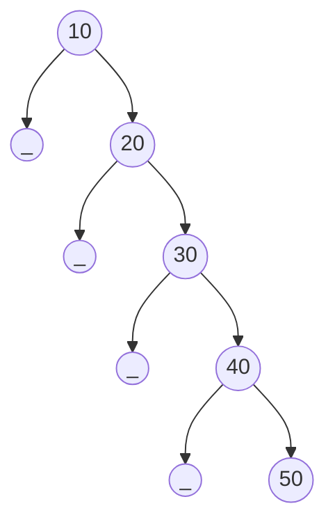

</div>

Height = O(n)

Red-Black Trees prevent such degeneration and keep the height bounded.

## Properties of a Red-Black Tree

Every valid Red-Black Tree must satisfy the following five properties.

### Every Node is Either Red or Black

Example:

<div style={{textAlign: 'center'}}>

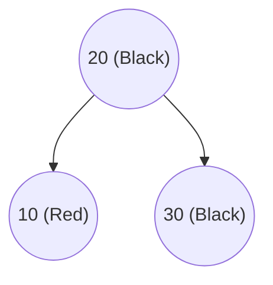

</div>

### Root Must Be Black

Valid:

<div style={{textAlign: 'center'}}>

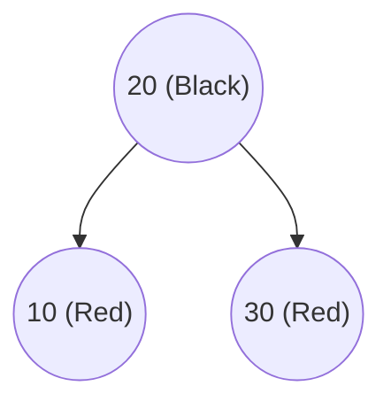

</div>

Invalid:

<div style={{textAlign: 'center'}}>

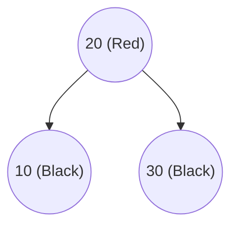

</div>

Root cannot be red.

### All NIL Leaves Are Black

Instead of using actual null pointers conceptually, Red-Black Trees treat every missing child as a special NIL node.

<div style={{textAlign: 'center'}}>

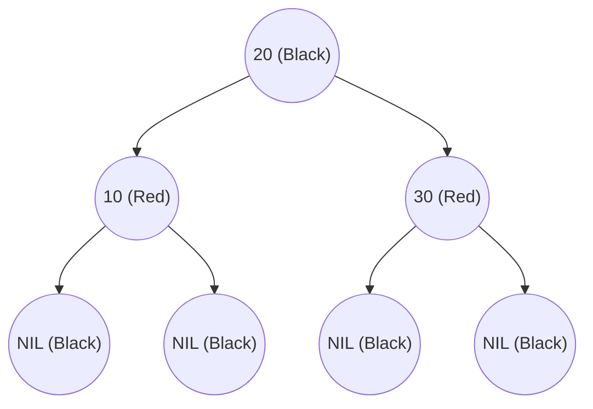

</div>

### Red Node Cannot Have Red Children

No two consecutive red nodes can appear on a path.

Valid:

<div style={{textAlign: 'center'}}>

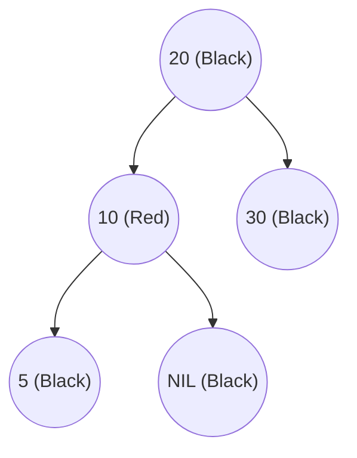

</div>

Invalid:

<div style={{textAlign: 'center'}}>

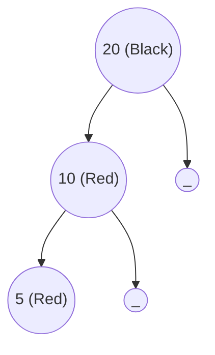

</div>

This is called a **Red-Red Violation**.

### Every Path Must Have Same Number of Black Nodes

The number of black nodes from any node to its descendant NIL leaves must be identical.

This count is called the **Black Height**.

Valid:

<div style={{textAlign: 'center'}}>

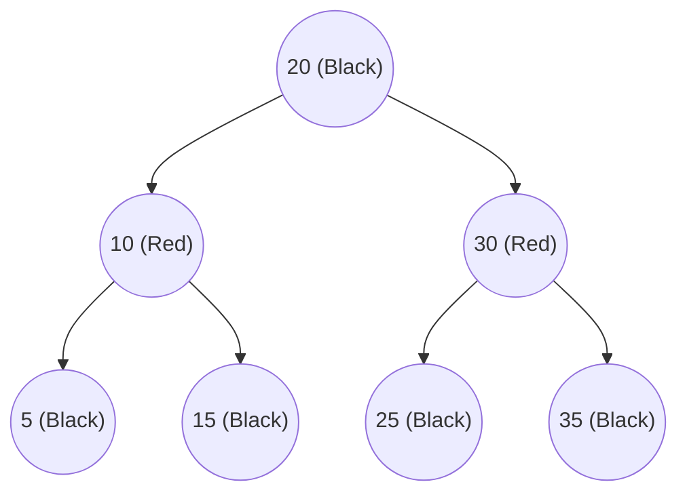

</div>

All root-to-NIL paths contain the same number of black nodes.

## Black Height

Black Height (BH) is:

> Number of black nodes from a node to any NIL leaf, excluding the starting node itself.

Example:

<div style={{textAlign: 'center'}}>

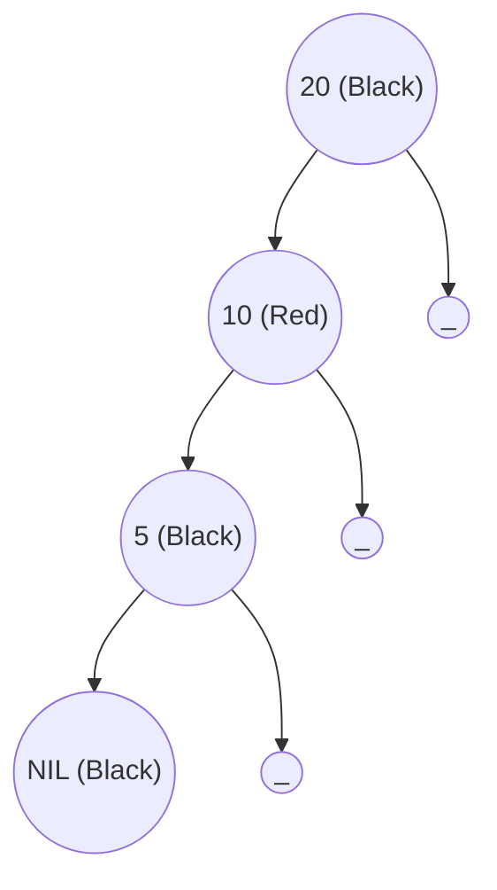

</div>

For node 20:

Path:

```text
20 → 10 → 5 → NIL
```

Black nodes below 20:

```text
5, NIL
```

BH(20) = 2

## Insertion in Red-Black Tree

Insertion occurs in two phases.

- **Phase 1**: Insert the node exactly like a BST.

- **Phase 2**: Fix Red-Black property violations.

### New Nodes Are Always Inserted Red

Suppose we insert 15.

<div style={{textAlign: 'center'}}>

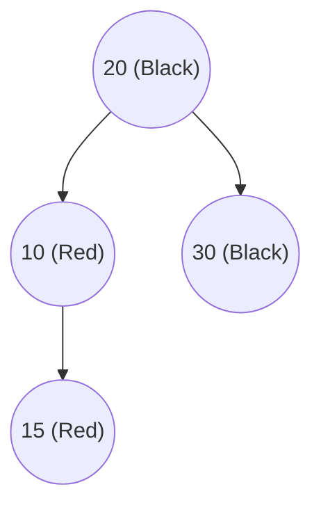

</div>

Immediately we have:

```tetx
10 (Red)
|
15 (Red)
```

Red-Red violation.

## Fixing Violations

There are two major tools:

1. Recoloring
2. Rotations

### Case 1: Uncle is Red

Initial tree:

<div style={{textAlign: 'center'}}>

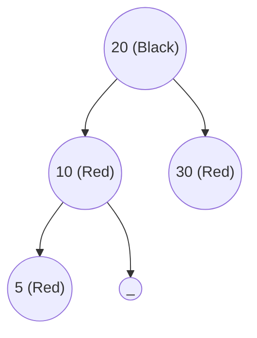

</div>

```text
Node = 5
Parent = 10
Uncle = 30
```

Both Parent and Uncle are Red.

#### Solution

Recolor:

```text
Parent  -> Black
Uncle   -> Black
Grandparent -> Red
```

Result:

<div style={{textAlign: 'center'}}>

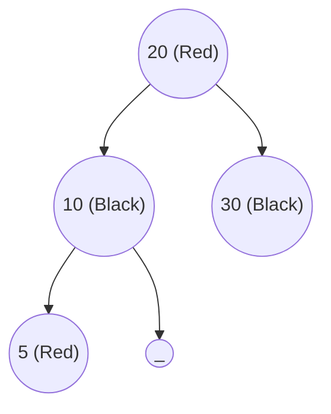

</div>

If grandparent becomes root, recolor it back to black.

### Case 2: Uncle is Black

Rotations are required.

#### Left-Left (LL) Case

Before insertion:

<div style={{textAlign: 'center'}}>

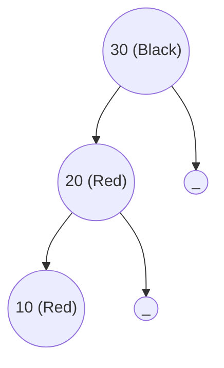

</div>

Violation:

Red node cannot have Red children.

After right rotation:

<div style={{textAlign: 'center'}}>


</div>

#### Right-Right (RR) Case

Before:

<div style={{textAlign: 'center'}}>

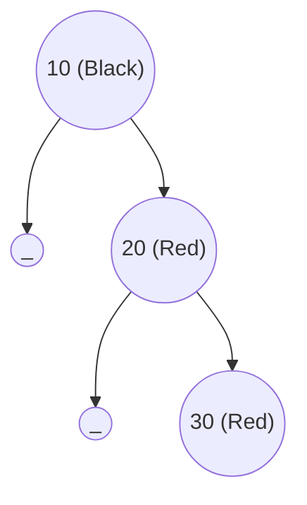

</div>

#### Left Rotation

After:

<div style={{textAlign: 'center'}}>


</div>

#### Left-Right (LR) Case

Before:

<div style={{textAlign: 'center'}}>

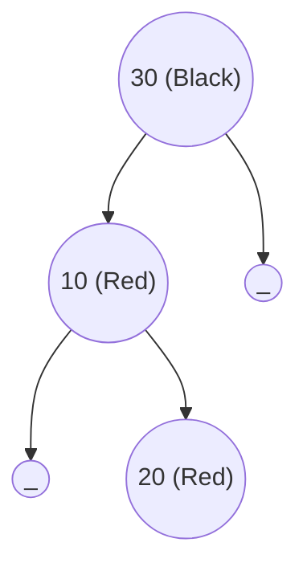

</div>

##### Step 1: Left Rotation

<div style={{textAlign: 'center'}}>


</div>

##### Step 2: Right Rotation

<div style={{textAlign: 'center'}}>


</div>

#### Right-Left (RL) Case

Before:

<div style={{textAlign: 'center'}}>

```mermaid
graph TD
    G(("10 (Black)"))

    G --> A(("_"))
    G --> P(("30 (Red)"))

    P --> N(("20 (Red)"))
    P --> B(("_"))
```

</div>

##### Step 1: Right Rotation

<div style={{textAlign: 'center'}}>

```mermaid
graph TD
    G(("10 (Black)"))
    G --> A(("_"))
    G --> P(("20 (Red)"))
    P --> B(("_"))
    P --> N(("30 (Red)"))
```

</div>

##### Step 2: Left Rotation

<div style={{textAlign: 'center'}}>

```mermaid
graph TD
    N(("20 (Black)"))

    N --> G(("10 (Red)"))
    N --> P(("30 (Red)"))
```

</div>

## Tree Rotations

Rotations are local restructuring operations that preserve BST ordering.

### Right Rotation

Before:

<div style={{textAlign: 'center'}}>

```mermaid
graph TD
    G(("30 (Black)"))
    G --> P(("20 (Red)"))
    G --> M(("_"))
    P --> N(("10 (Red)"))
    P --> Q(("_"))
```

</div>

After:

<div style={{textAlign: 'center'}}>

```mermaid
graph TD
    X((20))
    X --> A((10))
    X --> Y((30))
```

</div>

### Left Rotation

Before:

<div style={{textAlign: 'center'}}>

```mermaid
graph TD
    X((20))
    X --> A(("_"))
    X --> Y((30))
    Y --> Z(("_"))
    Y --> B((40))
```

</div>

After:

<div style={{textAlign: 'center'}}>

```mermaid
graph TD
    Y((30))
    Y --> X((20))
    Y --> B((40))
```

</div>

## Example Insertion Sequence

Insert:

```text
10, 20, 30
```

### Insert 10

<div style={{textAlign: 'center'}}>

```mermaid
graph TD
    A(("10 (Black)"))
```

</div>

### Insert 20

<div style={{textAlign: 'center'}}>

```mermaid
graph TD
    A(("10 (Black)"))
    A --> Z(("_"))
    A --> B(("20 (Red)"))
```

</div>

Valid.

### Insert 30

<div style={{textAlign: 'center'}}>

```mermaid
graph TD
    A(("10 (Black)"))
    A --> X(("_"))
    A --> B(("20 (Red)"))
    B --> Y(("_"))
    B --> C(("30 (Red)"))
```

</div>

RR violation.

Apply left rotation:

<div style={{textAlign: 'center'}}>

```mermaid
graph TD
    B(("20 (Black)"))
    B --> A(("10 (Red)"))
    B --> C(("30 (Red)"))
```

</div>

Balanced again.

## Deletion in Red-Black Tree

Deletion is significantly more complicated than insertion.

Process:

1. Delete node as BST.
2. If a red node is removed → usually no problem.
3. If a black node is removed → black-height may decrease.
4. Fix violations using:
   - Recoloring
   - Rotations
   - Double Black resolution

Because deletion involves many cases, most implementations follow the CLRS algorithm or library implementations directly.

## Red-Black Tree vs AVL Tree

| Feature    | Red-Black Tree  | AVL Tree    |
| ---------- | --------------- | ----------- |
| Balance    | Looser          | Stricter    |
| Height     | Slightly Taller | Shorter     |
| Search     | Slightly Slower | Faster      |
| Insertion  | Faster          | Slower      |
| Deletion   | Faster          | Slower      |
| Rotations  | Fewer           | More        |
| Complexity | Easier          | More Strict |

## Complexity of Operations

| Operation | Complexity |
| --------- | ---------- |
| Search    | O(log n)   |
| Insert    | O(log n)   |
| Delete    | O(log n)   |
| Min       | O(log n)   |
| Max       | O(log n)   |
