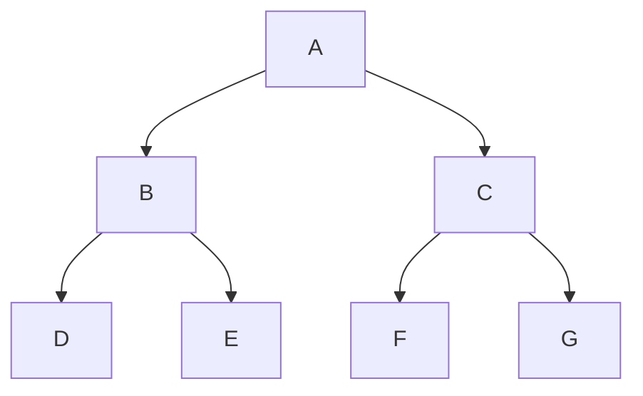
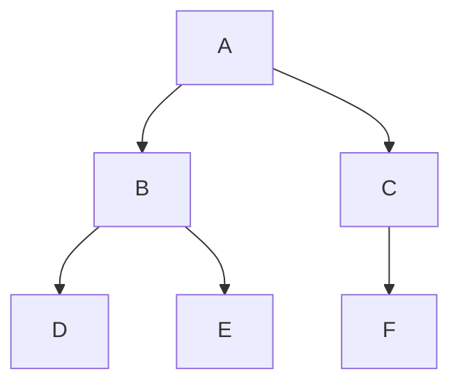

# Strict vs Complete Binary Tree

<!-- markdownlint-disable MD024 -->

## Strict Binary Tree

A **Strict Tree** (also called a _Proper Binary Tree_ in the binary case) is a tree in which **every non-leaf node has exactly the same number of children**.

- For a **strict binary tree**, every non-leaf node has exactly **two children**.
- For a **strict k-ary tree**, every non-leaf node has exactly **k children**.

### Key Points

- No node can have only 1 child.
- Leaf nodes have **0 children**.
- Internal nodes have **exactly k children** (for k-ary trees; in binary case, exactly 2 children).

### Example (Strict Binary Tree)

<div style={{textAlign: 'center'}}>



</div>

Here,

- A, B, C are internal nodes → exactly 2 children each.
- D, E, F, G are leaves → 0 children.
- This is a strict binary tree.

## Complete Binary Tree

A **Complete Tree** is a tree in which **all levels are completely filled except possibly the last**, and the **last level has nodes as far left as possible**.

- Commonly discussed for binary trees (**Complete Binary Tree**).
- Ensures compactness, which is useful for array storage.

### Key Points

- Every level except possibly the last is **fully filled**.
- In the last level, nodes are placed **left to right** without gaps.
- Used in **heaps** (min-heap, max-heap).

### Example (Complete Binary Tree)

<div style={{textAlign: 'center'}}>



</div>

Here,

- All levels except the last are completely filled.
- Last level nodes are left-aligned (D, E, F).

## Differences Between Strict and Complete Trees

| Feature                  | Strict Tree                                                        | Complete Tree                                                                             |
| ------------------------ | ------------------------------------------------------------------ | ----------------------------------------------------------------------------------------- |
| **Definition**           | Every non-leaf node has exactly _k_ children (binary: 2 children). | All levels filled except possibly last, last filled left to right.                        |
| **Children Count**       | Internal nodes have fixed children count.                          | Internal nodes can have variable children count, but placement follows completeness rule. |
| **Shape**                | More rigid structure.                                              | More flexible, only needs to fill nodes from top-left.                                    |
| **Example Use Case**     | Perfectly balanced hierarchical structures.                        | Heap data structure, BFS-based algorithms.                                                |
| **Possible to be both?** | Yes, if the tree is also perfectly filled.                         | Yes, if all internal nodes have exactly k children and levels are filled.                 |

## Python Representation Examples

### Strict Binary Tree Check

```python
class Node:
    def __init__(self, val):
        self.val = val
        self.left = None
        self.right = None

def is_strict_binary_tree(root):
    if not root:
        return True
    if (root.left is None) != (root.right is None):
        return False
    return is_strict_binary_tree(root.left) and is_strict_binary_tree(root.right)

# Example
root = Node(1)
root.left = Node(2)
root.right = Node(3)
root.left.left = Node(4)
root.left.right = Node(5)

print(is_strict_binary_tree(root))  # True
```

### Complete Binary Tree Check

```python
from collections import deque

def is_complete_binary_tree(root):
    if not root:
        return True
    q = deque([root])
    end = False
    while q:
        node = q.popleft()
        if not node:
            end = True
        else:
            if end:
                return False
            q.append(node.left)
            q.append(node.right)
    return True

print(is_complete_binary_tree(root))  # True
```
