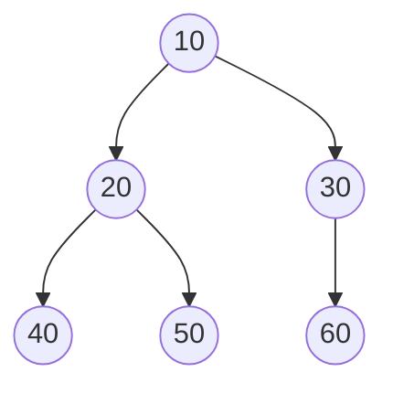

# Tree Representation in Memory

<!-- markdownlint-disable MD024 -->

A tree can be stored in memory mainly in two ways:

1. **Array Representation**
2. **Linked Representation**

## Array Representation of a Tree

### Concept

- Store tree nodes in a Python list.
- The index of the node determines its parent-child relationship.
- For binary trees:

$$
\text{Left Child Index} = 2i + 1
$$

$$
\text{Right Child Index} = 2i + 2
$$

where $i$ is the parent index.

### Example – Binary Tree in Array

<div style={{textAlign: 'center'}}>



</div>

Python representation:

```python
# Array representation of a binary tree
tree = [10, 20, 30, 40, 50, 60]

# Accessing children
parent_index = 1  # Node 20
left_child = tree[2 * parent_index + 1]  # 40
right_child = tree[2 * parent_index + 2]  # 50

print(f"Left Child of 20: {left_child}")
print(f"Right Child of 20: {right_child}")
```

### For N-ary Trees

For an n-ary tree, one common way is:

- Store children contiguously and maintain a dictionary mapping each node index to a list of child indices.

Example for $n = 3$:

```python
# N-ary tree stored in arrays
values = ["A", "B", "C", "D", "E", "F", "G"]
children = {
    0: [1, 2, 3],   # A -> B, C, D
    1: [4, 5],      # B -> E, F
    2: [6],         # C -> G
    3: [],          # D
    4: [],          # E
    5: [],          # F
    6: []           # G
}
```

### Advantages

- Fast access ($O(1)$) for parent/children if tree is complete.
- Cache-friendly.

### Disadvantages

- Wasted space if tree is sparse.
- Difficult to grow dynamically.
- Not ideal for non-complete trees.

## Linked Representation of a Tree

### Concept

- Each node is an object storing:
  - data
  - links to children (and optionally parent).

### Binary Tree – Linked Representation

```python
class BinaryTreeNode:
    def __init__(self, data):
        self.data = data
        self.left = None
        self.right = None

# Example tree
root = BinaryTreeNode(10)
root.left = BinaryTreeNode(20)
root.right = BinaryTreeNode(30)
root.left.left = BinaryTreeNode(40)
root.left.right = BinaryTreeNode(50)
root.right.left = BinaryTreeNode(60)
```

### N-ary Tree – Linked Representation

#### Option 1: Fixed-size children array

```python
class NAryTreeNode:
    def __init__(self, data, n):
        self.data = data
        self.children = [None] * n  # fixed number of children

# Example for n = 3
root = NAryTreeNode("A", 3)
root.children[0] = NAryTreeNode("B", 3)
root.children[1] = NAryTreeNode("C", 3)
root.children[2] = NAryTreeNode("D", 3)
```

#### Option 2: Variable-size children list

```python
class NAryTreeNode:
    def __init__(self, data):
        self.data = data
        self.children = []  # dynamic list of children

# Example
root = NAryTreeNode("A")
root.children.append(NAryTreeNode("B"))
root.children.append(NAryTreeNode("C"))
root.children.append(NAryTreeNode("D"))
```

#### Option 3: First Child / Next Sibling Representation

```python
class FCNSNode:
    def __init__(self, data):
        self.data = data
        self.first_child = None
        self.next_sibling = None

# Example
root = FCNSNode("A")
root.first_child = FCNSNode("B")
root.first_child.next_sibling = FCNSNode("C")
root.first_child.first_child = FCNSNode("D")
```

### Advantages

- Flexible: works for any shape tree.
- No wasted space for missing children.

### Disadvantages

- Pointer overhead.
- Slower child access (must follow references).

## Comparison Table

| Feature           | Array Representation         | Linked Representation         |
| ----------------- | ---------------------------- | ----------------------------- |
| Memory usage      | Wastes space in sparse trees | Uses extra space for pointers |
| Access time       | $O(1)$ for complete trees    | $O(k)$ for k-th child         |
| Insert/Delete     | Expensive (shift elements)   | Easy (update pointers)        |
| Works for         | Complete trees               | Any tree shape                |
| Cache performance | High                         | Lower                         |

## When to Use

- **Array Representation**: For complete trees (e.g., heaps, segment trees).
- **Linked Representation**: For sparse, dynamic, or n-ary trees.
