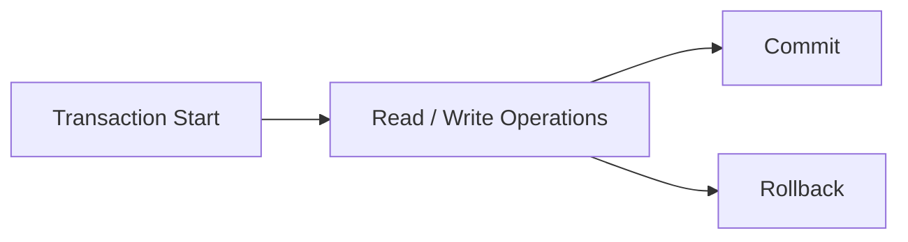
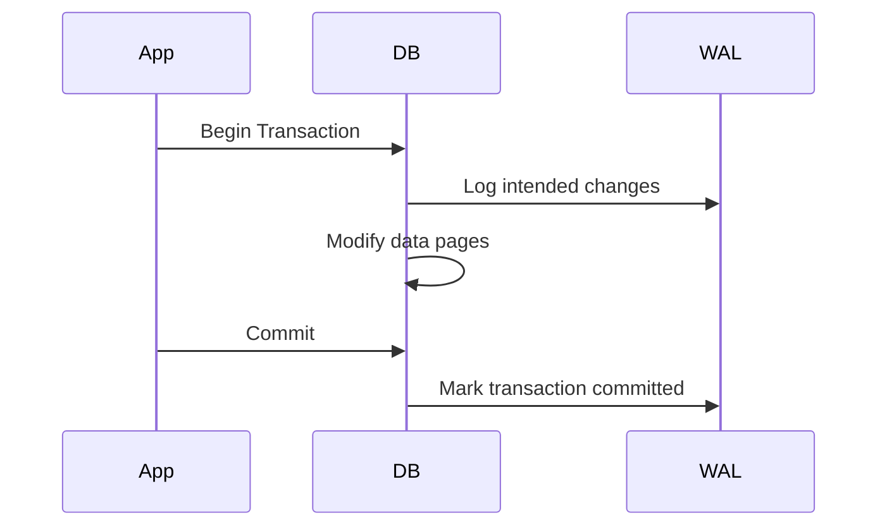
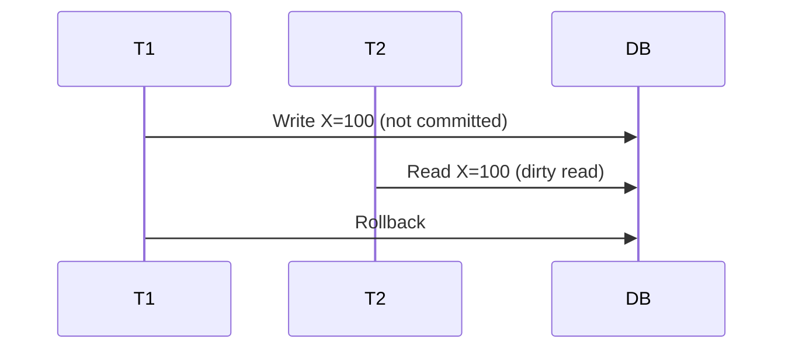
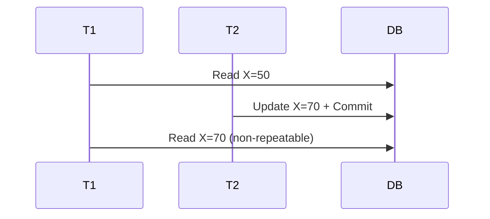
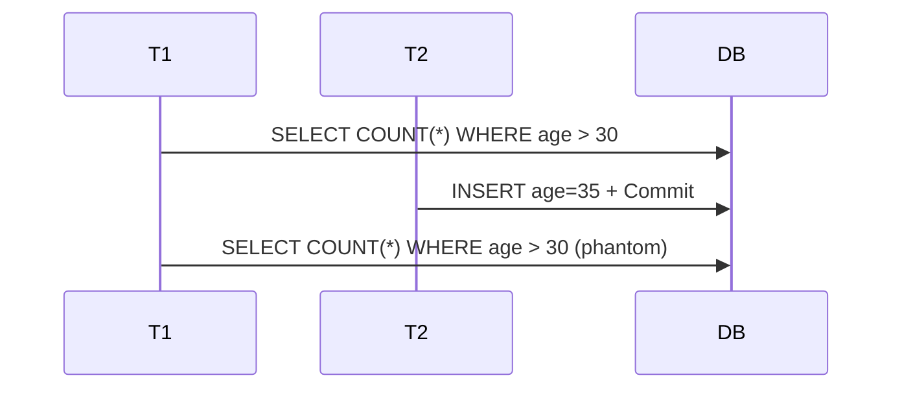
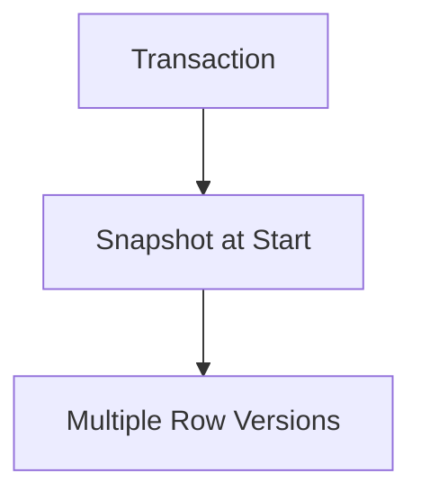
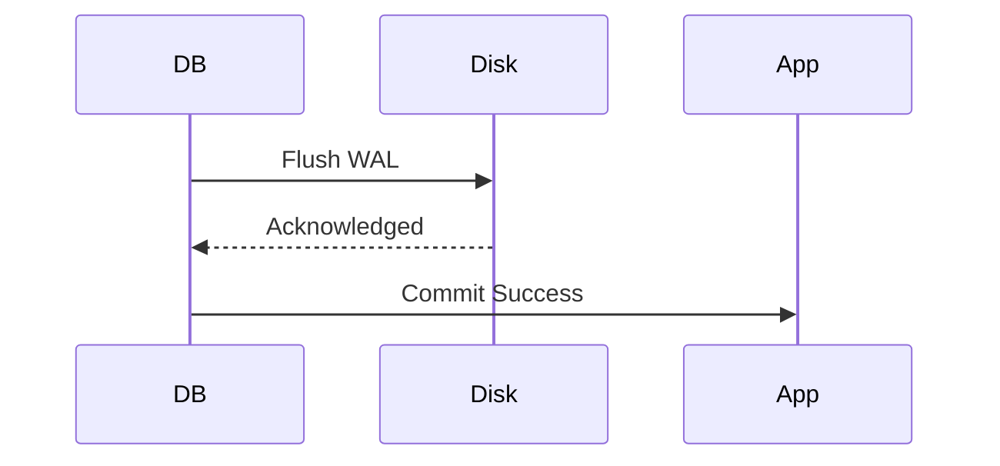
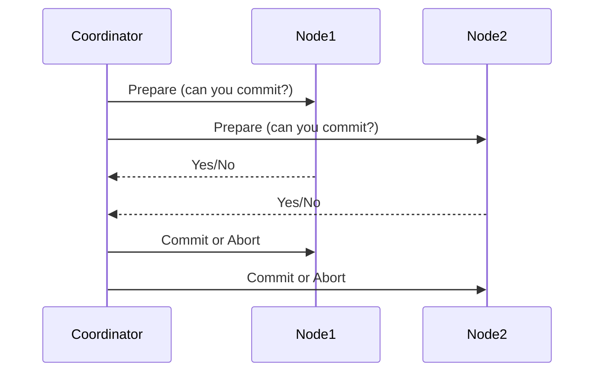

# ACID

:::tip[Status]

This note is complete, reviewed, and considered stable.

:::

**ACID** is a set of four guarantees that define a **transaction**:

- **A**tomicity
- **C**onsistency
- **I**solation
- **D**urability

A **transaction** is a logical unit of work that moves the database from one valid state to another.

<div style={{textAlign: 'center'}}>



</div>

## Why ACID Exists

Databases exist to store **shared, persistent state**. The moment we introduce:

- Multiple users
- Concurrent reads & writes
- Crashes, power failures, network issues

We face a core problem:

> **How do we ensure the data is always correct, even when things go wrong?**

Without strict guarantees:

- Money can be created or lost
- Inventory can go negative
- Partial updates can corrupt data

ACID is the **contract** between the database and our application that defines _correctness_.

## Atomicity

> Either **all operations** in a transaction succeed, or **none of them do**.

There is **no partial state** visible.

### Example (Bank Transfer)

```text
Transfer $100 from A to B
1. A.balance -= 100
2. B.balance += 100
```

If the system crashes after step 1 but before step 2:

- Without Atomicity → money disappears
- With Atomicity → both steps rollback

### How Atomicity Is Implemented Internally

**Write-Ahead Logging (WAL)** is the core mechanism.

Rules:

1. Changes are written to the **log first**
2. Only then are data pages modified

<div style={{textAlign: 'center'}}>



</div>

If a crash happens:

- Log is replayed
- Uncommitted transactions are undone

### Common Misconception

Atomicity ≠ single statement

A transaction can include:

- Multiple tables
- Multiple indexes
- Triggers
- Foreign key checks

## Consistency

> A transaction must move the database from **one valid state** to **another valid state**.

Consistency is about **rules**, not isolation or crashes.

### Types of Consistency

#### Database-Level Consistency

Enforced by the DB engine:

- Primary keys
- Foreign keys
- NOT NULL
- UNIQUE
- CHECK constraints

```sql
balance >= 0
```

#### Application-Level Consistency

Business rules:

- User cannot withdraw more than daily limit
- Order must have at least one item

The database **cannot enforce these automatically**.

### Important Truth

> **The database guarantees consistency _only if your transaction logic is correct_.**

If you write buggy logic, ACID will faithfully preserve the bug.

## Isolation

> Concurrent transactions should not interfere in a way that violates correctness.

But **full isolation is expensive**, so databases provide **levels**.

## Isolation Problems

Isolation problems describe **anomalies that occur when multiple transactions run concurrently without sufficient isolation**. The diagrams below show _what happens_; the explanations tell you _why it is a problem_ and _what guarantee is violated_.

Think of isolation as answering this question:

> “If two transactions run at the same time, can one see the intermediate, incomplete, or changing results of the other?”

### Dirty Read

A transaction reads data written by another transaction that has **not yet committed**.

**Why it is dangerous:**
If the writing transaction rolls back, the reading transaction has used **data that never officially existed**.

**Real-world example:**

- Transaction T1 updates an account balance but hasn’t committed yet.
- Transaction T2 reads this new balance and makes a business decision.
- T1 rolls back.
- T2 has now acted on **phantom data**.

<div style={{textAlign: 'center'}}>



</div>

**Key insight:**

> Dirty reads violate the illusion that a transaction only sees _final, committed_ data.

### Non-Repeatable Read

A transaction reads the **same row twice** and gets **different values**, because another transaction modified and committed that row in between.

**Why it is dangerous:**
The transaction cannot rely on data staying stable during its execution.

**Real-world example:**

- You read your bank balance.
- Another transaction updates it.
- You read it again within the same transaction and see a different value.

<div style={{textAlign: 'center'}}>



</div>

**Key insight:**

> Non-repeatable reads break the expectation that _data you read remains unchanged_ during a transaction.

### Phantom Read

A transaction re-runs a **range query** and sees **new or missing rows** that were inserted or deleted by another committed transaction.

**Why it is dangerous:**
Even if individual rows don’t change, the **set of rows matching a condition** does.

**Real-world example:**

- You count how many users are above age 30.
- Another transaction inserts a new qualifying user.
- You run the same query again and get a different count.

<div style={{textAlign: 'center'}}>



</div>

**Key insight:**

> Phantom reads show that isolation is not just about rows, it’s also about **ranges and predicates**.

## Isolation Levels (SQL Standard)

| Level            | Dirty     | Non-Repeatable | Phantom                |
| ---------------- | --------- | -------------- | ---------------------- |
| Read Uncommitted | Allowed   | Allowed        | Allowed                |
| Read Committed   | Prevented | Allowed        | Allowed                |
| Repeatable Read  | Prevented | Prevented      | Allowed (SQL standard) |
| Serializable     | Prevented | Prevented      | Prevented              |

### How Isolation Is Implemented

#### Lock-Based (Pessimistic)

- Row locks
- Table locks
- Gap locks

#### MVCC (Optimistic)

- Snapshot reads
- Versioned rows

<div style={{textAlign: 'center'}}>



</div>

## Durability

> After commit, data will survive crashes, power loss, and restarts.

### How Durability Is Achieved

- Write-Ahead Logs flushed to disk
- fsync()
- Replication (in some systems)

<div style={{textAlign: 'center'}}>



</div>

### Durability Trade-Offs

| Strong Durability       | Faster Performance       |
| ----------------------- | ------------------------ |
| fsync per commit        | Group commit             |
| Synchronous replication | Asynchronous replication |

Some databases allow relaxing durability requirements for improved speed.

## ACID Across Major Databases

### PostgreSQL

- Full ACID
- MVCC-based isolation
- Serializable via SSI
- Strong durability by default

### MySQL (InnoDB)

- ACID compliant
- Repeatable Read default
- Gap locks prevent phantoms

### Oracle

- Very strong ACID
- Mature MVCC
- Excellent consistency guarantees

### SQL Server

- Lock-based + snapshot isolation
- Serializable supported

### SQLite

- ACID compliant
- Single-writer model
- WAL improves concurrency

## ACID in Distributed Databases

Maintaining ACID guarantees across multiple nodes is fundamentally more challenging than in a single-node system.

### Challenges

- **Network partitions**: We cannot reliably communicate between nodes at all times (CAP theorem)
- **Replication lag**: Data changes propagate asynchronously across replicas
- **Two-phase commit overhead**: Coordinating commits across multiple nodes is expensive and prone to failures
- **Consensus complexity**: Ensuring all nodes agree on a consistent state requires sophisticated consensus algorithms

### Implementation Approaches

#### Two-Phase Commit (2PC)

A coordination protocol where a coordinator asks all participating nodes if they can commit, then either commits or aborts based on their responses.

<div style={{textAlign: 'center'}}>



</div>

**Pros**: Strong consistency guarantees  
**Cons**: Blocking operations, poor availability during partitions

#### Eventual Consistency with Sagas

Break distributed transactions into a series of local transactions coordinated by application logic. Each step can succeed or fail independently, with compensating transactions for rollbacks.

#### Consensus-Based Systems (Raft, Paxos)

Systems like CockroachDB use Raft consensus to replicate a consistent log across nodes, providing strong ACID guarantees even with network failures. This approach is more resilient than traditional 2PC.

### Trade-Offs

Distributed ACID is **expensive** because:

- Coordination latency increases with each additional node
- Throughput decreases due to synchronous coordination
- Availability suffers during network partitions
- Complex failure scenarios require careful handling

Many distributed systems (Cassandra, DynamoDB) explicitly choose BASE over distributed ACID for better scalability and availability.

## BASE

**BASE** is an acronym that stands for:

- **B**asically Available - The system is available most of the time
- **S**oft state - The state of the system may change without explicit input (due to replication lag)
- **E**ventually consistent - The system will eventually reach a consistent state

Used in **NoSQL & large-scale distributed systems** to prioritize availability and performance over immediate consistency.

### BASE Philosophy

> **Availability and scalability over strict immediate correctness**

Rather than blocking operations to guarantee consistency, BASE systems accept temporary inconsistencies and resolve them asynchronously. This is a practical trade-off for systems operating at internet scale with thousands of nodes and users across the globe.

### BASE vs ACID

| Aspect              | ACID                              | BASE                                 |
| ------------------- | --------------------------------- | ------------------------------------ |
| Consistency model   | Strong/immediate consistency      | Eventual consistency                 |
| Transactions        | Full ACID transactions            | No / limited / local transactions    |
| Availability        | Can be reduced during failures    | Designed to be always available      |
| Latency             | Higher due to coordination        | Lower, optimized for speed           |
| Partition tolerance | Limited (2PC fails on partitions) | High (designed to handle partitions) |
| Use case            | Critical correctness (financial)  | High-scale distributed systems       |

### How BASE Systems Work

**Conflict Resolution Strategies:**

- **Last-Write-Wins (LWW)**: The most recent write overwrites older writes (simple but can lose data)
- **Vector Clocks/Version Vectors**: Track causality to detect concurrent writes
- **Application-Level Resolution**: Let the application decide how to merge conflicting versions
- **CRDTs (Conflict-free Replicated Data Types)**: Data structures that guarantee convergence without coordination

**Example: Adding an item to a set in a distributed system**

- Node A adds item X
- Node B adds item Y
- Both additions are replicated asynchronously
- Eventually, all nodes converge to X, Y

### Examples of BASE Systems

- **DynamoDB** - Strongly consistent reads available but eventually consistent by default
- **Cassandra** - Tunable consistency; can configure reads/writes for performance vs. consistency
- **Riak** - Distributed key-value store with sophisticated conflict resolution
- **Couchbase** - NoSQL database with eventual consistency
- **Redis Cluster** - In-memory data structure store with asynchronous replication

These systems:

- Replicate aggressively across regions
- Accept temporary inconsistencies between replicas
- Resolve conflicts asynchronously using various strategies
- Prioritize low latency and high availability

## When to Use ACID vs BASE

### Use ACID When

- **Financial transactions**: Money transfers, payments, accounting
- **Critical data correctness**: Medical records, legal contracts
- **Business invariants must never break**: Unique constraints, referential integrity
- **Small to medium scale**: Single-region or limited geographic distribution
- **Lower throughput requirements**: Where latency is less critical than correctness

### Use BASE When

- **Massive global scale**: Millions of users across multiple continents
- **Low latency is critical**: User-facing applications require response times < 100ms
- **Temporary inconsistency is acceptable**: Social media feeds, inventory counts (approximate is fine)
- **High availability**: System must remain operational during network partitions
- **Write-heavy workloads**: Need to scale writes horizontally

### Hybrid Approaches

Many modern systems use a **polyglot persistence** strategy:

- **ACID database** for critical data (user accounts, transactions)
- **BASE system** for high-volume, eventually-consistent data (activity feeds, recommendations)
- **Cache layer** for read-heavy data
