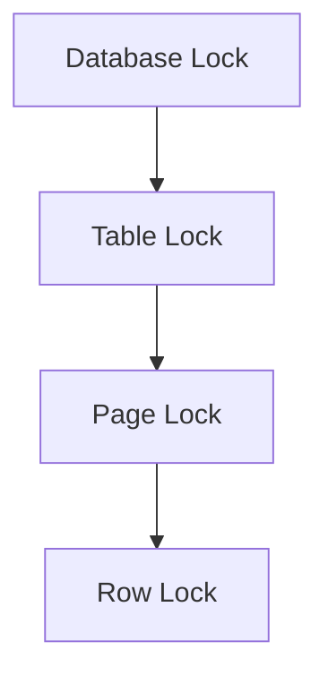
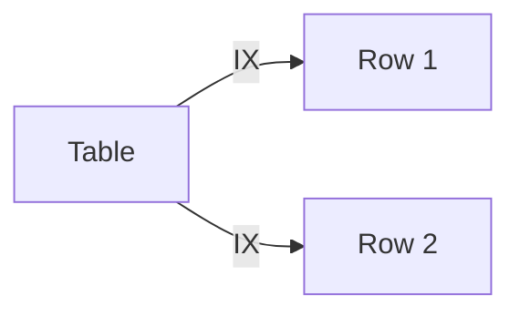
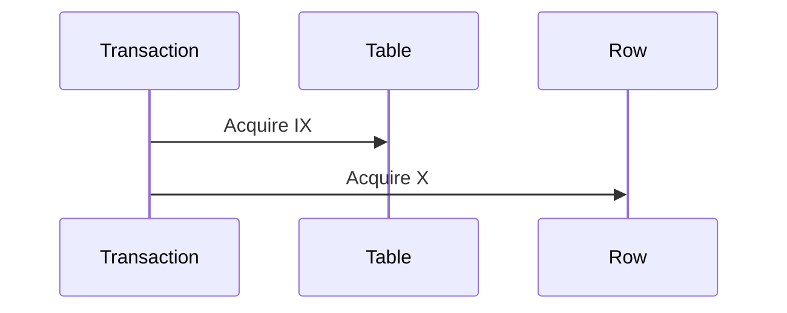
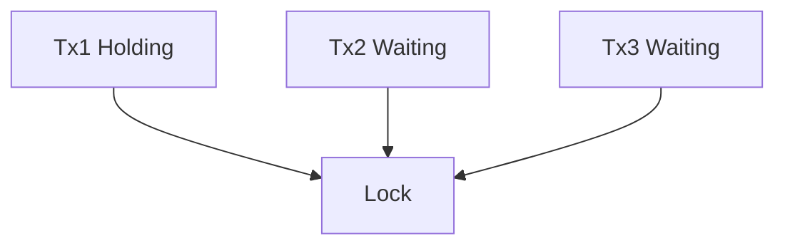
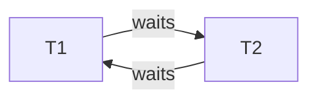

# Locks

:::tip[Status]

This note is complete, reviewed, and considered stable.

:::

In multi-user database systems, multiple transactions execute concurrently to maximize throughput and resource utilization. Locks exist to **coordinate concurrent access to shared data** so that correctness is preserved. Without locks, concurrent reads and writes could corrupt data or expose inconsistent intermediate states.

Locks primarily protect against the following anomalies:

- **Lost updates** – one transaction overwrites another’s changes
- **Dirty reads** – reading uncommitted data
- **Non-repeatable reads** – re-reading yields different results
- **Phantom reads** – new rows appear between reads

Conceptually, a lock is a **contract** between a transaction and the database engine that grants controlled access to a data item.

## Concurrency Control Overview

Concurrency control ensures that the outcome of concurrent execution is equivalent to some serial execution (serializability).

Two dominant approaches:

1. **Lock-based concurrency control**

   - Transactions acquire locks before accessing data
   - Conflicts are resolved by blocking or aborting transactions

2. **Optimistic / MVCC-based concurrency control**

   - Readers do not block writers
   - Conflicts are detected at commit time

Locks are still essential even in MVCC systems for:

- Writes
- Schema changes
- Certain isolation guarantees

## ACID Properties Relation

Locks are primarily tied to **Isolation** and **Consistency**, but they indirectly support all ACID properties.

| ACID Property | Role of Locks                                |
| ------------- | -------------------------------------------- |
| Atomicity     | Prevents partial visibility of changes       |
| Consistency   | Enforces integrity during concurrent updates |
| Isolation     | Core purpose of locks                        |
| Durability    | Locks ensure committed state is well-defined |

Isolation levels (Read Committed, Repeatable Read, Serializable) determine **how aggressively locks are used**.

## Transactions and Lock Scope

Locks are scoped to:

- A **transaction** (released on commit/rollback)
- A **statement** (statement-level locks)

Scope dimensions:

- Object scope: row, page, table, database
- Time scope: short-lived vs long-lived

Long-running transactions dramatically increase lock contention and risk of blocking.

## Lock Granularity

Lock granularity defines **how much data a lock protects**.

### Database Level

- Locks the entire database
- Rare, usually for maintenance operations
- Highest contention, lowest overhead

Use cases:

- Backup
- Restore
- Global configuration changes

### Table Level

- Locks the entire table
- Common for DDL and bulk operations

Pros:

- Simple
- Low lock manager overhead

Cons:

- Poor concurrency

### Page Level

- Locks a fixed-size block (page) of data
- Balance between concurrency and overhead

Often used internally by storage engines where row-level locks are too expensive.

### Row Level

- Locks individual rows
- Highest concurrency
- Highest lock bookkeeping cost

Used heavily in OLTP systems.

#### Granularity Hierarchy

<div style={{textAlign: 'center'}}>



</div>

## Lock Types and Modes

### Shared Locks (S)

- Allows multiple readers
- Prevents writers

Used for SELECT queries under stronger isolation levels.

**Example:**

```sql
-- Transaction 1
BEGIN TRANSACTION ISOLATION LEVEL REPEATABLE READ;
SELECT * FROM users WHERE id = 1;  -- Acquires S lock on row

-- Transaction 2
BEGIN TRANSACTION;
SELECT * FROM users WHERE id = 1;  -- Can acquire S lock (compatible)
UPDATE users SET name = 'Jane' WHERE id = 1;  -- Blocked (X lock incompatible with S)
```

### Exclusive Locks (X)

- Allows a single writer
- Blocks all other access

Required for UPDATE, DELETE, INSERT.

**Example:**

```sql
-- Transaction 1
BEGIN TRANSACTION;
UPDATE users SET name = 'John' WHERE id = 1;  -- Acquires X lock on row

-- Transaction 2 (blocked)
BEGIN TRANSACTION;
SELECT * FROM users WHERE id = 1;  -- Blocked waiting for X lock release
UPDATE users SET age = 30 WHERE id = 1;  -- Blocked (X locks are mutually exclusive)
```

### Intent Locks

Intent locks signal **future locking intentions** at a finer granularity.

Examples:

- IS (Intent Shared) – indicates that shared locks will be acquired on child objects
- IX (Intent Exclusive) – indicates that exclusive locks will be acquired on child objects

They enable efficient multi-granularity locking without requiring the database to check every child object.

**Example:**

```sql
-- Transaction holding multiple row locks
BEGIN TRANSACTION;
LOCK TABLE users IN INTENT EXCLUSIVE MODE;  -- Table gets IX lock
UPDATE users SET status = 'active' WHERE id IN (1, 2, 3);  -- Row-level X locks acquired
```

<div style={{textAlign: 'center'}}>



</div>

### Update Locks (U)

Used to avoid deadlocks during read-modify-write cycles.

Behavior:

- Initially behaves like Shared (allows multiple readers)
- Converts to Exclusive when the update happens

Common in SQL Server-style engines.

**Example:**

```sql
-- SQL Server: read-modify-write with U lock
BEGIN TRANSACTION;
SELECT * FROM accounts WHERE id = 1 WITH (UPDLOCK);  -- Acquires U lock
-- Other transactions can read but cannot acquire U or X locks
UPDATE accounts SET balance = balance - 100 WHERE id = 1;  -- Upgrades U to X
COMMIT;
```

### Schema Locks

Protect database metadata.

Types:

- Schema Stability (allows queries)
- Schema Modification (blocks everything)

DDL statements rely heavily on schema locks.

## Lock Compatibility

Two locks are compatible if they can be held simultaneously on the same data object by different transactions.

### Compatibility Matrix

| Requested \ Held      | S (Shared) | X (Exclusive) | IS (Intent Shared) | IX (Intent Exclusive) |
| --------------------- | ---------- | ------------- | ------------------ | --------------------- |
| S (Shared)            | ✓          | ✗             | ✓                  | ✗                     |
| X (Exclusive)         | ✗          | ✗             | ✗                  | ✗                     |
| IS (Intent Shared)    | ✓          | ✗             | ✓                  | ✓                     |
| IX (Intent Exclusive) | ✗          | ✗             | ✓                  | ✓                     |

### Lock Acquisition Rules

- Stronger locks cannot be granted if weaker incompatible locks exist
- Upgrades must re-check compatibility against all existing locks

Lock upgrades are a frequent source of deadlocks because they can create wait-for cycles.

### Multi-Granularity Locking

Transactions lock higher-level objects with intent locks before locking finer objects.

<div style={{textAlign: 'center'}}>



</div>

## Acquisition Strategies

### Two-Phase Locking (2PL)

Phases:

1. **Growing phase** – acquire locks, no releases allowed
2. **Shrinking phase** – release locks, no acquisitions allowed

Guarantees serializability when strictly enforced.

**Strict 2PL** releases locks only at transaction commit or rollback, ensuring no uncommitted changes are visible.

### Three-Phase Locking (3PL)

Adds an intermediate phase to avoid blocking anomalies.

Rarely used in real systems due to complexity.

### Lock Escalation

Automatic promotion of many fine-grained locks into a coarser lock.

Trade-off:

- Reduced overhead
- Reduced concurrency

### Deadlock Prevention

Common strategies:

- **Timeout-based abort** – abort if wait exceeds threshold
- **Wait-die** – older transactions wait for newer ones; younger transactions die and retry
- **Wound-wait** – older transactions preempt younger ones; younger transactions wait

Each strategy balances fairness, throughput, and restart overhead differently.

## Lock Management

### Acquisition and Release

Locks are:

- Acquired on demand
- Released at commit/rollback or earlier

Incorrect release timing breaks isolation.

### Lock Timeouts

Transactions waiting beyond a configured threshold are automatically aborted.

Prevents infinite waits but may abort valid long-running transactions under contention.

### Lock Waiting Queues

Blocked transactions wait in queues per lock object.

<div style={{textAlign: 'center'}}>



</div>

### Lock Monitoring Queries

Databases expose system views for us to inspect:

- Current locks held
- Waiting transactions
- Blocking chains

Essential for diagnosing and debugging production contention issues.

## Problems and Solutions

### Blocking Transactions

Occurs when incompatible locks collide and one transaction must wait.

Mitigation strategies:

- Keep transactions short to minimize lock hold times
- Use proper indexing to reduce the number of rows accessed
- Optimize query execution plans

### Deadlocks (Detection/Resolution)

Circular wait condition.

<div style={{textAlign: 'center'}}>



</div>

Resolved by aborting one participant.

### Livelocks

Transactions repeatedly abort and retry without progress, wasting resources.

Solved via exponential backoff or priority-based scheduling adjustments.

### Starvation

Low-priority transactions never acquire locks.

Solved via fairness policies.

## PostgreSQL Implementation

### MVCC Integration

PostgreSQL uses MVCC, so:

- Reads do not block writes
- Writes still require locks

Locks coordinate visibility and structural safety.

### Lock Modes (AccessShare to AccessExclusive)

Ordered from weakest to strongest:

- AccessShare (SELECT)
- RowShare
- RowExclusive
- ShareUpdateExclusive
- Share
- ShareRowExclusive
- Exclusive
- AccessExclusive (DDL)

### pg_locks System View

Provides visibility into:

- Lock type
- Lock mode
- Granted vs waiting

Critical for diagnosing contention.

### Explicit Locking Commands

```sql
LOCK TABLE users IN ACCESS EXCLUSIVE MODE;
```

Used sparingly for critical sections.

## PostgreSQL Internals

### LockManager Architecture

Centralized lock manager per instance.

### Hash Table Storage

Locks stored in shared memory hash tables keyed by object ID.

### Lightweight Locks

Protect internal data structures.

- Very fast
- Not user-visible

### Advisory Locks

Application-defined locks.

- Not tied to table rows
- Used for coordination

### Wait Graph Analysis

Deadlock detector builds wait-for graphs periodically.

### Backend Lock Handling

Each backend process:

- Requests locks
- Sleeps when blocked
- Wakes on release

## Advanced Topics

### Predicate vs Key-Range Locks

Predicate locks protect logical conditions (e.g., "salary > 100000").
Key-range locks protect physical index ranges and prevent phantom reads.

Serializable isolation levels rely on these mechanisms.

### Lock-Free Alternatives

Optimistic concurrency control avoids locks by detecting conflicts at commit time.

Most effective when conflicts are rare and transaction throughput is a priority.

### Distributed Locks

Required in distributed systems.

Challenges:

- Clock skew
- Network partitions

Examples:

- ZooKeeper
- etcd
- Redis Redlock

### Performance Tuning

Best practices:

- Keep transactions short
- Index properly
- Avoid unnecessary explicit locks
- Monitor lock contention continuously
