# Connection Pooling

:::tip[Status]

This note is complete, reviewed, and considered stable.

:::

A database connection is a **persistent communication channel** between an application and a database server.

Establishing a connection involves:

* TCP handshake
* Authentication (credentials, certificates, SSL)
* Allocating memory and worker resources on the database
* Registering a session in the database’s internal state

This makes connection creation **significantly more expensive** than executing most queries.

## Naive ways to connect to a database (and why they fail)

### One connection per request

```text
Request arrives
→ Open database connection
→ Execute query
→ Close connection
→ Send response
```

<div style={{textAlign: 'center'}}>

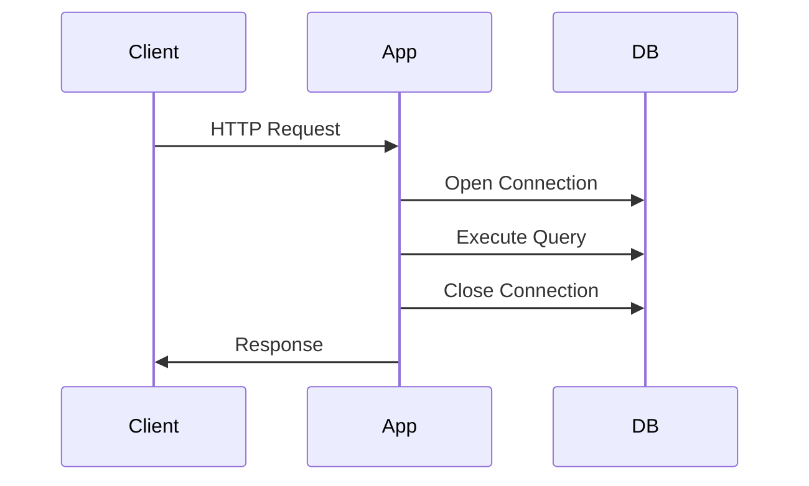

</div>

#### Why this approach fails

* Connection setup dominates request latency
* High CPU and memory usage on the database
* Connection storms during traffic spikes
* Poor scalability beyond low traffic

This model is acceptable only for scripts or extremely low-load systems.

### Single shared global connection

```text
Create one DB connection
Reuse it for all requests
```

<div style={{textAlign: 'center'}}>

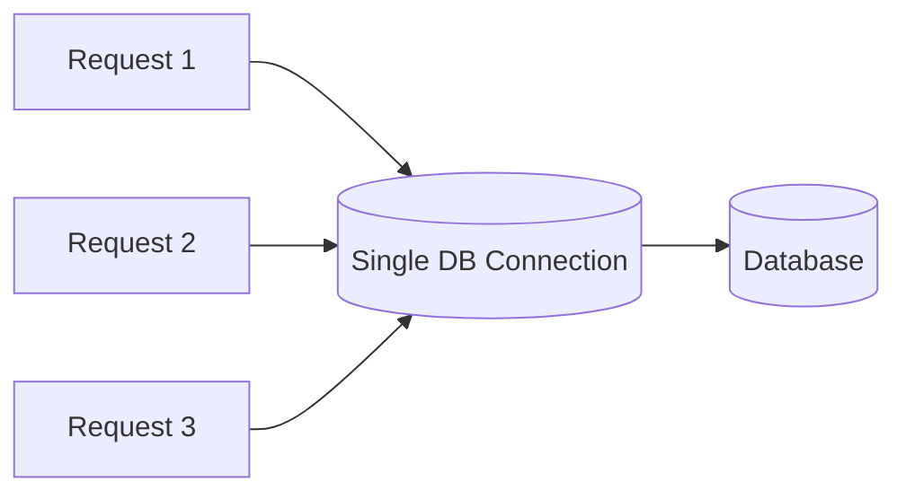

</div>

#### Why this approach fails

* No real concurrency
* Thread safety issues
* One broken connection breaks the entire system

## Core idea of connection pooling

**Connection pooling** means:

> Maintain a fixed number of pre-opened database connections and reuse them across requests.

Connections are **borrowed**, not created or destroyed per request.

## How connection pooling works internally

### Pool initialization

At application startup:

<div style={{textAlign: 'center'}}>

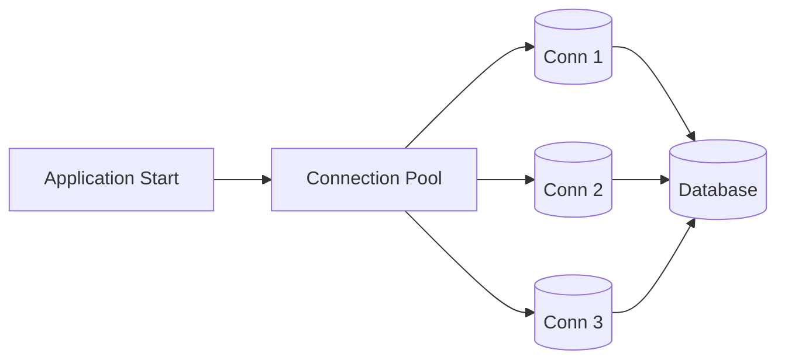

</div>

* Connections are created once
* Stored in an idle state
* Kept alive for reuse

### Request lifecycle with pooling

<div style={{textAlign: 'center'}}>

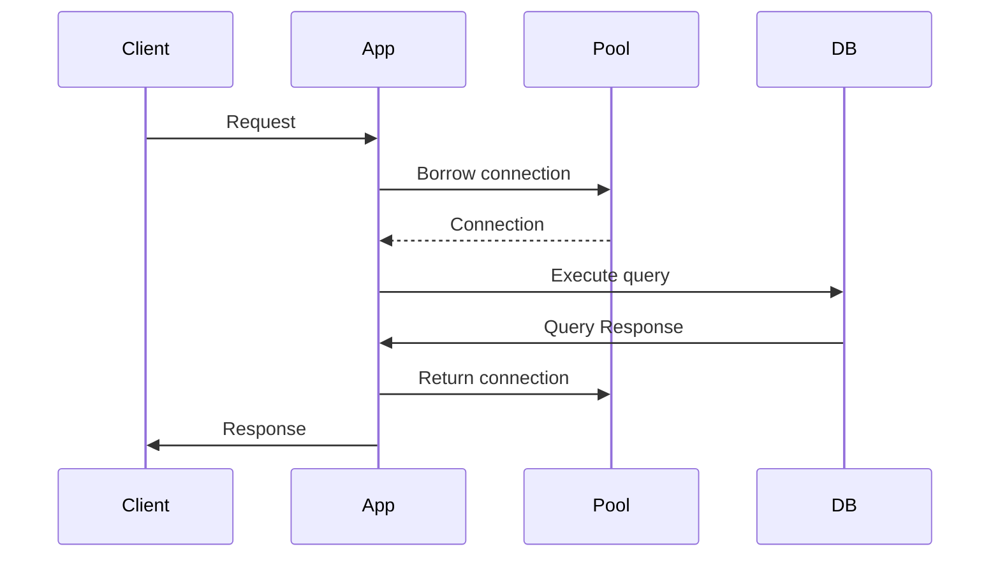

</div>

Key rule:

* **Connections must always be returned to the pool**

### Pool exhaustion and waiting

When all connections are busy:

<div style={{textAlign: 'center'}}>

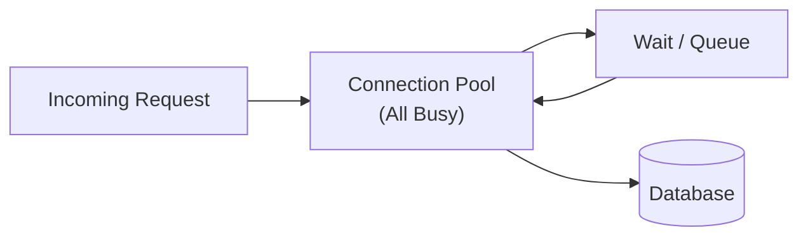

</div>

This introduces **backpressure**, protecting the database.

## Key characteristics of a connection pool

### Pool size

The pool enforces a maximum number of concurrent database connections.

* Small pool → higher wait times
* Large pool → database overload

The pool size is a **control knob**, not a performance booster.

### Connection reuse

<div style={{textAlign: 'center'}}>

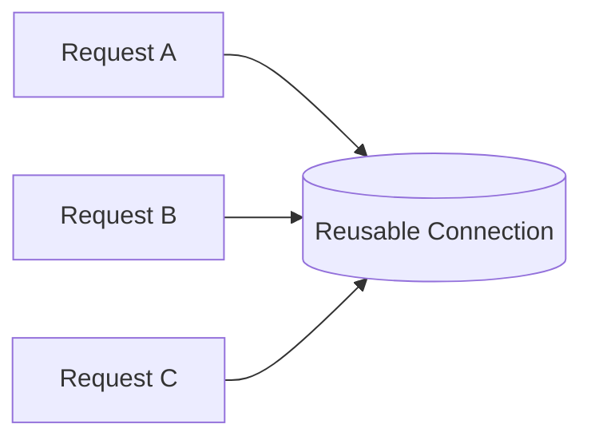

</div>

The same connection serves many requests over time, amortizing setup costs.

## Advantages of connection pooling over other approaches

### Performance advantage

Compared to per-request connections:

<div style={{textAlign: 'center'}}>

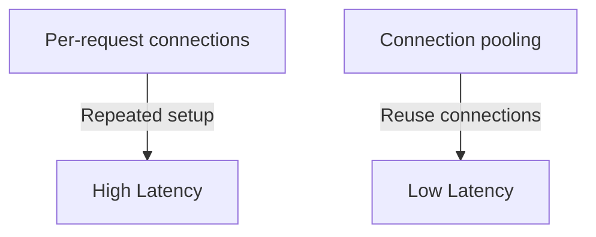

</div>

Pooling removes repeated connection overhead from the critical path.

### Scalability advantage

<div style={{textAlign: 'center'}}>

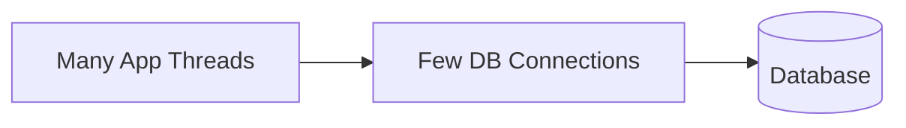

</div>

* Application concurrency ≠ database concurrency
* Pool acts as a **gatekeeper**

### Database protection

From the database’s perspective:

<div style={{textAlign: 'center'}}>

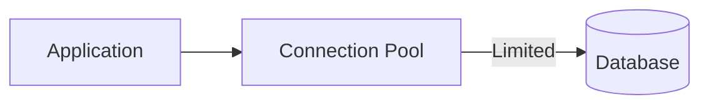

</div>

The pool:

* Prevents connection floods
* Keeps resource usage stable
* Improves predictability under load

### Resource efficiency

Without pooling:

* Constant connection creation/destruction
* High CPU and memory churn

With pooling:

* Long-lived connections
* Better cache and worker reuse

### Fault tolerance

Pools can:

* Detect broken connections
* Replace them automatically
* Retry safely

This logic is centralized instead of duplicated across application code.

## Connection pooling vs concurrency (important distinction)

<div style={{textAlign: 'center'}}>

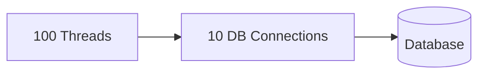

</div>

* Many threads can exist
* Only limited DB access is allowed
* Excess work waits instead of crashing the database

This is **intentional system design**, not a bottleneck.

## Common production failure modes

### Connection leaks

<div style={{textAlign: 'center'}}>


</div>

Result:

* Requests hang
* System degrades over time

### Oversized pools

<div style={{textAlign: 'center'}}>

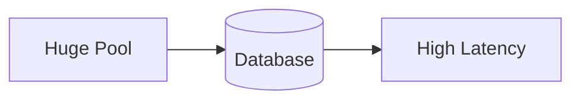

</div>

More connections increase contention and reduce performance.

### Long-running transactions

Connections held too long reduce pool availability and cause cascading delays.

## Real-world implementations

Connection pooling is built into most ecosystems:

* Java → HikariCP
* Python → SQLAlchemy / Django
* Go → `database/sql`
* Node.js → driver-level pools

Different APIs, same underlying model.
