# Transactions

:::tip[Status]

This note is complete, reviewed, and considered stable.

:::

A **transaction** is a sequence of database operations that the database treats as **one logical unit**.

A transaction guarantees:

* Either **all operations succeed**
* Or **none of them take effect**

There is **no visible partial state**.

## Why transactions exist

Databases operate in an environment where **failures and concurrency are normal**:

* Multiple users updating data at the same time
* Application crashes
* Database crashes
* Partial execution of multi-step logic

Without transactions, databases would constantly end up in **corrupted or inconsistent states**.

Example problem:

```text
1. Deduct ₹1000 from Account A  - executed successfully
2. Add ₹1000 to Account B       - db crahsed
```

Money disappears.

Transactions exist to guarantee:

> **Multiple operations behave as one correct, indivisible unit of work.**

## Transaction lifecycle (high level)

<div style={{textAlign: 'center'}}>

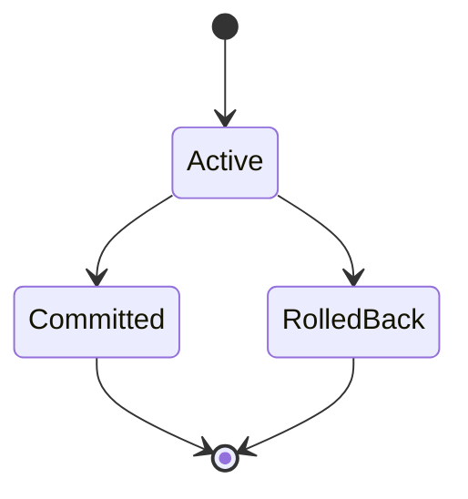

</div>

* `BEGIN` → transaction becomes **Active**
* `COMMIT` → changes become permanent
* `ROLLBACK` → changes are undone

## ACID properties (what transactions guarantee)

Transactions are defined by **ACID**. These are **engineering guarantees**, not theory.

## Atomicity – all or nothing

Atomicity means:

> A transaction is indivisible. Partial results are never visible.

Example:

```sql
BEGIN;
UPDATE accounts SET balance = balance - 100 WHERE id = 1;
UPDATE accounts SET balance = balance + 100 WHERE id = 2;
COMMIT;
```

If the second update fails, the first update is **undone**.

### Atomicity internally

Databases achieve atomicity using:

* **Undo information**
* **Transaction logs**

<div style={{textAlign: 'center'}}>

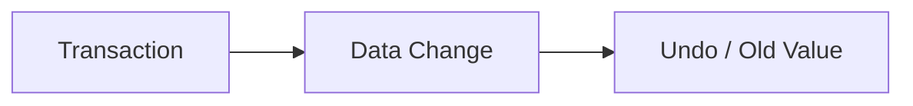

</div>

If the transaction aborts, the database reverts changes using undo data.

## Consistency – rules are enforced

Consistency means:

> A transaction moves the database from one **valid state** to another **valid state**.

Examples of consistency rules:

* Foreign keys must exist
* Unique constraints must hold
* Balance must not be negative

If a transaction violates constraints:

* The database **rejects it**
* The transaction is rolled back

Important:

> Transactions do not define rules, **constraints do**.
> Transactions ensure rules are never bypassed.

## Isolation – transactions don’t interfere

Isolation means:

> Concurrent transactions must not see each other’s **partial work**.

Without isolation, anomalies occur.

### Dirty read example (bad)

```text
T1: UPDATE balance = balance - 500 (not committed)
T2: SELECT balance → sees reduced balance
T1: ROLLBACK
```

T2 observed data that **never existed**.

Isolation prevents this.

## Durability – committed means permanent

Durability means:

> Once a transaction commits, its changes will survive crashes.

Databases achieve durability using:

* Write-Ahead Logging (WAL)
* fsync to stable storage
* Crash recovery

## Transactions and connections (critical relationship)

A transaction is **always bound to one database connection**.

<div style={{textAlign: 'center'}}>

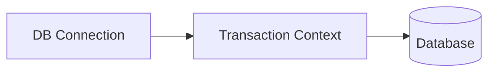

</div>

Implications:

* A transaction cannot span multiple connections
* The connection is held until `COMMIT` or `ROLLBACK`
* This is why long transactions exhaust connection pools

## How transactions work internally (real mechanism)

Internally, transactions rely on **four core systems**:

1. Transaction IDs (TXID)
2. Write-Ahead Logging (WAL)
3. MVCC (row versioning)
4. Locks (minimal and scoped)

## Transaction start (BEGIN internally)

When you run:

```sql
BEGIN;
```

The database:

1. Assigns a **Transaction ID (TXID)**
2. Creates a **transaction context**
3. Records snapshot information

<div style={{textAlign: 'center'}}>

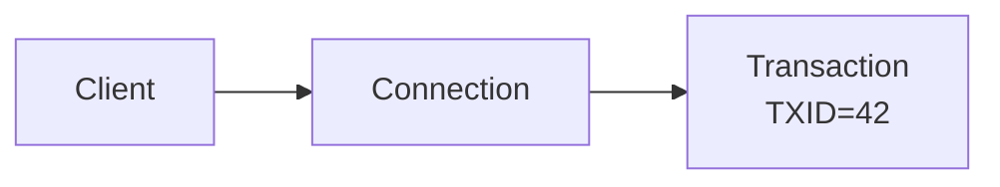

</div>

No data is copied. No locks are taken yet.

## Write-Ahead Logging (WAL)

### Core rule

> **Changes must be written to the log before data pages are modified.**

Why?

* Logs are sequential → fast
* Logs are replayable → crash-safe

### UPDATE internally

```sql
UPDATE users SET balance = 900 WHERE id = 1;
```

Steps:

1. Create WAL record (old value, new value, TXID)
2. Append WAL record to disk
3. Modify data page in memory
4. Mark page as dirty

<div style={{textAlign: 'center'}}>

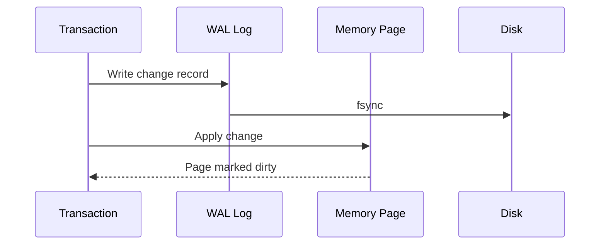

</div>

## COMMIT internally

When `COMMIT` is issued:

1. Write COMMIT record to WAL
2. Flush WAL to disk
3. Mark transaction as committed
4. Release locks
5. Make versions visible

<div style={{textAlign: 'center'}}>

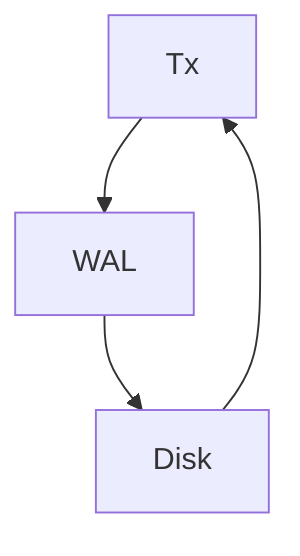

</div>

At this point:

* Transaction is **durable**
* Crashes cannot undo it

## ROLLBACK internally

When `ROLLBACK` happens:

1. Use undo / old versions
2. Revert in-memory changes
3. Discard transaction context

<div style={{textAlign: 'center'}}>

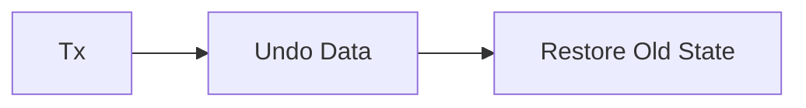

</div>

No durability guarantee is needed for rollback.

## MVCC – how isolation really works

Modern databases use **MVCC (Multi-Version Concurrency Control)**.

Instead of overwriting rows:

* Updates create **new versions**
* Old versions remain for other transactions

<div style={{textAlign: 'center'}}>

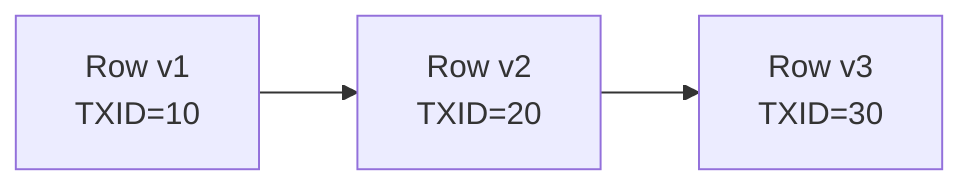

</div>

## Snapshots and visibility

Each transaction gets a **snapshot**:

* Which transactions were committed
* Which were active

When reading a row:

```text
Is this version visible to my snapshot?
→ Yes → return
→ No → skip
```

Reads do **not block writes**.

## Locks (still necessary, but limited)

Despite MVCC, locks exist:

| Lock           | Purpose                   |
| -------------- | ------------------------- |
| Row locks      | Prevent concurrent writes |
| Table locks    | DDL                       |
| Advisory locks | App-level coordination    |

<div style={{textAlign: 'center'}}>

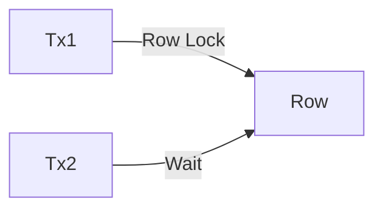

</div>

Locks are:

* Fine-grained
* Short-lived
* Scoped to transactions

## Crash recovery

After a crash:

1. Database scans WAL
2. Replays committed transactions
3. Ignores uncommitted ones

<div style={{textAlign: 'center'}}>

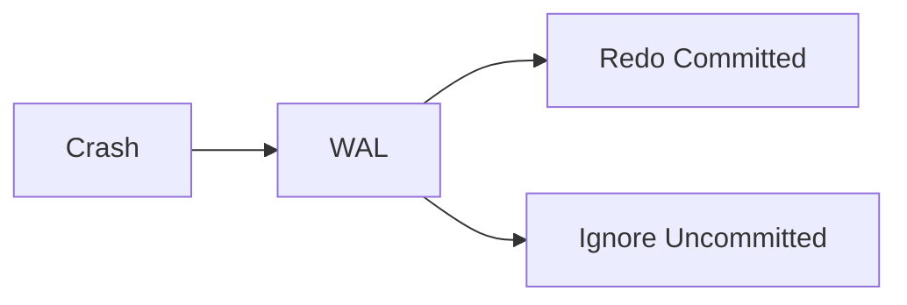

</div>

This guarantees **Atomicity + Durability**.

## Garbage collection of old versions

Old row versions cannot live forever.

Background process:

* Removes versions no snapshot needs
* Reclaims space

(PostgreSQL: `VACUUM`)

<div style={{textAlign: 'center'}}>

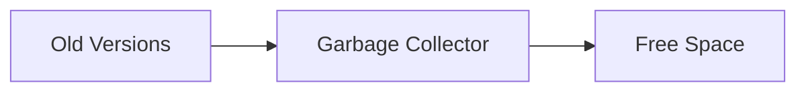

</div>

Long transactions delay cleanup.

## Why long transactions are dangerous

Long transactions:

* Hold snapshots open
* Prevent garbage collection
* Hold connections
* Increase WAL size

This leads to:

* Pool exhaustion
* Disk bloat
* Latency spikes

Rule:

> **Start transactions late, commit early.**

## Mental model

Think of a transaction as:

* A **private snapshot**
* A **stream of logged changes**
* A set of **new row versions**
* A **temporary ownership of a connection**

Other transactions never see half-finished work.
