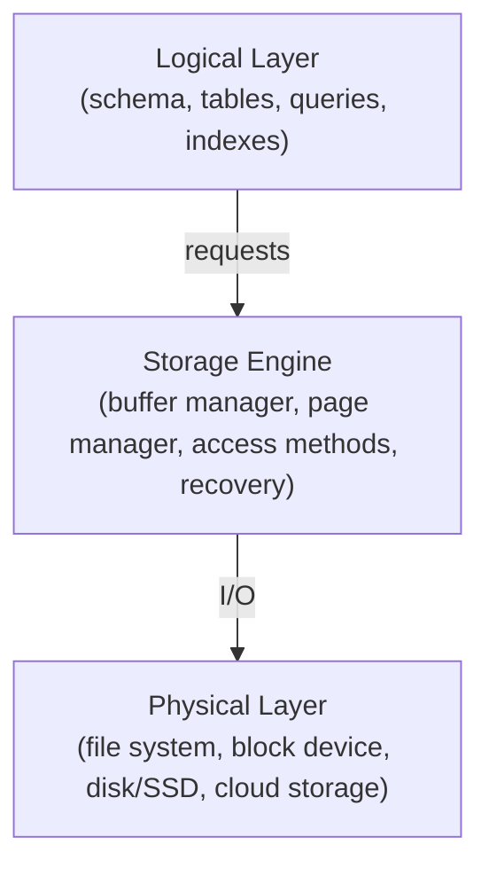

# Database Storage

**Database storage** is the physical representation of data within a database system. It's typically organized into **files** and **pages**.

## Storage Hierarchy

A storage hierarchy is a systematic arrangement of storage devices based on their speed, capacity, and cost. This hierarchy is essential for optimizing data access and storage costs in computer systems.

**Common Levels of Storage Hierarchy:**

### Primary Storage (Main Memory)

- Fastest storage device.
- Directly accessible by the CPU.
- Volatile (loses data when power is off).
- Used for active programs and data.

### Secondary Storage

- Slower than primary storage but larger capacity.
- Non-volatile (retains data when power is off).
- Examples: Hard Disk Drives (HDDs), Solid-State Drives (SSDs).

### Tertiary Storage

- Slowest storage device but has the largest capacity.
- Used for long-term data storage and archiving.
- Examples: Magnetic tapes, optical discs.

## Storage Hierarchy Access Speed

Storage hierarchy refers to the various types of data storage systems arranged by speed and cost. Here's a breakdown of access speeds for different types of storage:

### Registers

- **Access Time**: Nanoseconds (ns)
- Fastest storage, used for immediate data manipulation by the CPU.

### Cache Memory (L1, L2, L3)

- **Access Time**: Typically 1-10 ns
- Very fast, located close to the CPU to speed up access to frequently used data.

### RAM (Random Access Memory)

- **Access Time**: Approximately 10-100 ns
- Primary volatile storage used for active processes and data.

### SSD (Solid State Drive)

- **Access Time**: Around 100-500 µs (microseconds)
- Much faster than traditional hard drives, using flash memory to store data.

### HDD (Hard Disk Drive)

- **Access Time**: Generally 5-15 ms (milliseconds)
- Slower due to mechanical parts; access times vary depending on seek time and rotational speed.

### Optical Discs (e.g., CDs, DVDs)

- **Access Time**: 150-300 ms
- Slower than HDDs; uses lasers to read data.

### Magnetic Tape

- **Access Time**: Seconds to minutes
- Primarily used for archival storage; very slow access due to sequential reading.

## Why is Storage Hierarchy Important?

- **Performance Optimization:** Data is stored at the appropriate level based on its usage frequency. Frequently accessed data is kept in faster storage, while less frequently accessed data is stored in slower, cheaper storage.
- **Cost Optimization:** By using a hierarchy, organizations can balance performance and cost by storing data at the most suitable level.
- **Data Availability:** Critical data can be replicated across multiple storage levels to ensure high availability and redundancy.

## Example of Storage Hierarchy in a Database System

- **Primary Storage:** Active database buffers, query results, and frequently accessed data.
- **Secondary Storage:** Main database files, indexes, and temporary data.
- **Tertiary Storage:** Historical data, backups, and archived data.

## Key Factors Influencing Storage Hierarchy

- **Access Frequency:** How often data is accessed.
- **Data Size:** The amount of data to be stored.
- **Data Retention Requirements:** How long data needs to be retained.
- **Cost Constraints:** Budgetary limitations.

## Emerging Trends

- **Cloud Storage:** Leveraging external storage providers for scalable and flexible storage solutions.
- **Hybrid Cloud Storage:** Combining on-premises and cloud storage for optimal performance and cost.
- **Object Storage:** Designed for storing large amounts of unstructured data.

Understanding the storage hierarchy is crucial for designing efficient and cost-effective storage systems in various applications, including databases, cloud computing, and data centers.

## Sequential vs. Random Access

### Sequential Access

- Data is accessed in a linear order, starting from the beginning of a file.
- Typically used for tapes and older storage devices.
- Requires reading all preceding data to access a specific data item.
- **Example:** Reading a book from the beginning to reach a specific page.

### Random Access

- Data can be accessed directly without reading intermediate data.
- Typically used for modern storage devices like hard disk drives (HDDs) and solid-state drives (SSDs).
- Allows for efficient data retrieval and modification.
- **Example:** Jumping directly to a specific page in a book using the table of contents.

> Random access on **non-volatile** storage is almost always **much slower** than sequential access.  
> DBMS will want to maximize sequential access.

## Database Storage Layers

A database storage system can be thought of as three stacked layers, each responsible for a different set of abstractions and tasks. Separating responsibilities helps DBMS architects optimize performance, reliability and manageability.

### Logical Layer

- What it is: The logical model and query layer — tables, schema, indexes, view definitions, and SQL-level access patterns.
- Responsibilities: Plans and executes queries, interprets schema, returns logical RIDs (page+slot), enforces constraints and provides logical consistency.
- Example technologies: Query optimizer/planner, SQL engine, high-level application code.

### Storage Engine Layer

- What it is: The DBMS internals that manage on-disk structures and memory caches: buffer manager, file manager, access methods (B-tree, LSM), page and tuple layout, transaction logging, concurrency control, and recovery.
- Responsibilities: Maps logical objects to physical pages/files, maintains caches (buffer pool), coordinates WAL/redo/undo, manages allocation and free lists, and handles I/O scheduling and batching.
- Example technologies: InnoDB (MySQL), RocksDB, PostgreSQL storage manager.

### Physical Layer

- What it is: The OS and hardware responsible for actual persistent storage: file systems, block devices, SSDs/HDDs, NVMe, or cloud object stores.
- Responsibilities: Block allocation, physical I/O, caching at OS level, device concurrency and latency characteristics, and providing durable writes to stable storage.
- Example considerations: File system (ext4/XFS), raw block devices, RAID, or cloud volumes (EBS, GCE PD).
