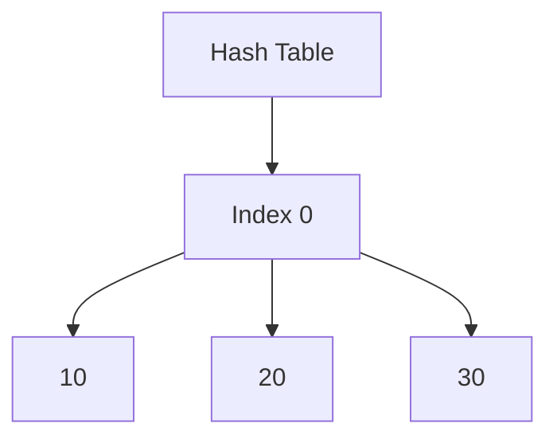
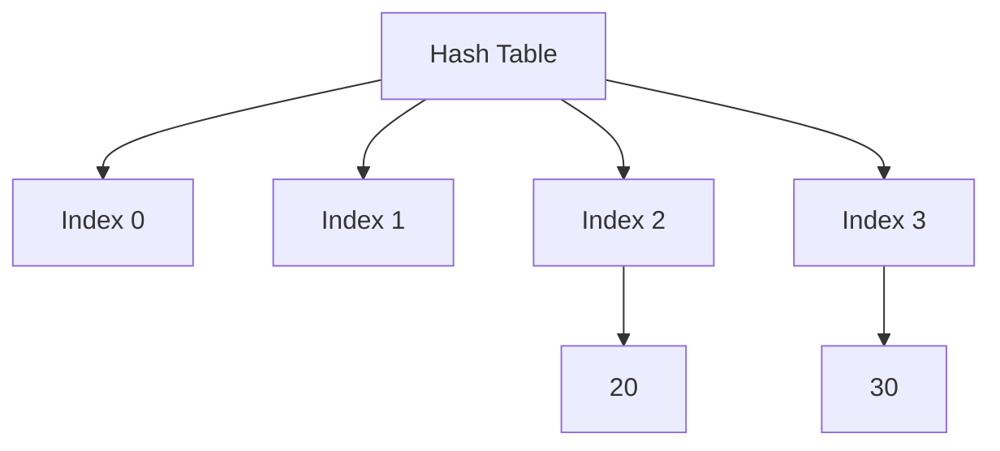
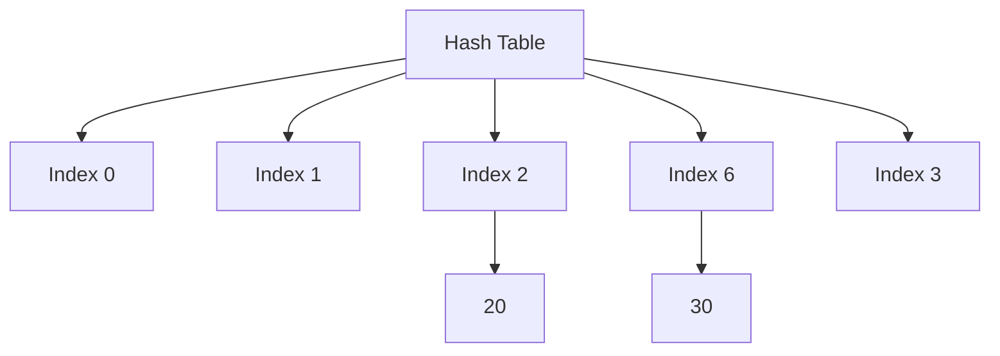

# Hash Tables

A **Hash Table** is a data structure that provides an efficient way to store and retrieve data using key-value pairs. The underlying mechanism relies on a **hash function** that maps keys to specific indices in an array, ensuring fast access times.

## Key Characteristics

- **Time Complexity**:
  - Average-case: O(1) for insertion, deletion, and lookup.
  - Worst-case: O(n) when collisions are not handled properly.
- **Space Complexity**: O(n), where n is the number of entries.
- **Applications**:
  - Caching (e.g., LRU Cache)
  - Databases (e.g., indexing)
  - Implementing associative arrays and sets

## Components of a Hash Table

1.  **Array**: The underlying data storage.
2.  **Hash Function**: Converts a key into an array index.
3.  **Collision Handling Mechanism**: Resolves conflicts when multiple keys hash to the same index.

## Hash Functions

A **Hash Function** should have the following properties:

1.  **Deterministic**: Same input always produces the same output.
2.  **Uniformity**: Distributes keys uniformly across the array.
3.  **Efficiency**: Fast to compute.
4.  **Minimization of Collisions**: Reduces instances of keys hashing to the same index.

Popular Hash Functions:

1.  **Modulo Operation**: Simplest method, computes `index = hash(key) % table_size`. However, not always ideal for non-uniform data distributions.
2.  **Multiplicative Hash Function**: Uses multiplication and fractional parts to achieve better uniformity (e.g., `index = floor(table_size * frac(hash(key) * A))`, where `A` is a constant).
3.  **Cryptographic Hash Functions**:
    - Examples: MD5, SHA-256.
    - Ensure strong collision resistance.
    - Slower but crucial for security-sensitive applications like digital signatures.
4.  **Universal Hashing**: Family of hash functions designed to minimize collisions across any set of keys.
5.  **MurMurHash**:
    - Non-cryptographic hash function known for high speed and uniformity.
    - Frequently used in distributed systems like Cassandra.
6.  **CityHash**:

    - Optimized for speed and commonly used in database indexing.
    - Developed by Google.

7.  **XXHash**:

    - Extremely fast, designed for non-cryptographic use cases.
    - Popularized by Facebook, with the latest version being XXHash3, offering high-speed hashing with excellent distribution and low collision rates.

## Collision Handling Mechanisms

Hash functions can produce the same index for different keys, resulting in a **collision**. Effective collision handling is crucial for maintaining the performance and integrity of a hash table.

Two common techniques for handling collisions are **chaining** and **open addressing**.

### Chaining

**Chaining** resolves collisions by storing all elements with the same hash index in a separate data structure, typically a linked list or a dynamic array. Each index of the hash table contains a pointer to the head of the chain.

#### Steps:

1. Compute the hash index using the hash function.
2. If the index is empty, insert the element there.
3. If the index already contains a chain, append the new element to the chain.

#### Example:

When inserting values `10`, `20`, and `30` into a hash table of size 10, all map to index `0` (assuming `hash(key) = key % size`):



#### Advantages:

- Simple to implement.
- Hash table size doesn't limit the number of elements (beyond memory constraints).
- Works well with a good hash function and low load factor.

#### Disadvantages:

- Performance degrades if chains grow long, especially with poor hash functions.
- Extra memory overhead for pointers or additional data structures.

#### Optimization Tips:

- Use a balanced tree or dynamic array instead of a linked list for better performance.
- Keep the load factor low (e.g., rehash when the load factor exceeds a threshold).

### Open Addressing

In **open addressing**, all elements are stored directly within the hash table array. When a collision occurs, the algorithm searches for the next available slot according to a specific probing sequence.

#### Types of Probing:

**1. Linear Probing:**

- If a collision occurs, incrementally check the next slot (i.e., $$ \text{index} = (\text{hash} + i) \% \text{size} $$).
- For example, if the hash table size is `10` and `hash(20) = 2`, inserting `30` (also mapping to `2`) results in probing the next available slot.



##### Advantages:

- Simple to implement.
- Efficient for low load factors.

##### Disadvantages:

- **Clustering:** A chain of consecutive filled slots increases the probability of further collisions.

**2. Quadratic Probing:**

- Uses a quadratic function to compute the next slot: $$ \text{index} = (\text{hash} + c_1 \cdot i^2 + c_2 \cdot i) \% \text{size} $$.
- For example, if `hash(20) = 2`, the next slots probed would be \( (2 + 1^2) \% 10 \), \( (2 + 2^2) \% 10 \), and so on.



##### Advantages:

- Reduces clustering compared to linear probing.

##### Disadvantages:

- May leave gaps in the table, reducing overall efficiency.

**3. Double Hashing:**

- Uses a secondary hash function to determine the step size for probing: $$ \text{index} = (\text{hash}\_1 + i \cdot \text{hash}\_2) \% \text{size} $$.
- The second hash function ensures the probing sequence is more distributed.
- For example, with `hash1(key) = key % size` and `hash2(key) = 7 - (key % 7)`, inserting values follows this pattern:


##### Advantages:

- Reduces clustering significantly, making it one of the most efficient methods.

##### Disadvantages:

- More complex than other probing techniques.

### Comparison of Chaining and Open Addressing

| Feature                                  | Chaining                         | Open Addressing                  |
| ---------------------------------------- | -------------------------------- | -------------------------------- |
| **Storage**                              | Requires extra memory for chains | Stores all elements in the table |
| **Load Factor**                          | Can exceed 1                     | Must remain below 1              |
| **Deletion**                             | Easy                             | Complex                          |
| **Cache Performance**                    | Poor (pointer traversal)         | Better (contiguous memory)       |
| **Performance with Poor Hash Functions** | Degrades significantly           | Degrades significantly           |

## Static Hash Tables

Static hash tables have a fixed size and do not allow resizing.

- **Use Cases**:

  - Applications where the maximum number of entries is known in advance.
  - Memory-constrained environments.

- **Advantages**:

  - Simple to implement.
  - No overhead for resizing.

- **Disadvantages**:

  - Inefficient if size is underestimated (causing high collision rates).
  - Wasted space if size is overestimated.

### Linear Probing

Linear probing is a technique used in static hash tables to resolve collisions. If a collision occurs, the algorithm searches the next available slot in a sequential manner.

- **Insertion**:

  1.  Compute the hash index for the key.
  2.  If the slot is occupied, probe the next slot until an empty one is found.
  3.  Insert the key-value pair into the empty slot.

- **Search**:

  1.  Compute the hash index for the key.
  2.  Check the slot. If the key is not found, continue probing sequentially until the key is located or an empty slot is encountered.

- **Deletion**:

  1.  Locate the key using the search process.
  2.  Mark the slot as deleted (use a special marker to distinguish it from an empty slot).
  3.  During search and insertion, skip over marked slots but recheck their sequence for proper key relocation.

- **Advantages**:

  - Simple to implement.
  - High cache performance due to locality of reference.

- **Disadvantages**:

  - Clustering: Consecutive slots may become filled, degrading performance.

#### Example Implementation

```python
class LinearProbingHashTable:
    def __init__(self, size):
        self.size = size
        self.table = [None] * size

    def hash_function(self, key):
        return hash(key) % self.size

    def insert(self, key, value):
        index = self.hash_function(key)
        original_index = index
        while self.table[index] is not None:
            if self.table[index][0] == key:
                self.table[index] = (key, value)
                return
            index = (index + 1) % self.size
            if index == original_index:  # Table is full
                raise Exception("Hash table is full")
        self.table[index] = (key, value)

    def search(self, key):
        index = self.hash_function(key)
        original_index = index
        while self.table[index] is not None:
            if self.table[index][0] == key:
                return self.table[index][1]
            index = (index + 1) % self.size
            if index == original_index:
                return None
        return None

    def delete(self, key):
        index = self.hash_function(key)
        original_index = index
        while self.table[index] is not None:
            if self.table[index][0] == key:
                self.table[index] = None
                return True
            index = (index + 1) % self.size
            if index == original_index:
                return False
        return False
```

### Cuckoo Hashing

Cuckoo hashing uses two or more hash functions and two tables to resolve collisions. Each key can reside in one of several possible locations, and if all are occupied, an eviction process is triggered.

- **Insertion**:

  1.  Compute the possible hash indices for the key.
  2.  If one slot is empty, place the key there.
  3.  If all slots are occupied, evict an existing key and rehash it to its alternative location. Repeat the process until all keys are placed.

- **Search**:

  1.  Compute the possible hash indices for the key.
  2.  Check each index; if the key is found, return its value.

- **Deletion**:

  1.  Compute the possible hash indices for the key.
  2.  Remove the key if it exists in any of the indices.

- **Advantages**:

  - Constant worst-case lookup time.
  - Simple collision handling.

- **Disadvantages**:

  - High insertion cost due to potential multiple evictions.
  - Inefficient at high load factors.

#### Example Implementation

```py
class CuckooHashTable:
    def __init__(self, size):
        self.size = size
        self.table1 = [None] * size
        self.table2 = [None] * size

    def hash1(self, key):
        return hash(key) % self.size

    def hash2(self, key):
        return (hash(key) // self.size) % self.size

    def insert(self, key, value):
        for _ in range(self.size):
            index1 = self.hash1(key)
            if self.table1[index1] is None:
                self.table1[index1] = (key, value)
                return

            key, value, self.table1[index1] = self.table1[index1][0], self.table1[index1][1], (key, value)

            index2 = self.hash2(key)
            if self.table2[index2] is None:
                self.table2[index2] = (key, value)
                return

            key, value, self.table2[index2] = self.table2[index2][0], self.table2[index2][1], (key, value)

        raise Exception("Rehash required")

    def search(self, key):
        index1 = self.hash1(key)
        if self.table1[index1] and self.table1[index1][0] == key:
            return self.table1[index1][1]

        index2 = self.hash2(key)
        if self.table2[index2] and self.table2[index2][0] == key:
            return self.table2[index2][1]

        return None

    def delete(self, key):
        index1 = self.hash1(key)
        if self.table1[index1] and self.table1[index1][0] == key:
            self.table1[index1] = None
            return True

        index2 = self.hash2(key)
        if self.table2[index2] and self.table2[index2][0] == key:
            self.table2[index2] = None
            return True

        return False
```

## Dynamic Hash Tables

Dynamic hash tables can grow or shrink as the number of entries changes, typically by resizing the underlying array.

### Resizing Mechanism

1.  When the **load factor** exceeds a threshold (e.g., 0.75), the table is resized.
2.  Create a new array (typically double the size).
3.  Rehash all keys into the new array.

- **Load Factor**: Ratio of the number of entries to the table size.

  - Load Factor = Number of Entries / Table Size

### Collision Handling in Dynamic Hash Tables

1.  **Chained Hashing**:

    - Uses linked lists (or other data structures like trees) to handle collisions.
    - **Add**:

      1.  Compute the hash index.
      2.  Insert the key-value pair into the linked list at that index.

    - **Get**:

      1.  Compute the hash index.
      2.  Traverse the linked list at that index to find the key.

    - **Delete**:

      1.  Compute the hash index.
      2.  Remove the key from the linked list.

2.  **Open Addressing with Linear Probing**:

    - Stores entries directly in the array, probing for the next available slot if a collision occurs.
    - **Add**:

      1.  Compute the hash index.
      2.  If the slot is occupied, probe the next slot sequentially until an empty slot is found.
      3.  Insert the key-value pair.

    - **Get**:

      1.  Compute the hash index.
      2.  Check sequentially until the key is found or an empty slot is reached.

    - **Delete**:

      1.  Locate the key and mark the slot as deleted (special marker).

3.  **Double Hashing**:

    - Uses a second hash function to determine the probe sequence.
    - Reduces clustering compared to linear probing.

### Advanced Dynamic Hashing Techniques

1.  **Extensible Hashing**:

    - Uses a directory of pointers to buckets and allows the hash table to grow incrementally without full rehashing.
    - **Add**:

      1.  Compute the hash and map it to a bucket via a directory.
      2.  If the bucket overflows, split the bucket and redistribute the entries.
      3.  Update the directory to point to the new buckets.

    - **Get**:

      1.  Use the directory and hash value to locate the bucket.
      2.  Search within the bucket for the key.

    - **Delete**:

      1.  Locate the bucket and remove the key.
      2.  Optionally merge buckets if underutilized.

    - **Advantages**:

      - Grows incrementally, avoiding full rehashing.
      - Efficient for disk-based storage systems.

2.  **Linear Hashing**:

    - Incrementally grows the hash table by splitting buckets dynamically.
    - **Add**:

      1.  Compute the hash and locate the bucket.
      2.  If the bucket overflows, split the bucket and redistribute its contents.
      3.  Increase the range of the hash function as needed.

    - **Get**:

      1.  Compute the hash and locate the bucket.
      2.  Search within the bucket for the key.

    - **Delete**:

      1.  Locate the bucket and remove the key.

    - **Advantages**:

      - Avoids global resizing.
      - Gradual growth reduces performance spikes.

3.  **Chained Hashing with Dynamic Buckets**:

    - Combines chained hashing with buckets that can grow dynamically.
    - Useful for applications with large key-value stores and unpredictable growth.

### Sample Python Code

#### Chained Hashing

```py
class ChainedHashTable:
    def __init__(self, size):
        self.size = size
        self.table = [[] for _ in range(size)]

    def _hash(self, key):
        return hash(key) % self.size

    def add(self, key, value):
        index = self._hash(key)
        for pair in self.table[index]:
            if pair[0] == key:
                pair[1] = value
                return
        self.table[index].append([key, value])

    def get(self, key):
        index = self._hash(key)
        for pair in self.table[index]:
            if pair[0] == key:
                return pair[1]
        return None

    def delete(self, key):
        index = self._hash(key)
        self.table[index] = [pair for pair in self.table[index] if pair[0] != key]

# Example usage
cht = ChainedHashTable(10)
cht.add("key1", "value1")
print(cht.get("key1"))  # Output: value1
cht.delete("key1")
print(cht.get("key1"))  # Output: None
```

#### Linear Probing

```py
class LinearProbingHashTable:
    def __init__(self, size):
        self.size = size
        self.table = [None] * size

    def _hash(self, key):
        return hash(key) % self.size

    def add(self, key, value):
        index = self._hash(key)
        start_index = index
        while self.table[index] is not None and self.table[index][0] != key:
            index = (index + 1) % self.size
            if index == start_index:
                raise Exception("Hash table is full")
        self.table[index] = (key, value)

    def get(self, key):
        index = self._hash(key)
        start_index = index
        while self.table[index] is not None:
            if self.table[index][0] == key:
                return self.table[index][1]
            index = (index + 1) % self.size
            if index == start_index:
                break
        return None

    def delete(self, key):
        index = self._hash(key)
        start_index = index
        while self.table[index] is not None:
            if self.table[index][0] == key:
                self.table[index] = None
                return
            index = (index + 1) % self.size
            if index == start_index:
                break

# Example usage
lht = LinearProbingHashTable(10)
lht.add("key1", "value1")
print(lht.get("key1"))  # Output: value1
lht.delete("key1")
print(lht.get("key1"))  # Output: None
```

### Advantages of Dynamic Hash Tables

- **Scalability**: Automatically adjusts to changes in data volume.
- **Efficient Memory Utilization**: Expands or contracts based on load.
- **Improved Performance**: Reduces collision rates through resizing and advanced techniques.

### Disadvantages of Dynamic Hash Tables

- **Resizing Overhead**: Resizing operations are expensive (O(n)).
- **Complexity**: Implementation is more complex compared to static hash tables.
- **Temporary Performance Degradation**: Resizing causes brief performance drops.

### Comparison: Static vs Dynamic Hash Tables

| Feature               | Static Hash Table       | Dynamic Hash Table           |
| --------------------- | ----------------------- | ---------------------------- |
| **Size**              | Fixed                   | Variable                     |
| **Resizing**          | Not applicable          | Supported (costly operation) |
| **Memory Efficiency** | May waste space         | More efficient               |
| **Use Cases**         | Predictable entry count | Unpredictable entry          |
