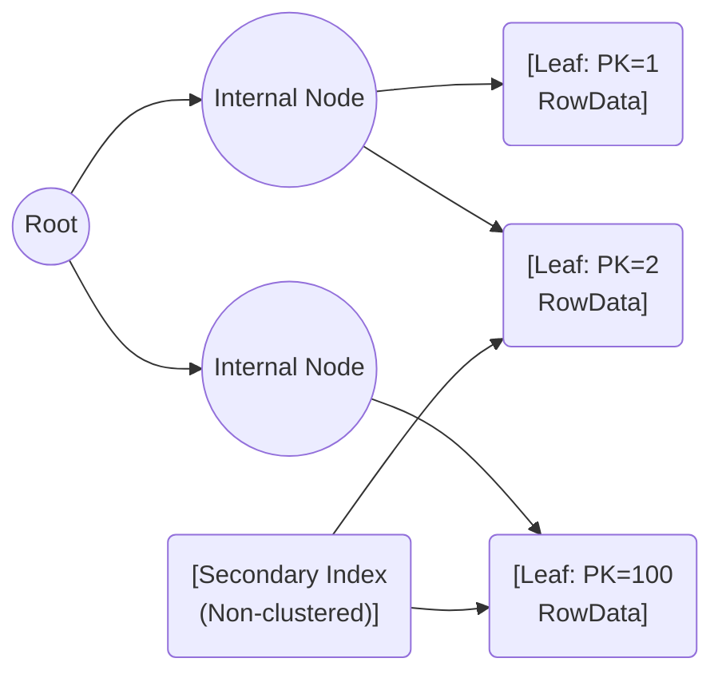

# Index Organized Storage

Index-Organized Storage (IOS) is a storage technique in databases where data is stored directly in the index structure itself. Unlike traditional tables where data and indexes are stored separately, an index-organized table (IOT) combines both the data and index, allowing for efficient access patterns and performance benefits in specific use cases.

Here's a breakdown of the key aspects of index-organized storage:

## Concept and Structure

- In a standard relational database, tables store data rows, and separate indexes are created on columns to speed up search operations.
- In an index-organized table, rows are stored in a sorted order based on a primary key or index, effectively combining data storage and indexing into a single structure.
- This setup allows the database to access rows using the primary key directly without needing an additional lookup from an index to the actual data location.

### Quick Example

In a clustered index (index-organized) table, the leaf nodes of the primary key's B-tree contain the full row. A non-clustered secondary index stores the secondary key and a pointer (the primary key) to the clustered index leaf where the row is stored. This lets the DBMS quickly fetch the row by first using the secondary index to find the primary key then looking up that primary key in the clustered index (which already stores the row data).

## Primary Key-Based Organization

- The primary key is the primary means of organizing and accessing data in index-organized storage.
- Rows are stored in a B-tree index structure, sorted by the primary key, enabling fast retrieval based on the primary key value.

### Clustered vs Heap+Index

- Clustered/Index-Organized: The data is stored in-order in the index (the primary key's B-tree leaf nodes). Good for PK lookups and range scans.
- Heap + Secondary Index: Data is in a heap data structure (unordered) and indexes store pointers to rows (RID or physical location). Secondary index lookups require an extra fetch.

Where a database supports both, like InnoDB, the clustered index gives faster PK lookups, whereas secondary indexes store the PK instead of the physical row pointer.

## Storage and Retrieval Efficiency

- Since data is stored in the index, the database can access it in fewer steps, reducing I/O overhead and improving retrieval times, especially for primary key-based queries.
- This organization is ideal for applications where data is frequently queried by primary key or needs to be retrieved in sorted order.

## Reduced Redundancy and Storage Footprint

- In index-organized tables, there’s no need for a separate storage area for data rows and indexes, reducing the storage footprint.
- However, there is a trade-off: the insertion, updating, and deletion of records can be slower, as maintaining the sorted B-tree structure requires additional operations.

## Use Cases

- **OLTP (Online Transaction Processing) Systems:** IOTs are useful where fast, predictable performance is required for key-based access patterns, making them ideal for transaction-heavy systems.
- **Lookups and Range Scans:** Since data is sorted by primary key, IOTs are effective for range scans and ordered data retrieval.
- **Caching and Redundant Index Removal:** By removing redundant storage, they can be used in scenarios where caching at an index level is desired.

## Benefits

- **Performance Gains for Key-Based Queries:** Primary key lookups and range queries are faster due to the combined index and data storage structure.
- **Efficient Space Usage:** Reduces the storage footprint by eliminating the need for separate data and index structures.
- **Reduced I/O Overhead:** With data stored in the index, there’s no need for additional steps to locate the data, resulting in fewer I/O operations.

## Limitations

- **Slower Insert and Update Operations:** Maintaining a sorted structure for new or modified entries can impact performance in systems with heavy insert/update operations.
- **Limited Flexibility for Non-Primary Key Access:** Index-organized storage is optimized for primary key access, so queries not involving the primary key may be slower.
- **Complex Maintenance:** Managing fragmentation and rebalancing the index tree can be complex and may require regular maintenance or optimization.

## Implementation Details

- Primary Key constraint: Index-organized storage requires a primary key to physically order rows and usually requires it to be unique (or the database enforces uniqueness when clustering).
- Row size considerations: Very large rows or wide primary keys can bloat the clustered index and increase I/O when reading index pages; overflow/external storage is often used for huge attributes (see [Tuple Oriented Storage](./tuple-oriented-storage.md) for details).
- Secondary indexes: Secondary (non-clustered) indexes must store the primary key as a pointer to the clustered index leaf. If the secondary index contains all columns needed by a query (a covering index), the lookup can be satisfied by the secondary index alone — no additional PK fetch needed.
- Auto-increment / insert locality: Sequential primary key inserts (like auto-increment) tend to be efficient because new rows append, minimizing page splits and fragmentation; random PK inserts cause more page splits.

## Best Practices

- Choose a compact primary key: Smaller primary keys reduce index size and pointer overhead in secondary indexes.
- Avoid clustering on frequently-updated columns: Clustered index maintenance can add overhead when the clustered key changes.
- Use covering secondary indexes where possible for read-heavy workloads: This reduces extra lookups into the clustered index.
- Be cautious about very large variable-length attributes in clustered indexes; consider using overflow/external storage.

## When not to use Index-Organized Storage

- High insert/update loads with random keys: If the primary workload is heavy inserts with random keys (e.g., UUIDs), page splits and rebalancing can severely impact write throughput.
- Wide primary keys: Very wide keys (long string-based keys) increase storage and I/O for both the clustered index and any secondary indexes that include the primary key as a pointer.

## Examples of Index-Organized Storage in Practice

- **Oracle Database:** Oracle supports index-organized tables (IOTs), allowing for efficient primary key-based data storage.
- **MySQL:** MySQL’s InnoDB storage engine uses a clustered index to organize tables by primary key, resembling index-organized storage.
