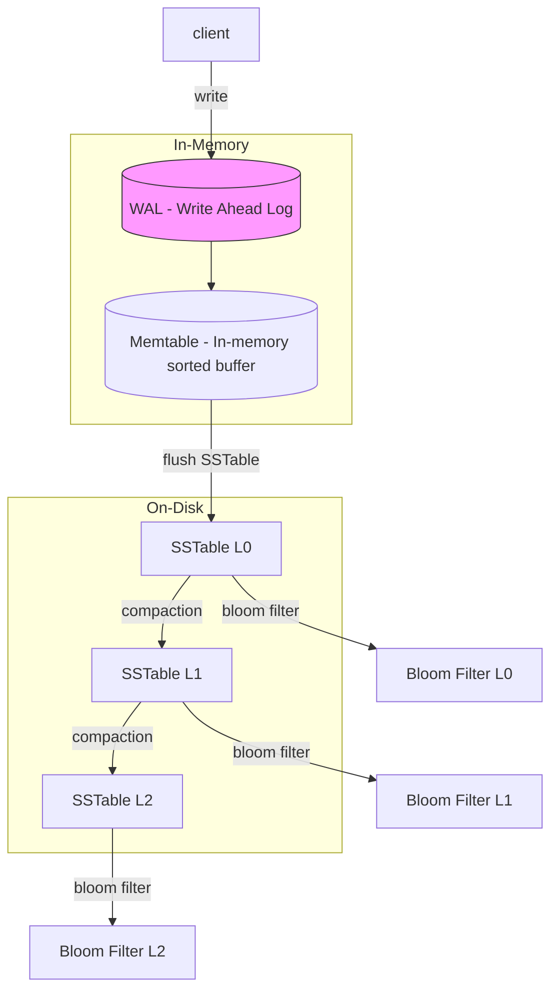
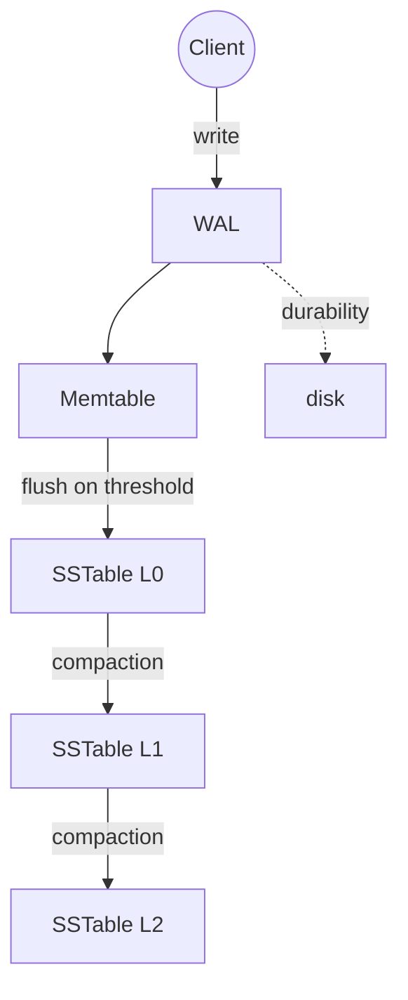
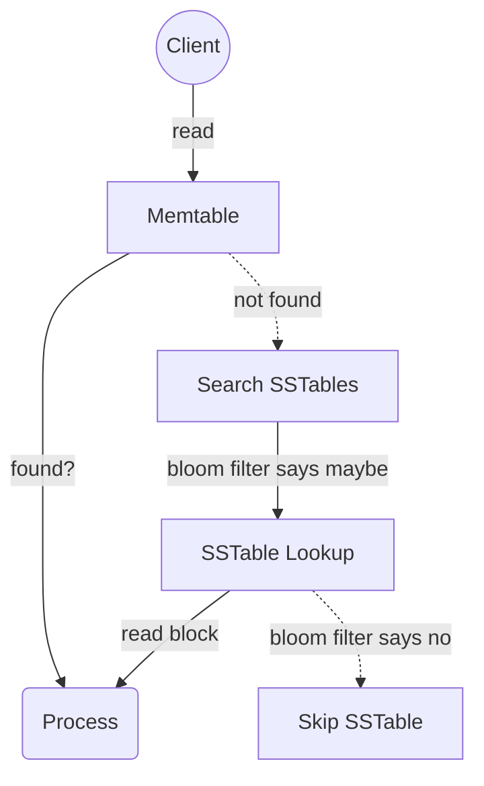

# Log-Structured Merge Tree

<!-- markdownlint-disable MD024 -->

Log-Structured Merge (LSM) trees are a fundamental data structure used in database storage, particularly for handling high-write workloads efficiently. Here’s a breakdown of key concepts and considerations when working with LSM storage:

## Concept and Structure

- **Write-Optimized Data Structure**: LSM trees are designed to optimize write operations by writing changes sequentially in memory (to a structure known as a memtable), instead of making random writes directly to disk.
- **Levels and Compaction**: Data is stored in multiple levels, and when the memtable reaches a certain size, it’s flushed to disk as a new file (often called an SSTable). As these files accumulate, they are periodically merged and compacted to reduce redundancy, delete obsolete data, and keep read performance efficient.

## Write Operation (Write Path)

### Memtable Insertion

- Incoming writes (e.g., inserts, updates, deletes) are first placed into a **memtable**—an in-memory, sorted data structure.
- Writes are handled efficiently in memory, as they avoid random disk I/O.

### Write-Ahead Log (WAL)

- Before data is added to the memtable, it’s written to a **write-ahead log (WAL)**.
- This ensures durability, as the WAL records each write operation sequentially on disk. If there’s a system crash, the WAL allows the database to recover any uncommitted data.

### Flushing the Memtable

- When the memtable reaches a configured size, it’s flushed to disk as an immutable, sorted file called an **SSTable** (Sorted String Table).
- This flush process is a sequential write, which is faster and reduces wear on the disk.

### Compaction

- Over time, multiple SSTables are created, potentially containing outdated or duplicate records.
- **Compaction** merges SSTables, removes deleted and old data, and organizes records for better read efficiency.
- This reduces the number of files on disk, balancing storage space with performance.

### Write Amplification

- Frequent compactions increase write amplification, as data may be written to disk multiple times.
- However, this process ensures that queries remain efficient and storage space is managed effectively.

## Read Operation (Read Path)

### Lookup in Memtable

- When a read request arrives, the database first checks the **memtable**.
- Since the memtable is in memory and sorted, it can be quickly searched for the requested key.

### Checking SSTables on Disk

- If the key isn’t found in the memtable, the search continues in the **SSTables** on disk.
- SSTables are stored as a series of files on disk, typically organized by levels or tiers to manage access patterns.

### Bloom Filters

- Each SSTable has an associated **Bloom filter**. This probabilistic data structure helps quickly determine whether a key might exist in a specific SSTable.
- The Bloom filter check minimizes unnecessary reads by eliminating SSTables that don’t contain the requested key.

### Searching SSTables

- If the Bloom filter indicates that a key might exist in an SSTable, the database reads the relevant SSTable(s).
- Within each SSTable, data is sorted, allowing binary search, which is efficient for finding keys.

### Merging Results

- In cases where the key exists in multiple SSTables (due to updates or deletes), the database merges the results, applying any updates or deletes as necessary.
- The latest version of the record is returned to the user.

### Read Amplification

- Searching across multiple SSTables can lead to **read amplification**, meaning the system may need to access several files to retrieve a single record.
- Compaction mitigates this by merging SSTables over time, reducing the number of files that must be checked for each read.

## Compaction

Compaction merges multiple SSTables into fewer files, removing deleted or outdated entries and thus reducing storage overhead.

### Strategies

- _Leveling_: SSTables are organized into levels, and compaction involves moving data from one level to the next.
- _Size-Tiered_: Smaller SSTables are periodically merged into larger ones, grouping similar data together to improve access patterns.

### When compaction runs

- **Memtable flush triggers**: After memtable flushes, new SSTables land in Level 0; when L0 or any level accumulates a threshold number of SSTables, compaction is triggered.
- **Size thresholds**: Compaction is often triggered when the total size of a level exceeds a configured size ratio or threshold compared to the previous level (e.g., Level 1 limit).
- **Tombstone/obsolete ratio**: If an SSTable contains a high ratio of deleted/obsolete entries (tombstones), compaction will run to clean it up.
- **Manual/maintenance triggers**: Administrators can also trigger compaction manually for maintenance, or systems can run background compactions periodically.

### Performance issues with compaction

- **Write amplification**: Compaction rewrites data across levels; depending on strategy, compaction increases the amount of data written to disk (K times), which is write amplification.
- **I/O contention and latency spikes**: Compaction consumes disk I/O and CPU. Without throttling, compaction can cause latency spikes for foreground operations.
- **CPU / Memory usage**: Compaction requires CPU to merge and rewrite SSTables and memory for buffering; concurrent compactions increase resource usage.
- **Read amplification during compaction**: Compactions can temporarily increase read amplification if background compaction runs while the read pattern needs files being compacted.
- **Resource balancing trade-offs**: Systems must tune compaction threads, throttle I/O, or schedule compaction during off-peak periods to minimize impact.

### Mitigations and tuning

- **Throttle compaction**: Limit compaction I/O throughput to reduce across-the-board impact; allow concurrent compactions with limited threads.
- **Adaptive compaction**: Adjust compaction speed based on system load or target latency SLAs.
- **Compaction policies**: Use leveling for stable read performance (lower read amplification) at the cost of higher write amplification; use size-tiered when aiming to reduce write amplification.
- **Prioritize hot data**: Compaction can prioritize SSTables with high tombstone ratios or those covering hot keys to reduce read/write impact.
- **Incremental or parallel compaction**: Stagger compactions or split work into smaller merges to reduce spikes.

## Performance Characteristics

- **Efficient Writes**: LSM trees are excellent for high-throughput writes, as they avoid random I/O by writing data in a log-structured fashion.
- **Read Amplification**: Due to multiple levels and compaction, LSM trees can have higher read amplification, meaning reads may need to access several files to retrieve a single key.
- **Write Amplification**: Frequent compaction results in write amplification, which is a trade-off for achieving better read performance over time.

## Use Cases

- **High-Write Workloads**: LSM trees are ideal for applications with high write demands, like logging, metrics storage, and real-time data analytics.
- **NoSQL Databases**: Popular databases like Cassandra, HBase, and RocksDB leverage LSM trees for their storage engines due to their write-optimized design.

## Considerations and Trade-Offs

- **Storage Overhead**: Frequent flushing and multiple levels of data storage can result in significant storage overhead.
- **Latency Variability**: Compaction can cause spikes in latency, as it is a resource-intensive operation.
- **Configuration Complexity**: Balancing compaction frequency, SSTable size, and the number of levels is crucial for optimizing performance in an LSM-based database system.

## Alternatives and Comparisons

- **B-Trees**: Unlike LSM trees, B-trees optimize for read-heavy workloads by storing data in a hierarchical structure that allows efficient random reads but requires more random I/O for writes.
- **Hybrid Approaches**: Some databases, like MongoDB, offer hybrid options to use either B-trees or LSM-based storage, allowing flexibility based on the workload.

## MemTable Data Structure

The MemTable, an in-memory structure, is optimized for fast writes and efficient lookups. It typically uses:

- **Red-Black Tree or AVL Tree**: Balanced binary search trees like red-black trees or AVL trees are commonly used for the MemTable. They keep data sorted, allowing efficient in-order traversal and enabling fast reads and writes (in (O(log n)) time).
- **Skip List**: Some implementations use skip lists as an alternative to trees, especially in write-heavy databases. Skip lists provide probabilistically balanced structure, making inserts, deletes, and lookups efficient (also (O(log n)) time complexity) while being simpler to implement and manage in concurrent environments.

## SSTable Data Structure

An SSTable, a file stored on disk, is an immutable and sorted structure optimized for sequential read and efficient range queries. Its core components include:

- **Sorted Array (or Block-Ordered Data)**:
  - Each SSTable is essentially a sorted array of key-value pairs or records stored sequentially on disk. The entire structure is sorted by keys, allowing efficient binary search within blocks.
  - **Indexing by Key**: Often, SSTables include a simple index (usually loaded into memory) that allows quick lookups by pointing to blocks or offsets within the file for a given key.
- **Data Blocks**:
  - SSTables are divided into data blocks (often 4 KB or 8 KB in size), each containing a subset of sorted records.
  - **Block-Based Indexing**: To reduce I/O operations, an in-memory index is maintained for each SSTable. It contains pointers to the beginning of each block within the SSTable, allowing faster access to specific blocks on disk.
- **Bloom Filter**:
  - SSTables often include a Bloom filter, stored in memory, to quickly check if a specific key might be present in the SSTable.
  - This filter allows the system to skip unnecessary I/O operations by eliminating SSTables that definitely don’t contain the queried key.

## LSM Tree Examples

### Key-Value and NoSQL Databases

### Cassandra

- _Type_: Distributed NoSQL database.
- _Usage_: Cassandra is known for its high write and read scalability, making it a popular choice for applications that require high availability and massive amounts of data.

### HBase

- _Type_: Columnar NoSQL database built on top of Hadoop.
- _Usage_: Used for managing large amounts of sparse data, HBase uses LSM trees to support fast writes and high data throughput.

### RocksDB

- _Type_: Embedded key-value store.
- _Usage_: Optimized for fast storage with LSM trees, RocksDB is used within larger systems (like MySQL or Kafka) to provide efficient storage and is popular in storage-heavy applications.

### LevelDB

- _Type_: Embedded key-value store (developed by Google).
- _Usage_: Uses LSM trees to support fast write operations. It’s often used in desktop and mobile applications due to its simplicity and lightweight design.

### ScyllaDB

- _Type_: NoSQL database (Cassandra-compatible).
- _Usage_: ScyllaDB is designed for high-performance and low-latency workloads. It uses LSM trees along with a unique architecture that optimizes it for modern hardware.

### DynamoDB (Amazon)

- _Type_: Fully managed NoSQL database by AWS.
- _Usage_: DynamoDB is often backed by an LSM-like storage engine optimized for high-write and low-latency applications in a fully managed cloud environment.

### Bigtable (Google)

- _Type_: Columnar NoSQL database (managed service on GCP).
- _Usage_: Known for its scalability and high throughput, Bigtable is used for time-series data, IoT data, and analytical workloads that require efficient write capabilities.

### Relational Databases

### MyRocks (MySQL with RocksDB)

- _Type_: Relational database (MySQL variant).
- _Usage_: MyRocks is a MySQL storage engine using RocksDB (which uses LSM trees). It’s designed for high-write applications where reducing storage space and write amplification is critical.

### CockroachDB

- _Type_: Distributed SQL database.
- _Usage_: Uses LSM trees for its storage layer to manage distributed data, allowing it to handle heavy write operations and maintain high availability across regions.

### TiDB

- _Type_: Distributed SQL database.
- _Usage_: TiDB uses an LSM-based storage layer (with RocksDB or TiKV) for high-performance and distributed data management, balancing SQL compatibility with NoSQL performance.

## **3. Time-Series Databases**

### InfluxDB

- _Type_: Time-series database.
- _Usage_: Known for handling high-throughput time-series data, InfluxDB uses an LSM-based storage engine to optimize for frequent writes typical in monitoring, IoT, and analytics applications.

### TimescaleDB

- _Type_: Time-series database built on PostgreSQL.
- _Usage_: While PostgreSQL uses a B-tree structure by default, TimescaleDB includes LSM options and optimizations for handling high-frequency data insertions in time-series data.

### **4. Search and Logging Databases**

### Elasticsearch

- _Type_: Search and analytics engine.
- _Usage_: While Elasticsearch primarily uses inverted indices, its underlying data storage and segment merging incorporate LSM-like principles to handle high-ingest data efficiently.

### Splunk

- _Type_: Logging and analytics platform.
- _Usage_: Splunk uses an LSM-inspired model for its data storage to support high-speed log ingestion and indexing, essential for real-time analytics and monitoring.

### Log-Structured File Systems (e.g., OpenTSDB)

- _Type_: Time-series storage on HBase.
- _Usage_: OpenTSDB leverages HBase's LSM tree structure to store and retrieve large volumes of time-series data for metrics tracking and monitoring purposes.

## FAQ: LSM Tree Sizing and Tuning

### How do I select the number of levels?

- The number of levels is determined primarily by your total on-disk dataset size (S), the size of your base level or memtable flush size (M), and the growth factor between levels (T). As a rule-of-thumb for leveling compaction:

  L ≈ ceil(log_T(S / M))

  This gives a rough estimate — actual systems may treat Level 0 differently and use size-limits per level or thresholds for compaction.

- Practical guidance:
  - Choose the memtable / base SSTable size small enough to avoid large L0 write stalls.
  - Use a T value (commonly 8–10 for leveling) to make level sizes grow geometrically and keep levels manageable.

### How do I choose level sizes and the growth factor (T)?

- Strategy:

  - Choose a base level size (often determined by memtable size and an L0 cap).
  - Select a growth factor T where each level is roughly T times the previous level.
  - Larger T reduces the number of levels (and total compaction passes) but increases individual level sizes and can increase read costs for certain patterns.

- Example: If your base level (L1) target is 1GB and T=10, then L2 target is 10GB, L3 is 100GB and so on.

- Tuning trade-offs:
  - Larger T -> fewer levels -> potentially lower write amplification -> larger compaction work per event -> potentially higher per-compaction latency impact.
  - Smaller T -> more levels -> increased write amplification -> smaller incremental compaction workload -> possibly better read locality.

### Additional practical tips

- Use the library defaults as a starting point (RocksDB default compaction settings and T ~ 10 are sensible for many workloads).
- Monitor S, memtable size, L0 file count, and compaction throughput. Tune L0 size limits and compaction concurrency before changing T.
- Always test under realistic workloads; I/O characteristics and storage type (SSD vs spinning disks) affect optimal settings.
