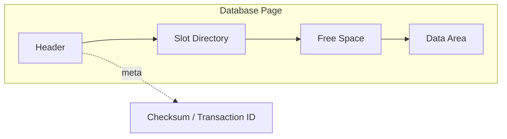
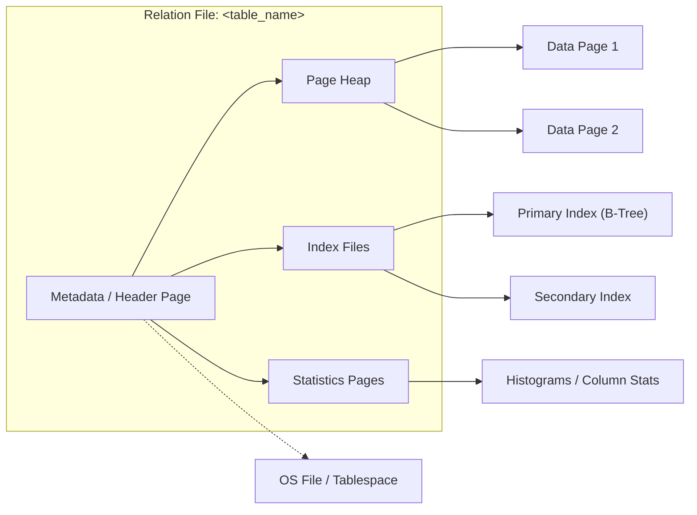
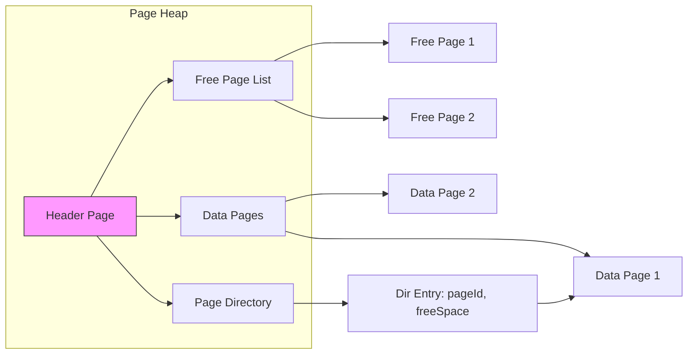
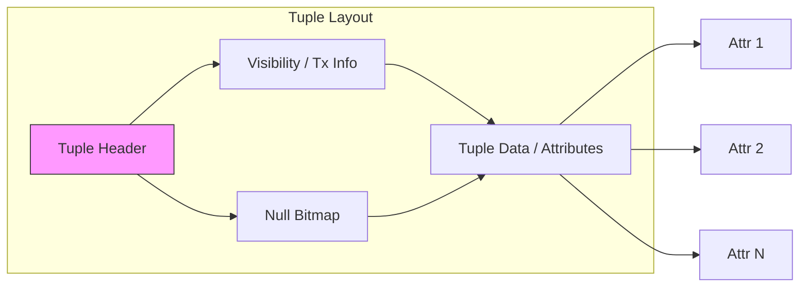

# Tuple Oriented Storage

:::tip[Status]

This note is complete, reviewed, and considered stable.

:::

## Storage Manager

The Storage Manager is a critical component of a Database Management System (DBMS) responsible for managing the physical storage and retrieval of data. It acts as an interface between the DBMS and the underlying storage devices, such as hard disk drives (HDDs) or solid-state drives (SSDs).

**Key Functions of the Storage Manager:**

- **Data Storage:** Allocates physical storage space for data and indexes.
- **Data Retrieval:** Retrieves data from storage based on user queries or application requests.
- **Data Modification:** Updates, inserts, and deletes data within the storage system.
- **Concurrency Control:** Ensures that multiple transactions can access and modify data simultaneously without conflicts.
- **Recovery Management:** Recovers the database to a consistent state in case of failures or errors.

**Components of the Storage Manager:**

- **Buffer Manager:** Manages a cache of data pages in memory to improve performance.
- **File Manager:** Organizes data into files and manages file structures.
- **Page Manager:** Handles the allocation and deallocation of pages within files.
- **Access Methods:** Provides mechanisms for efficiently accessing data, such as B-trees, hash indexes, and sequential scans.
- **Concurrency Control Manager:** Implements techniques like locking or timestamping to prevent conflicts.
- **Recovery Manager:** Maintains a log of transactions and uses it to undo or redo operations in case of failures.

## Database Pages

**Database pages** are the fundamental units of data storage within a database system. They are fixed-size blocks of data that are read from and written to disk. Pages provide a structured and efficient way to organize and manage data.

### Database Page Components

Each database page can be thought of as four main components: the Header, the Slot Directory, the Data Area, and the Free Space. Together, these components let the DBMS store variable-length tuples efficiently and handle inserts, updates, and deletes without layout changes to the schema.

#### Header

- Contains page-level metadata: page id, page type, flags, a page-level transaction id or LSN, checksum, and pointers/offsets for free space and for the start of the slot directory.
- The header is typically a fixed-size region at the top of the page and is read first by the DBMS when the page is loaded.

#### Slot Directory

- The slot directory is an array of slot descriptors, each holding the byte offset (and often the length) of a tuple within the Data Area.
- A slot index maps directly to a logical tuple identifier (RID) for that page (e.g., pageNo + slotNo).
- The slot directory grows from the top of the page downward; deleted tuples can be marked by zeroing out the slot or storing a tombstone.

#### Free Space

- The free space sits between the end of the slot directory and the start of the data area. The DBMS uses this gap to allocate new tuples or grow existing ones.
- Free space is reclaimed by coalescing gaps or by compacting the Data Area when necessary.

#### Data Area

- This region stores the actual tuple bytes.
- The Data Area often grows in reverse order (from the end of the page backwards). That means when a new tuple is inserted, the system writes its bytes at the end of the current data area (the highest offsets) and updates a new slot in the Slot Directory that points to the tuple offset.
- Storing tuples this way avoids shifting existing tuples on insert and makes compaction/defragmentation easier when tuples are removed.

This layout — the slot directory growing forward and the Data Area growing backward — lets the DBMS perform efficient variable-length tuple management: a fixed-size directory on one side and a flexible data region on the other that meet in the middle.

### Key Characteristics of Database Pages

- **Fixed Size:** Pages have a predetermined size, typically measured in bytes. This ensures consistent data access and storage management.
- **Header:** The header section of a page contains metadata information, such as the page number, transaction ID, and flags indicating the page's status (e.g., dirty, free).
- **Data Area:** The data area stores the actual data, which can be organized in various ways depending on the database system and data structure.
- **Free Space:** Pages often include a free space area to accommodate insertions and updates without requiring the entire page to be rewritten.

> Oracle and some other databases can have different page sizes for each table.

### Page Management Techniques

- **Page Allocation:** Determining which page to use for storing new data. This can be done using techniques like sequential allocation, linked allocation, or indexed allocation.
- **Page Replacement:** Deciding which page to remove from the buffer pool (in-memory cache) when a new page needs to be loaded. Common algorithms include LRU (Least Recently Used), FIFO (First-In-First-Out), and LFU (Least Frequently Used).
- **Page Splitting and Merging:** Handling situations where a page becomes full or nearly empty. Splitting a page creates two new pages, while merging combines two pages into one.

### Page Types

- **Data Pages:** Store the actual data records.
- **Index Pages:** Store index entries that point to data pages, enabling efficient data retrieval.
- **Metadata Pages:** Store information about the database structure, such as table definitions, indexes, and constraints.

### Page-Based Storage Advantages

- **Efficiency:** Pages provide a convenient size for reading and writing data to disk.
- **Simplicity:** They offer a uniform way to manage data storage.
- **Performance:** Page-based storage can improve performance by reducing the number of I/O operations required.

### Considerations

- **Page Size:** The choice of page size can impact performance and storage efficiency. Larger pages may reduce the number of I/O operations but can also lead to wasted space if pages are not fully utilized. Write operations can also be slow if the page size is too large.
- **Page Organization:** The way data is organized within a page can affect retrieval efficiency. Techniques like B-trees, hash tables, and heap files are commonly used.
- **Page Compression:** Compressing data within pages can reduce storage requirements and improve I/O performance.

### Default Page Sizes in Different Databases

The default page size varies among different database systems. Here are some common default page sizes:

**Relational Databases:**

- **MySQL:** 16KB
- **PostgreSQL:** 8KB
- **Oracle Database:** 8KB
- **SQL Server:** 8KB
- **DB2:** 4KB

**NoSQL Databases:**

- **MongoDB:** 16KB
- **Cassandra:** 64KB
- **Couchbase:** 16KB
- **Redis:** 4KB
- **Riak:** 16KB

## Relation File

A relation file (a table file) is the on-disk container for a relation (table). It typically holds a collection of pages (data pages, metadata pages) and pointers to any auxiliary files (indexes, statistics). The relation file contains the persistent state of a table and enables the DBMS to locate and manage tuples for that relation.

### Relation File Components

Below are the main components that make up a relation file and a short description of what each stores and what it does. For more detail see the dedicated subsections below (metadata and page heap are covered further down).

- **Metadata / Header Page:**

  - Stores relation-level metadata: relation id, human readable name, schema definition, page parameters (page size, fill-factor), and pointers to other components such as the Page Heap, indexes, and statistics pages.
  - Contains transaction/versioning information (LSN, created_by, last_modified) and integrity checks (checksums) used for recovery.
  - Purpose: Provides quick, centralized information about the relation layout and where to find other on-disk structures; helps the DBMS interpret on-disk bytes and manage the relation.

- **Page Heap:**

  - Contains the set of data pages that hold tuples for the relation, along with auxiliary structures used to manage allocation, such as the free-page list or a page directory.
  - Purpose: Primary storage for tuples. The Page Heap module handles page allocation/deallocation, tracks free space, and finds pages suitable for insertions or updates.

- **Index Files:**

  - Separate files or structures that store index data (primary and secondary). These files record mapping from keys to RIDs (page id + slot) or direct locations.
  - Store index metadata like root page, fill factor, and versioning; can be B-trees, LSM segments, inverted indexes, or hash indexes.
  - Purpose: Provide efficient access paths for queries, constraint enforcement (unique/primary keys), and faster join/lookups.

- **Statistics Pages:**

  - Store optimizer statistics and histograms, per-column cardinality and frequency data, and summary stats about page counts and distribution.
  - Purpose: Used by the query optimizer/planner to estimate costs and choose indexes, join orders, and execution strategies.

- **OS File / Tablespace Entry:**
  - OS-level file path, tablespace entries, extent information, or other allocation metadata that ties the logical relation to physical disk allocation.
  - Purpose: Controls file placement, I/O characteristics, and grouping of multiple relation files across devices or tablespaces.

### Relation File Metadata

Metadata provides the DBMS with the information it needs to interpret on-disk data and manage the relation. Typical metadata elements found in a relation file header or dedicated metadata pages include:

- **Relation ID & Name:** Internal ID and human-readable table name.
- **Schema Definition:** Ordered list of columns with name, type, fixed/variable length info, and nullability.
- **Physical Layout / Format:** Row-store vs column-store, tuple packing format (aligned, compact), and tuple size constraints.
- **Page Parameters:** Default page size, fill-factor, and page-level layout (slotted pages vs fixed-width storage).
- **Constraints & Keys:** Definitions of primary key, unique constraints, check constraints, and foreign keys.
- **Indexes:** Pointers to associated index files or catalog entries for primary/secondary indexes.
- **Partitioning Info:** If the relation is partitioned, pointers to partition files and partition range/map metadata.
- **Storage Options:** Compression flags, encryption flags, tablespace, file path, and extent information.
- **Statistics & Statistics Pointers:** Cardinality (row_count), number of pages, histograms, per-column stats used by the query planner.
- **Transaction/Versioning Info:** LSN, created_by, last_modified_by, last_modified_time, and a schema_version/version vector.
- **Free Space / Page Count:** Number of pages, free space summaries, and pointers to free-page lists or page directory locations.
- **Access Control / Ownership:** Owner object (role), privilege metadata, and audit flags.

These metadata elements are often stored on one or more reserved pages (header pages) at the start of the relation file, and some metadata may also be recorded in the database's system catalogs for quick access.

### Why metadata matters

- **Query Planning:** The optimizer uses column statistics and cardinality estimates to produce efficient query plans.
- **Space Management:** Page-level free space and page directory stats help the DBMS quickly find pages suitable for inserts and updates.
- **Recovery & Integrity:** LSNs, checksums, and versioning information help the recovery manager restore consistent state after crashes.

### Index Files

Index files hold the data structures used to map keys (single or compound) to the corresponding tuple locations (RIDs) in the Page Heap.

- **What they store:** index entries (key -> RID), index metadata (root page, tree height, fill-factor), and internal node/page layout for structures like B-trees or LSM segments.
- **Purpose:** Provide fast lookup for point queries, range scans, and support for constraints (unique/primary keys). Indexes reduce I/O when locating tuples and allow efficient join algorithms.
- **Notes:** Some systems store primary indexes in the same file as the table (clustered index), while secondary indexes are often separate files that point back to RIDs.

### Statistics Pages

Statistics pages store summary information the query optimizer relies on when creating execution plans.

- **What they store:** per-column histograms, cardinality estimates, null counts, distinct value counts, sample rows, and per-table page/row counts.
- **Purpose:** Enable the optimizer to estimate selectivity, pick appropriate indexes, and produce cost-based execution plans.
- **Notes:** Statistics are often refreshed by background jobs or explicit ANALYZE commands; stale stats can lead to suboptimal plans.

### OS File / Tablespace Entry

The relation's OS file or tablespace mapping describes how the logical relation is mapped to physical storage.

- **What it stores:** File paths, extent allocations, filegroup/tablespace mapping, allocation offsets, and physical segment sizes.
- **Purpose:** Controls placement of the relation's bytes on disk, influences I/O patterns and performance, and allows administrators to distribute storage across devices for capacity and performance.
- **Notes:** Tablespaces allow DBAs to group multiple relations and physical files for easier management and backup strategies.

## Page Heap

A **page heap** is a data structure used in database systems to manage the allocation and deallocation of storage pages. It's essentially a collection of free and used pages within a database file.

### Page Heap Components

Below are the primary components used in a Page Heap and how they function together:

- **Header Page:** Stores global metadata for the page heap and pointers to structures like the free page list or page directory. It is the first place a DBMS checks for quick references to heap state.
- **Free Page List:** A linked list or collection of pages that are entirely free and can be instantly allocated. This allows the DBMS to rapidly allocate a brand-new page without scanning partially-used pages.
- **Data Pages:** Pages that store tuples and have their own headers, slot directories (if slotted), data area, and free space. Data pages are tracked by page directory entries for available free space.
- **Page Directory:** A set of entries (often stored on special directory pages) mapping data pages to metadata such as freeSpace and pageId. The directory lets the DBMS quickly find a candidate page for inserts or updates.
- **Directory Entry:** Each entry in the page directory contains information like pageId and freeSpace (and sometimes page type), making it efficient to select pages with enough space for new tuples.

These components enable efficient allocation, deallocation, and space-tracking for rows and pages at the storage layer.

The DBMS can locate a page on disk given a page id by using a linked list of pages or a page directory.

- **Linked List:** Header page holds pointers to a list of free pages and a list of data pages. However, if the DBMS is looking for a specific page, it has to do a sequential scan on the data page list until it finds the page it is looking for.
- **Page Directory:** DBMS maintains special pages, called page directory, to track locations of data pages, the amount of free space on each page, a list of free/empty pages and the page type. These special pages have one entry for each database object.

**Page Heap Algorithms:**

Different database systems use various algorithms to manage the page heap:

1. **First-Fit:** The first free page that is large enough to accommodate the new data object is allocated.
2. **Best-Fit:** The smallest free page that is large enough is allocated.
3. **Worst-Fit:** The largest free page is allocated.

The choice of algorithm can impact the performance and efficiency of the database system. For example, first-fit is often a good choice for simplicity and speed, but it can lead to fragmentation over time. Best-fit can reduce fragmentation but may require more overhead to find the best-fit page.

**Page Heap Fragmentation:**

Fragmentation occurs when free space is scattered across the page heap, resulting in small, non-contiguous free blocks. Fragmentation can reduce storage utilization and performance.

To mitigate fragmentation, database systems may employ techniques like:

- **Coalescing:** Combining adjacent free pages into larger free blocks.
- **Defragmentation:** Reorganizing the data to consolidate free space and improve performance.
- **Page Splitting and Merging:** Splitting large pages or merging small pages to optimize storage utilization.

### Page Layout in Database Storage

A **page** is a fixed-size block of data that is the fundamental unit of storage in a database system. The layout of a page defines how data is organized within the page, including the header, data area, and free space.

**Header Structure:**

- **Page ID:** A unique identifier for the page.
- **Page Type:** Indicates the type of page (e.g., data page, index page, metadata page).
- **Free Space:** The amount of free space available on the page.
- **Transaction ID:** The transaction that last modified the page.
- **Checksum:** A value used to verify data integrity.

## Record IDs in Databases

**Record IDs (RIDs)** are unique identifiers assigned to tuples (rows) in a database. They help pinpoint the exact location of data in storage, which is essential for efficient data retrieval and manipulation. RIDs typically consist of two components:

- **Page Number**: Indicates the specific page in storage where the tuple resides.
- **Tuple Offset**: Specifies the position of the tuple within that page.

This structure allows database management systems to quickly access records without scanning the entire dataset.

### Record IDs in Different Databases

1. **Relational Databases (e.g., MySQL, PostgreSQL, Oracle)**:

   - **Implementation**: In relational databases, RIDs usually represent a combination of a page number and a tuple offset. For example, MySQL's InnoDB storage engine uses RIDs to locate rows within clustered indexes.
   - **Usage**: RIDs facilitate efficient data retrieval and support operations like updates and deletes by referencing specific tuples directly.

2. **NoSQL Databases (e.g., MongoDB)**:

   - **Implementation**: MongoDB utilizes **ObjectIDs** as unique identifiers for its documents. While not traditional RIDs, ObjectIDs serve a similar function by providing unique access points for documents.
   - **Usage**: These IDs enable quick document retrieval and ensure that each document is uniquely identifiable across collections.

3. **Key-Value Stores (e.g., Redis, Amazon DynamoDB)**:

   - **Implementation**: In key-value databases, the key acts as a unique identifier for records. Although not RIDs in the classic sense, the keys function similarly by providing direct access to values.
   - **Usage**: Keys allow for rapid data access without the need for additional indexing, making operations very efficient.

4. **Column-Family Stores (e.g., Apache Cassandra)**:

   - **Implementation**: Cassandra uses a unique primary key for each row, which can be considered a form of RID. This key is crucial for directly accessing data within the distributed architecture.
   - **Usage**: The primary key structure allows for efficient data retrieval and supports horizontal scalability, ensuring that data can be accessed quickly even in large datasets.

5. **Graph Databases (e.g., Neo4j)**:
   - **Implementation**: In Neo4j, every node and relationship has a unique internal identifier, functioning similarly to RIDs. These IDs allow for efficient traversal and querying of the graph structure.
   - **Usage**: Unique identifiers facilitate quick access to nodes and relationships, which is essential for graph-based queries.

## Tuple Layout

A tuple is essentially a sequence of bytes (these bytes do not have to be contiguous). It is the DBMS’s job to interpret those bytes into attribute types and values.

- **Tuple Header:** Contains meta-data about the tuple.
  - Visibility information for the DBMS’s concurrency control protocol (i.e., information about which transaction created/modified that tuple).
  - Bit Map for NULL values.
  - Note that the DBMS does not need to store meta-data about the schema of the database here.
- **Tuple Data:** Actual data for attributes.
  - Attributes are typically stored in the order that we specify them when we create the table.
  - Most DBMSs do not allow a tuple to exceed the size of a page.
-   **Tuple Header:** Contains meta-data about the tuple.
    -   Visibility information for the DBMS’s concurrency control protocol (i.e., information about which transaction created/modified that tuple).
    -   Bit Map for NULL values.
    -   Note that the DBMS does not need to store meta-data about the schema of the database here.
-   **Tuple Data:** Actual data for attributes.
    -   Attributes are typically stored in the order that we specify them when we create the table.
    -   Most DBMSs do not allow a tuple to exceed the size of a page.
-   **Unique Identifier:**
    -   Each tuple in the database is assigned a unique identifier.
    -   Most common: page id + (offset or slot).
    -   An application cannot rely on these IDs to mean anything.

**Denormalized Tuple Data**: If two tables are related, the DBMS can “pre-join” them, so the tables end up on the same page. This makes reads faster since the DBMS only has to load one page rather than two separate pages. However, it makes updates more expensive since the DBMS needs more space for each tuple.

## Large Attribute Storage (Overflow & External Storage)

When an attribute value (for example, a large TEXT or BLOB column) cannot fit comfortably into the remaining free space on a page, DBMSs use a few common techniques to store it without violating page-size constraints:

- External storage (TOAST / LOB table): Some systems (e.g., PostgreSQL) store large attributes in a separate storage object (TOAST table or LOB store). The tuple stores a compact reference (pointer) to the external storage.
- Overflow pages / chained pages: The DBMS stores the large attribute across multiple overflow pages and links them so the attribute can be streamed or reassembled by following pointers.
- Compression & partial inline: The DBMS may compress the attribute or save a compressed chunk inline and use external storage for the rest.

### Consequences & implementation notes

- The tuple still fits within the page (usually by storing a small header and a pointer to external storage), so slot offsets and page layout remain consistent.
- Reading or updating large attributes will often require additional I/O to fetch overflow pages or the external LOB table. The Storage Manager coordinates these multi-page reads.
- Updating an attribute that grows beyond the page size will commonly trigger a move (tuple relocation), an externalization of the attribute, or an in-place pointer update.
- The DBMS maintains proper write-ahead logging and recovery metadata for both the primary tuple and its overflow chunks.

## Deleting Tuples from a Page

There are two main approaches to deletion depending on DBMS semantics and concurrency control:

- Logical deletion (MVCC-style): When a transaction deletes a tuple, the DBMS marks it as deleted by setting the transaction visibility metadata (e.g., t_xmax/tombstone). The tuple remains physically present on the page until a background process or maintenance pass reclaims it.
- Physical deletion: The DBMS updates the slot directory and compacts the data area or marks the space as free for immediate reuse. This often requires exclusive locks or careful coordination with MVCC to avoid accidental reads by concurrent transactions.

### Common steps and considerations

- Mark the tuple's slot as deleted (or mark the tuple version as dead) and update page metadata/LSN so the change is durable and recoverable.
- Optionally zero out or reuse the tuple bytes later via page compaction; whether the DBMS performs compaction eagerly or lazily depends on performance trade-offs.
- When space in the page is reclaimed, the slot directory may either keep the slot (mark as free) or shift/compact slots and update offsets and RIDs accordingly. Some engines avoid moving tuples across pages to keep RIDs stable.
- WAL/recovery: Deletions are usually recorded in the write-ahead log to enable undo/redo during recovery.

## Dead Tuples & Garbage Collection (VACUUM)

In MVCC systems, multiple versions of a tuple can exist concurrently. A tuple is considered a "dead tuple" when it is not visible to any running or future transaction (no active snapshot can see it) and thus safe to reclaim.

### How DBMSs reclaim dead tuples

- VACUUM (or GC/pass): Periodic or on-demand passes scan pages, identify dead tuples and reclaim their space. There are different forms:
  - Light VACUUM / Reclaim in-place: Marks slots free and updates page free-space tracking; does not reduce file size but allows reuse of page space.
  - VACUUM FULL / Table Rewrite: Rewrites the entire table to compact it and release unused file space back to the OS; requires exclusive access in many engines.
- Autovacuum: Many systems perform opportunistic or scheduled background vacuuming to prevent excessive bloat and maintain statistics.
- HOT (Heap Only Tuple) updates: Some systems (e.g., PostgreSQL) can perform HOT updates where new versions remain on the same page (no index update required), enabling quick reclamation and reduced index churn.
- Freezing and wrapping XIDs: Long-lived tuples may require a "freeze" to avoid transaction ID wraparound. VACUUM FREEZE marks tuples as frozen for this purpose.

### Notes & trade-offs

- VACUUM is necessary to reclaim space and update statistics—the more frequently we vacuum, the less bloat and the better the optimizer statistics.
- Reclaiming/deleting tuples requires careful management of concurrency and durability (WAL) to ensure other transactions cannot read partially-deleted states.
- Some reclamation processes only mark slots available for reuse (so physical layout doesn't change), while table-rewrite operations will physically compact data and change tuple offsets.
