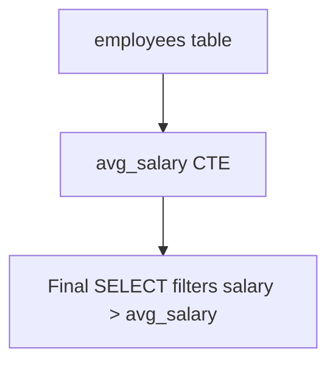
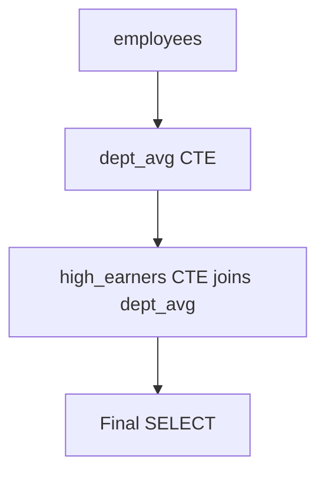
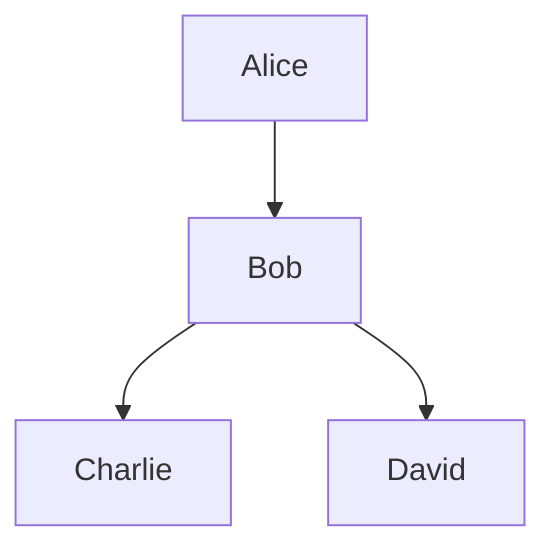

# Common Table Expressions (CTEs)

:::tip[Status]

This note is complete, reviewed, and considered stable.

:::

A **Common Table Expression (CTE)** is a **temporary named result set** that exists only during the execution of a single SQL statement.
CTEs improve query readability, allow for recursive queries, and can simplify complex queries that would otherwise require nested subqueries or derived tables. They're one of our favorite tools for making SQL more readable!

## Basic Syntax

```sql
WITH cte_name AS (
    SELECT column1, column2
    FROM table_name
    WHERE condition
)
SELECT *
FROM cte_name
WHERE another_condition;
```

**Explanation:**

- `WITH` introduces the CTE.
- `cte_name` is the temporary name for the result set.
- The CTE can then be referenced in the main `SELECT` query as if it were a table - pretty neat!

### Example 1: Simple CTE

**Tables:**

`employees`

| employee_id | name    | department_id | salary |
| ----------- | ------- | ------------- | ------ |
| 1           | Alice   | 101           | 70000  |
| 2           | Bob     | 102           | 80000  |
| 3           | Charlie | 101           | 60000  |

**Goal:** Find employees earning more than the average salary.

```sql
WITH avg_salary AS (
    SELECT AVG(salary) AS avg_sal
    FROM employees
)
SELECT name, salary
FROM employees, avg_salary
WHERE salary > avg_salary.avg_sal;
```

**Output:**

| name  | salary |
| ----- | ------ |
| Bob   | 80000  |
| Alice | 70000  |

<div style={{textAlign: 'center'}}>



</div>

**Explanation:**

- The CTE `avg_salary` calculates a single value.
- The main query references it for filtering, making the query way clearer than a nested subquery would be.

### Example 2: Multiple CTEs

We can define **multiple CTEs** in a single query.

```sql
WITH dept_avg AS (
    SELECT department_id, AVG(salary) AS avg_sal
    FROM employees
    GROUP BY department_id
),
high_earners AS (
    SELECT e.name, e.salary, e.department_id
    FROM employees e
    JOIN dept_avg d
    ON e.department_id = d.department_id
    WHERE e.salary > d.avg_sal
)
SELECT *
FROM high_earners;
```

**Output:**

| name  | salary | department_id |
| ----- | ------ | ------------- |
| Alice | 70000  | 101           |
| Bob   | 80000  | 102           |

<div style={{textAlign: 'center'}}>



</div>

**Explanation:**

- First CTE calculates department average salary.
- Second CTE filters employees above department average.
- Main query selects from the second CTE.
- **Readability and modularity** are greatly improved - we can build complex queries step by step!

### Example 3: Recursive CTE

Recursive CTEs reference themselves. Useful for hierarchical data, e.g., organizational charts.

**Table: `employees` (manager hierarchy)**

| employee_id | name    | manager_id |
| ----------- | ------- | ---------- |
| 1           | Alice   | NULL       |
| 2           | Bob     | 1          |
| 3           | Charlie | 2          |
| 4           | David   | 2          |

**Goal:** Get all employees under manager Alice.

```sql
WITH RECURSIVE subordinates AS (
    SELECT employee_id, name, manager_id
    FROM employees
    WHERE manager_id IS NULL  -- Alice

    UNION ALL

    SELECT e.employee_id, e.name, e.manager_id
    FROM employees e
    INNER JOIN subordinates s
    ON e.manager_id = s.employee_id
)
SELECT *
FROM subordinates;
```

**Output:**

| employee_id | name    | manager_id |
| ----------- | ------- | ---------- |
| 1           | Alice   | NULL       |
| 2           | Bob     | 1          |
| 3           | Charlie | 2          |
| 4           | David   | 2          |

<div style={{textAlign: 'center'}}>



</div>

**Explanation:**

- Recursive CTE starts with the anchor member (Alice).
- Recursively joins to find subordinates at all levels - this is super powerful for hierarchical data!

## Advantages of CTEs

1. **Improved Readability:**
   Break complex queries into named steps.
2. **Reusable within Query:**
   The CTE name can be referenced multiple times.
3. **Supports Recursion:**
   Useful for hierarchical data.
4. **Better than nested subqueries:**
   Simplifies complex filtering, aggregation, or joins.

## When to Use Joins, Subqueries, and CTEs

| Operation    | When to Use                                                                                                           | Notes                                                           |
| ------------ | --------------------------------------------------------------------------------------------------------------------- | --------------------------------------------------------------- |
| **JOIN**     | Combining columns from multiple tables in a single query.                                                             | Efficient for large datasets; supported in all databases.       |
| **Subquery** | Filtering based on aggregated or conditional values; existence checks; single-step computations.                      | Can be correlated (row-by-row) or nested.                       |
| **CTE**      | Breaking complex queries into readable steps; recursive hierarchies; multiple references to same intermediate result. | Optimized by the query planner; makes query maintenance easier. |

## Database Optimization Notes

| Feature                   | PostgreSQL                                              | MySQL                                                          | SQL Server                                          | Oracle                                                    |
| ------------------------- | ------------------------------------------------------- | -------------------------------------------------------------- | --------------------------------------------------- | --------------------------------------------------------- |
| **JOIN optimization**     | Uses hash join, merge join, nested loop; well-optimized | Similar; uses nested loops or hash joins                       | Uses cost-based optimizer; multiple join strategies | Similar; cost-based optimizer                             |
| **Subquery optimization** | Can convert to JOIN internally for efficiency           | Correlated subqueries may be slow; sometimes optimized to JOIN | Correlated subqueries optimized to JOIN             | Similar; optimizer can flatten subqueries                 |
| **CTE optimization**      | Non-recursive CTE may be inlined                        | Non-recursive CTE inlined (MySQL 8+)                           | Non-recursive CTE inlined                           | Non-recursive CTE inlined; recursive executed iteratively |
| **Recursive CTE**         | Well-supported; optimized                               | Supported from 8.0; can be slower on large data                | Supported; optimized                                | Supported; can handle large hierarchies                   |

**Note:**

- Non-recursive CTEs are often **just syntactic sugar** for derived tables; performance is similar to subqueries.
- Recursive CTEs are unique; they are optimized differently than joins or subqueries.

## Key Takeaways

1. **CTEs** are temporary result sets that improve query clarity and structure.
2. **Recursive CTEs** are ideal for hierarchical data.
3. **Subqueries** are better for filtered or aggregated computations.
4. **Joins** are most efficient for combining tables.
5. Use **CTEs** when queries are complex, reused multiple times, or require recursion.
6. Databases optimize these differently: CTEs are usually inlined, subqueries may be flattened into joins, and recursive CTEs are iteratively evaluated.
