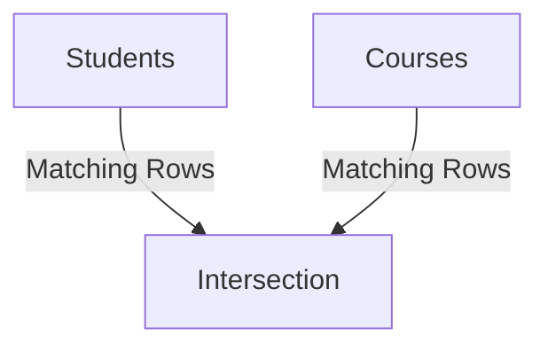
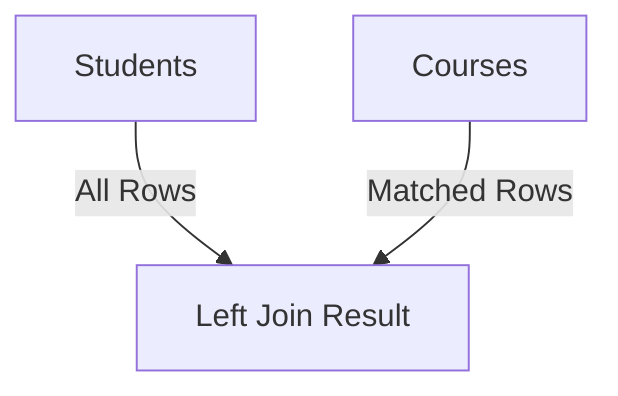
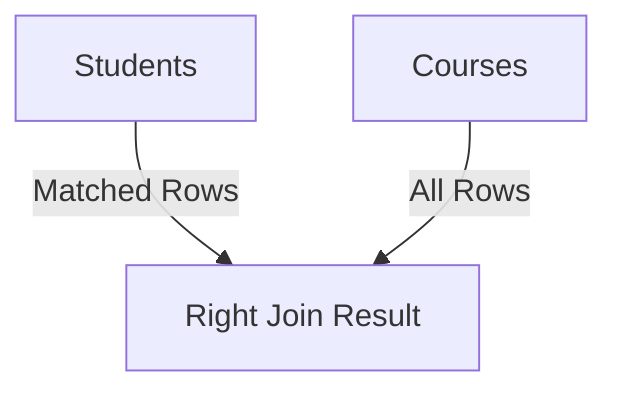
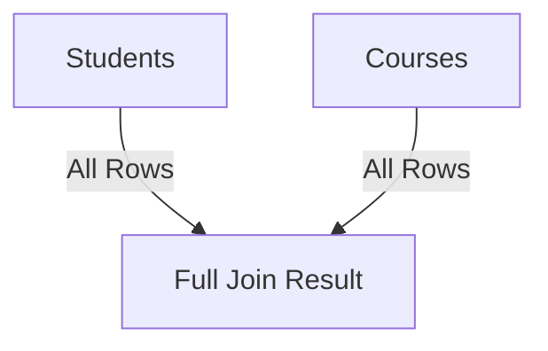
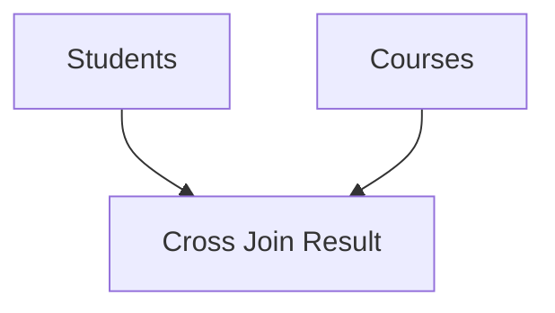
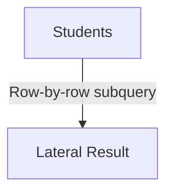

# Join Queries

In relational databases, data is often spread across multiple tables to maintain normalization and reduce redundancy.
To retrieve data that spans multiple tables, SQL provides the **JOIN** operation, which combines rows from two or more tables based on a **related column** between them.

The most common types of joins are:

- **INNER JOIN**
- **LEFT JOIN (LEFT OUTER JOIN)**
- **RIGHT JOIN (RIGHT OUTER JOIN)**
- **FULL OUTER JOIN**
- **CROSS JOIN**
- **LATERAL JOIN**

## Example Setup

We’ll use the following two tables throughout the examples:

**Table: `students`**

| student_id | name    | course_id |
| ---------- | ------- | --------- |
| 1          | Alice   | 101       |
| 2          | Bob     | 102       |
| 3          | Charlie | NULL      |

**Table: `courses`**

| course_id | course_name |
| --------- | ----------- |
| 101       | Math        |
| 102       | Science     |
| 103       | History     |

## INNER JOIN

**Definition:**
Returns only the rows that have matching values in both tables.

<div style={{textAlign: 'center'}}>



</div>

**Query:**

```sql
SELECT s.name, c.course_name
FROM students s
INNER JOIN courses c ON s.course_id = c.course_id;
```

**Output:**

| name  | course_name |
| ----- | ----------- |
| Alice | Math        |
| Bob   | Science     |

**Explanation:**
Only Alice and Bob have matching course IDs in both tables.
Charlie is excluded because his `course_id` is `NULL`.

## LEFT JOIN (LEFT OUTER JOIN)

**Definition:**
Returns all rows from the **left table** and the matched rows from the **right table**.
If there’s no match, the right side will contain `NULL`.

<div style={{textAlign: 'center'}}>



</div>

**Query:**

```sql
SELECT s.name, c.course_name
FROM students s
LEFT JOIN courses c ON s.course_id = c.course_id;
```

**Output:**

| name    | course_name |
| ------- | ----------- |
| Alice   | Math        |
| Bob     | Science     |
| Charlie | NULL        |

**Explanation:**
All students are returned. For Charlie, there’s no course match, so `course_name` is `NULL`.

## RIGHT JOIN (RIGHT OUTER JOIN)

**Definition:**
Returns all rows from the **right table** and the matched rows from the **left table**.
If there’s no match, the left side will contain `NULL`.

<div style={{textAlign: 'center'}}>



</div>

**Query:**

```sql
SELECT s.name, c.course_name
FROM students s
RIGHT JOIN courses c ON s.course_id = c.course_id;
```

**Output:**

| name  | course_name |
| ----- | ----------- |
| Alice | Math        |
| Bob   | Science     |
| NULL  | History     |

**Explanation:**
All courses are returned. The “History” course has no enrolled student, so `name` is `NULL`.

## FULL OUTER JOIN

**Definition:**
Returns all rows from both tables.
If there’s no match, unmatched columns will contain `NULL`.

<div style={{textAlign: 'center'}}>



</div>

**Query:**

```sql
SELECT s.name, c.course_name
FROM students s
FULL OUTER JOIN courses c ON s.course_id = c.course_id;
```

**Output:**

| name    | course_name |
| ------- | ----------- |
| Alice   | Math        |
| Bob     | Science     |
| Charlie | NULL        |
| NULL    | History     |

**Explanation:**
Combines results of both LEFT and RIGHT joins.

**Note:**
MySQL doesn’t support `FULL OUTER JOIN` natively.
To emulate it, you can use `UNION`:

```sql
SELECT s.name, c.course_name
FROM students s
LEFT JOIN courses c ON s.course_id = c.course_id
UNION
SELECT s.name, c.course_name
FROM students s
RIGHT JOIN courses c ON s.course_id = c.course_id;
```

## CROSS JOIN

**Definition:**
Produces a **Cartesian product** of both tables — every row from the first table is combined with every row from the second table.

<div style={{textAlign: 'center'}}>



</div>

**Query:**

```sql
SELECT s.name, c.course_name
FROM students s
CROSS JOIN courses c;
```

**Output:**

| name    | course_name |
| ------- | ----------- |
| Alice   | Math        |
| Alice   | Science     |
| Alice   | History     |
| Bob     | Math        |
| Bob     | Science     |
| Bob     | History     |
| Charlie | Math        |
| Charlie | Science     |
| Charlie | History     |

**Explanation:**
Every student-course combination is returned.

## LATERAL JOIN (PostgreSQL & SQL Server)

**Definition:**
A **LATERAL JOIN** allows a subquery in the `FROM` clause to reference columns from preceding tables in the same `FROM` clause.
It’s useful when you want to run a subquery for each row of another table.

<div style={{textAlign: 'center'}}>



</div>

**Example Scenario:**
Suppose we have a table `marks` that stores multiple marks per student.

**Table: `marks`**

| student_id | mark |
| ---------- | ---- |
| 1          | 85   |
| 1          | 90   |
| 2          | 78   |

We want to select each student and their **highest mark**.

**Query (PostgreSQL):**

```sql
SELECT s.name, m.highest_mark
FROM students s,
LATERAL (
    SELECT MAX(mark) AS highest_mark
    FROM marks
    WHERE marks.student_id = s.student_id
) m;
```

**Output:**

| name    | highest_mark |
| ------- | ------------ |
| Alice   | 90           |
| Bob     | 78           |
| Charlie | NULL         |

**Explanation:**
For each student, the lateral subquery runs individually and finds their maximum mark.

**Note:**

- MySQL 8.0+ supports this using the keyword `JOIN LATERAL` or `CROSS JOIN LATERAL`.
- SQL Server supports similar behavior with `APPLY` (`CROSS APPLY`, `OUTER APPLY`).

## Summary of Join Differences Across Databases

| Join Type       | MySQL          | PostgreSQL   | SQL Server    | Oracle              |
| --------------- | -------------- | ------------ | ------------- | ------------------- |
| INNER JOIN      | ✅ Supported   | ✅ Supported | ✅ Supported  | ✅ Supported        |
| LEFT JOIN       | ✅             | ✅           | ✅            | ✅                  |
| RIGHT JOIN      | ✅             | ✅           | ✅            | ✅                  |
| FULL OUTER JOIN | ❌ (use UNION) | ✅           | ✅            | ✅                  |
| CROSS JOIN      | ✅             | ✅           | ✅            | ✅                  |
| LATERAL JOIN    | ✅ (8.0+)      | ✅           | ✅ (as APPLY) | ✅ (as CROSS APPLY) |

## Key Takeaways

- **INNER JOIN** → Returns only matching rows.
- **LEFT JOIN** → Keeps all left rows, fills missing right with `NULL`.
- **RIGHT JOIN** → Keeps all right rows, fills missing left with `NULL`.
- **FULL OUTER JOIN** → Keeps all rows from both sides.
- **CROSS JOIN** → Cartesian product of both tables.
- **LATERAL JOIN** → Enables correlated subqueries in `FROM`.
