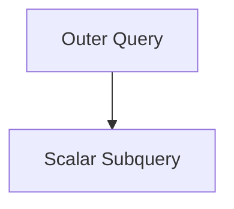
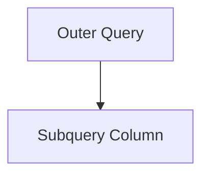
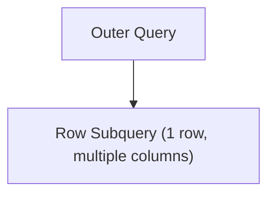
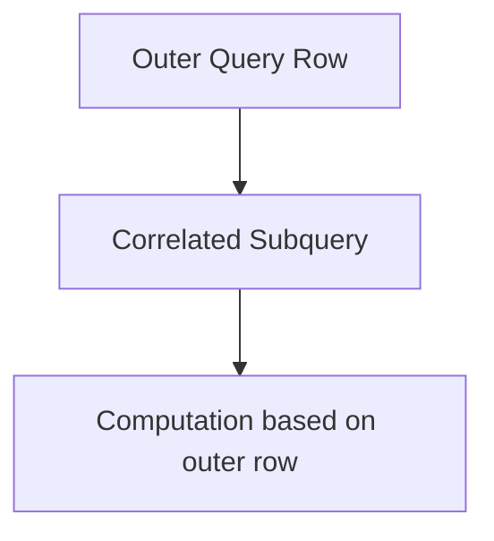
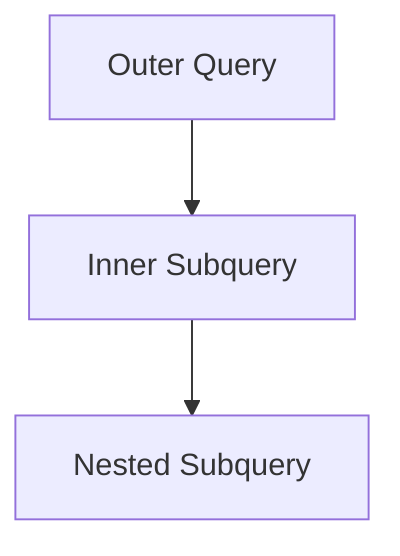
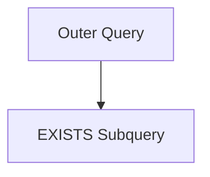

# Subqueries and Nested Queries

:::tip[Status]

This note is complete, reviewed, and considered stable.

:::

A **subquery** (or inner query) is a SQL query embedded within another query.
A **nested query** is a broader term describing queries that are nested inside other queries, which can include multiple levels of subqueries.

**Why we use them:**

- Break down complex queries into manageable parts.
- Filter or compute intermediate results for use in the outer query.
- Retrieve aggregate or conditional results dynamically.

## Types of Subqueries

1. **Scalar Subquery** – returns a single value.
2. **Column Subquery** – returns a single column with multiple rows.
3. **Row Subquery** – returns multiple columns but a single row.
4. **Correlated Subquery** – references columns from the outer query; evaluated **row by row**.
5. **Nested Subqueries** – a subquery within another subquery.

### Scalar Subquery

Returns a single value; can be used in `SELECT`, `WHERE`, or `HAVING`.

<div style={{textAlign: 'center'}}>



</div>

**Example:**

```sql
SELECT name,
       (SELECT MAX(salary) FROM employees) AS max_salary
FROM employees;
```

**Output (example):**

| name    | max_salary |
| ------- | ---------- |
| Alice   | 120000     |
| Bob     | 120000     |
| Charlie | 120000     |

**Explanation:**
The scalar subquery `(SELECT MAX(salary)...)` runs once and returns a single value, which is applied to all outer query rows - efficient!

### Column Subquery

Returns a single column with multiple rows; often used with `IN`.

<div style={{textAlign: 'center'}}>



</div>

**Example:**

```sql
SELECT name
FROM employees
WHERE department_id IN (
    SELECT id FROM departments WHERE location = 'NY'
);
```

**Output (example):**

| name    |
| ------- |
| Alice   |
| Charlie |

**Explanation:**
Subquery returns all department IDs in NY. Outer query filters employees in those departments - a common pattern!

### Row Subquery

Returns multiple columns but **only one row**. Often used with comparison operators `(=, <, >)`.

<div style={{textAlign: 'center'}}>



</div>

**Example:**

```sql
SELECT name
FROM employees
WHERE (department_id, salary) = (
    SELECT department_id, MAX(salary)
    FROM employees
    GROUP BY department_id
    LIMIT 1
);
```

**Output (example):**

| name  |
| ----- |
| Alice |

**Explanation:**
Outer query selects employees who match the department ID and maximum salary returned by the row subquery - this finds the top earner in a specific department.

### Correlated Subquery

Subquery that **depends on a column from the outer query**; evaluated **once per row** of outer query.

<div style={{textAlign: 'center'}}>



</div>

**Example:**

```sql
SELECT name
FROM employees e1
WHERE salary > (
    SELECT AVG(salary)
    FROM employees e2
    WHERE e2.department_id = e1.department_id
);
```

**Output (example):**

| name  |
| ----- |
| Bob   |
| Alice |

**Explanation:**
The subquery calculates average salary **per department** for each row of the outer query. Only employees above their department average are returned - this is a correlated subquery, so it runs once per outer row.

### Nested Subqueries

A subquery inside another subquery. Useful for multi-level filtering or complex computations.

<div style={{textAlign: 'center'}}>



</div>

**Example:**

```sql
SELECT name
FROM employees
WHERE department_id IN (
    SELECT id
    FROM departments
    WHERE location IN (
        SELECT location
        FROM offices
        WHERE region = 'East'
    )
);
```

**Output (example):**

| name  |
| ----- |
| Alice |
| Bob   |

**Explanation:**

- Innermost query selects all locations in the East region.
- Middle query selects department IDs in those locations.
- Outer query selects employees in those departments - nested subqueries let us drill down through multiple levels!

## EXISTS and NOT EXISTS

Checks for existence of rows in subqueries.

<div style={{textAlign: 'center'}}>



</div>

**Example:**

```sql
SELECT name
FROM employees e
WHERE EXISTS (
    SELECT 1
    FROM projects p
    WHERE p.lead_id = e.employee_id
);
```

**Output (example):**

| name  |
| ----- |
| Alice |
| Bob   |

**Explanation:**
Only employees who are project leads exist in the subquery; they're returned by the outer query. `EXISTS` is efficient because it stops as soon as it finds a match!
