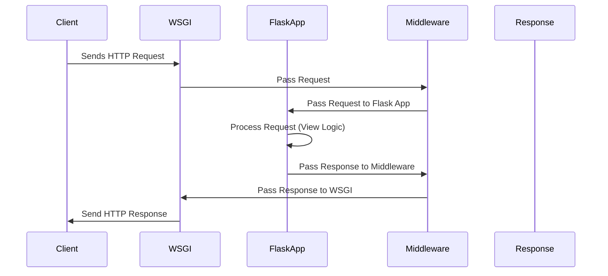
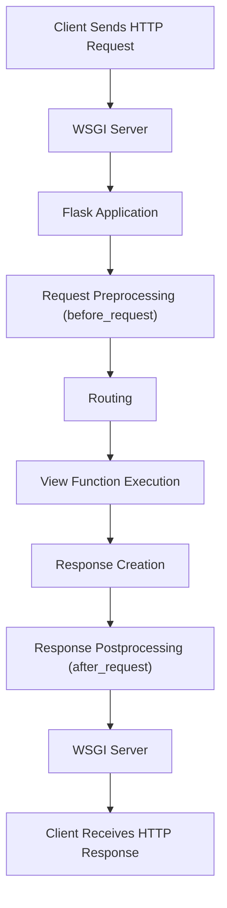

# Request and Response Cycle

The **Request-Response Cycle** is the core of web application behavior in Flask. It defines how Flask handles incoming HTTP requests from clients (like web browsers) and sends back appropriate responses. Understanding this cycle is critical for building efficient and functional Flask applications.

## Overview of the Request-Response Cycle



1. A **client** (e.g., a browser or API client) sends an HTTP request to the server.
2. The **web server** (e.g., Gunicorn, uWSGI) receives the request and passes it to the Flask application via the WSGI interface.
3. The Flask application processes the request by:
   - Matching the URL with a route.
   - Executing the corresponding view function.
4. The view function returns a **response** object, which Flask sends back to the client via the WSGI server.
5. The client receives and processes the HTTP response.

This process involves multiple components in Flask, such as request and response objects, routing, and middleware.

## Key Components of the Request-Response Cycle

### Request Object

The request object in Flask encapsulates all the details of the incoming HTTP request, such as the method, headers, form data, query parameters, and JSON payload.

- **Importing the `request` object**:

  ```python
  from flask import request
  ```

- **Common Attributes of `request`**:

  - `request.method`: The HTTP method (e.g., `GET`, `POST`, `PUT`, `DELETE`).
  - `request.args`: The query parameters in the URL (e.g., `/search?q=flask`).
  - `request.form`: Form data submitted via POST (from an HTML form).
  - `request.json`: JSON data sent in the request body (usually for APIs).
  - `request.headers`: The headers of the HTTP request.
  - `request.cookies`: Cookies sent by the client.
  - `request.url`: The full URL of the request.
  - `request.path`: The URL path (excluding the domain and query string).

- **Example of Accessing Request Data**:

  ```python
  from flask import Flask, request

  app = Flask(__name__)

  @app.route('/greet', methods=['GET', 'POST'])
  def greet():
      if request.method == 'POST':
          name = request.form.get('name')
          return f"Hello, {name}!"
      return "Send a POST request with your name!"
  ```

### Routing

Routing is the process of mapping URLs to specific view functions in Flask. The `@app.route` decorator is used to define routes.

- **Example of Routing**:

  ```python
  @app.route('/')
  def home():
      return "Welcome to the homepage!"

  @app.route('/about')
  def about():
      return "This is the About page."
  ```

When a request is received, Flask matches the URL in the request against the defined routes. If no match is found, Flask raises a `404 Not Found` error.

### View Functions

A **view function** is the Python function that handles the logic for a specific route. It processes the request and returns a response.

- **Example**:

  ```python
  @app.route('/hello/<name>')
  def hello(name):
      return f"Hello, {name}!"
  ```

- Flask uses **dynamic routing** to pass parts of the URL as arguments to the view function (e.g., `<name>`).

---

### Response Object

After processing a request, a Flask view function must return a response. This response can be:

1. A string (converted to an HTTP response with a `200 OK` status).
2. A tuple of `(response_body, status_code)`.
3. A `Response` object.

- **Importing the `Response` class**:

  ```python
  from flask import Response
  ```

- **Attributes of a Response**:

  - `response.data`: The response body.
  - `response.status_code`: The HTTP status code (e.g., 200, 404, 500).
  - `response.headers`: The headers in the response.

- **Example of Custom Response**:

  ```python
  from flask import Response

  @app.route('/custom-response')
  def custom_response():
      response = Response("Custom Response Body", status=202)
      response.headers['X-Custom-Header'] = 'MyHeaderValue'
      return response
  ```

### Middleware

Middleware is code that executes before or after a request is processed. Flask provides hooks like `before_request`, `after_request`, and `teardown_request` for middleware functionality.

- **`before_request`**: Runs before the request is routed.
- **`after_request`**: Runs after the view function generates a response.
- **`teardown_request`**: Runs at the end of the request lifecycle, regardless of whether an exception occurred.

- **Example of Middleware**:

  ```python
  @app.before_request
  def before_request_func():
      print("This runs before each request!")

  @app.after_request
  def after_request_func(response):
      print("This runs after each request!")
      return response
  ```

### Error Handling

If an error occurs during the request-response cycle, Flask provides a mechanism to handle it gracefully using custom error handlers.

- **Example of Error Handling**:

  ```python
  @app.errorhandler(404)
  def not_found_error(error):
      return "This page does not exist!", 404
  ```

## Lifecycle of a Request in Flask

1. **Request Arrival**:

   - The WSGI server receives the HTTP request and forwards it to the Flask app.

2. **Preprocessing**:

   - Flask processes the request using `before_request` middleware and request hooks.

3. **Routing**:

   - Flask matches the request URL to a route and calls the corresponding view function.

4. **View Function Execution**:

   - The view function executes, processes the request, and generates a response.

5. **Postprocessing**:

   - Flask processes the response using `after_request` middleware.

6. **Response Delivery**:
   - The response is sent back to the WSGI server, which forwards it to the client.

### Visual Representation of the Request-Response Cycle



## Example of a Full Request-Response Cycle in Flask

```python
from flask import Flask, request, jsonify

app = Flask(__name__)

@app.before_request
def log_request():
    print(f"Incoming Request: {request.method} {request.url}")

@app.route('/add', methods=['POST'])
def add_numbers():
    data = request.json
    result = data['a'] + data['b']
    return jsonify({'result': result})

@app.after_request
def log_response(response):
    print(f"Outgoing Response: {response.status}")
    return response

@app.errorhandler(404)
def handle_404(error):
    return "Route not found!", 404

if __name__ == '__main__':
    app.run(debug=True)
```
