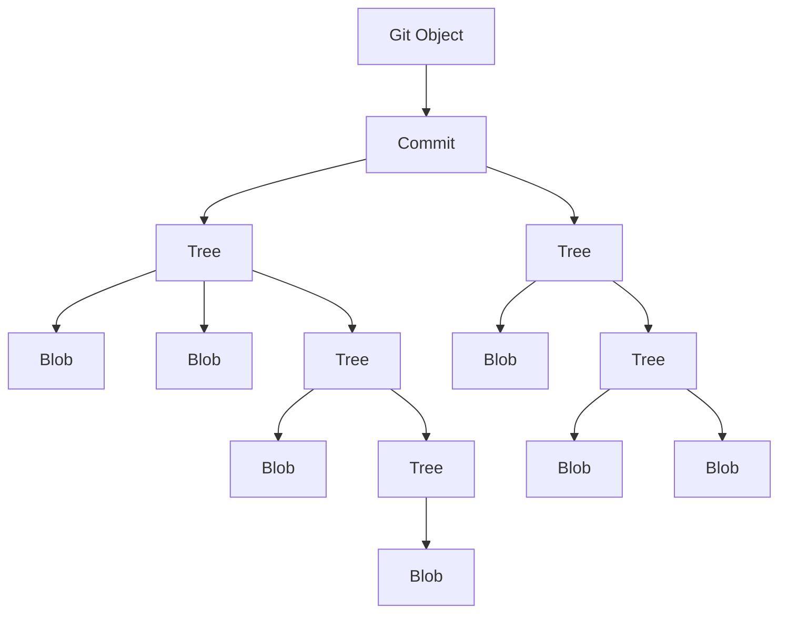

# Git Internals

## The `.git` Folder

Every Git repository contains a hidden `.git` directory, which serves as the heart of the repository. This directory contains all the metadata, configuration, and data necessary to manage version control. The `.git` folder is created when you initialize a repository (`git init`) or clone an existing repository (`git clone`).

The `.git` directory structure includes several important subdirectories and files:

- **`config`**: Stores repository-specific configuration settings (like remote repository URL, branches, user name, email).
- **`HEAD`**: A pointer to the currently checked-out branch. This file holds the reference to the branch or commit that the working directory is currently at.
- **`index`**: Also known as the staging area or cache, this file stores the index (snapshot) of the files that are staged for the next commit.
- **`objects/`**: Contains all the objects that Git uses to store data, such as commits, trees, and blobs. Git stores data in the form of these objects to reduce redundancy and optimize storage.
- **`refs/`**: This folder contains references to heads (branches) and tags. Under this folder, you’ll find references to local branches and remote-tracking branches.
- **`logs/`**: Stores logs for branch references, showing changes made to branches and how they evolved over time.
- **`hooks/`**: Contains sample scripts for Git hooks (like pre-commit, post-commit) that allow for custom actions to be triggered at specific points during the Git workflow.

## The Role of SHA in Git

Git uses **SHA-1** (Secure Hash Algorithm 1) to generate unique identifiers for its objects. These SHA-1 hashes are 40-character strings that act as cryptographic fingerprints for all Git objects. A SHA-1 hash is used to uniquely identify the contents of a commit, file, or any other object in Git.

For example, Git assigns a SHA-1 hash to:

- **Commits**: Each commit is represented by a SHA-1 hash. The commit hash is generated based on the commit content, including the author, timestamp, commit message, and the tree object that represents the file snapshot.
- **Files**: Files are stored as **blobs** in Git. A blob object is assigned a SHA-1 hash based on the content of the file.
- **Directories**: Git represents directories as **tree objects**. A tree object groups blobs (files) and other tree objects (subdirectories) under a particular directory structure.
- **Tags**: Git uses SHA-1 to uniquely identify tags that point to specific commits.

SHA-1 hashes in Git are deterministic, meaning the same input will always result in the same hash. This ensures that even small changes in a file or commit will result in a completely different SHA-1 value, helping to detect changes.

## Commit Storage and Structure

A commit in Git is an object that contains a snapshot of your project at a given point in time, along with metadata such as the commit message, author, and timestamp. The commit is stored in Git's object database as a **commit object**, and it points to a **tree object**, which in turn points to blob objects (files).

A commit object typically contains the following:

1. **Commit Metadata**:

   - Author name and email
   - Timestamp of the commit
   - Commit message

2. **Tree Object**:

   - A reference to the tree object that represents the state of the file system at the time of the commit.

3. **Parent Commits**:
   - A reference to one or more parent commits (for example, in the case of merges, multiple parent commits are present).

The commit object is created by Git when a new commit is made, and it is identified by a SHA-1 hash that uniquely identifies that specific commit.

**Commit Object Example**:

```plaintext
commit <sha1-hash>
tree <sha1-hash of tree object>
parent <sha1-hash of parent commit>
author <name> <email> <timestamp>
committer <name> <email> <timestamp>
<commit message>
```

The commit object points to a **tree object** (which represents the snapshot of the files), and each file in the tree object is represented by a **blob object** (holding the file's content).

### Example Commit Process:

1. **Creating a Commit**:
   - When you execute `git commit`, Git first creates a snapshot of the staged changes and stores the result as a tree object (which contains references to the blobs representing individual files).
2. **Storing the Commit**:

   - Git then creates a commit object, which points to this tree object and contains the commit message, author, timestamp, and any parent commits.

3. **Hashing**:

   - Git calculates the SHA-1 hash of the commit object and stores it in the `.git/objects` directory. The commit’s SHA-1 hash is a cryptographic representation of all the data associated with that commit.

4. **Referencing Commits**:
   - After the commit is created, Git stores the commit’s SHA-1 hash in the `.git/refs/heads/` directory, under the branch name (e.g., `master` or `main`). This allows Git to track which commit is currently checked out for each branch.

## Git Objects in `.git/objects`

All Git objects (commits, blobs, trees) are stored in the `.git/objects/` directory, and these objects are stored in a compressed, binary format. The directory is organized into a two-level hierarchy:



- The first two characters of a SHA-1 hash represent a subdirectory (e.g., `.git/objects/ab/`).
- The remaining 38 characters are the object filename (e.g., `.git/objects/ab/cde1234...`).

Git uses a **pack file** format to optimize storage. When a repository grows large, Git bundles multiple objects into a single pack file (`.pack`), reducing disk usage and speeding up operations.

## How Git Tracks Changes

Git's efficiency comes from the way it tracks changes. Rather than storing full versions of every file with each commit, Git only stores **deltas** or differences between files (if changes are made to the same file). It uses a combination of object types:

- **Blob**: Stores the raw contents of files.
- **Tree**: Stores a snapshot of the file structure, including references to blobs (files) and other trees (subdirectories).
- **Commit**: Stores the metadata (author, timestamp, message) and references to a tree object and its parent commits.

Git’s approach allows it to efficiently store a large number of commits and file changes with minimal storage overhead.

## The `git cat-file` Command

The `git cat-file` command is a powerful tool that allows you to inspect Git objects in the `.git/objects` directory. With this command, you can explore the details of various Git objects such as blobs (file content), trees (directory structure), and commits.

#### Syntax:

```bash
git cat-file -p <object-hash>
```

- **`-p` (pretty-print)**: Displays the content of the object in a human-readable format.
- **`-t` (type)**: Shows the type of the object (blob, tree, or commit).
- **`-s` (size)**: Displays the size of the object in bytes.

## Viewing the Entire Project from a Commit Hash

Using the `git cat-file` command, you can navigate through the contents of a repository by starting with a commit hash and exploring its associated tree and blob objects.

### Steps to Explore a Commit and Its Contents:

1. **Start with a Commit Hash**:

   - When you run `git log`, each commit has a SHA-1 hash associated with it. Use this hash to start exploring.

   Example:

   ```bash
   git log --oneline
   ```

   Output:

   ```plaintext
   3f62c0a Initial commit
   ```

2. **Inspect the Commit Object**:

   - Use the commit hash to view the details of the commit object.

   ```bash
   git cat-file -p 3f62c0a
   ```

   Output:

   ```plaintext
   tree f16b0e45e0a5c6e61c8b3d43234578db23818d57
   author Abhishek <abhishek@example.com> 1672527600 +0000
   committer Abhishek <abhishek@example.com> 1672527600 +0000

   Initial commit
   ```

   - The **tree hash** (`f16b0e4...`) represents the snapshot of the project directory.

3. **Inspect the Tree Object**:

   - Use the tree hash to explore the directory structure and see the files and subdirectories.

   ```bash
   git cat-file -p f16b0e45e0a5c6e61c8b3d43234578db23818d57
   ```

   Output:

   ```plaintext
   100644 blob bbc4a75e0a8d72d67ec9c1c0f5d0b47ea93e2d88    README.md
   100644 blob 9da3b8e6e10333f63cf575dcee73e8d22a769b9e    main.py
   040000 tree 1c7a28f342d9dbd1d21c9865c1d08e6cf4a0c2b7    src
   ```

   - The tree object lists:
     - **Mode**: File type and permissions (e.g., `100644` for regular files, `040000` for directories).
     - **Object Type**: Blob for files, Tree for subdirectories.
     - **SHA-1 Hash**: Points to the content of the file (blob) or subdirectory (tree).
     - **Filename**: Name of the file or directory.

4. **Inspect a Blob Object (File Content)**:

   - Use the hash of a blob to view the content of a specific file.

   ```bash
   git cat-file -p bbc4a75e0a8d72d67ec9c1c0f5d0b47ea93e2d88
   ```

   Output:

   ```plaintext
   # README.md content
   Welcome to the project!
   ```

5. **Traverse Subdirectories**:
   - For subdirectories, use the tree hash to explore further.
   ```bash
   git cat-file -p 1c7a28f342d9dbd1d21c9865c1d08e6cf4a0c2b7
   ```
   Output:
   ```plaintext
   100644 blob a1b2c3d4e5f6g7h8i9j0k1l2m3n4o5p6q7r8s9t0    utils.py
   ```

### Example: Viewing the Entire Project from a Commit

Given a commit hash (`3f62c0a`), you can reconstruct the entire project as follows:

1. Use the commit hash to find the tree hash:

   ```bash
   git cat-file -p 3f62c0a
   ```

   Output:

   ```plaintext
   tree f16b0e45e0a5c6e61c8b3d43234578db23818d57
   ```

2. Use the tree hash to list the files and directories:

   ```bash
   git cat-file -p f16b0e45e0a5c6e61c8b3d43234578db23818d57
   ```

   Output:

   ```plaintext
   100644 blob bbc4a75e0a8d72d67ec9c1c0f5d0b47ea93e2d88    README.md
   100644 blob 9da3b8e6e10333f63cf575dcee73e8d22a769b9e    main.py
   040000 tree 1c7a28f342d9dbd1d21c9865c1d08e6cf4a0c2b7    src
   ```

3. For each blob, use its hash to display the file content:

   ```bash
   git cat-file -p bbc4a75e0a8d72d67ec9c1c0f5d0b47ea93e2d88
   ```

   Output:

   ```plaintext
   Welcome to the project!
   ```

4. For subdirectories, use their tree hash to navigate deeper.

By following this process, we can manually traverse and reconstruct the entire project at the state of a given commit, directly from the `.git` folder and object hashes.

## How Branches Are Stored in `.git` Folder

In Git, branches are lightweight pointers to specific commits. Internally, a branch is nothing more than a file that contains the **SHA-1 hash** of the commit it points to. These branch files are stored in the `.git/refs/heads/` directory.

### Storing Branches in `.git/refs/heads/`

When we create a branch in Git, a new file is added to the `.git/refs/heads/` directory. The name of the file corresponds to the branch name, and its content is the SHA-1 hash of the commit that the branch is currently pointing to.

#### Example:

Let’s say we have a branch called `main`.

1. Inside `.git/refs/heads/`, there will be a file named `main`.

   ```bash
   cat .git/refs/heads/main
   ```

   Output:

   ```plaintext
   3f62c0a7a7e1a81c4a92b9b9cf56d2a44ea18cf2
   ```

   - This file contains the hash of the latest commit on the `main` branch (`3f62c0a...`).

2. If we create another branch (e.g., `feature`), Git will create a new file `.git/refs/heads/feature` with the same structure, containing the commit hash that the `feature` branch points to.

### Relationship Between HEAD and Branches

Git uses the **`HEAD`** file to determine the currently active branch or commit. The `HEAD` file typically contains a reference to the branch we’re currently working on.

#### Example:

If we’re on the `main` branch, the `HEAD` file will contain:

```plaintext
ref: refs/heads/main
```

This indicates that `HEAD` is pointing to the `main` branch. When we make a new commit, Git updates the `main` file inside `.git/refs/heads/` to point to the new commit hash.

### Detached HEAD State

In some cases, `HEAD` might point to a specific commit hash instead of a branch. This is known as a **detached HEAD state**.

#### Example:

If we check out a specific commit using `git checkout <commit-hash>`, the `HEAD` file will contain:

```plaintext
3f62c0a7a7e1a81c4a92b9b9cf56d2a44ea18cf2
```

In this case, we are not on any branch, but rather on a specific commit.

### Remote Branches in `.git/refs/remotes/`

Remote-tracking branches are stored in `.git/refs/remotes/`. For example, if we clone a repository with a `main` branch from a remote named `origin`, Git will create the file `.git/refs/remotes/origin/main` to track the remote branch.

#### Example:

```bash
cat .git/refs/remotes/origin/main
```

Output:

```plaintext
3f62c0a7a7e1a81c4a92b9b9cf56d2a44ea18cf2
```

### Packed References

When a repository has many branches, tags, or references, Git might store them in a more optimized format called a **packed reference file**. Instead of having individual files for each branch in `.git/refs/heads/`, Git consolidates them into a single file called `.git/packed-refs`.

#### Example:

Contents of `.git/packed-refs`:

```plaintext
# pack-refs with: peeled fully-peeled
3f62c0a7a7e1a81c4a92b9b9cf56d2a44ea18cf2 refs/heads/main
1a2b3c4d5e6f7g8h9i0j1k2l3m4n5o6p7q8r9s0 refs/heads/feature
```

Git automatically manages when references are packed. Despite being packed, the logical structure of branches remains the same.
