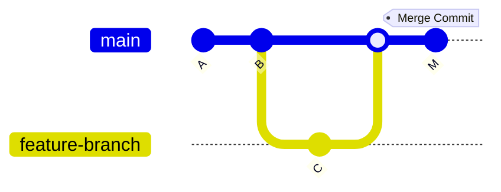
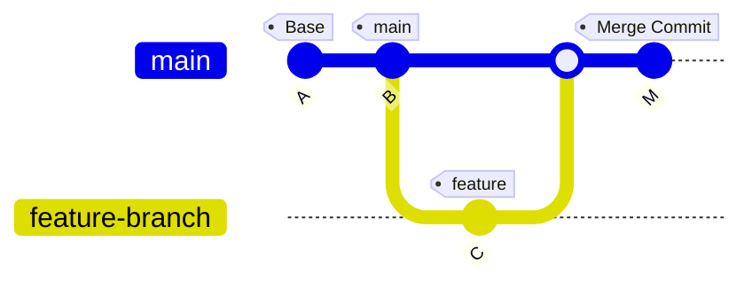
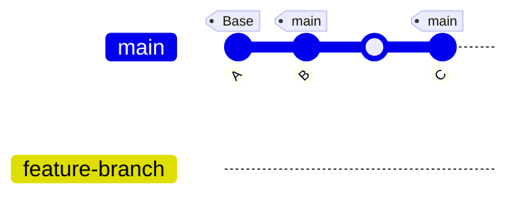

# Git Merge, Rebase, and Squash

Git is a powerful version control system, and understanding how to manage commits and branches effectively is key to maintaining a clean and organized codebase. Below are detailed explanations of some core Git concepts: **Merge**, **Rebase**, **Squash**, **Three-Way Merge**, **Fast Forward**, and how they work in different scenarios.

## Git Merge

Git merge is used to combine the changes from one branch into another. Typically, you'll merge a feature branch into the main branch (e.g., `main` or `develop`). The merge process looks at the commit histories of both branches and merges them.

- **How it works**: When you perform a merge, Git looks at the common ancestor (the commit where both branches diverged) and compares the changes made in both branches. If there are no conflicts, it combines the changes into a new merge commit.
- **Merge Commit**: A new commit is created to record the merge operation. This commit has two parent commits: the previous commit on the target branch and the last commit on the source branch.

**Example:**

```bash
git checkout main
git merge feature-branch
```



### Three-Way Merge (ORT)

A three-way merge occurs when Git merges two branches and uses the common ancestor (the merge base) to resolve any changes between them.

- **How it works**:

  1. Git identifies the common ancestor commit, where the two branches diverged.
  2. It compares the changes made in the two branches since that commit.
  3. It automatically merges the changes unless there are conflicts.

- **ORT (Octopus Recursive Tree)**: ORT is a newer merge algorithm used by Git to speed up and handle more complex merge scenarios. It resolves the three-way merge more efficiently, handling multiple merges more effectively.

**Example:**

```bash
git checkout main
git merge feature-branch
```



### Fast Forward Merge

A fast-forward merge occurs when the target branch has no commits since the branch you are merging from diverged. In this case, Git can simply "fast-forward" the target branch pointer to the latest commit of the source branch without creating a merge commit.

- **How it works**: If the target branch is directly behind the source branch (i.e., no new commits in the target branch since the source branch was created), Git simply moves the pointer of the target branch to the latest commit of the source branch.

**Example**:

```bash
git checkout main
git merge feature-branch
```

If the target branch (e.g., `main`) hasn’t moved forward, the result is a fast-forward merge.



## Git Rebase

Rebasing is the process of moving or "replaying" commits from one branch onto another. Instead of creating a merge commit, rebase rewrites the commit history to appear as if the changes were made in sequence.

- **How it works**: When you rebase, Git will take the commits from your current branch and reapply them on top of the target branch, effectively re-writing history. This creates a linear commit history and eliminates the need for a merge commit.

- **Interactive Rebase**: You can perform an interactive rebase to reorder, edit, or squash commits before applying them.

**Example:**

```bash
git checkout feature-branch
git rebase main
```

## Git Squash

Squashing is the process of combining multiple commits into a single commit. This is often used when you want to tidy up a branch before merging it to the main branch.

- **How it works**: In an interactive rebase, you can mark commits for squashing. When squashed, the changes from multiple commits are combined into a single commit.

- **Use Case**: Squash is often used to simplify a branch history, especially when the branch has many small commits or "fixup" commits that are not meaningful individually.

**Example:**

```bash
git checkout feature-branch
git rebase -i main
```

During the rebase, you mark commits with `squash` or `fixup` to combine them.
