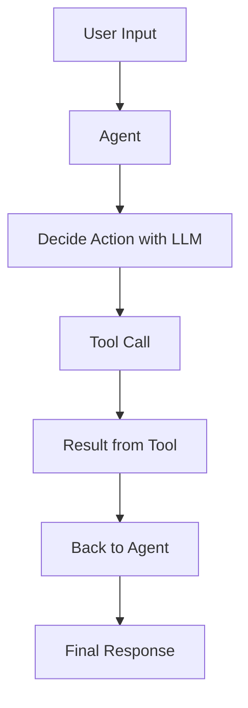
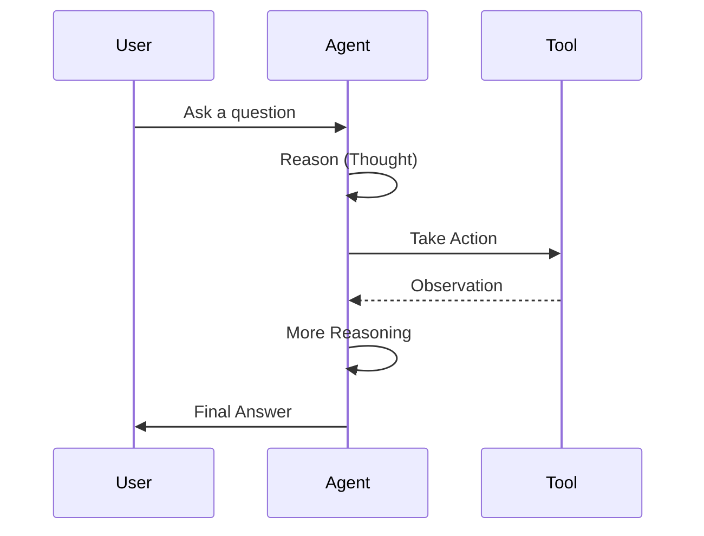

# LangChain Agents

Agents in LangChain are entities that use large language models not just to generate text, but to **decide actions**. Instead of producing only direct responses, an agent can choose which tools to call, when to call them, and how to use the results in order to solve a task.

The workflow of an agent:

1. Take user input
2. Use the LLM to decide what action to take (e.g., call a tool, query a database, or just respond)
3. Execute the chosen action
4. Feed the result back into the agent
5. Repeat the cycle until a final answer is produced

Agents are useful when the problem requires multiple steps, reasoning, or external data sources.

<div style={{textAlign: 'center'}}>



</div>

## ReAct Agents

ReAct (Reason + Act) is a framework for building agents that combines reasoning and acting. Instead of producing only a final output, the LLM generates both **thoughts** (reasoning steps) and **actions** (tool invocations).

For example:

- Thought: "I need to find today’s weather."
- Action: "Call Weather API with city=London."
- Observation: "It is 22°C and sunny."
- Thought: "Now I can answer the user."
- Final Answer: "The weather in London today is 22°C and sunny."

ReAct agents are particularly effective because they let the LLM explain its reasoning process, making the workflow more transparent and reliable.

<div style={{textAlign: 'center'}}>



</div>

## LangChain Tools

Tools are external functions or services that agents can use to complete tasks. They extend the capabilities of the agent beyond the LLM’s knowledge.

Examples of tools include:

- Web search APIs
- Database queries (SQL, vector search)
- File systems
- Calculators
- Custom APIs

Each tool has:

- A **name** (used by the agent to identify it)
- A **description** (explains what it does)
- A **function** (the actual implementation that runs when the tool is called)

Agents rely on tools to access fresh data, perform computations, or interact with external systems.

## Example code: ReAct Agent with tools

Below is an example of building an agent using the ReAct framework with LangChain. The agent can use a **math tool** to answer numerical queries.

```python
from langchain_openai import ChatOpenAI
from langchain.agents import initialize_agent, Tool
from langchain.agents import AgentType
import math

# Define a custom tool
def calculate_square_root(x: str) -> str:
    try:
        number = float(x)
        return f"The square root of {number} is {math.sqrt(number)}"
    except ValueError:
        return "Please provide a valid number."

math_tool = Tool(
    name="Square Root Calculator",
    func=calculate_square_root,
    description="Useful for calculating square roots of numbers."
)

# Load a chat model
llm = ChatOpenAI(model="gpt-3.5-turbo", temperature=0)

# Initialize ReAct agent with the tool
agent = initialize_agent(
    tools=[math_tool],
    llm=llm,
    agent=AgentType.CHAT_ZERO_SHOT_REACT_DESCRIPTION,
    verbose=True
)

# Run an example query
response = agent.run("What is the square root of 144?")
print(response)
```

### Explanation of the code

1. **Custom Tool**: A function `calculate_square_root` is defined and wrapped as a LangChain `Tool`.
2. **Model**: `ChatOpenAI` is loaded to serve as the reasoning engine.
3. **Agent Initialization**: `initialize_agent` creates a ReAct-style agent that knows how to use the tool.
4. **Query Execution**: The user asks for the square root of 144. The agent reasons that it needs the tool, calls it, gets the result, and then produces the final answer.
