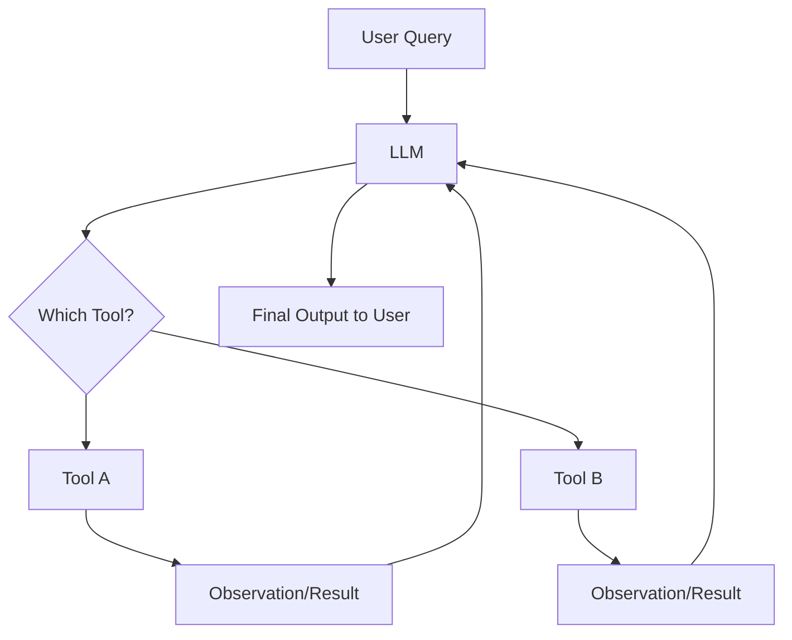
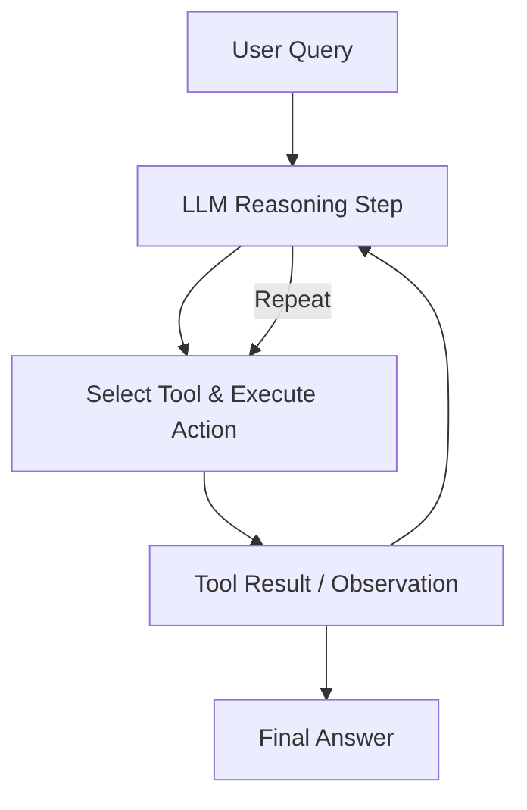

# LangChain Agents

A **LangChain Agent** is an orchestrator that **decides how to use an LLM and external tools** to achieve a goal. Instead of just generating text, an agent can **take actions**, like calling APIs, performing calculations, or interacting with databases, based on a user query.

## Core Concepts

1. **Agent vs LLM**

   - An LLM generates text based on input.
   - An Agent uses an LLM **to plan actions and call tools** iteratively until a solution is reached.

2. **Tool Integration**
   Agents work closely with tools. The LLM acts as a decision-maker:

   - Receives user input.
   - Determines the best tool(s) to call.
   - Executes the tool and observes the result.
   - Repeats if needed, producing the final answer.

3. **Agent Workflow**

<div style={{textAlign: 'center'}}>



</div>

This flow shows that the agent interacts in **loops**, letting the LLM guide tool usage until the query is fully answered.

## ReAct Framework

**ReAct (Reasoning + Acting)** is a specific type of agent reasoning paradigm introduced in LangChain for multi-step decision making.

1. **Key Idea**

   - LLM interleaves **reasoning** and **acting** in steps:

     - **Reasoning**: The LLM thinks about what action to take next.
     - **Acting**: The LLM executes a tool or takes an action.

2. **Why ReAct**

   - Enables agents to handle **complex tasks** that require multiple steps.
   - Improves accuracy by **observing intermediate results** and adjusting the next step.

3. **ReAct Loop Example**

<div style={{textAlign: 'center'}}>



</div>

- Here, the LLM **thinks, acts, observes, and repeats** until a complete answer is reached.

## Setting up a ReAct Agent in LangChain

1. **Define Tools**

   ```python
   from langchain.tools import Tool

   def calculator_fn(query: str) -> str:
       return str(eval(query))

   calculator_tool = Tool(
       name="Calculator",
       func=calculator_fn,
       description="Use this tool to perform math operations."
   )

   def get_weather(city: str) -> str:
       return f"The weather in {city} is sunny"

   weather_tool = Tool(
       name="Weather",
       func=get_weather,
       description="Use this tool to get the current weather of a city."
   )

   tools = [calculator_tool, weather_tool]
   ```

2. **Initialize ReAct Agent**

   ```python
   from langchain.chat_models import ChatOpenAI
   from langchain.agents import initialize_agent, AgentType

   llm = ChatOpenAI(model="gpt-4", temperature=0)

   react_agent = initialize_agent(
       tools=tools,
       llm=llm,
       agent=AgentType.REACT_DESCRIPTION,
       verbose=True
   )
   ```

3. **Run Queries**

   ```python
   query1 = "Add 23 and 19"
   query2 = "What's the weather in Paris?"

   print(react_agent.run(query1))  # Output: 42
   print(react_agent.run(query2))  # Output: The weather in Paris is sunny
   ```

## Advantages of ReAct Agents

1. **Stepwise Reasoning**: Handles multi-step problems with intermediate observations.
2. **Tool Flexibility**: Can use multiple tools in sequence.
3. **Dynamic**: Adjusts actions based on observations.
4. **Explainability**: ReAct agents can log their reasoning and actions, making the process interpretable.

## Practical Example: Multi-step Reasoning

Suppose we want an agent to **calculate the area of a rectangle and check if it’s greater than 50**.

```python
def area_rectangle(length: int, width: int) -> str:
    return str(length * width)

area_tool = Tool(
    name="RectangleArea",
    func=area_rectangle,
    description="Calculate area of rectangle given length and width."
)

tools.append(area_tool)

react_agent = initialize_agent(
    tools=tools,
    llm=llm,
    agent=AgentType.REACT_DESCRIPTION,
    verbose=True
)

query = "Calculate area of rectangle with length 8 and width 7, is it greater than 50?"
print(react_agent.run(query))
```

- The agent:

  - Calls `RectangleArea`.
  - Observes result (56).
  - Compares to 50.
  - Returns final answer.

## Best Practices

1. **Tool Descriptions Matter**: Provide clear instructions to guide the LLM.
2. **Limit Tools per Agent**: Too many tools can confuse the agent.
3. **Verbose Mode**: Useful for debugging reasoning and action steps.
4. **Chaining ReAct**: ReAct agents can be combined with multi-tool setups for complex workflows.
