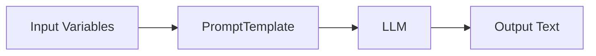
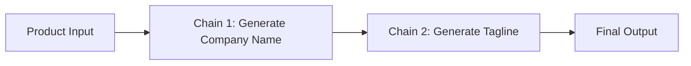

# Chains

In LangChain, **Chains** are sequences of steps that process inputs and produce outputs, typically involving one or more language model calls combined with other utilities. Instead of working directly with raw prompts and models, Chains allow us to structure workflows. This makes our applications more reusable, modular, and easier to maintain.

A Chain can be as simple as a **single LLM call** or as complex as a **multi-step pipeline** involving prompts, tools, memory, and custom logic.

## Core Concepts of Chains

### What Chains are

Chains abstract the orchestration of LLM calls and related tasks. They provide a framework for:

- Defining a sequence of steps.
- Managing inputs and outputs between components.
- Reusing logic across different applications.

### Why Chains matter

- They make applications **structured and reproducible**.
- They allow **integration of multiple components** (LLMs, prompts, retrievers, databases, tools).
- They reduce **boilerplate code** and simplify debugging.

## Basic Example of a Chain

A very simple Chain is the `LLMChain`. It combines a `PromptTemplate` with an LLM.

```python
from langchain.prompts import PromptTemplate
from langchain.chains import LLMChain
from langchain_openai import OpenAI

llm = OpenAI(temperature=0)

prompt = PromptTemplate(
    input_variables=["product"],
    template="What is a good name for a company that makes {product}?"
)

chain = LLMChain(llm=llm, prompt=prompt)

result = chain.run(product="colorful socks")
print(result)
```

Here:

- `PromptTemplate` defines the structure.
- `LLMChain` binds it with the LLM.
- `run()` executes the Chain.

## Flow of a Chain

We can visualize the flow of a simple Chain:

<div style={{textAlign: 'center'}}>



</div>

This shows how user input is transformed by a prompt, processed by the LLM, and then returned as output.

## Types of Chains

There are several types of Chains in LangChain, each serving different use cases:

- **LLMChain** – a single LLM call with a prompt.
- **SimpleSequentialChain** – a linear sequence where the output of one chain is passed as input to the next.
- **SequentialChain** – like `SimpleSequentialChain` but allows multiple inputs and outputs.
- **RouterChain** – routes inputs to different chains depending on conditions.
- **TransformChain** – applies a Python function as a transformation step inside a chain.

## Example of SequentialChain

We can combine multiple steps into one flow.

```python
from langchain.chains import LLMChain, SequentialChain
from langchain.prompts import PromptTemplate
from langchain_openai import OpenAI

llm = OpenAI(temperature=0)

# Step 1: Generate a company name
prompt1 = PromptTemplate(
    input_variables=["product"],
    template="What is a good name for a company that makes {product}?"
)
chain1 = LLMChain(llm=llm, prompt=prompt1, output_key="company_name")

# Step 2: Generate a slogan based on the name
prompt2 = PromptTemplate(
    input_variables=["company_name"],
    template="Write a creative tagline for {company_name}."
)
chain2 = LLMChain(llm=llm, prompt=prompt2, output_key="tagline")

# Combine them
overall_chain = SequentialChain(
    chains=[chain1, chain2],
    input_variables=["product"],
    output_variables=["company_name", "tagline"]
)

result = overall_chain.run(product="eco-friendly shoes")
print(result)
```

Here:

1. The first chain generates a company name.
2. The second chain generates a tagline based on that name.
3. The SequentialChain orchestrates the whole process.

## Flow of SequentialChain

<div style={{textAlign: 'center'}}>



</div>

This shows how outputs of one chain become inputs to the next.

## RouterChain Example

Sometimes we want different prompts for different cases. A RouterChain can decide which chain to execute.

For example:

- If the input asks for translation, route to a translation chain.
- If the input asks for summarization, route to a summarization chain.

This adds flexibility and intelligence in choosing the right path.

## Benefits of Chains

- **Modularity** – we can compose small building blocks.
- **Reusability** – chains can be reused across projects.
- **Scalability** – easy to extend with more steps.
- **Debugging** – intermediate outputs can be inspected.
- **Integration** – chains connect LLMs with external tools and memory.

## Sample code: Summarization using LangChain

Below is a minimal example showing how to use Prompt Templates, ChatModels, and Chains together to perform text summarization.

```python
from langchain_openai import ChatOpenAI
from langchain.prompts import PromptTemplate
from langchain.chains import LLMChain

# Step 1: Define the prompt template
template = """
Summarize the following text in 2-3 sentences:
{text}
"""
prompt = PromptTemplate(template=template, input_variables=["text"])

# Step 2: Load a chat model
chat_model = ChatOpenAI(model="gpt-3.5-turbo", temperature=0)

# Step 3: Create a chain combining prompt and model
summarization_chain = LLMChain(llm=chat_model, prompt=prompt)

# Step 4: Provide input text
input_text = """
LangChain is an open-source framework that helps developers build applications using large language models.
It provides abstractions for prompts, chains, agents, and memory, making it easier to create advanced AI systems.
LangChain is widely used for chatbots, question answering, document analysis, and workflow automation.
"""

# Step 5: Run the chain
summary = summarization_chain.run({"text": input_text})
print(summary)
```

### Explanation of the workflow

1. **PromptTemplate** defines the summarization task with a variable `{text}`.
2. **ChatOpenAI** loads the chat model (GPT-3.5 in this case).
3. **LLMChain** connects the prompt with the model, forming a simple chain.
4. The input text is passed into the chain.
5. The model processes the filled-in prompt and returns a concise summary.
